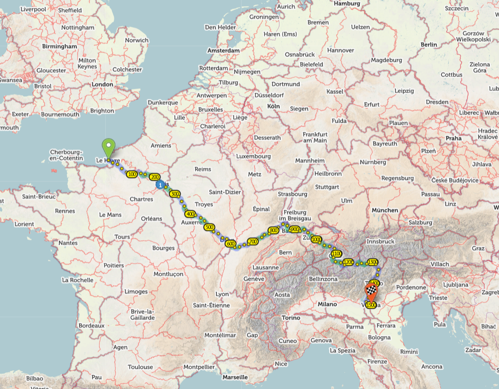
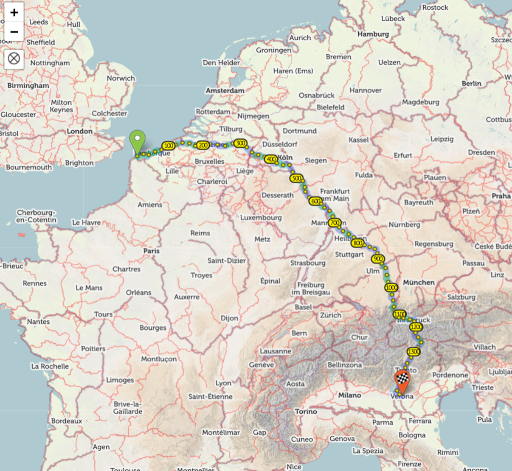

--- 
title: "Verona: Day Zero"
categories: [verona2026]
date: 2026-04-25
---

This year I've decided to cycle to the 23rd [PHPDay Conference](https://www.phpday.it/) in Verona. I attended
the conference for the past two years as an attendee and this year I'm a speaker. It's a fun
event in a beautiful city and I will **drink beer and eat pizza**.

The decision to cycle was, in-part, made due the success of my "Gravel" ride
to Mannheim for the [Unkonf conference](https://www.unkonf.de/en) [in October
last year](/blog/categories/mannheim2025/). I then cycled 1,700k in 16
interesting days (including rest days). This journey promises a similar
distance to Verona and then **possible more miles** to get back to the UK
depending on how terrible I feel.

## Routing

I considered two routes based on ferry crossings from the UK and the logistics averround
them:

- **Portsmouth to Le Havre**: 2.5 hour train ride (2 changes), 6 hour 30 minute ferry crossing.
- **Dover to Calais**: 6 hour train ride (2 changes), 2.5 hour ferry crossing.

Both journeys are roughly similar in terms of time and price but provide very different starting points.

Starting from Le Havre I'd want to go south through Paris to Dijon then
somehow turn east in a very France heavy route. This route is drawn below is 1500k:

_Route from Le Havre_

From Calias the distance is similar but I'd traverse **sandwich-rich** Belgium[^beer]:

_Route from Calais_

The Calais route promises **more mountains** and more sandwiches. So I'm
taking that one. Neither of the routes are exact and I'll be largely making
them up as I go.


There's the obvious concern that I'd be spending significant sandwiches in
Germany, which is far from ideal, but in anycase better than the poor sandwich culture
of France.


## Fitness

My fitness has **declined**. In October last year I spent a summer regularly
riding 150/200 miles a week and I was able to cycle between 80 and 120 miles a
day without too many issues.

I'll need to cycle similar distances on this trip - and although I haven't
been idle my weekly miles are less than half of what they were then and I'll
need to stay vigilent for injuries.

## Preparation

My setup is going to be almost identical to my Mannhiem trip and includes full
camping gear (tent, sleeping bag, airmattress, ground sheet, stove and cooking
pot). It was barely necessary then as I only camped two nights and it's a
signficant bulk of the luggage. I considered a bivvy bag this year with the
intention of staying in hotels as much as possible while still having the
possibltiy of sleeping rough if absolutely necessary. But finally I decided
against it.

In terms of new kit. 

- **Bone conducting headphones**: charged via. USB-C and
  _may_ allow me to join billable calls on the road.
- **Convertible pants**: these double as "smartish" trousers and can also be
  converted normal looking shorts. Allowing me to not look like a cyclist when
  I stop cycling.

Every thing else is essentially the same.

Kit List
--------

### Personal

- Garmin fenix watch

### Cycle wear

- Helmet
- Bib shorts
- Jersey
- Cycling glasses
- SPD cycling shoes
- Merino wool socks
- Merino wool gloves

### Handlebar bag

- Framework 13 Laptop
- 60w USB-C power supply
- Portable 60w charger
- Bum cream / toiletries / toilet paper / earplugs
- Cables
  - Garmin watch
  - USB-C x 2 (various)
  - Mini USB x 1 (Sansa Clip)
  - Micro USB x 1 (Front light)
- Bone conducting headphones
- Sansa Clip MP3 player and headphones
- Swiss army knife
- Bank cards

### Handlebar

- Garmin Edge 540
- Phone
- Bell

### Framebag

- Front light
- Back light 
- Shitty lock
- Spare inner tube
- Repair patches
- Tire levers x 3
- Chain lube
- Multi-tool
- Head scarf thing
- Energy gels

### Left Fork

- Tent and poles
- Ground sheet

### Right Fork: Dry bag

- Sleeping bag
- Air matress
- Stove and Saucepand
- 1 meal: Chili-Sin-Carne & BrownRice

### Saddlebag

- Patagonia convertible trousers
- Conference shirt
- "Barefoot" shoes
- Thermal bottoms
- Merino wool top
- 2x Pants (underwear)
- 2x Socks
- 2x wratchet straps

## Departure

Will I go tomorrow? Maybe.

[^beer]: a country also rich in Belgium beer.
