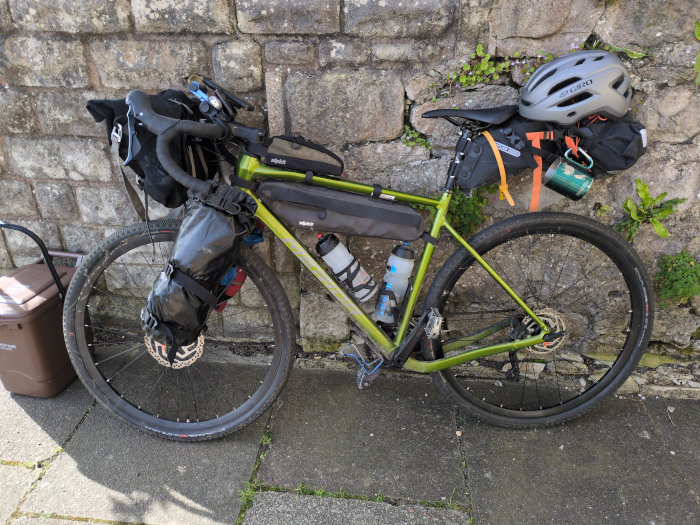
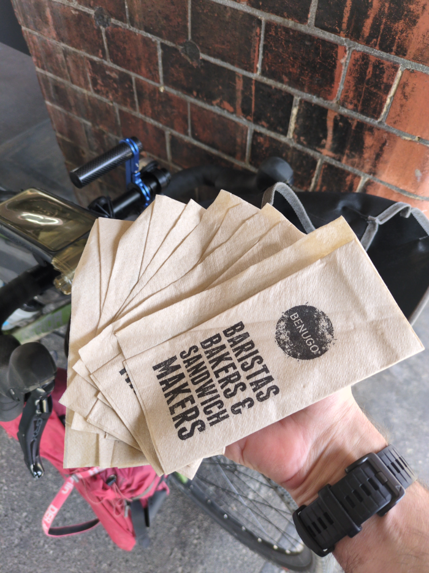
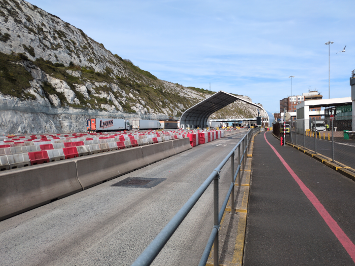
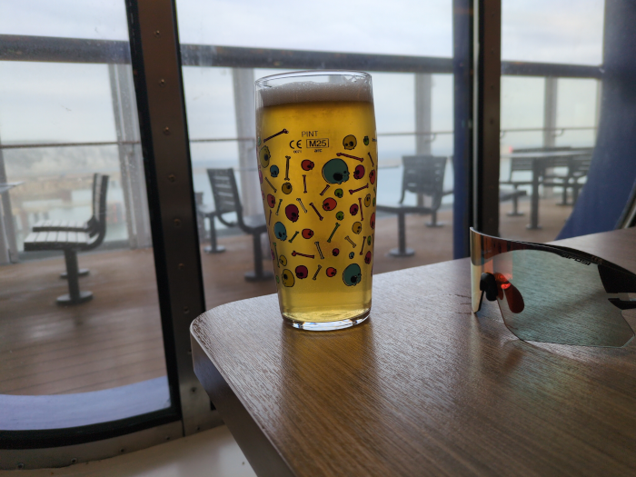
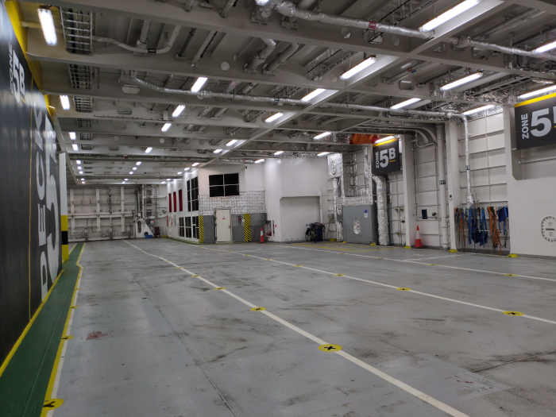

--- 
title: "Verona: Day One"
categories: [verona2026]
date: 2026-04-26
distance: 4
time: 30m
bundle_image: ./beer.png
---

Went to bed late and slept badly in my own bed waking up without any
particular excitement and not really wanting to get out of bed. It was 7:30am
and I knew that if I were to leave today I would need to get the train in the
next hours and I still had to pack everything.

Yesterday I did make a [list](#kit-list) of everything and
where it should be located on the bike and so after a too-leisurely breakfast,
reading about the the saddening story of another failed assination attempt on
a certain world leader, I realised I had one hour before the train was to
leave and so there followed a period of intense activity while I searched for
and packed everything on my list onto my bike before cleaning the kitchen,
taking my waste out and turning off the water.

_The Bike_

The train was to leave the station at 9:47am and I left the house at 9:37am
worrying (as I still am) that I had left the gas on, that my passport was
still on the table, that I had forgotten something. I _had_ forgotten
something, I've forgotten what it was that I forgot, but it wasn't critical
and my forgotten things from the last trips were remembered and accounted for.

I hadn't purchased any tickets - for train nor ferry - but I knew the train
ticket would be around £60 the day previously, this morning it had risen to
£80 and when I arrived at the station with minutes to spare it was "sold out".
I hurridely went to the ticket booth "Dover please" "are you going via. Southampton?" "No,
London" "That's £110". With the price having doubled I had to pay and
proceeded to search for and find my business's Mastercard (is this a
reasonable business expense? need to check with my accountant). WRONG PIN.
fuck. WRONG PIN. double fuck. I loaded up the banking app on my phone to show
the pin number "FINGERPRINT PLEASE".

I wisely decided to repair my phone's screen at a repair shop the day before.
"Why not treat myself" I thought. The screen had been cracked for a year and
was barely legible. They fixed it but when I got home the fingerprint reader
was broken. I googled it "you need to reset the fingerprint reader after
replacing the screen" "what a relief" I thought. That, however, didn't work. I
took it back to the shop and an hour later informed me that they had broken it
while replacing the screen and they'd need to send it away for four weeks.
That wasn't going to happen.

"FINGERPRINT PLEASE". Fortunately Google Pay allowed me to continue with only
my pin code and maybe I can make it a business expense later. I purchased the
extortionately priced ticket and I'm on the train typing this blog post. A
cycling couple got on the train with me at Weymouth. It's busy. I'll need to
change at London for Dover. I haven't purchased the ferry ticket yet as I'm
unsure if I'll make the next sailing after I arrive. 

The P&O ferries to Calias run every few hours until around 11PM, take around
2h30m for the traverse and cost £25 for a person and a bicycle. I'll need to
find accomodation when I land.

---

I waited by my bicycle as the train pulled in to Waterloo station and the
doors opened and people filed out onto the crowded platform and we made our
way slowly to the gates. I had to change to "Waterloo East" station which was
maybe 200m down the road. I thought I had 10 minutes but I mangaged to get
lost before arriving at the platform with minutes to spare. "Dover Priory?" I
asked the attendant. It was not coming in for another 20 minutes. I needed
coffee so I wheeled my bicycle back up from the platform and found some.

_6 useful serviettes provided with my snack_

Returning later the train pulled in and I scanned the carriages as the
carriages of the slowing train flashed past my eyes. Coffee in one hand,
bicycle in the other. I couldn't see any bicycle signs "the middle one" the
platform attendant told me. I looked ahead, it was a long train, I didn't know
which one the middle one was "that one!" she said. It wasn't in the middle. I got
my bicycle onto the packed train, the bicycle slot was mercifully vacant and
the attendant tapped on the window looking for some kind of acknowledgement I
nodded and smiled.

Now. I would get to Dover at 16:00 and the port was close by. But the next
ferry was then 40 minutes later. I consulted the internet - I would have to
check-in 90 minutes prior to departure. Oh well. The next one was at 18:50 - I
would have a wait.

I sat down in a vacant seat besides my bicycle and proceeded to buy a ticket
for the next day. After downloading the ticket I realised that the next day is
tomorrow. I cancelled but was charged the full £28.50 regardless.

---

As the train rolled into Dover Priory I could see [Dover Castle](https://en.wikipedia.org/wiki/Dover_Castle) and the [White
Cliffs](https://en.wikipedia.org/wiki/White_Cliffs_of_Dover) and I made my way directly the short distance to the ferry terminal.

_White Cliffs of Dover_

I cycled towards what I thought was the passport check "STOP!" I looked behind
me and I had passed the passport check so I turned back and had my passport
checked. I took directions and followed them and looked around like a lost
sheep before finding my way "go to the office" they said. "Drivers Office" it
said. "I'm not a driver" I thought. I went in and there were three ferry
operator desks. I wanted to check-in with P&O but all the busy stations were
filled. Polish guys gesturing at their phones and swearing frequently in
Polish and a Scotish guy not swearing at all. Finally I checked in and was
told I'd have to wait for some time.

Fortunately I was able to wait in a cafe for an hour before going out to wait
in lane 208 "at six o'clock wait in lane 208" he said. At six o'clock I waited
in the lane, in front of the ferry, and an endless stream of heavy goods
vehicles exited from the ferry into the "Busiest Port in Europe".

_Beer with White Cliffs of Dover in the background_

On the boat I got a beer and sat and the crossing was over in a few hours.
Down I went to the car bay to get my bike and wheeled it to the front, I was
gestured out and pointed forward and down the ramp I went.

"Speak English" "yeah" "You must wait here. Over there is the motor way. The
Chambre de Commerce will, urgh, escort you. Wait here please".

I waited. All the cars left the ferry. I waited. All the cars waiting to board
the ferry boarded the ferry. I waited. I gestured impatiently. It was getting
cold and dark. "You see, it is le change de garde, they are changing shifts.
It is the Chambre de Commerce. It's very special thing. They will escort you"

"I can walk out!?" "No, you must be escorted. It is the motorway. Very dangerous".

Finally my escort arrived. I was the only cyclist on the ferry and I had my
own personal escort from the dock.

_interior of the ferry. just here to break up the page_

I'm staying in a Campinele Hotel. It was 10PM when I arrived here. It's a
basic budget room. I've been warned that there are adolescents in the
adjoining rooms and that I should dial reception if they make noise.

Tomorrow I'll have breakfast and probably head towards Brugge and maybe Ghent,
possibly staying with a friend who lives in the area should it be
convenient.
