--- 
title: "Calais to Ghent"
categories: [verona2026]
tour: [ verona26 ]
date: 2026-04-27
distance: 172
time: 8h3m
bundle_image: ./202604261821-almostinbruge.jpg
gpx: /gpx/verona26/day2.gpx
aliases:
  - /blog/2026/04/27/calias-to-ghent
---

I'm at Bram's house sitting on a bed feeling the familiar exhaustion of a long
day in the saddle. At some point within the next hour we'll go in to Ghent
city and find pizza and I'm going to find some Belgium Beer.

Today started off in the Campernile hotel after a undisturbed by adolescents
but it wasn;t a good sleep. I paid €11 for breakfast and made the most of the
buffet. The weather looked good and I packed up my few things and left.

I hadn't "booked" in with Bram yet. We had vaguely discussed that I might be
going his way but there were no plans so I contacted him in the morning and
mentioned that I _could_ make it to Ghent today.

Riding out through the low Calais buildings into the country with big sky,
lines of trees, wide green fields and long horizons. The sun was shining but
it wasn't hot, although not cold enough for gloves. The wind wasn't entirely
favourable and was blowing from the North as I headed east but I managed to
keep up a steady 17mph for the first leg of the ride.

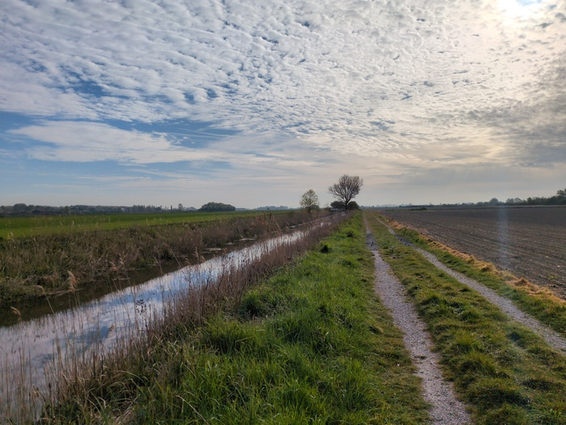
_Tracks_

I used Strava to create the route. I chose a "Gravel" ride then selected the
starting point "Calais" then selected "Brugge" and then "Ghent". It was a good
route and, as far as I know, the routing considers "popularity" which meant,
for example, in Brugge that it took me to the Belfry (the main tourist
attraction) and then routed me back out the same way I came.
_
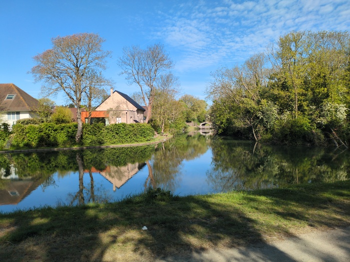
_Water_

After the route had taken me over some off-road paths I was confronted with
what looked like a busy road and a dirt path - the roads were parallel and I
assumed, wrongly, that I was supposed to take the dirt path. It turns out I
was riding into a construction site that was parallel to the road I was
meant to be on, but the road I intended to be on was 25 meters above me
with a sharp slope leading to a crash barrier. I had no choice but to follow
commit to my error and eventually finding an exit.

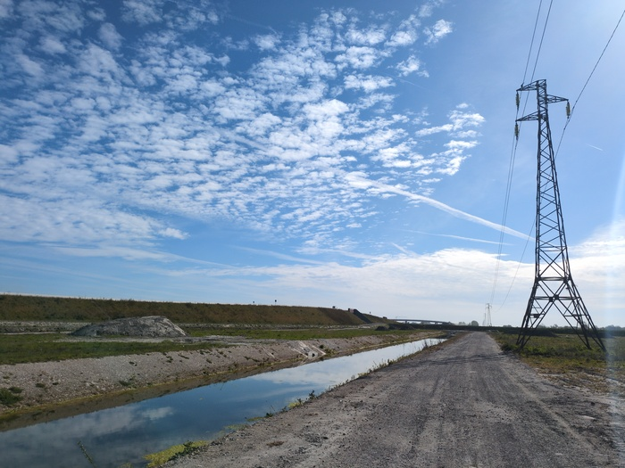
_The road I was supposed to be on in the background_

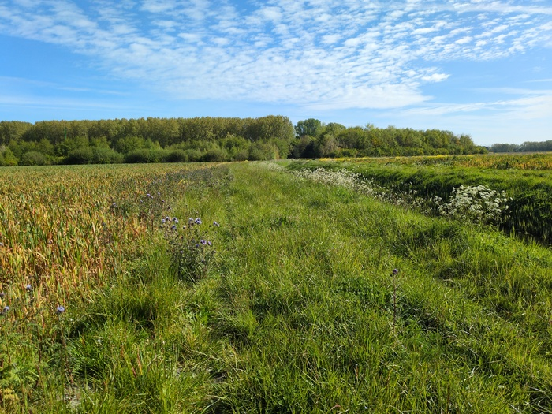
_Blindly following Strava_

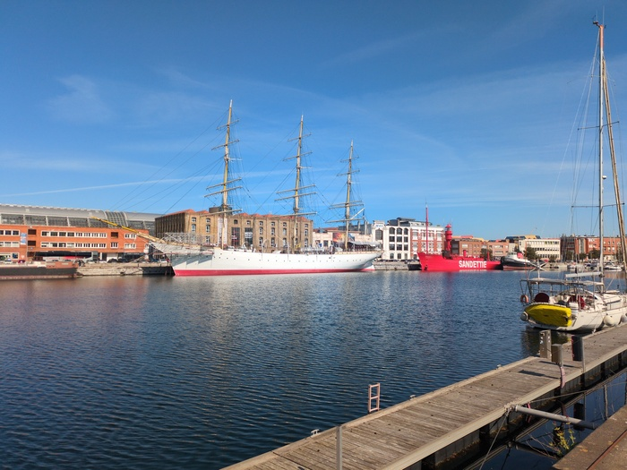
_Fireship!_

The first stop was Dunkirk (or Dunkurque). I was exepecting to see some
references to the great World War II evacuation of British troops. But it was
just a big beach.

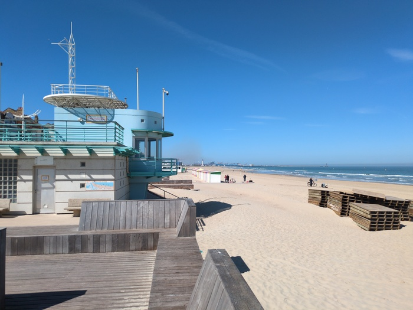
_Dunkurque Baeach 1_
_
I stopped here for a Gauffre (waffle) and an espresso. I had done 30 miles
(48k) and my legs were aching. I was still full from breakfast but I still had
77 miles (123k) to go, so the Gauffre wasn't likely to be superfluous.

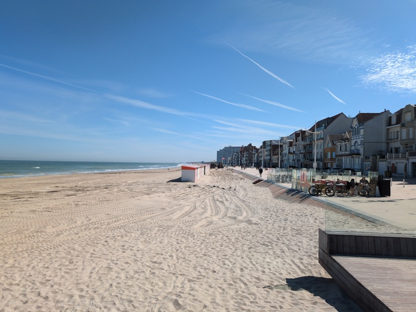
_Dunkurque Baeach 2_

There were plenty of Gendarmes in the area. They patrol in a group of three
and I passed three such groups on the beach and more in the surrounding areas.
Its surprising as there wouild be no such police presence in the UK and I
can't imagine what crimes they were there to prevent.

In the country side there were refugees. I passed a forest full of tents and
this time the "Gendarmes" were wearing army fatigues.

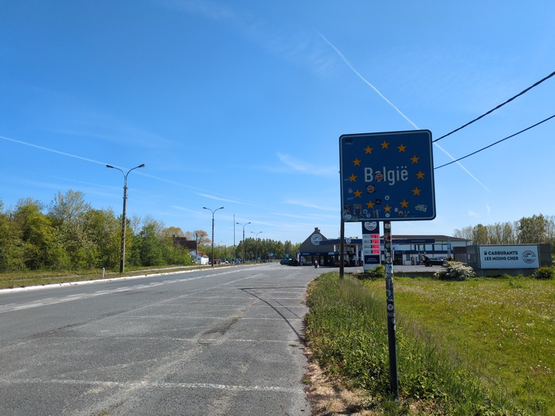
_Belgium_

Soon I was in Belgium. This was great news, as it meant that, as I have no
idea how to speak Flemish, I would be able to speak English again. This was
great news both for me and the Belgian people.

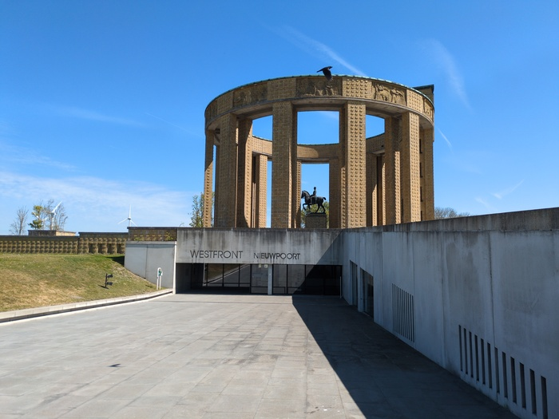
_Westfront_

I joined the canal. Canals are generally flat, but the entire trip so far had
been flat. There was and would be no hills today. I was making "good" time at
16-17mph despite the disadvantageous cross wind "I'm so fit" I thought
(knowing in fact that though I'm a cyclist and far from being a performant
one) and felt good about myself until I realised that I was being overtaken
frequently. 16-17mph would be a good speed for me on my racing bike in the
Dorset hills, less so on the Belgian flats.

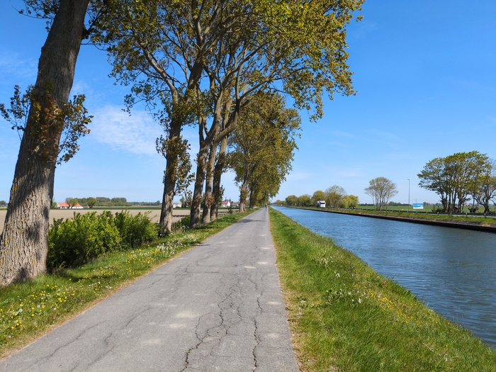
_Canal_

The sun was now beating hotter, warming my skin, though not oppressive. I
stopped at a Spa convenience store and purchased a cold drink and by hazard
some sugary Haribo-like sweets which, unlike Haribo, where visibly labed as
being "Vegan".

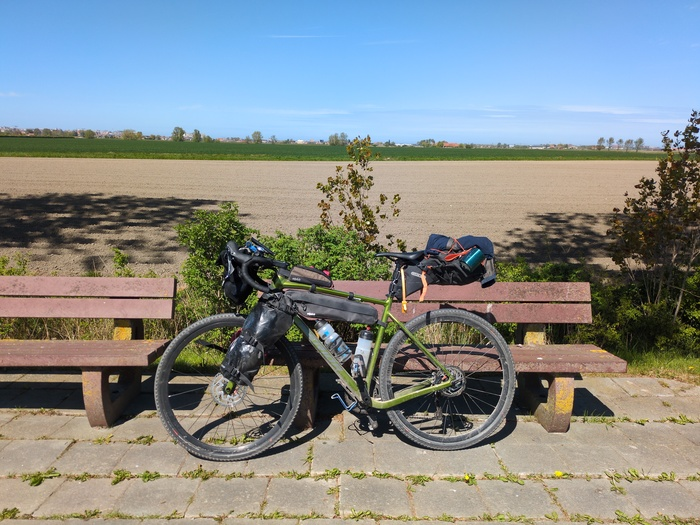
_The Bike_

For this trip I purchased a new Jersey - I probably would have purchased a new
one anyway and there wasn't anything particuly wrong with my old one, I just
wanted _one other_ jersey. This one is _tight_. When I ride on my racer bike I
have a ton of geat stashed in the rear Jersey pockets - pump, phone, keys,
gels, globves, etc Tt's [against the rules](https://www.ride25.com/cycling-blog/velominati-rules/)) to put bags on a
road bike. This all served to weigh the jersey down and to help keep me from
looking like an idiot. Not looking like an idiot is something that cyclists
prize highly

On this backpacking bike I obviously have all my gear in bags which means
nothing to stop my tigh jersey workings its way up past my navel up to my
middle of my chest instead of being anchored below my (somewhat enlarged)
belly. This means that I have to periodically pull it back down to where it
should be.

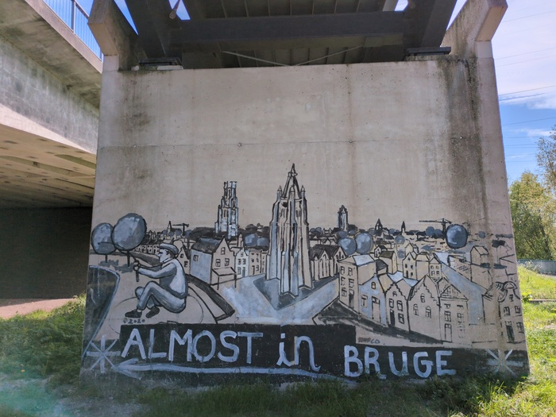
_Almost in Brugge_

The first 2 hours of the ride are full of observations, the remaining
6 hours are a blur.

I made it to Brugge and looked at the Belfry then rode about and found a place
to get some food. There are a _lot_ of tourists here for May. It must be even
worse in peak season. I sat down and ate my Pizza. I was ahead of scheduule -
I said I'd arrive in Ghent at 19:00 but, as I noticed the wind would be in my
favor and the ground would remain flat, I could be there an hour earlier. It
was just 30 or so miles to go.

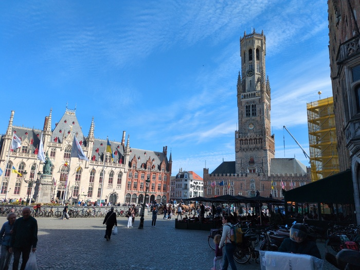
_The Belfry_

I had now ridden past what I'd normally classify as a "long ride" - that
distance being around 100k (62 miles) and the fatigue was setting in slowly
and inexorably.

I decided to calculate when I would arrive in Ghent:

- I've ridden **50 miles**.
- It's taken **3.5 hour**s
- Ghent is **107 miles** from Calais.
- It will take me another **7 hours**.

7 hours! I paniced. It took me some minutes to realise my error. My brain
doesn't work sometimes and it gets worse when my bodily fluids are used as
fuel.

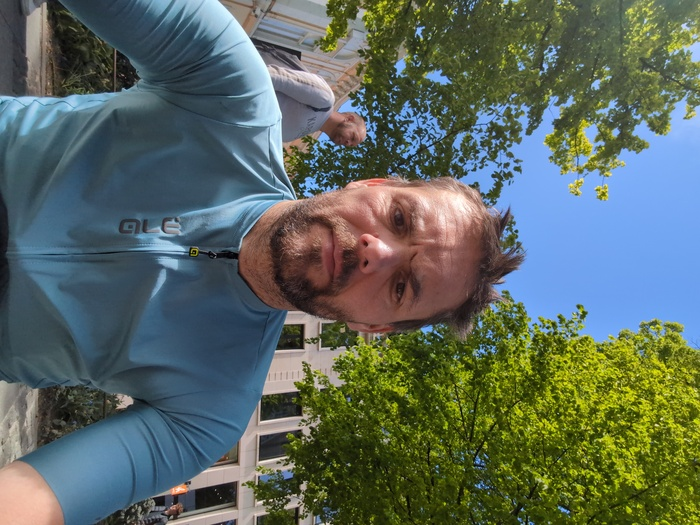
_Je suis Anglais_

I stopped for a pee at a bunker. There was a cheep-cheep-cheep of bats. It was
a bat-bunker and it had a ladder. I climbed the ladder. There was nothing to
see at the top and no visible way to gain access to the bat-bunker.

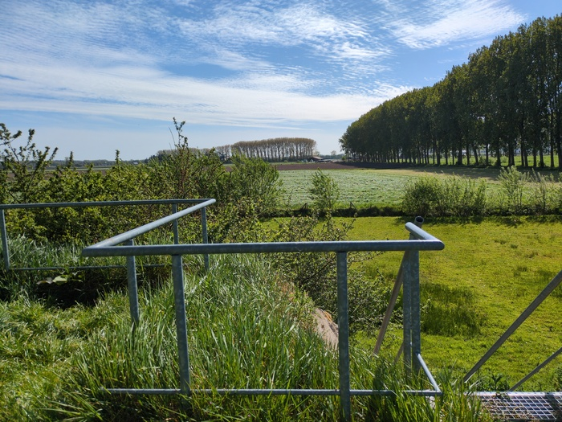
_Bat bunker_

It was not only road cyclists that over took me, but more annoyingly, people
on electric cycles travelling at speeds up-to or in excess of 30mph. This was
disheartening but I also noticed that these bikes has _number plates_ - so I
guess they are taxed.

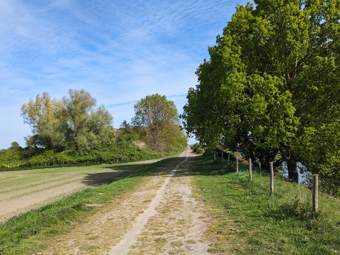
_Ruts in the Road_

The last 20 miles were increasingly hard and my pace dropped accordingly. I
was becoming dehydrated and was close to running out of water. I could
probably have also benefited from more food. As the miles ticked down I became
more impatient to finish.

I finally arrived at Bram's house and met his wife and waved helllo to his
children, had a shower, spent 45 minutes trying to remember how to sync my
blog photos to the lapto then we went for pizza and I had a few drinks.

Tomorrow I'll head in the direction that I'm heading.

e
