--- 
title: "Ghent to wherever I am now"
categories: [verona2026]
date: 2026-04-28
gpx: /gpx/verona26/ghent.gpx
bundle_image: 202604271831-grafiti.jpg
distance: 99.96
time: 5h18m
---

Now sitting in my tent on a pleasantly vacant campsite typing this blog post
with 57% battery knowing that I won't be able to charge it today. I've been to
the supermarket and have a Duvel beer (€1.60 vs. what would be around €3 in
the UK) and some baked beans and some cheese and a half a baguette. It would
have been an entire baguette bit I strapped it onyo my bag and half it seems
to be missing. I'll be heating the beans this evening and dining like a king
on the road. I need to eat.

I was roused by the sound of children this morning. I was aware I was at
Bram's house and went back to sleep and was woken by Bram a few hours later.
"I'll be up in a second" I said. I didn't want to get up. I had to, but I
didn't want to. My eyes were heavy as lead. Looking in the mirror I had
potatoes under my eyes. The previous days ride has taken it out of me. I felt
awful. My throat was sore and raw.

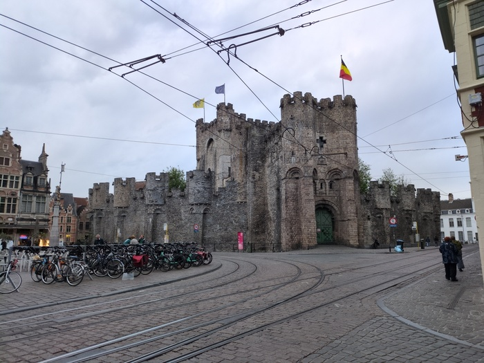
_Photo, from yesterday, of some castle in the center of Ghent_

"How are you feeling?" "Good!" I said. There was a breakfast spread on the
table and Bram made coffee and we talked for a bit. I asked if he had any
spare water bottles "lots" he said. I bought two with me and I realised
yesterday that one of them has a hole in it. Before I left he offered me some
fruit cake which I ate a few hours later, it was delicious.

I rode out on weary legs. I certainly wasn't aiming to do another 170k today.
100k would be enough and I knew roughly which direction I'd be heading.
Unfortunately my only plan is the screenshot of a map I made that's on my
blog, and it isn't very detailed. I needed to head east and at some point turn
south. The wind was blowing hard from the East. This would cause me irritation
later on.

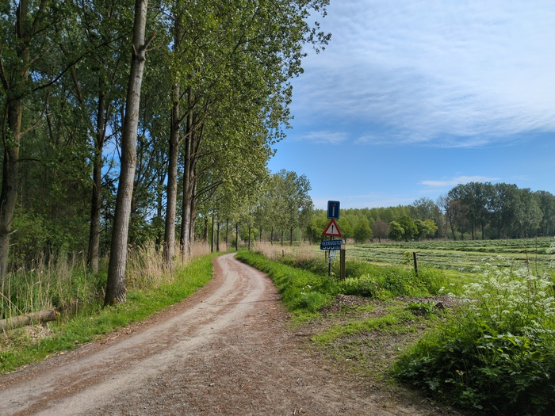
_Charming little bicycle trails_

The initial part of the trail wound about some nice dust tracks. At around 11
I was due to have a regular meeting with a client. And I stopped the bike in
the middle of the forest, whipped out my laptop and connected to Teams
performed two rounds of authentication, only to connect to see that they had
cancelled the meeting due to some internal issues.

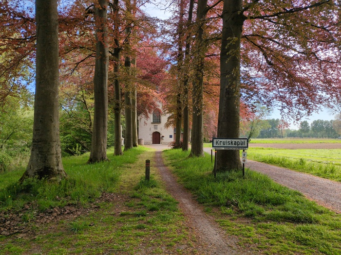

I knew my first stop would be Antwerp and I'd never visited before. I also
wanted a sandwich. I had mentally established that I would find an artisanal
sandwich shop and get a large sandwich with cheese, mayo, eggs, onion, tomato,
lettuce and anything else. It would then be cut in two.

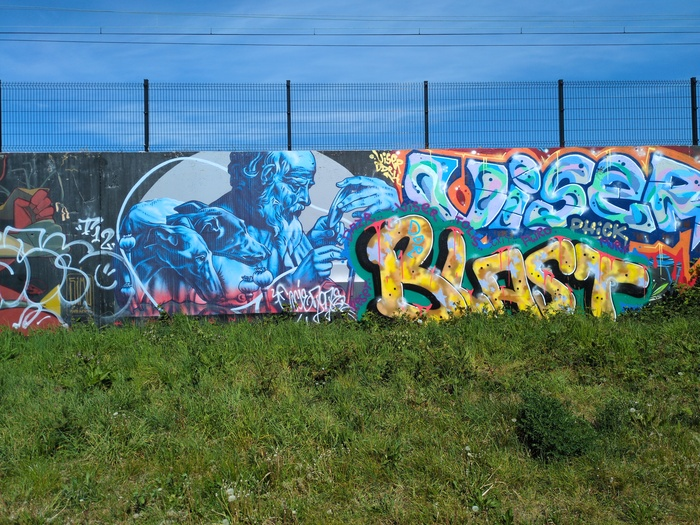
_Grafiti_

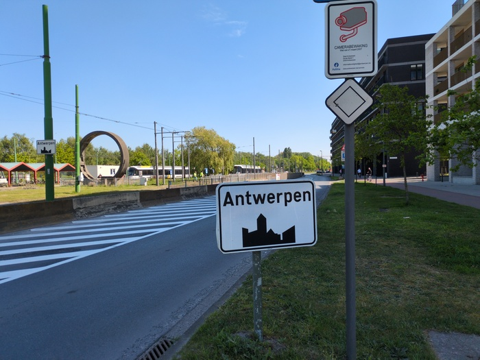
_Antwerp_

As I approached Antwerp I saw a tower (reminding me of the Empire State
Building for some reason) and was making my way towards it. I was unaware of
the river when I the map led me to a crowd of cyclists standing outside of a
building.

"What's going on?" I asked a couple that turned out to be German. "We are
waiting for the lift. The lift to the tunnel"

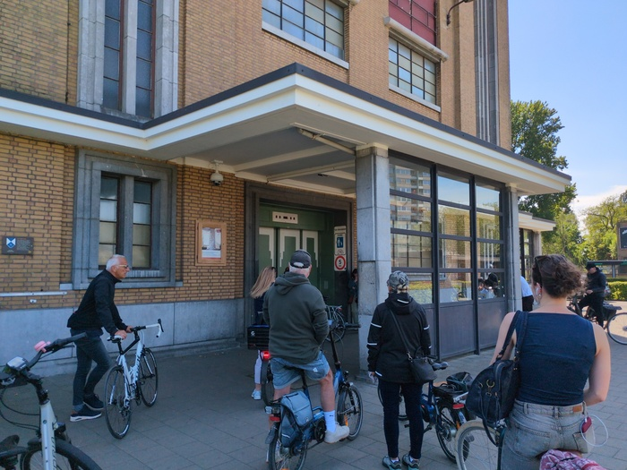
_Tunnel under the river_

The lift was huge and descneded 32 meters below ground and then everybody rode
the distance to the other end to get into another lift. I wheeled my bike to
the front corner and waited. And waited. It's not moving I noticed. I got a
few looks. Then somebody propped up the bike walked in front of my and pressed
the button I was standing next to and it started to move.

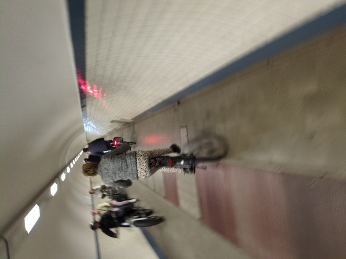
_Taking photos inside of the tunnel_

The tunnel exited into a plaza with lots of food shops.

I didn't find the sandwich of my dreams and what is more Antwerp was
offensively busy. So many people and so few sandwich shops. Waffles? Yes,
dozens on every street. Belgian Chocolate? No problem. Sandwiches? Much harder
to find. I eventually found a Panos which had an uninspired pre-wrapped
sandwich which was a smaller version of the one of my desire.

I had no place to stay that night. I had done around 30 miles. It would be
legitimate to stop in another 30 miles or so at the legal minimum distance of
100k. But there was nowhere to stay. There were hotels, but I wasn't prepared
to pay £140 for one night.

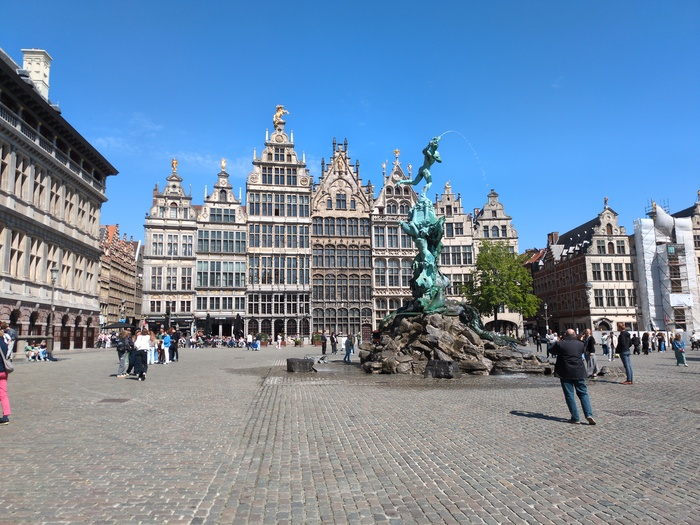
_This is Antwerp_

From Antwerp I joined the Canal. There is not much to say. I hate canals. They
are uneventful and flat and endless. I also hate the wind. The canal was going
east the wind was blowing from the east and it was blowing at around 17mph.

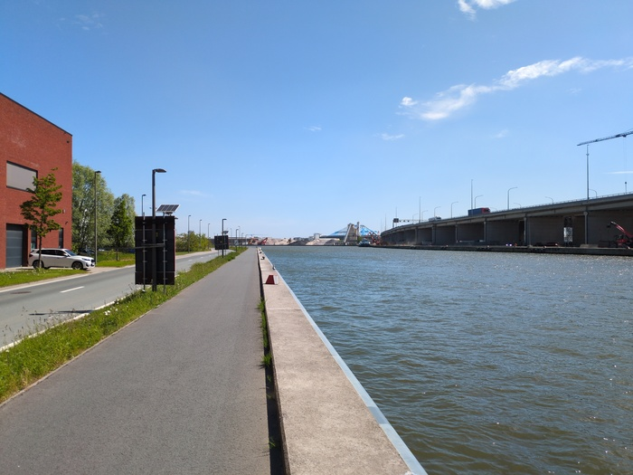
_Canal_

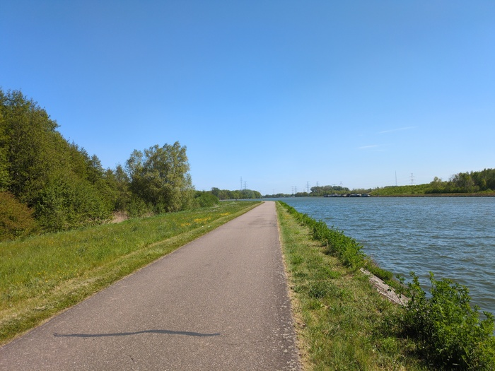
_More canal_

I was approaching the 60 mile mark and I felt weak and was struggling mentally
with the oppressive wind and constant effort. I still had nowhere to stay. My
map showed some campsites which were too far away and didn't look very good.
The next towns hotels were too expensive, and the town after that, Hessalt,
had some appropriate hotels which I wouldn't have needed as I have a colleague
there, but it was too far away.

I stopped. I tried Google Maps. Campsite, 5 minutes away, "Lovely couple" said
one review. That was all I needed. Crossed the bridge did I and wheeled up to
a closed large tavern, that was, closed. I felt a pang of disappointment, but
looked around and indeed there was a campsite, and I could see an old lady
sitting in the garden of her perma-caravan. She avoided eye contact with me
and I decided to have a poke around. Around the back of the tavern was a gate
and in the gate was a woman who I waved at. She welcoming and said camping was
€15 and I had to find food and cash and now I've paid.

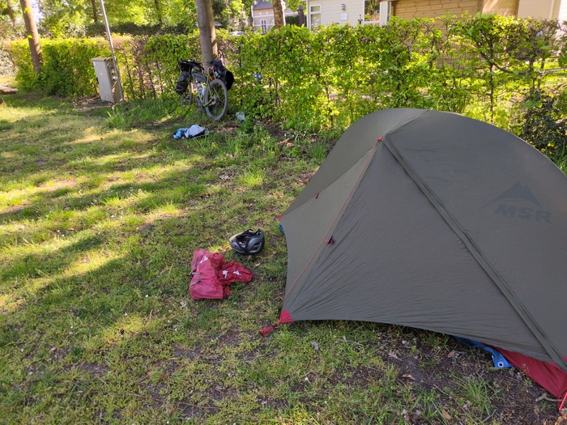
_Camping_

I'm the only camper and I'm about to make my food. Tomorrow I'll be entering
Germany, perhaps via. the Netherlands. Perhaps via. Maastricht.
