--- 
title: "To Aachen"
categories: [verona2026]
date: 2026-04-29
gpx: /gpx/verona26/aachen.gpx
bundle_image: ./202604281750-lunch.jpg
distance: 135.46
time: 7h40m
---

Achen is a vibrant city. I didn't expect that. Unfortunately I'm now in a
hotel 1.5k from the vibrant center and the pizzas located therein. The nearest
pizza is a 20 minute walk over a hill. I'd leave now but the laptop is dead
and needs charging.

I had a restless night in the tent and it became cold in the early hours
necessitating me climbing into my trousers, socks and putting my top on. I
woke at 3am, 6am, 7am (shall I get out of bed now) and at 8:30am I really
needed to use the facilities.

The tent took longer than I liked to pack, I guess I'm not used to it. The
good news is that the air matress didn't deflate overnight even though I
suspected it did. Tossing my stuff all over the field and fastening my bags
onto the bike badly so that things were threatening to fall off all day.

I felt lost. I didn't know exactly where I was going. Without even a coffee I
left the campsite and made my way to the nearest bakery, which wasn't that
near and that didn't have any coffee. They also required a minimum payment of €5
and the pastries were surprisingly cheap and generously proportioned which
meant I had to buy more than I thought I needed.

Bench in the shade and studied my map. It was now almost 10am - I had wasted
some good cycling hours - how far could I go today? Another 100k? Where would
that get me? Heading east I'd be crossing the Netherlands. I need a hotel as I
need to charge the things and I also need a hotel because I want a hotel. The
hotels were expensive in Netherlands, Aachen was just over the border and
reaasonably priced - but it was 76 miles (122k) and the route was 50%
off-road. I wouldn't have thought twice if I had left the campsite at 8am. But
now I wasn't sure if I'd have enough time. I decided to just head in that
direction and see what would happen.

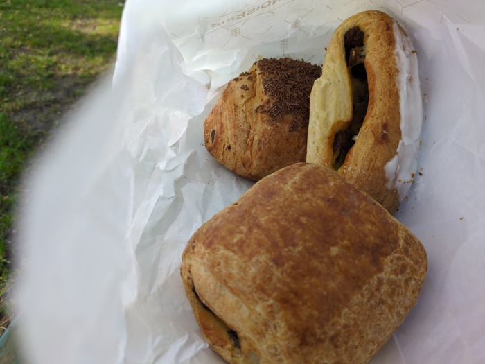
_Three Pastry Breakfast_

The first chunk of the day was back on my unbeloved Canal. Everytime I was
directed off the Canal my excitement grew "is this the last I see of the
canal?! how exciting!" only for the path to wind back to another monotonous,
wind oppressed, stretch.

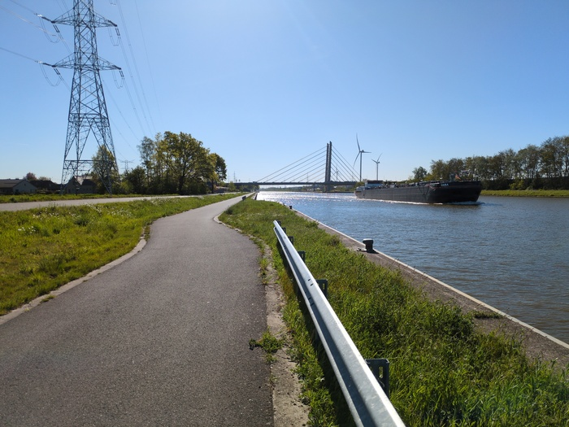
_Oh look! a canal!_

> I'm now sitting in a pizzeria after having walked 2km. I feel warm and
> strangely not so hungry. I'm sun blasted

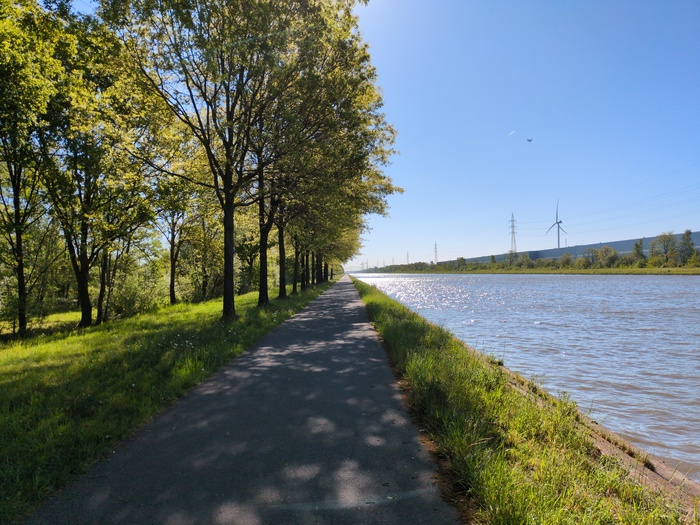
_Oh great fortune! More canal!_

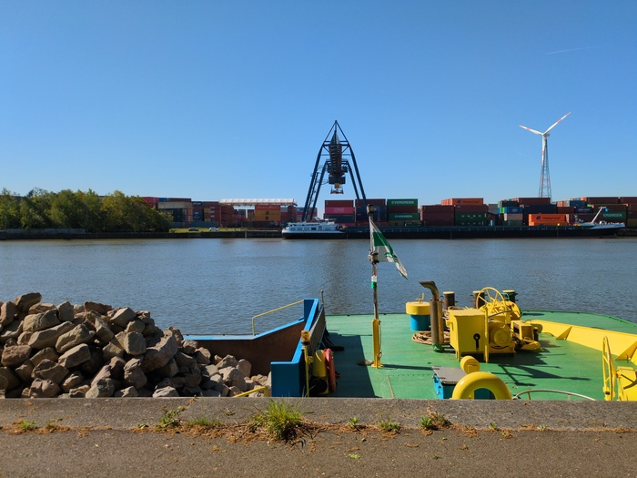
_Containers on the Canal_

Finally as the Canal ducked towards Hasselt I was thrown from its orbit into
the wild woods. The middle part of the day was largely offroad and it was a
welcome relief from the monotonous canal. It takes a degree of concentration
to ride off road which means its not boring. But it was now 13:00 and I hadn't
eaten and I had not arranged for anywhere to stay and I still had 50 miles
(80k) my potential destination, Aachen

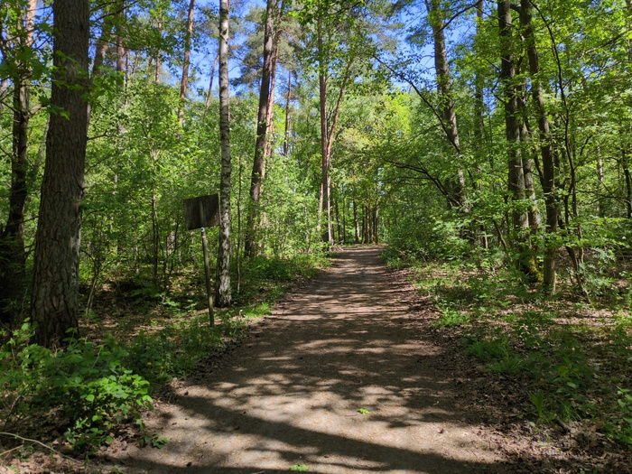
_Woods_

The dirt path wound through the forest, sometimes narrow, sometimes wide,
sometimes bumpy, sometimes smooth but I needed lunch and lunch wasn't
something that one typically finds in the woods. I had to make a detour to a
town.

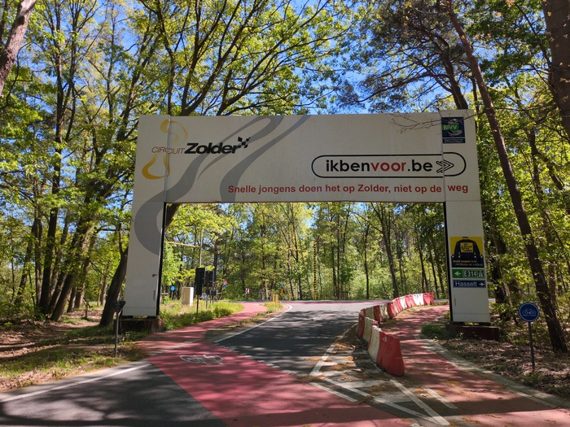
_Circuit Zoler - apparently a motorcross (?) track_

The **Garmin Edge 540 Cycle Computer** doesn't _want_ you to take unplanned
detours. As soon as I leave the chosen path it beeps at me incessantly while
it desperately tries to recaulate the route and turn me around. **BEEP!** **BEEP!**
"fuck off". **BEEP!** **BEEP!** You'd think there would be a "pause navigation" option but
the only option seemed to be to stop it completely which would've been more
**BEEP!** trouble than it's **BEEP!** worth.
_
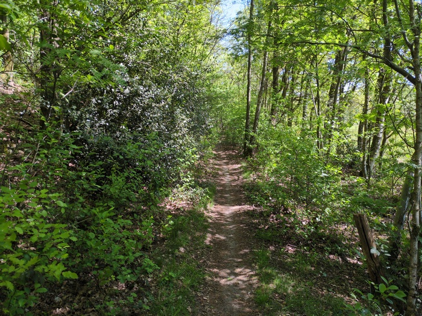
_Narrow track_

My chosen supermarket was the wrong one. It was huge and I had to leave my
bike outside - it was a very respectable area and it wasn't in danger of being
plundered but I have zero trust and my stress levels rise rapidly when I leave
it in public with its flimsy lock. My heart dropped when I walked inside
because it was a huge supermarket "what the fuck" I said. I'd have to collect
my things as quickly as possible and I did so as swear words poured out of my
mouth when I thought people couldn't hear me.

As I checked out I realised I had forgotten to get a drink but I had enough
water - or did I? I didn't know how much longer I'd be off road and it was
getting hot. I decided to risk it rather than going back in and being socially
akward.

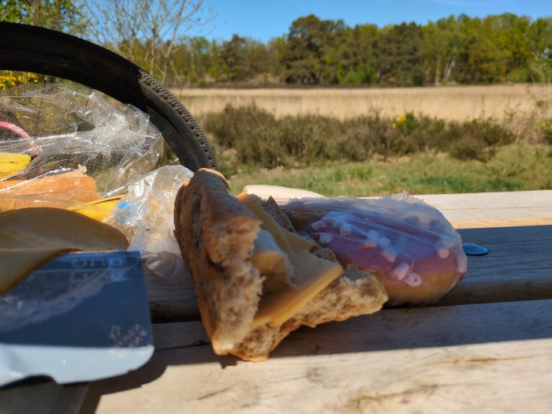
_Unsheltered Bannana and Cheese and Dohnut Lunch by a naturally noisy Watery place on a Bench provided by God_

The trail was very sandy in plaes causing the bike to glide at best and to
stop at worst requiring me to push it out onto more stable ground. I probably
need to check and possibly clean the chain tomorrow.

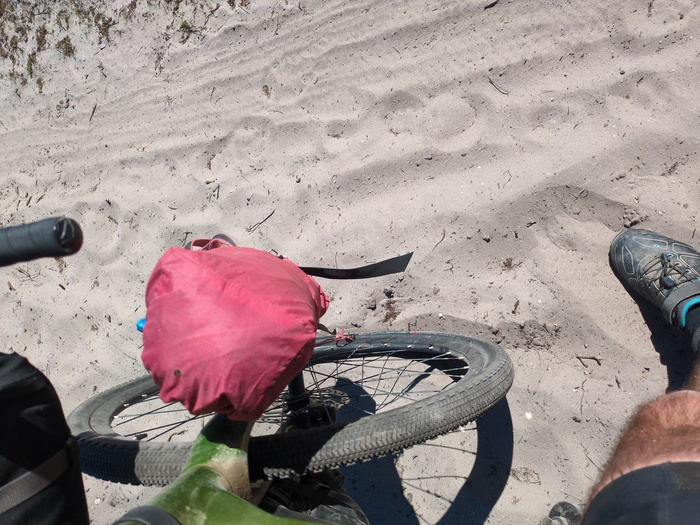
_Sand_

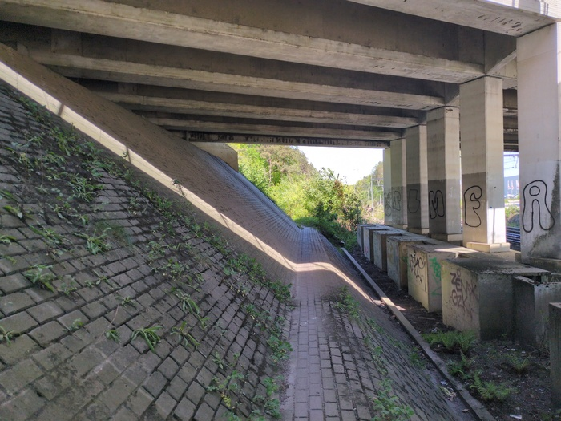
_Underpass_

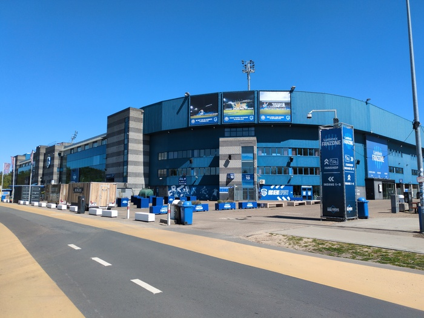
_Football is a thing in Belgium_

For a long while I was following a bumpy trail when I looked to my right and
saw the torso of a cyclist flying by on the otherside of the trees. I had been
riding a trail _next_ to a dedicated inter-forestery cycle path. Rattling
along on a
bumpy, hazerdous, trail when there was perfectly good asphault directly
parallel to me seemed like performative masochism so I joined the cycle path
while my cycle computer got chastised me **BEEP!** **BEEP!**

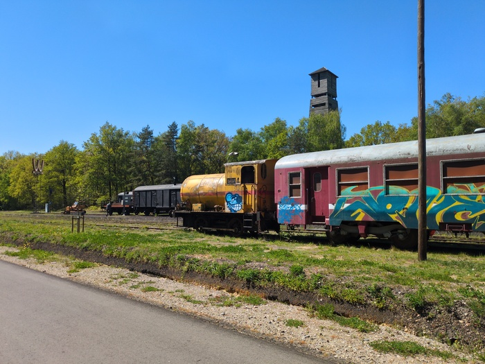
_Erstwhile Train Station_

The cycle path was a greenway that ran along what was a train line, the tracks
of which were often left in place and were being reclaimed by the forest.

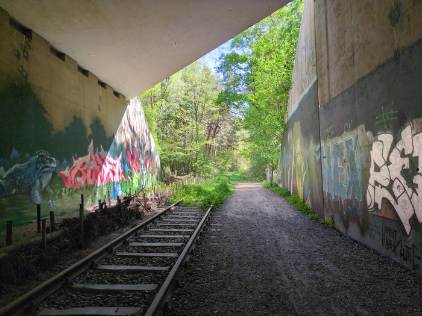
_Tracks being Reclaimed by the Forset_

While some of the trail was clearly meant for cycling, other parts were hiking
paths where cycling was prohibited by signs I chose to ignore. Other parts of
the trail seemed to be signed MTB trails.

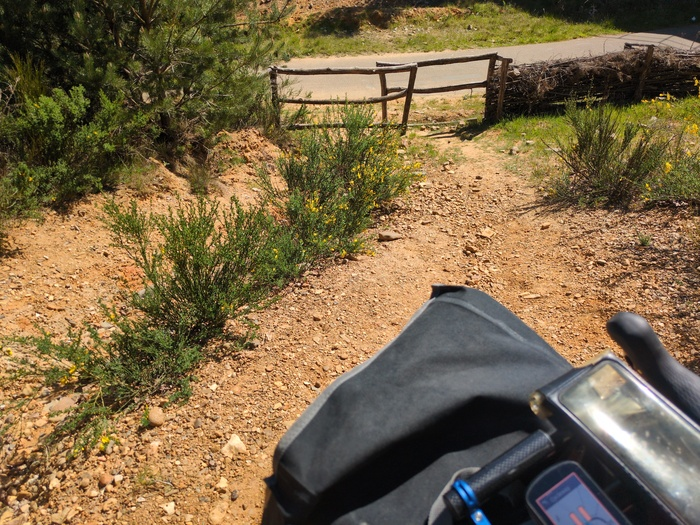
_Exiting the forst trail_

I had in mind to stop at a bar and get a cold drink at the next opportunity.
There was a campsite and swimming pool, the bar looked open and I hesitantly
wheeled my bike in. I found the bar. "Can I ... have a coke" I splittered out
in bearly-understandable English. The lady stared at me and nodded. She was
standing by the bar. "Yes" she said "€0.50" she said. "Wow, that's cheap!" I
paid with my phone and she printed a ticket and explained "go down to the pool
and show this ticket" ... I looked confused. We were at the bar. "Sprechen sie
Deustch?" I asked. She had given me a toilet ticket. Which table? She asked. I
waved broadly at entirely empty seating area but she walked out with me and
sat me at table 16. "Darf ich jestz Zahlen?" (can I pay now) I didn't want to
fanny about "Nein".

When I went back inside I asked if I could fill my "Wasserflaschen" she
thought for a minute, standing in front of the bar, with its taps of water
"You can use the toilet". "Ah! Thankyou!" I said looking at the bar, with its
water, and the implication that I'd have to pay €0.50 to get access to said
toilet to fill meine Wasserflaschen I left with no water.

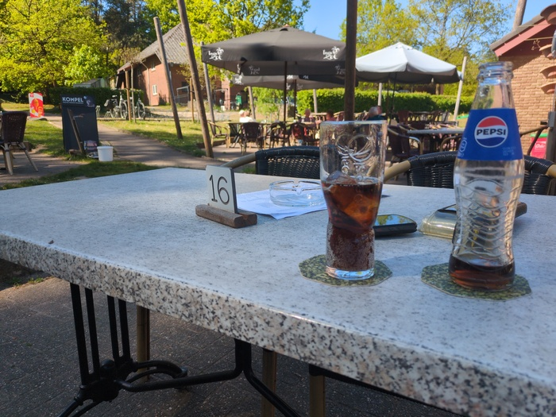
_Coke but no Water_

I ditched the helmet in the forest[^ditch]. It was getting hot and my head was getting
hot and I'm never riding more than 13mph anyway - I need to buy a hat though.
Fortunately I'm not in Spain so I'm not going to get busted by the cops.

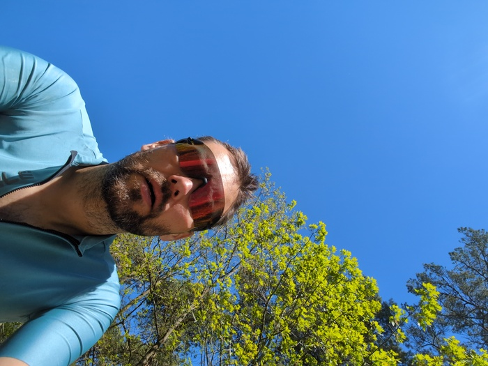
_No helmet_

I finally exited the wonderful section of trails - this is the most "gravel"
I've done in a day. I had been riding and was approaching the ultimate 20-30 mile
stretch through Netherlands and into Aachen. It was 16:00 and I realised that I'd easily make
it to Aachen by around 19:00 and decided to book a hotel.

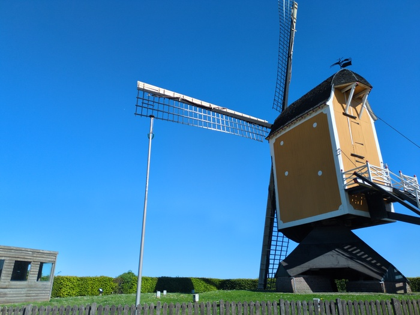
_Netherlands_

Besides annoying me, my cycle computer, for any given route, will count the
number of "climbs" there are, and when the climb starts it will say "**CLIMB!**"
and then switch to a view showing the remaining distance. I find this feature
both annoying and useful. It's nice to know that you've done 10/13 climbs for
the day and to know what to expect. But it's annoying too. "**CLIMB!**" it says
with the impication that I'm going to start sprinting up the hill. I thought
it was disabled but there have literally been zero hills in the past few days.

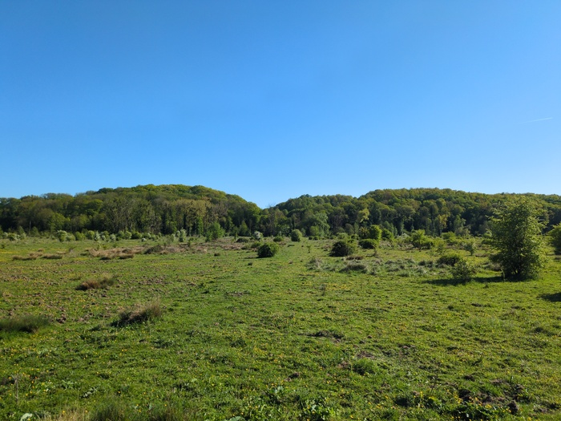
_Greenery_

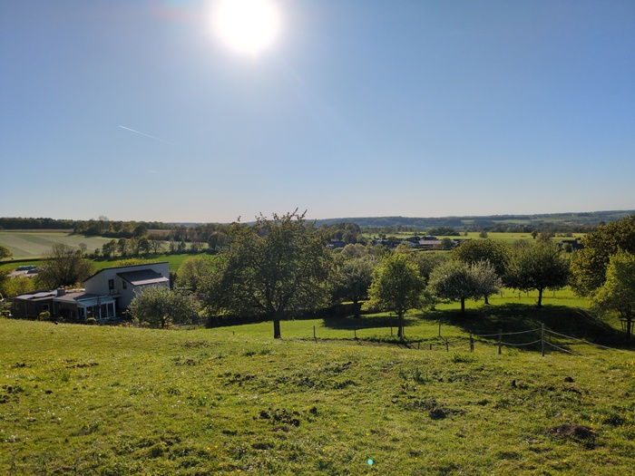
_Hills in the south of the Netherlands_

Towards the end I was struggling again although the struggle was only evident
in my lack of stamina and the knowledge that it was only 10km to Aachen. I
felt slower and I crawled very slowly up the hills towards the end.

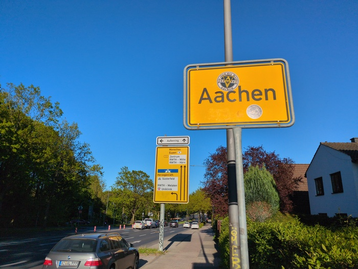
_Aachen_

I'm not sure what's happening tomorrow. I'll leave and I guess the route
starts to head south now.

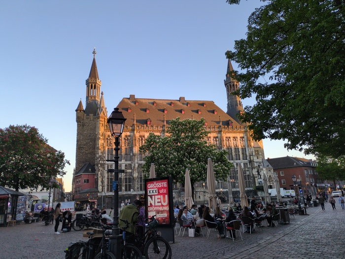
_Aachen Cathedral_

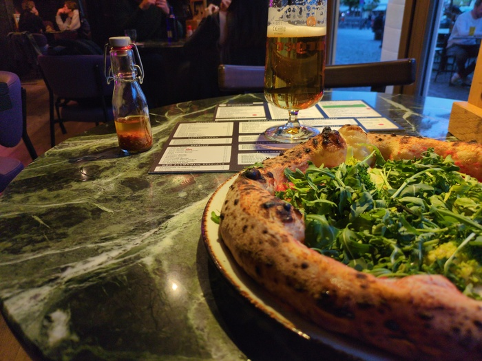
_Pizza and Beer_

---

[^ditch]: I didn't actually throw it away. I put it on the back of my bike.
