--- 
title: "Aachen to Troisvierges"
categories: [verona2026]
date: 2026-04-29
gpx: /gpx/verona26/troisvierges.gpx
bundle_image: ./202604292145-adventurebike.jpg
distance: 117.9
time: 7h01m
---

Today has been a a great ride with plenty of challenging off road sections.
I've just been served a large pizza vegetarian 5 minutes after ordering it and
I'm camping in the town of Troisvierges in Luxembourg. Now sitting in a
Brasserie where people don't seem to understand English but French seems very
popular but the signs are in German. I have not done any research.. A group of
French youths just left leaving me on my own in the garden terrace, which I'm
quite happy about.

I'm struggling to remember this morning. I left the hotel in Aachen after an
inclusive breakfast. The hotel was cheap but clean and I slept well. I hopped
on my bike it was refreshingly chilly. I had decided over breakfast to
head south. My original "route" (that was generated by a computer) would have
taken me east but a number of factors made me go south:

- The wind was blowing the the East. It would be easier going south.
- Somebody on social media recommended it "the highest pass in Belgium"

I'd discover that it was a great decision and it meant that I'd introduce a
new country to the trip. I felt energised as I jumped on my bike and started
pedalling with an energy that would be very much absent in a few hours. It
didn't take long before I was heading into the woods.

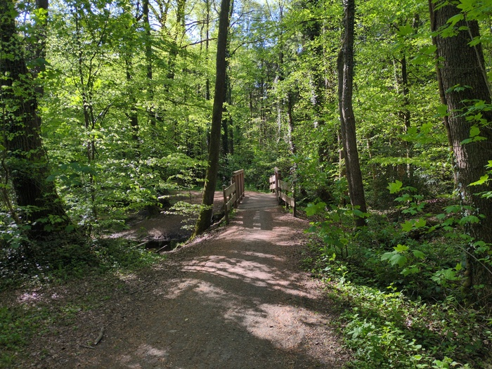
_Bridge into the woods_

In the first hour I was blown away by the beauty of the trail. The weather was
perfect, the green fields, the tall trees, the cloudless blue sky with, at
any given time, a number of jetstreams from planes taking off from an
airport, somewhere.

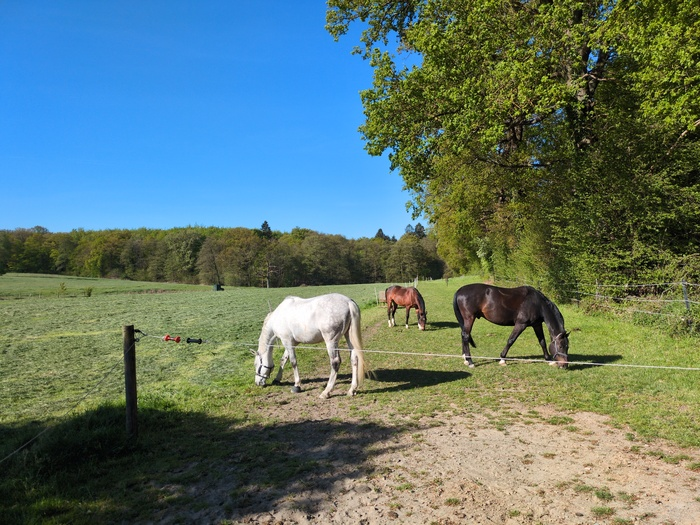
_Horses_

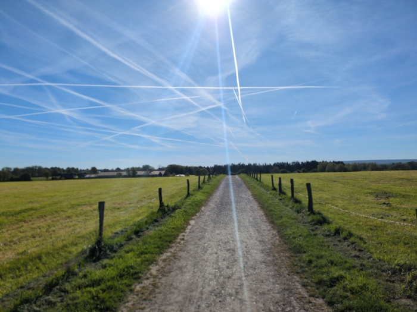
_Jet Streams_

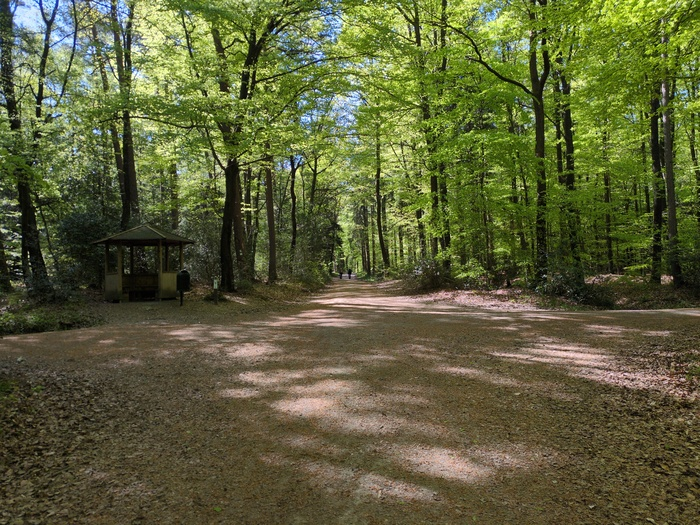
_Two Hikers_

The trail was sometimes challenging and there were a few sections that I had
to push or carry the bike - these trails would not have been possible with my
old four-paniered touring bike.

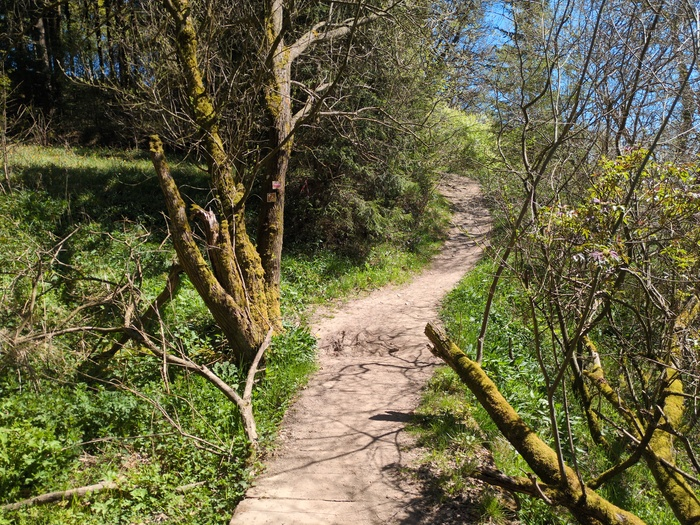
_Dipping into the troughs_

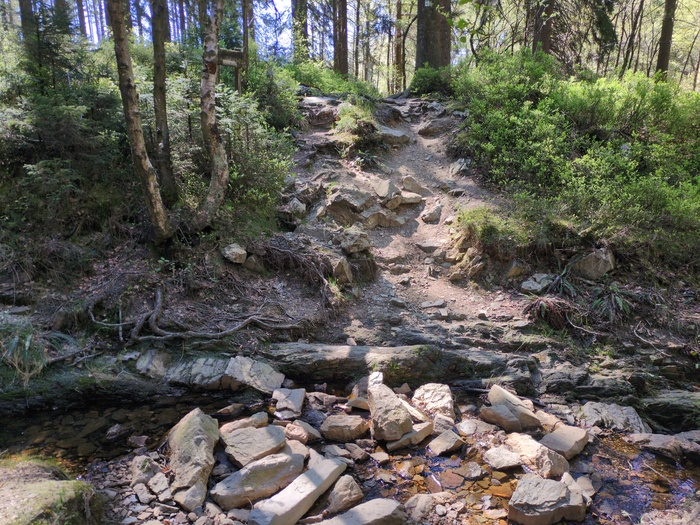
_Fording the River_

 The trails climbed to an altitude of 550m and after that I joined part of an
 extensive [RAVeL](https://en.wikipedia.org/wiki/RAVeL_network) cycle network
 which made heavy use of the old railway lines and are named after them. The
 route would alternate between the fast, flat, asphault and interesting
 off-road sections or forestry tracks.

 At around 11:30 I arrived in a town, covered in dust, and located a bakery
 with [OpenStreetMap](https://osmand.net/). If I disparaged German barkeries
 in the past, I take it back. This one was fantastic. They had a wide choice
 of vegetarian options and I had a Frischkase bagel and a coffee.

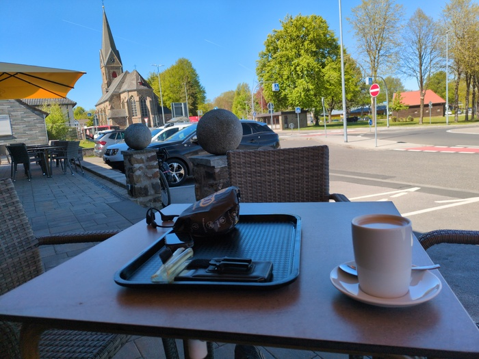
_Frischkase Bagel (hidden in the bag)_

One of the trails confronted me with a raised walking platform, which I
dutifully cycled over. I would have felt more clever if the trail wasn't
running parallel to the RAVeL route and was one of the "pointless" diversions.

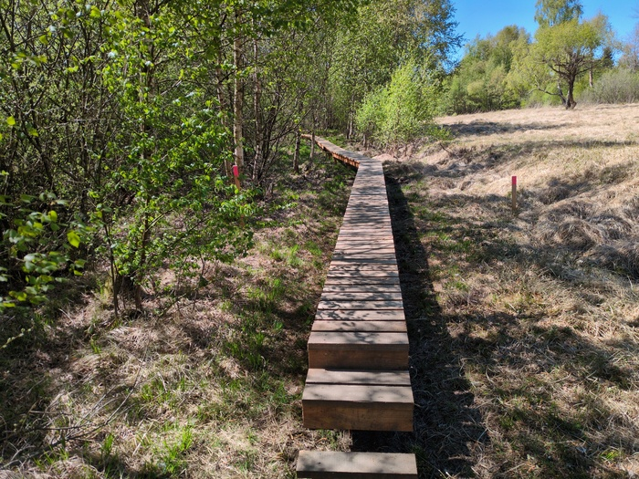
_Bicycle Obstacle Course_

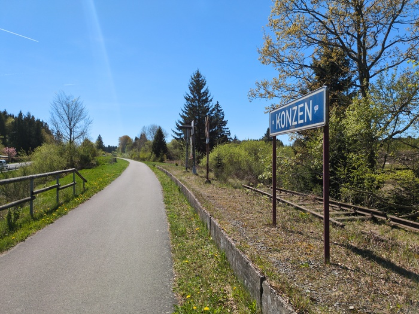
_Train Station_

The trail continued to the "Gefahrlich" path. For maybe 500m it was just sharp
descents and big bolders that I either walked or carried the bike over. I
fell off once (or rather managed to jump off and the bike fell over) but no
_harm_ was done.

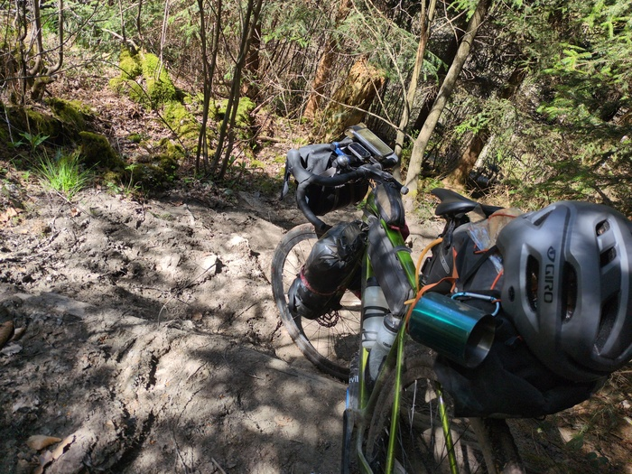
_Rocks all the way down_

After that there was a shelter by the river which I used as an opportunity to
park my bike and take a pee.

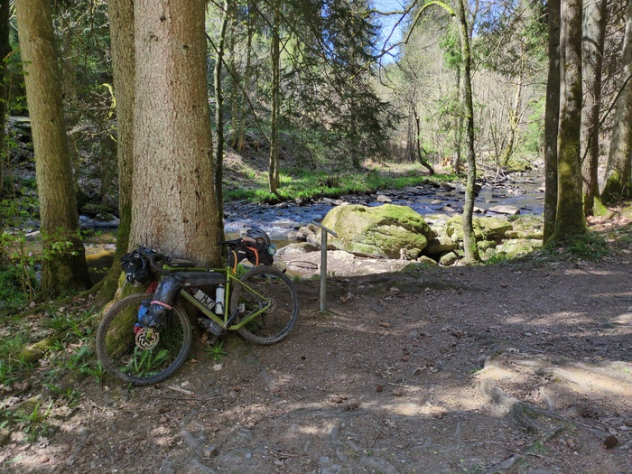

The trail exited onto a main road, and to the left as the road turned away
there was a little (well, medium-sized) chapel with burning candles and images
of Christ but most importantly there was a fountain emanating from the raised
platform.

In contrast to the previous days where I was exposed to the sun all day long I
wasn't very thirsty and hadn't, after 3 hours, finished a single water bottle.
But regardless I couldn't pass up an opportunity to binge some ice-cold
mountain water.

As I had been riding the trail to this point I remembered that my rear light
was still strapped onto my saddlebag. It was quite secure when I saw it last
but, after having lost my cutlery (which was attached to the carabiner of my
mug that is strapped to the side of my saddlebag) I thought it would be
prudent to remove it as I was unlikely to need it again.

When I arrived at the Holy Fountain I checked it. It was gone. All that was
left was the rubber band that held it in place. It probably fell off when I
fell over earlier. I'll need to get a new one.

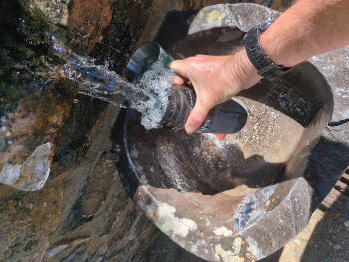
_Mountain water, bottle and mug_

My bum cream is running low. It's running low because I'm using it multiple
times a day and it's my lifeline. I also need to remember to buy some sun
lotion, a baseball cap and a new rear light.

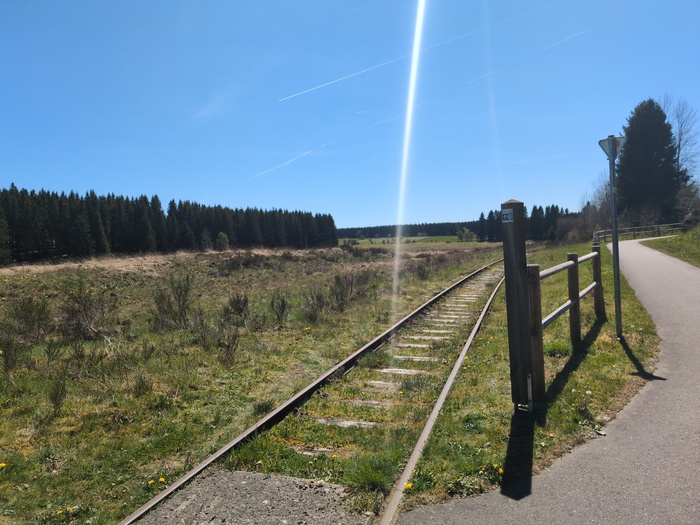
_The old railway_

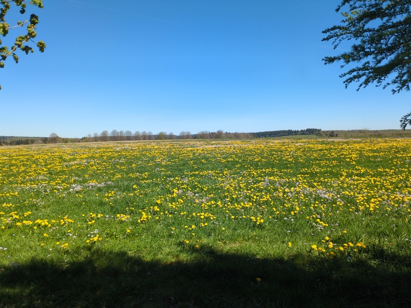
_Flowers_

_More trails_

At 16:00 I thought it would be prudent to phone ahead to a camping site and
verify that I could get a spot and that it wouldn't cost an extortionate
amount. 99% of the time there is a spot and it doesn't cost an extortionate
amount, but sometimes you end up in
[Wales](https://en.wikipedia.org/wiki/Wales). The route I planned was aimed at
a campsite near Troisvierges but they didn't answer, there was another and
they did and it would cost €16.50 and then I got lost and found my way again
and it would be another hour and a half of riding.

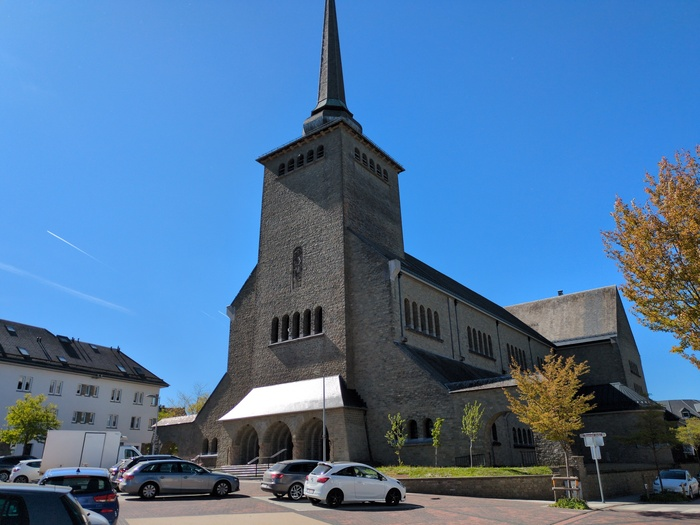
_I booked my camping pitch here with a telephone call and then got lost_

I had lots of time to get there. Today would rank in my top ten
rides, it might even be number one. It was awesome.

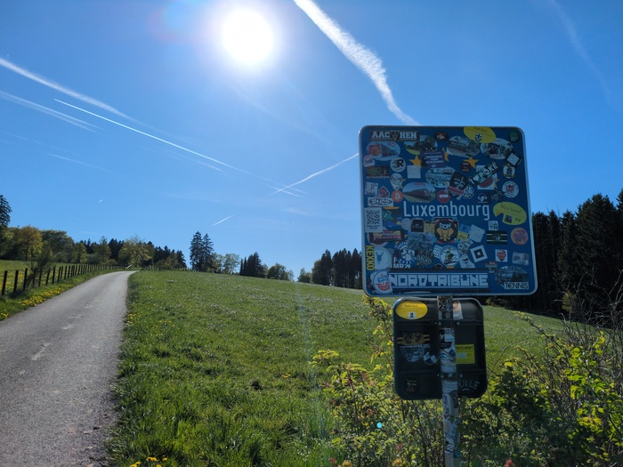
_Hello Luxembourg_
