--- 
title: "Troisvierges to Remerschen (Schengen)"
categories: [verona2026]
date: 2026-05-01
gpx: /gpx/verona26/remerschen.gpx
bundle_image: ./202604301748-damn.jpg
distance: 110.25
time: 5h58m
---

Sun blasted, lips cracking, tired, but otherwise feel good sitting at a
makeshift desk in a large, modern, youth hostel with a chair propping up the
charger which is connected to an EU power adapter which is prone to fall out
of the socket (and, on occasion, [electrocute people]()[^forgot]) that's propped up by a chair and the USB cable is too short so that's going
via. my portable charger. I need another USB-C cable. I bought two with me and
I've discovered that the prettier one (it's textured and posh) has stopped
working which limits my charging options.

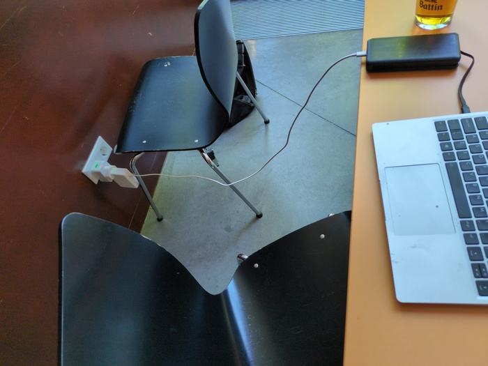
_Charge d'excellence_

I had anticipated a bad nights sleep in the tent. So I put on my extra layers
before sleeping. It was colder than a few days ago despite being far hotter
during the day and I could tell that it was going to get colder still. My
sleep was also troubled due to vivid dreams, which included me trying
fruitlessly to find a toilet - this was due to me having consumed 1 litre of
beer and 33cl of Leffe before sleeping. At 4am I had the choice: get up and go
or lay in bed and alternate between waking and dreaming about going for a wee.
In a hotel room it's a no-brainer, but in a tent it involves the whole "get
out of the sleeping bag into the cold and leave the tent" ritual. I bit the
bullet at 6:30am and dozed for another hour before planning breakfast.

Opening Google maps I typed "bakery" and a number of bakeries showed up
on the screen. I clicked on one - **opens on Saturday at 9am**. This was strange
because it was Friday. I clicked another **opens on Saturday**. "supermarket" I
searched **opens on Saturday**. I clicked **show all shops that are open now**.
There was _nothing_. It dawned on me that this was a holiday. It was [Labour
Day](https://en.wikipedia.org/wiki/Labour_Day) and it is very much celebrated
as a holiday here. 

The fact that all the shops closed was probematic I had:

- 2 bannanas
- Some rock-hard stale break that I threw out of the tent the night previous.
- Some gummy sweets

This was not going to be sufficient for 100k of potentially mountainous
riding. I also had two sachets of Uncle Bens pre-cooked Chilli-Sin-Carne from
Asda that I had reserved for emergency camping dinner. I resigned myself to
the fact that I might have to make do and hope that I had enough.

I noticed the camping reception was open "where can I get food?" I asked "you can get
breakfast at the cafe at train station". This surprised me as Google said it
was closed. I was relieved and I said thankyou and farewell and packed my
stuff, slightly more efficiently then last time, and cycled up the hill to
turn left down the hill to get to the train station where the cafe was
located on the way was a convenience store and the **convenience store was open**.
I paused "shall I go to the brasserie and breakfast in luxury or should I at
least check out the store before it closes and stock up for the day".

There was no harm in visiting the store and it would in fact
be silly not to. It was a poor-looking convenience store with that stale smell of
vegetables that such stores have but busy and it had a seating area and
they served coffees and pastries and actually quite a wholesome place. I
picked up two pastries, a bread roll and a coffee. "I'll make bannana
sandwich" I thought. In retrospect, this would've been my last
chance to buy supplies, I should've purchased far more than this. I wheeled my
bike to a bench with coffee in one hand and drank it and ate my pastries and
started cycling towards **Remerschen**.

I'm going to Remerschen because the Youth Hostel in Luxembourg City is full
and the hotels are outrageously expensive. I was going to Luxembourg City
because it was only 55 miles away and I thought I'd have no food. I'm going to
Remerschen because there's a Youth Hostel there that had available beds. It
was about 70 miles and 70 miles was too far. I had also considered going to
Germany or France but they also have Labour Day.

So I left town with my bread roll and bannanas and immediately left the road onto a hiking
trail. Looking much the same as some of the trails from yesterday

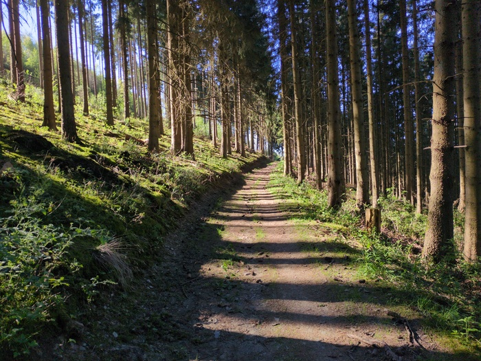
_Morning Trail_

The trickier trail wound down and descended to narrowers paths and there
were switch backs and at times I was facing down towards rocks and breaking,
the back wheel slding on the dirt and at an angle where there was a possiblity
gravity would flip the bike over.

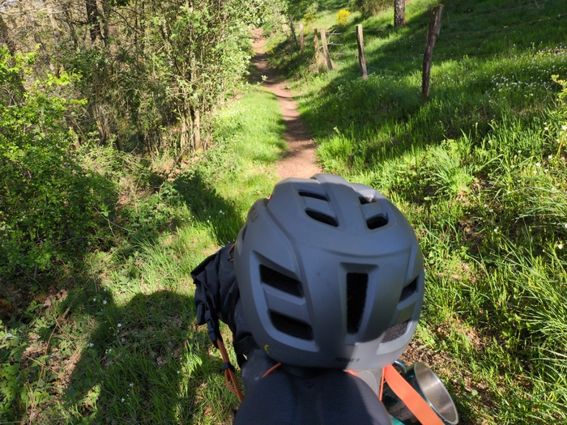
_Going down_

After going down I had to go up, and up, and up again. The gradient was too
steep to cycle (especially when having to navigate tree roots) so it was a
case of pushing, pulling or carrying the bike.

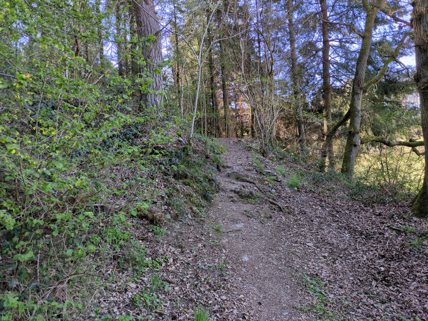
_Challenging Roots_

The path eventually "levelled out" - it had the relative illusion of being flat while
actually being a 14% gradient.

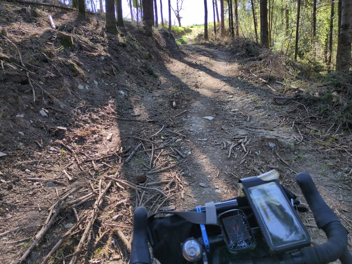
_Nearing the top_

Navigating this first part of the day took about an hour and a half and I
covered just 7 miles. I was concerned that if there were more of these sections
I'd not only be late, but also calorie difficient. After the trail I joined the
cycleway and I felt I was starting to eat my miles.

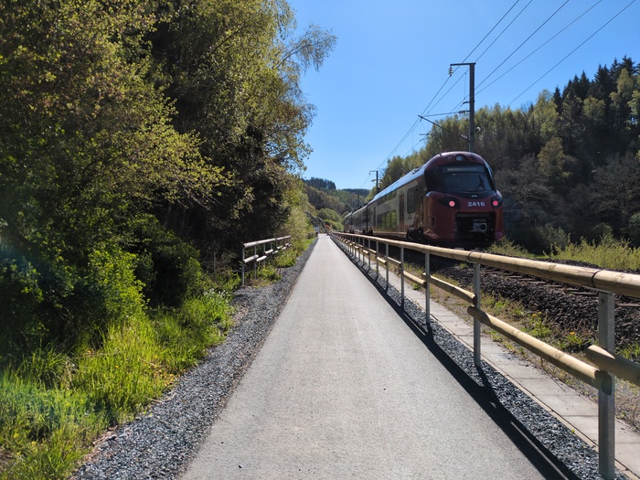
_Train!_

Having made a policy of avoiding the trail sections I ended up riding into a
town in a valley that I would have otherwise avoided. I thought that by
avoiding the trail I'd be faster, but the opposite was true as I ended up
riding up an incredibly steep road that led to an even steeper trail - so
steep that I had to catch my breath every few minutes before continuing to
strain my calve muscles hauling the bike towards the National Road.

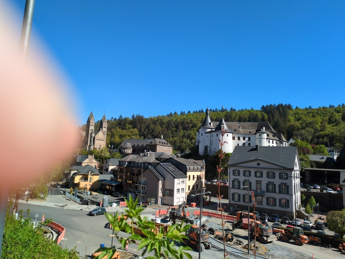
_The Unintended "Village"_

The sun was shining hard. This would've been my ideal weather but the sun,
like the rain and the cold and all weather becomes oppressive in excess and
the unbroken blue sky and lack of shadow caused the suns rays to beat down
onto my unprotected skin and even through my cycle jersey to cause minor
burning my neck, legs, arms and hands. I had intended to purchase sun cream
today, but all the shops are closed because Labour Day.

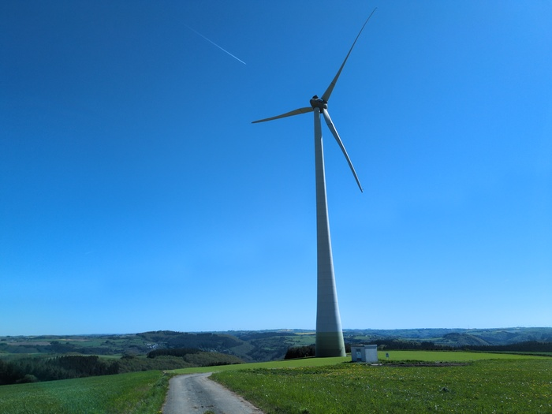
_Big Windmill_

I was at around 500m altitude and the route turned off the road onto a forest
track that went down - and it continued to go down. At this point I had been
cycling for two hours but I had barely done ten miles - so the descent was
welcome although I made heavy use of the brakes due to the forest detritus and
ruts.

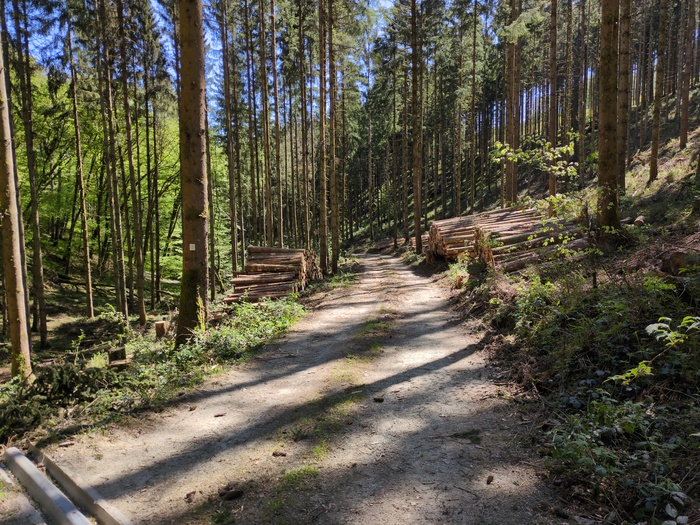
_Descending on the Forestry track_

I joined the main road. This is the first day I've been on a road with fast
traffic. As I climbed the hills there were thousdands of
[dandylion](https://en.wikipedia.org/wiki/Taraxacum) seeds floating in the air
providing a surreal element to the scenery.

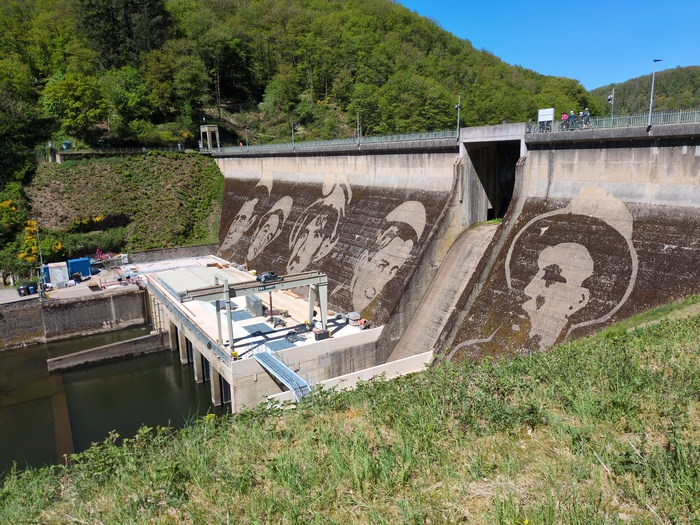
_Damn_

At this point I was on the road and I'd stay on the road. On one occasion I
had a choice to stay on the road or take the trail. Again I think the trail
would've been the better option and I felt a pang of jealousy as I saw two
cyclists on the trail on the otherside of the river while I was riding on the
asphault with cars overtaking me at speed.

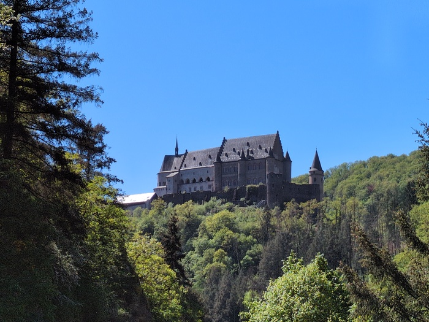
_Ceci c'est une Chateau_

I arrived in a place called
[Mullerthal](https://www.visitluxembourg.com/destinations/mullerthal). It was
conspicuous because of the _incredible_ number of parked cars and tourists.
There were far too many people and far too many cars - cars parked bumper to
bumper on both sides of the roads stretching for kilometers in either
direction and overflowing into parking fields. The attraction seemed to be the
hiking trails and the tourists were all over them like _ants_.

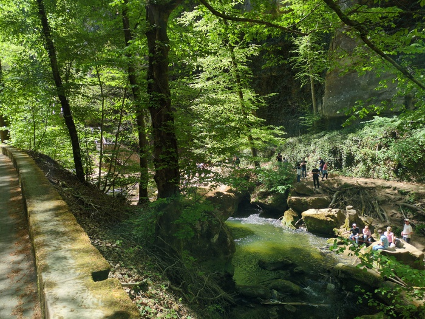
_Tourists - other frames would have featured more - they were _everywhere__

At this point I had covered more than half the distance. I had already
consumed my bannana sandwich a few hours previously and I had subsequently
encountered a petrol station that had one vegetarian take-away option that was
not disagreeable and I had stashed it in my bag for later. Now was the time. I
was feeling somewhat heat sick. I was sick of the heat.

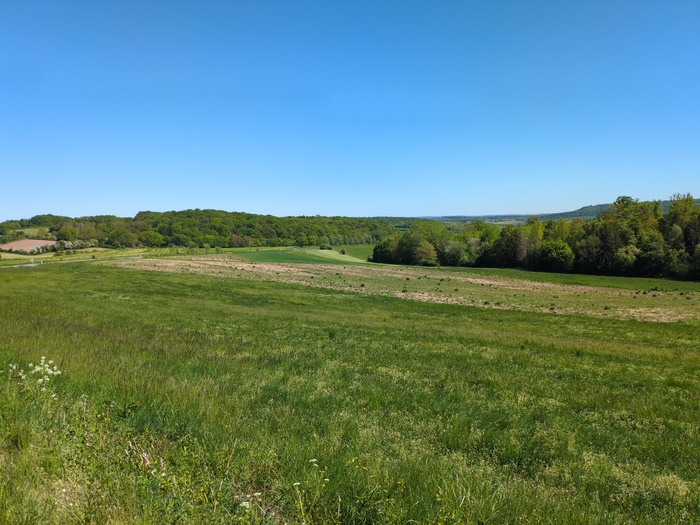
_Green - Luxembourg is very green_

The subsequent hours went quickly. The road flattened out and I met with the
[Mosel](https://en.wikipedia.org/wiki/Moselle) river which twisted and turned
and led me to more tourist traps. I was navigating the cycle path and weaving
in between hoardes of people. As the traffic was backed up on the main road I
decided it would be easier to ride there before the density of tourists
reduced to a level where I could rejoin the path.

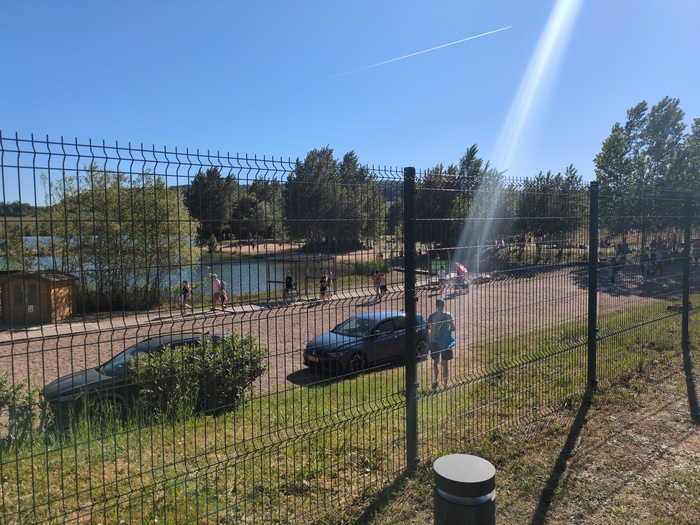
_Tourist Zoo?_

When I arrived at the hostel I wheeled my bike inside I said "hello". I'm
still not sure which language to speak. The offical language is
"Luxembourgish" but all the road signs are in French and there are a healthy
number of German signs too. There are _no_ English translations on "history
boards" that are found at historic places and I've had two occasions where
English was not understood at all. The receptionist struggled with English
and continued in French "Vous avez reservez une dormitoire Femme". I laughed
at my mistake but also was worried that there would be no male dormitories
(there were).

Despite my doubts in the morning I was both fed and ahead of time. I arrived
at the hostel at 17:00. Wherever I end up going I'll need to find sun-cream
tomorrow and maybe some lip-balm.

---

[^forgot]: I forgot that it was dangerous. I should really throw it away...
