--- 
title: "La Moselle"
categories: [verona2026]
date: 2026-05-02
gpx: /gpx/verona26/nancy.gpx
bundle_image: ./202605011748-moselle.jpg
distance: 126.92
time: 6h25m
---

Now sitting on an exposed table of a pizzeria on a street in Nancy. Kids are
rolling in the street and there is a spattering of other customers but it's
not busy. I'm waiting to order. I think I'm hungry, I'm certainly thirsty as I
just about ran out of the water that I was rationing today not having found a
convenient place to top the bottles up and the day was longer than I thought
it would be. I would have trouble speaking to the waitress.

The route was calculated in the morning over breakfast in the Hostel. I was
scanning around for cities or towns at appropriate distances and in
appropriate directions. Metz and Nancy stood out. But Nancy was only 75 but
would be a nice place to visit, beyond it was a town, Charmes, that would
comfortably exceed the 100 limit, perhaps too confortably to not be
comfortable. I didn't realise at the time that I was looking at miles and not
kilometers.

> At this point my order arrived and I drank an 9% "artisanal italian beer"
> which tasted like liquid gold and the pizza was a Calzone, which is what I
> ordered but I didn't know what that was until now. It was good.

I shared a 4 bed dorm with a guy from South Korea. He was hopping between
cities in Europe and had a youtube channel "I want to be an influencer" he
said. He mentioned that **all the public transport in Luxembourg is free** - I
double checked and indeed it is. Apparently the residents are rich and the
system was losing money anyway (not sure how those two factors combine to an
advantage) but more importantly making it free incentivises people to _not_
drive.

My lips are cracked. And it was for these lips and my burnt skin and uncovered
face that after breakfast I enquired as to where I might buy a "chappeau" (I
didn't know how to say baseball cap). I was directed to a magasin called
"Action". It took 15 minutes to walk there and when I arrived at 8:45 it
wasn't open until 9:00 so I had to wait. There was also a Pharmacy but that opened at
9:30 and I wasn't waiting for that. 

The Action store had almost
everything:

- Baseball cap (€6)
- Lip balm (€0,99)
- Sun cream (€6)

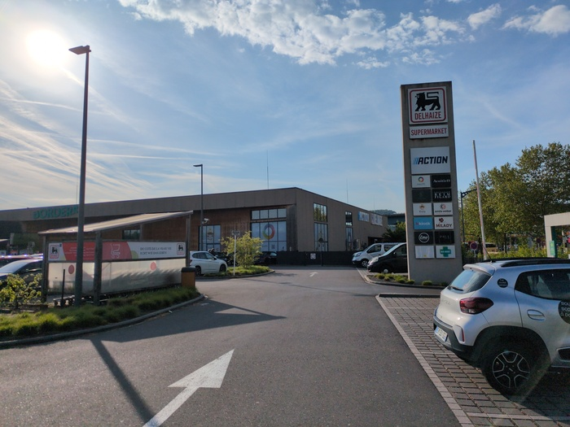
 _=Action!_

It didn't have bum cream and I walked back to the hostel. I should've ridden
there and back but I've got an irrational fear of leaving my bicycle
unattended. I should probably get over that. It was 10 o'clock when I left the
hostel. It was Saturday and shops would be open.

Within 15 minutes I was in France riding on the
cycle path that follows the [Moselle](https://en.wikipedia.org/wiki/Moselle) river - carrying on from where I had left
off the day before and probably onto which I'll carry on tomorrow for lack of
better ideas.

The day was set to be an easy day. No significant hills, just riding by the
river and through towns and cities. Passing numerous fishmen (no fisherwomen)
casting their lines into the river and a steady stream of cyclists. Waving touring
cyclists, reactionless old couples, groups of retired people occasionally
saluting, road cyclists either stare straight ahead or give a nod, the
occasional person on a
[recumbant](https://en.wikipedia.org/wiki/Recumbent_bicycle) but I have no
idea what they're doing with their faces. I've now developed a policy of
smiling by default and returning nods and gestures given.

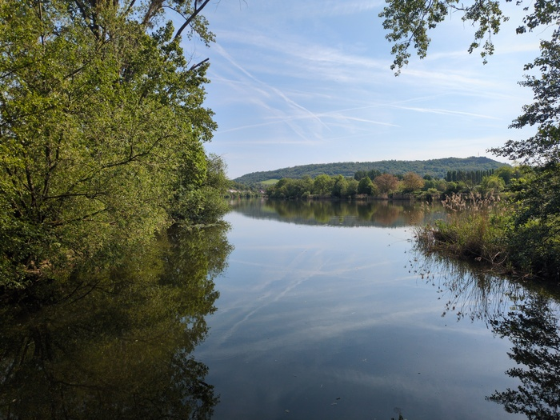
_La Moselle_

The Moselle is like the Canal but also unlike it. It is much more varied and
more sheltered from the wind. There were only a few sections today in which
I fought the wind and the wind was winning.

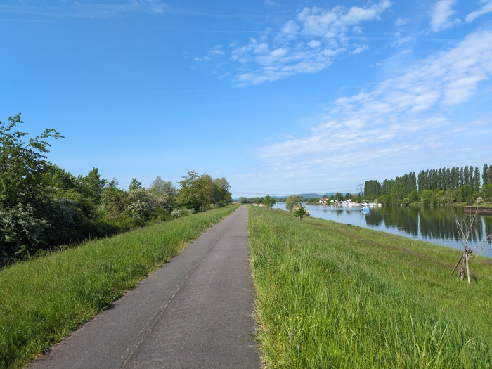
_Moselle again_

I probably should've eaten more for breakfast. So I stopped at a bakery and
purchased an "Escargot Raisin" usually known as "Pain au Raisin" - although
this one had icing on it, so maybe that's a difference.

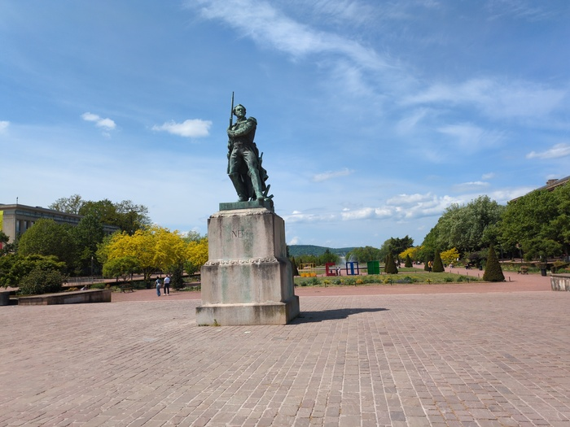
_Park_

Metz is a beautiful city. It was busy but at the same time _calm_. Everything
seemed relaxed and I cycled slowly aimlessly navigating the humming crowds
and investigating the cathedral and trying to find somewhere to get something
to eat.

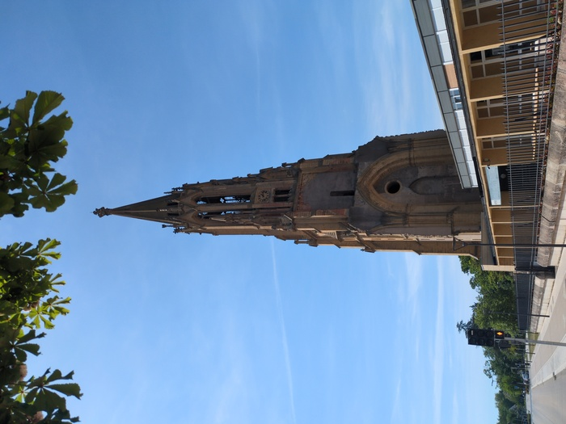
_[Temple de
Garnison (1875)](https://fr.wikipedia.org/wiki/Temple_de_Garnison)[^destroyed]_

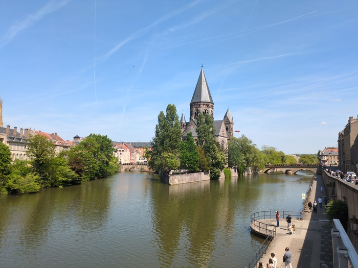
_Temple Neuf (1901)_
_
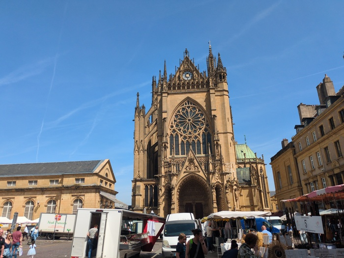
_Cathédrale Saint-Étienne (401-500)_

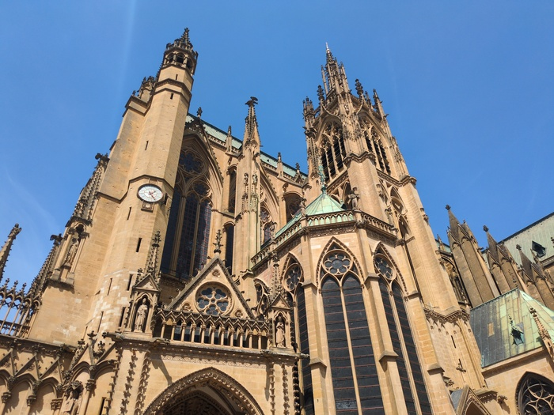
_Same catherdral_

After gawking at the cathedral I found a vegetarian sandwich (potato, fried
onions and cheese) and sat down on a wall in a spacious park.

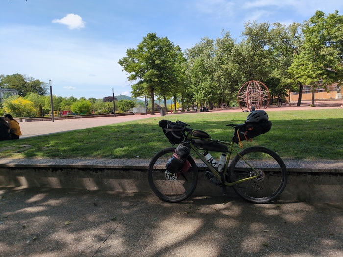
_Where I ate my lunch_

_The same park - Place de la Republique?_

The computer led me on to a pleasurably sheltered, joyful and sparesly peopled
path. There was bird song.

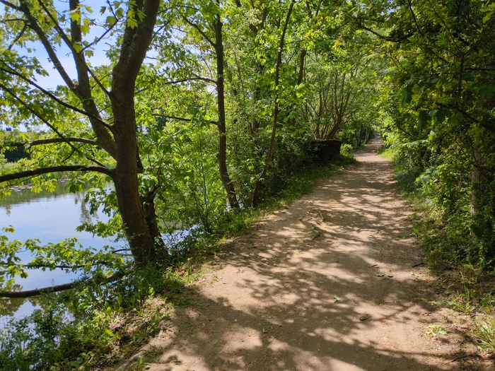
_The path_

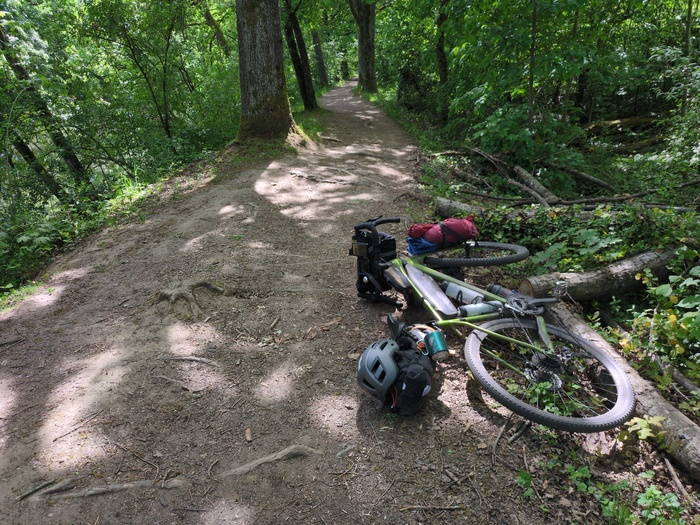
_I had to stop for a pee_

The path led me to past what looked like a truncated railway bridge. I rode
past it but then had to double back and figure out what I was looking at. I
found a sign and it was a _Roman_ aqueduct from the 1st century and it seemed
like a very impressive feat of engineering. The town is named after the
"arches" ([Jouy-aux-arches](https://fr.wikipedia.org/wiki/Jouy-aux-Arches)).

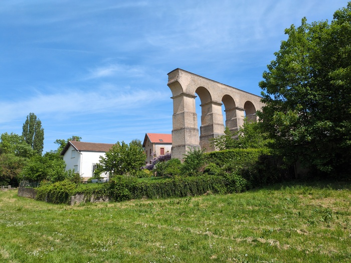
_Roman aqueduct at Jouy-aux-Arches_

I arrived at a monument for the [Battle of
Dornot-Corny](https://www.histoire-lorraine.fr/la-bataille-dornot-corny/) in
which almost 1000 american troups died in an assault on the Germans.

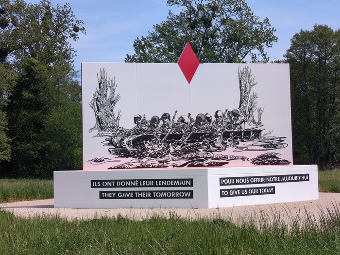
_Monument_

There were swans.

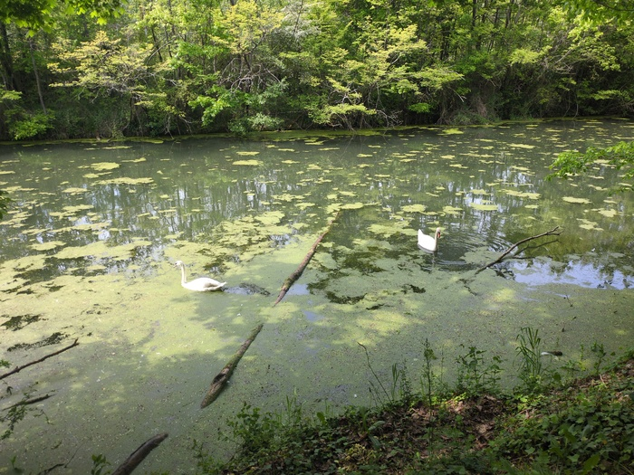
_Swans_

And industry.

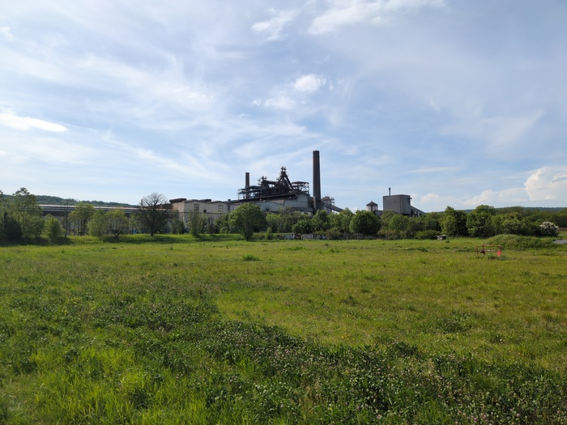
_Refinery_

Then I was in Nancy.

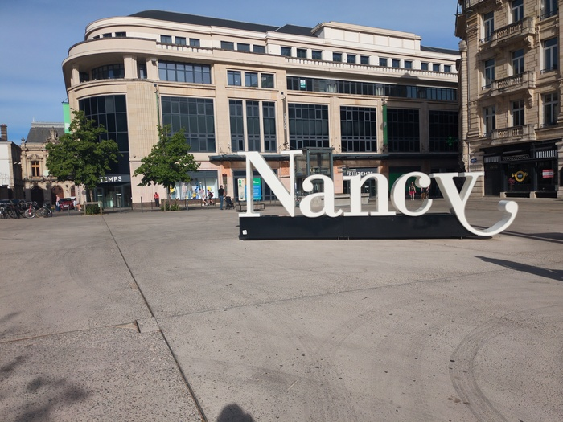
_Nancy_

I was counting down the meters to the hotel. The day was longer than I had
anticipated but also easy whilst also being somehow hard. I didn't sleep well
the night previously, nor the night before that and this being the sixth day
of cycling.

My legs often refuse to work after stopping and I need to work back into the
pedals slowly to regain my speed. I probably need a recovery day.

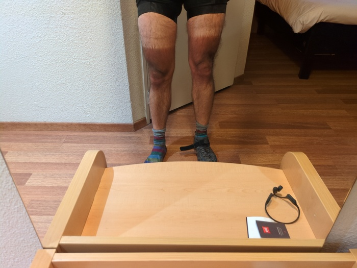
_I should probably align my lycra. I usually wear two shoes_

Judging from my position on the map I'm about half way to Verona, which means
that I have at least 4 days at my disposal.

---

[^destroyed]: it was bombed by the allies in the second world war and
    all that remains is the tower.
