--- 
title: "Massif des Vosges"
categories: [verona2026]
date: 2026-05-03
gpx: /gpx/verona26/vosges.gpx
bundle_image: ./202605022106-notrai.jpg
tour: [ verona26 ]
distance: 128.37
time: 6h35m
aliases:
  - /blog/2026/05/02/massive-des-vosges/
---

Sitting in a Buffalo Grill. Ordered a vegetarian Ranch Burger and a large
Grimburgen beer. I decided to book a Budget Ibis Hotel at around €50 but the
hotel is about 1k from the center of town and I probably should have done a
camping day - although it's threatening to rain so perhaps I made the right
decision. Today was 20% off road with that 20% being employed in traversing
the Vosges Massif, or part of the Vosges Massif. But in anycase I'm out of the
mountains now.

I was in Nancy this morning. It was Sunday and I remembered it was Sunday. I
had the choice of breakfast in the hotel for €16 or a walk across the road to
the Pauls bakery in the train station. One coffee, one Escargot Raisin and one
Pain au Chocolat for €6.60 and then it was time to go to Lidl to stock up for
the day: I got an inappropriately sized pre-wrapped vegetarian **sandwich**, two
**apples**, a bar of **chocolate** a pain rustique (**bread**) and some slices of **cheese**.
It turns out it was more than enough and I forgot about the inappropriately
sized sandwich and only ate half of the baguette.

My direction was decided over breakfast in the train station. I looked at the
map. In my mind Verona was below Switzerland, but in actual fact it's below
Austria. It would make sense to head east-south-east and I scanned for towns
and fell upon Sélestat - the name seems half French and half German. The route
would be mostly flat until the end when it wouldn't be (700m).

I left Nancy and hit the road. Making what seemed like good speed and my legs
felt recovered and good. I followed the computer until I heard people
cheering.

The cycle path was fenced off for a traiathlon. The
"Tu ne peux pas continuer en fait - tu va ou?" the marashall asked "Je ne sais
pas" I replied. I had to take a detour and the road continued to be relatively
fast and flat and I was making good time and heading towards the interesting
part of the day, which was contained in the last 30 miles until then all I
could think about was lunch and the **squeaking**.

What was the **squeaking** sound? I'd rather my bike didn't squeak and it was
squeaking when I was peddaling. It had been doing this for days in certain
gears but now it was squeaking on gears where it hadn't previously squeaked
and I decided to stop and look at it.

The sprockets on derralieur were thick with dirt, I ran the chain backwards
and put my thumbnail against the sprocket and reams of dirt span off. I pulled
out my pen knife and used the bottle opener to carve as much dirt off as I
could before applying some chain lubricant. The squeaking stopped.

Lunch was half a bagutte stuffed with three pre-cut slices of "English"
cheddar cheese and apple slices. Then half a bar of chocolate and I broke the
other half up and stuffed it in the snack bag on my frame.

I could see the blue mountains of the Vosges Massif in the distance, I
listened to Meat Loaf (Bat Out of Hell 1) and then I went off road.

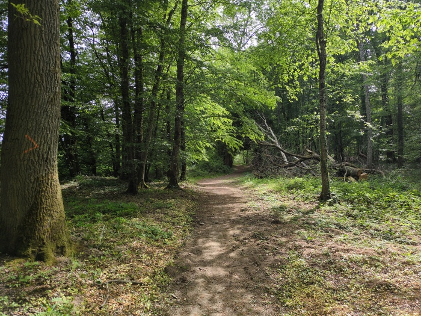
_Trail_

The trail started to climb, and it was a fun climb and I seemed to be capable
of it. I was now listening to Danzig (80s heavy rock) which encouraged me to
scramble up the rock and gravel road to appreciate the views. 

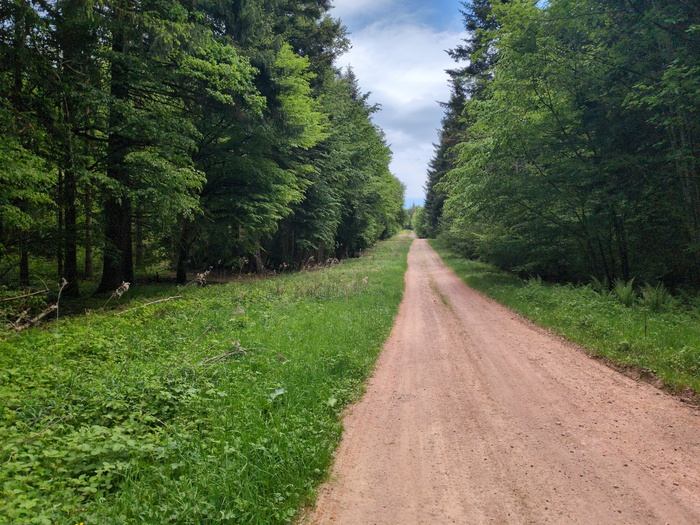
_Pretty tame_

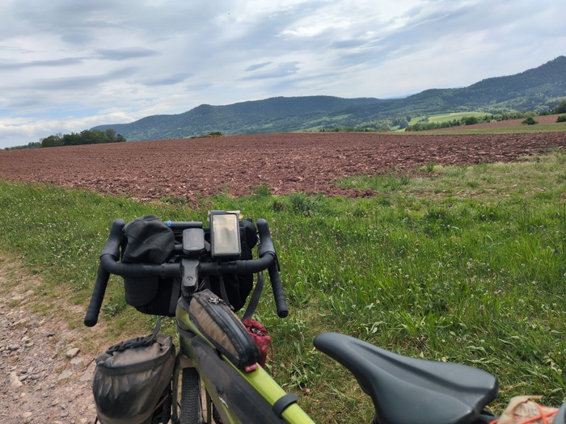
_Reaching the "top"_

There was a descent and I hit a pothole with a violent jolt and my
laptop-containing handlebar
bag came loose and flew off - landing about 3 meters from my bike. "Not ideal"
I thought. The laptop was probably fine (and there was no point in checking).
I knew this could be a problem because it happened
on my [last trip]() too, in that case the bag was
damaged and I had it repaired for this trip. The fact that it flew off was
better than it not flying off and getting stuck in the wheel. But it would be
even better if it didn't get stuck in the wheel. I tried to improvise a
secondary harness for it. After trying different solutions I settled on
anchoring the top strap to the handlebar that would leave it merely bounching
on the wheel - although even that had the potential to cause more damage than
would be done if it just fell off - but then again it could fall off the side
of a mountain 🤷

Having a more secure laptop transportation device would be something to
investigate on future trips.

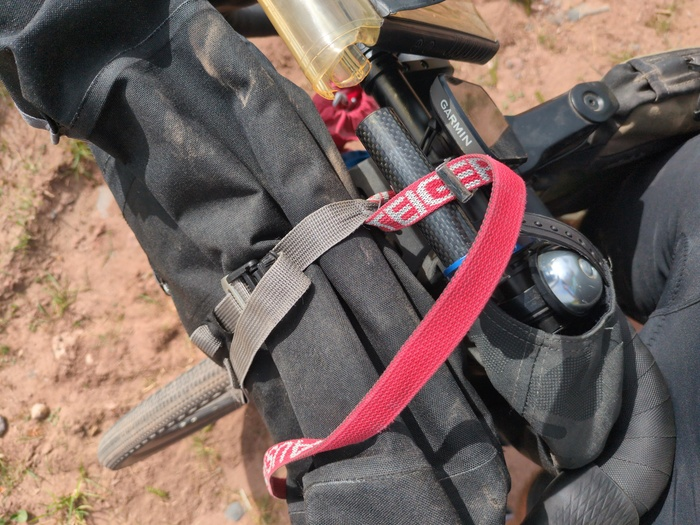
_"Securing" the bag - possibly making the problem worse"_

The trail exited onto a road and I met my first achievement "Col du Las 701m".

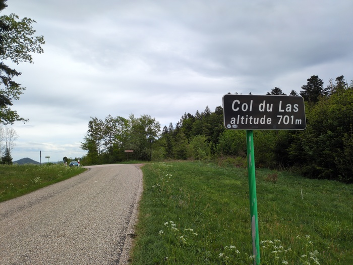
_Premier Col_

I spent some time on the road which provided some nice views before descending
and then the trails started again.

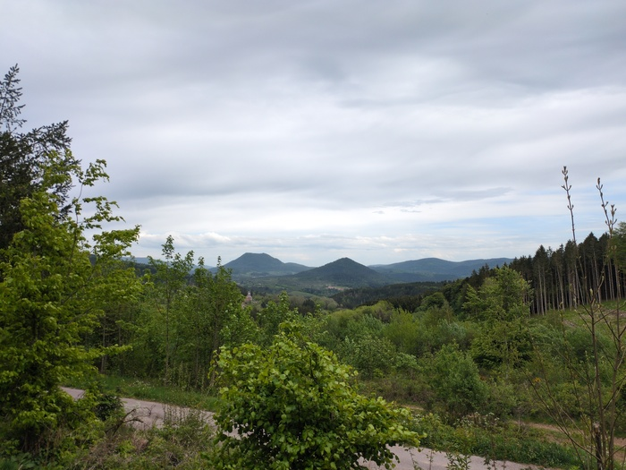
_View_

This trail was progressively more challenging. Starting off as a road, then a
forestry track...

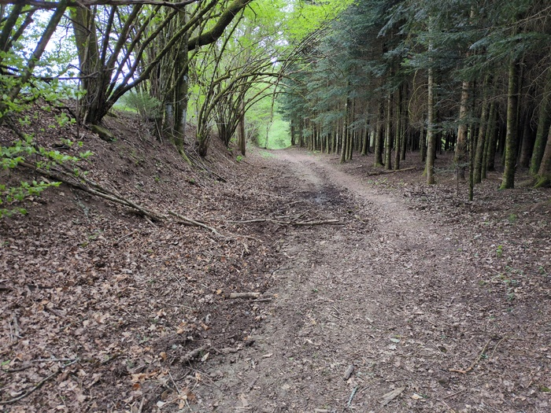
_So far so fine_

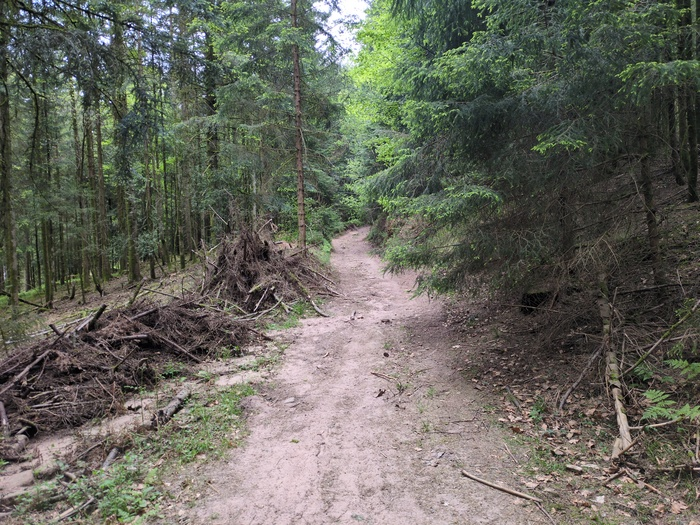
_Also good, fun!_

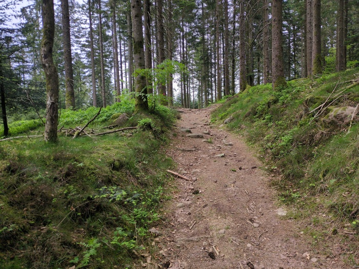
_A little more technical_

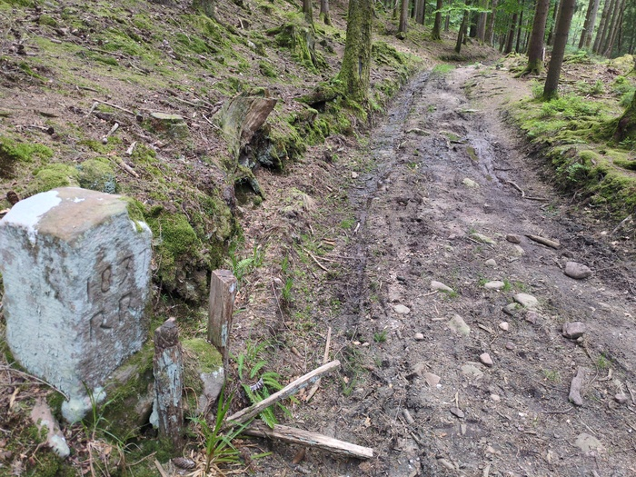
_Riding around the boggy bits_

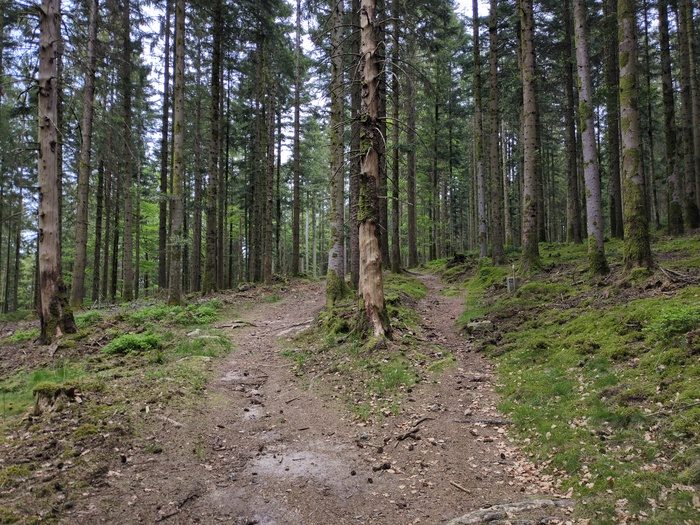
_Over the tree roots_

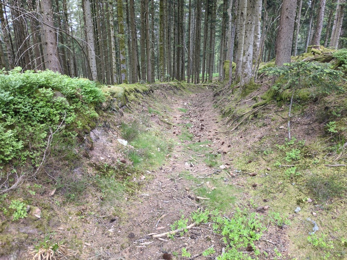
_Through a gully_

But then the computer wanted me to make a 90 degree turn left - but there was
nothing to the left. Nothing that resembled a course. There was a gully full
of detritus and next to it was the vauge impression of a track that faded into
the forest within 5 meters. I decided to take the gully but as I headed down
it I veered further from the course, so I cut back across the crunchy, moss
covered, ground to try and find the "path".

The "path" was, at best, an animal trail and I wonder if the Strava-provided
course (which as far as I know is based on "populatrity") was directing me
over somebody elses mistake. I followed the course while the terrain became
more and more difficult.

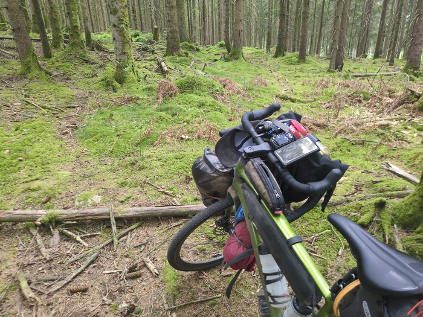
_There is no trail here_

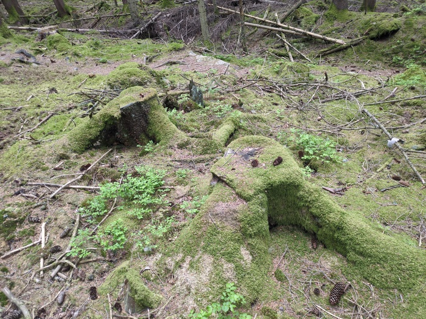
_Nope_

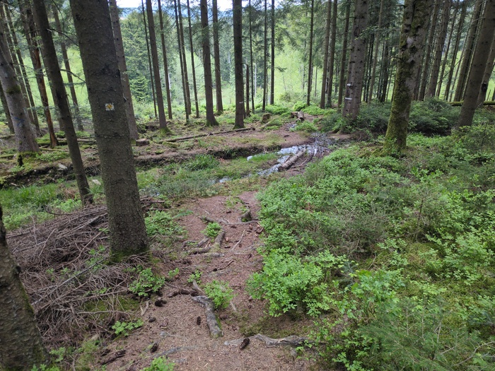
_Maybe?_

The ground became boggy - but it looked like there may have been a description
of a road here once upon a time.

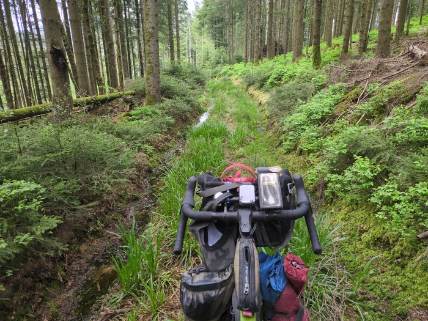
_Oh no_

And then there were Christmas Trees and I had to push my bike
past them while avoiding the slush mud pits in the ruts on either side.

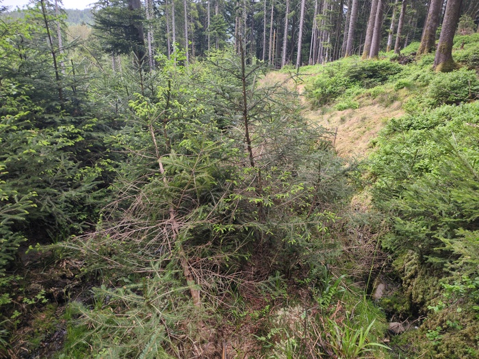
_Christmas Trees_

Finally I was confronted with a sharp, overgrown descent. This was close to my
limit and I checked the map - the road wasn't far off - my sodden
shoes squelched as I picked my way down over the bolders, carrying my bike and
eventually exiting on the road "thank fuck".

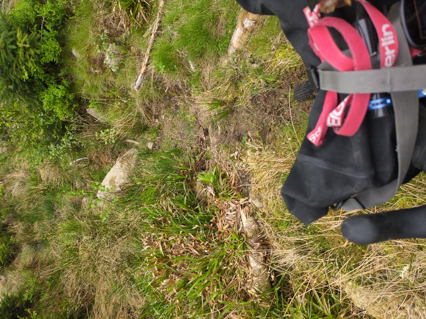
_Shit_

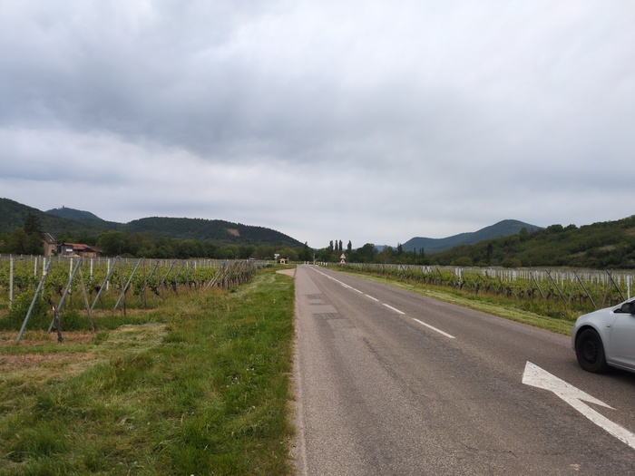
_Relief_

This episode has given me mixed feelings about the Strava routing. It means
that every offroad section carries a certain risk of becoming _too_ off-road.
It's interesting, but I can equally imagine it leading me off the edge of a
cliff and I'd follow.

Next a mostly 15 mile descent. At one turning the course
turned onto a track instead of following the road and I stopped and looked at
where the road was going and where the track was going. The track was shorter
and it would intersect with the road. **I didn't want another adventure** but
I decided to follow the track regardless and I humped my way down steeply over
the rivets and ruts and tree branches before the trail evened out and
eventually transitioned to a road.

Hitting the bottom I then passed through the town of
[Scherwiller](https://fr.wikipedia.org/wiki/Scherwiller) which featured lots
of extremely old German-style buildings.

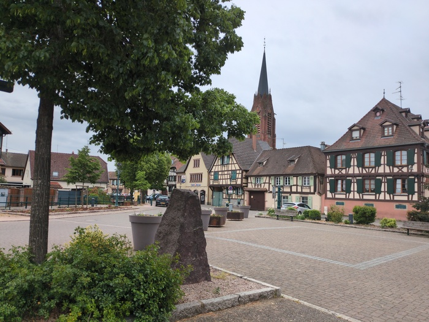
_Old buildings_

Finally I got to the town of
[Sélestat](https://en.wikipedia.org/wiki/S%C3%A9lestat) and made my way far
past the center to the outer ring and the Ibis Budget Hotel.

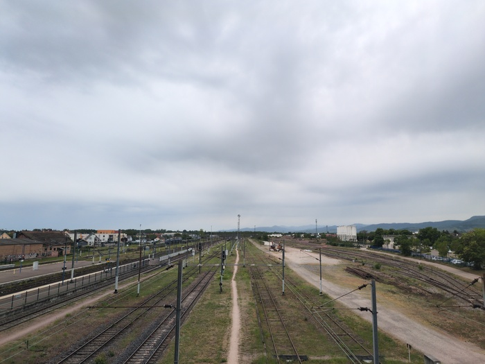
_Train yard_

I'm on the look out for a rest day but ideally want to take a day in a nice
city or a good hostel in the country. Until then I'll just keep moving towards
Verona.
