--- 
title: "Der Schwarzwald"
categories: [verona2026]
date: 2026-05-04
gpx: /gpx/verona26/blackforest.gpx
bundle_image: ./202605031714-view.jpg
distance: 128.37
time: 6h35m
---

I am now sitting in a very minimal but cosy wooden cabin that I've paid for at
Naturcamp Schluchsee. It cost €35 for the night and has electricity and
insulation benches and smells of wood and that's it. I've just made a coffee
and eaten the inadequately sized sandwich that I purcahsed at Lidl in Nancy
two days ago. There's a supermarket 5k away but I'm going to make do with the
limited supplies that I have and the beer that the campsite host gifted to me
"they left it in the fridge, you can have it". It's raining now and I'm at an
alitutde of around 1000m in the Black Foreset (Schwarzwald).

Breakfast was served at 6:30 at the Ibis budget hotel. I exited my room at 7am
and starting eating listening to the French news on TV and not understanding all
of it. I was reasonably hungry due to an insufficient dinner - having spent a
small fortune on a large beer and an overpriced vegetarian burger at the
Buffalo Grill the night before.

The route today woild continue east. I considered riding to Freiberg and
staying in the hostel for two nights. I probably should have. Instead I
targetted Schluchsee which is a lake beyond what I learnt was the Feldberg
mountain pass and seeing an number of camping sites reasoned that I'd find
a place to stay there.

I left the hotel and was routed on a cycle path on a busy road leading to the
border with Germany. I crossed over the Rhein at a Hydro-Electric plant and
stopped to put cream on my bum. I was going reasonably fast but then the
course joined the canal and went north-north-east and the wind was behind me
and I was speeding away while being bombarded with little insects that stuck
to my arms and got stuck underneath my sun glasses. 

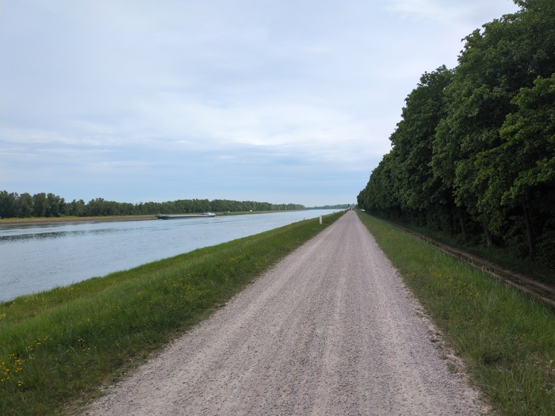
_Going fast on fast canal_

North-north-east is the wrong direction however and the course made a
correction to go south-east passing through a little forest.

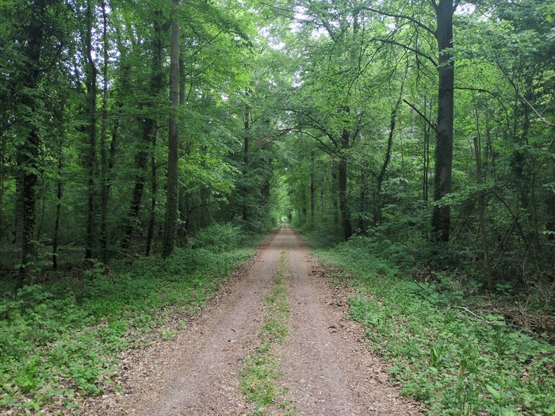
_Into the forset_

Then I was following the Leopoldskanal which eventually gave way to the
Dreisam river which would carry me into the heart of Freiboug.

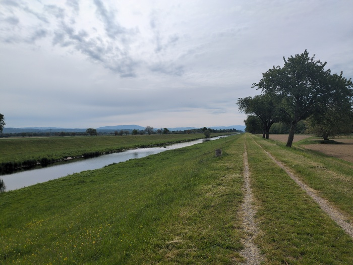
_The Dreisam River (or the Leopoldskanal, I don't know)__

As the river apporoached the city there were an increasing number of
residents to be found cycling, running or walking and the river
started to pass under bridges of various descriptions and was lined
increasingly with irregular trees and students sitting on the bank looking
wistfully at the running water. There was a woman wading _barfuss_ across the
river with her dog and the grafiti.

A guy on a bike loaded with bike-packing bags passed me with a nod while I had
stopped and was inspecting something on my phone. Momentarily he returned
"Eine frage?" "Sure" I said. He had lost one of his sandals, he said pointing
at the one sandal that was strapped into his bag. "Ich hab es nicht gesehen,
aber I hab fur es nicht gesucht!" I said.

Two days ago a cyclist on a club-ride asked me in French "have you seen a guy back there?" "No I
aven't" I replied. He turned to his companions "he hasn't seem him!" and I think
they carried on on my word and assumed that he was MIA. I should've added that
I hadn't seen him but even if I had passed him I wouldn't have _seen_ him. I
see lots of things, I remember few of them.

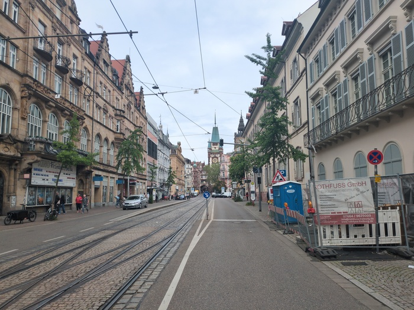
_Freiberg_

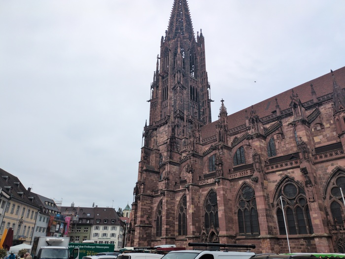
_[Freiberg Minster](https://en.wikipedia.org/wiki/Freiburg_Minster)_

I wheeled slowly into the Germanic center and made my way to a bakery and sat
down by a water fountain and ate my sandwich and quenched my thirst. It wasn't
very hot, it was cloudy and I may have gotten carried away with going "fast".
I found two pieces of dirty chocolate that I had forgotten about in my snack
bag and ate those too before finding a cycle shop and buying a new rear light.

Freibourg is also a nice city with a distinctly bohemian, liberal, student vibe.

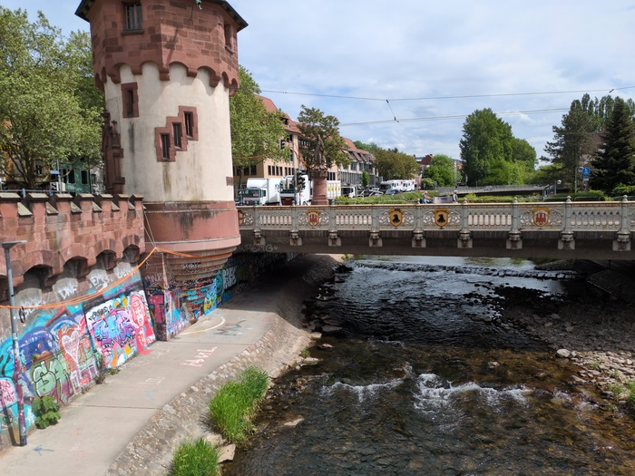
_Colourful_

I had made good time and had covered almost 40 miles (64k) by lunchtime. The
"hard" part was yet to come however - a 1250m ascent on offroad paths of
unknown quaility. But first I stopped for cake and coffee.

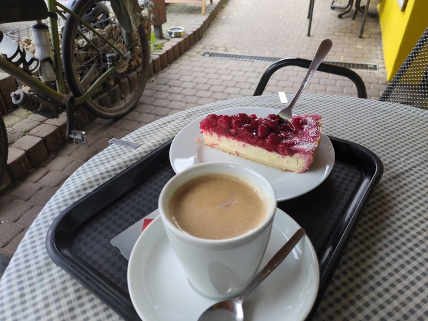
_The cake was larger in real life. The fork was a standard size. Imagine how
big the cake was._

The ascent started on an forestry track (the rest of the day would be offroad)
and got gradually steeper. The forestry tracked switched back and forth and
then the course wanted me to go somewhere that I didn't want to go.

I didn't want to go there because it didn't look like a track that was taken
in the past decade. I tried to avoid it (not wanting a repeat of yesterday)
and kept on the forestry track but soon realised that it I was heading in the
wrong direction, I took another track thinking it would cut back up, but it
didn't and eventually I had to double back and take the uninviting track.

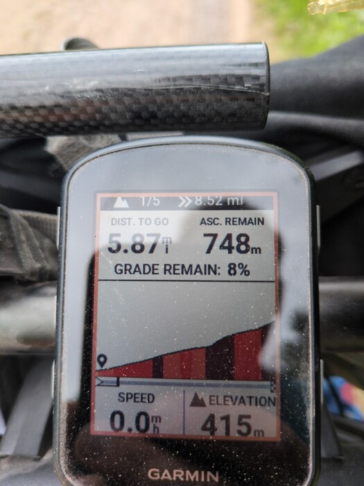
_The start_

I launched my bike up the track and soon realised that I'd need to push it but
it led quickly to a passable dirt trail (although I had to push my bike up the steepest parts
which were often at a 17% gradient). I had stopped my music a while back and
was enjoying the ambience of the forest before I descended back to a forestry
track and grinded and sweated my way to the end of the first climb and was
treated to a "reclining bench" with a view.

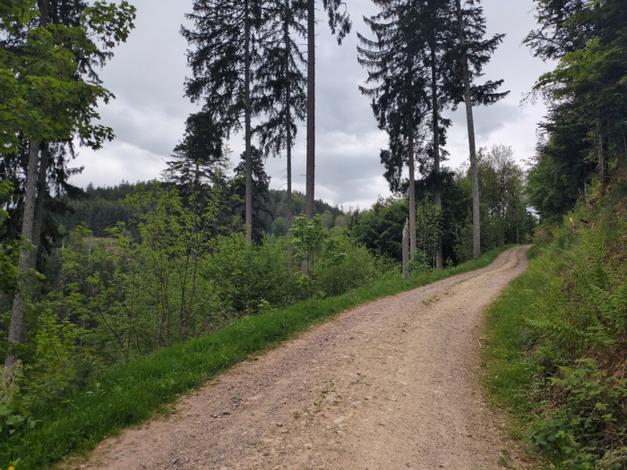
_Forest Track_

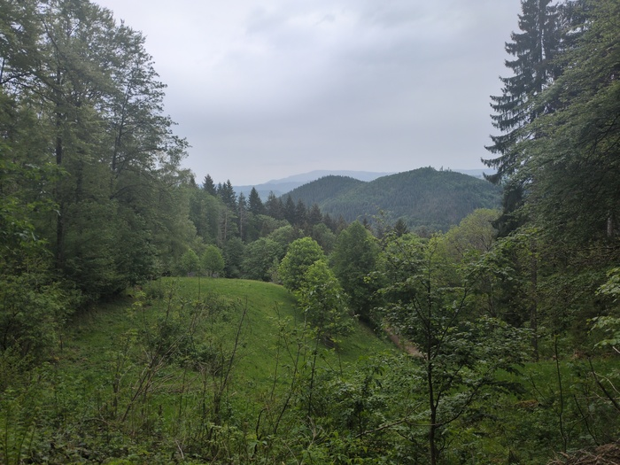
_Higher Ground_
 
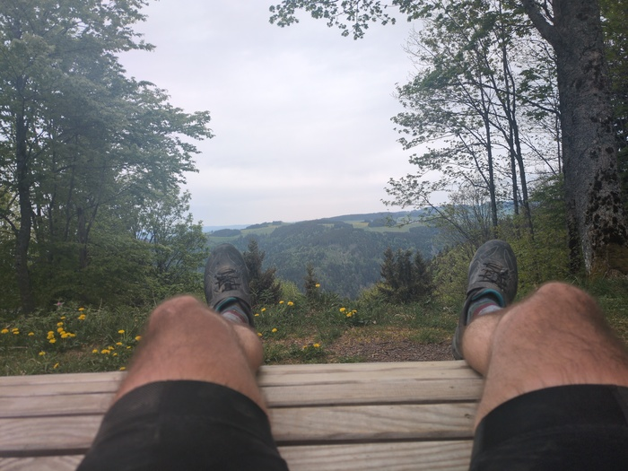
_Climb one of five_

This was the first of five "climbs" that the cycle computer had deemed worthy
of categorising as such. It was by far the biggest however and after that I
climbed a little more for a mile or so before descending. It was spitting with
rain and the temperature had dropped, My jersey was soaked with sweat so
I pulled on my jacket. The descent was minor and then I climbed higher again
to an altitude of 1250m and breaking out from the trail onto a main road which
was the top of the Feldberg pass.

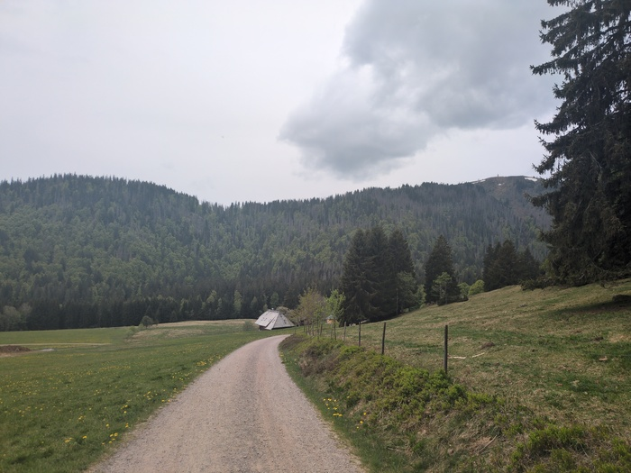
_Going down before going up_

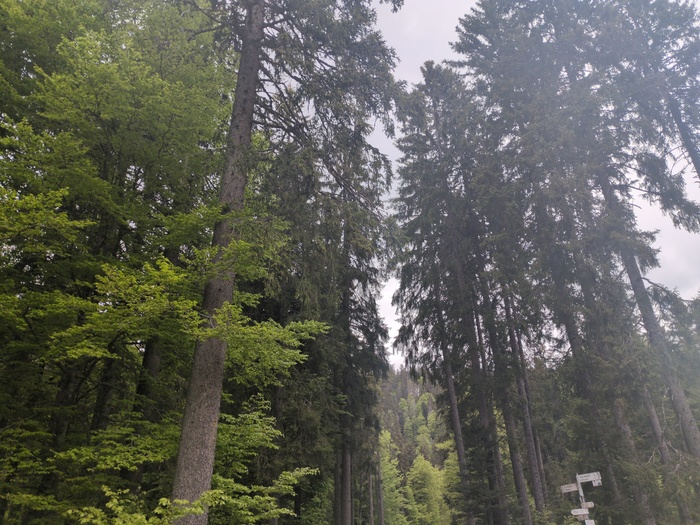
_Ancient Trees_

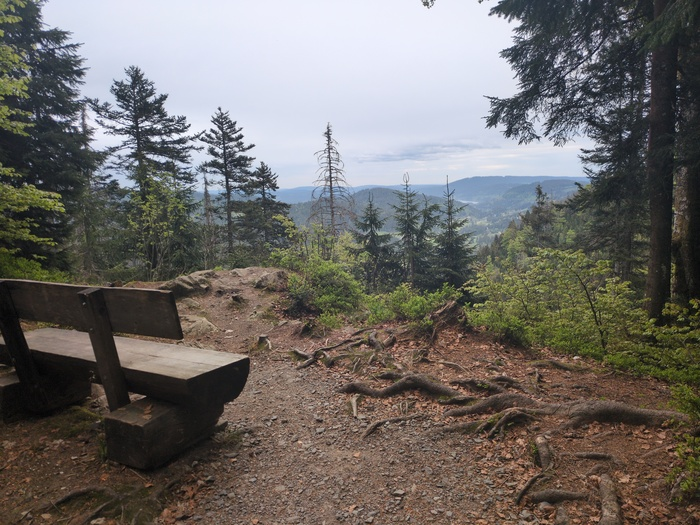
_Bench with a View_

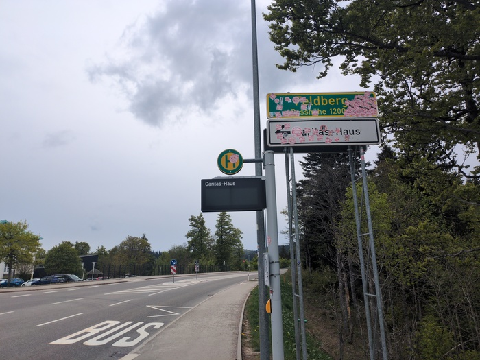
_The Stickered Summit_

After this it was mainly a disk-brake-heavy, careful, descent to 1000m and the
Schluchsee lake. Careful because I didn't want to hit a pot-hole and see my
laptop fall off the the mountain.

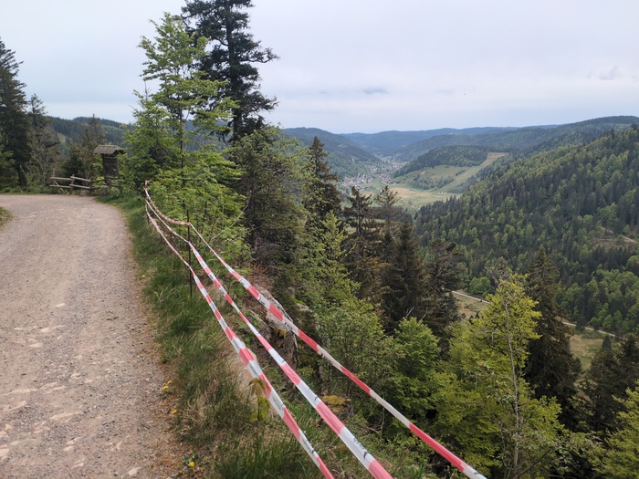
_Crash Barrier_

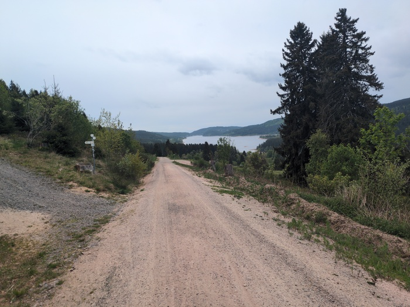
_The Schluchsee_

I arrived in the town of _Aha!_ (exclamation mark added by me).

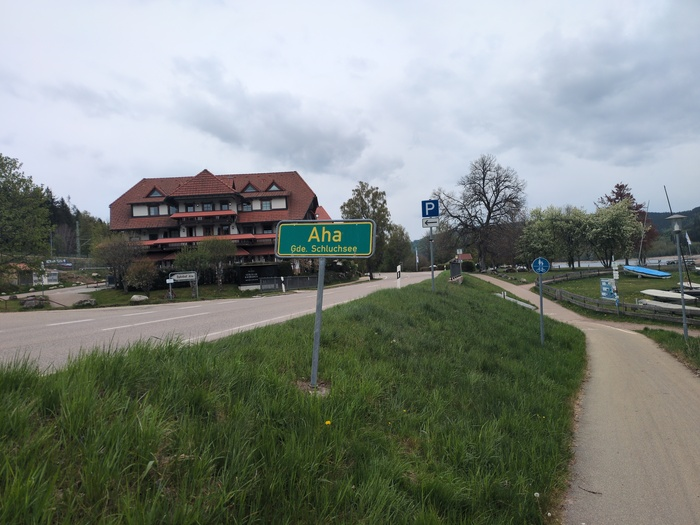
_Aha!_

It had been lightly raining intermittently and it was now about 17:00 - I had
considered that if I got to this point early I could carry on, but the
mountain had taken some time and I wanted to stop, so I did.

The Naturcamp appealed to me and I wheeled up the road to it (it wasn't
signposted) and found the little office open with a kindly man inside of it.
"Sprechen sie Englisch?" I asked "A little" he said "Ich spreche auch ein
bischen deutsch" "then we should survive". I'm the only person on
the camp.

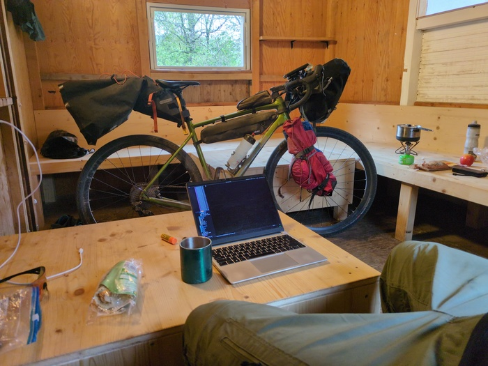
_My Hut_

Hungry am I now and will eat my little half-loaf of bread and my cheese and
cook one of my ready meals. Tomorrow I _could_ be in Austria or at least in
Konstanz - I could also just stay here in my hut for another night.

