--- 
title: "Bodensee"
categories: [verona2026]
date: 2026-05-05
gpx: /gpx/verona26/konstanz.gpx
bundle_image: ./202605041739-flowers.jpg
distance: 109.15
time: 6h21m
---

I'm hungry and sitting in a pizzeria in Konstanz, which is in Germany and not
in Switzerland although it is rather close. The hotel is expensive for the
tiny room that I have and the fact that my bike is in the "innerhof"
(backyard) with nothing but my flimsy lock and an unlocked door to protect it
from anybody that felt like taking it. The hotelier sounded snooty when I
looked up and saw a stinky sweaty cyclist standing on the second floor
reception "Gutentag. Kann ich ihnen helfen?" it's standard "respectful"
German but carrying the sense of "what the fuck are you doing in my hotel?".
This pizzeria is good.

The Naturcamp was cold - despite the wooden hut. The coldness started when I
wanted to take a shower "you can have a warm shower" said the man who left the
campsite soon after I was provisioned. I walked to the shower shack, closed
the door, stripped off, and, as is my custom turned on the water before
stepping away and checking how hot the water is. A _torrent_ gushed from the
pipe with no shower cap. It was ice cold and there was
only one control "turn left or turn right". Maybe if I turned it in the
other direction? Nope, just stops. Turn it more and the torrent becomes more
torrential soaking my clothes. So it was a cold shower on a cold night with
nothing but a clean pair of underwear as a towel.

It was _pitch_ black. Not a single light other than that of my cabin. The
gates were closed. I was alone. I can't claim to be a brave person and I
immediately imagined turning around and seeing a bear in my torchlight, or
that the campsite was a vampire honeypot like in a movie. I locked the door of
the cabin. When I woke I was still in one piece and I had no bite marks on my
neck or anything like that, so I think I got away with it although I didn't
sleep well - which was more due to the cold than fear of the supernatural.

Waking multiple times in the night and checking my watch "nope, not yet". When I
checked and it was 7am which is a permittable time to get up and pack-up except my phone was
dead so I had to charge it. At 7:30am I left and cycled 20m to the other end
of the Schluchsee to find a bakery. 

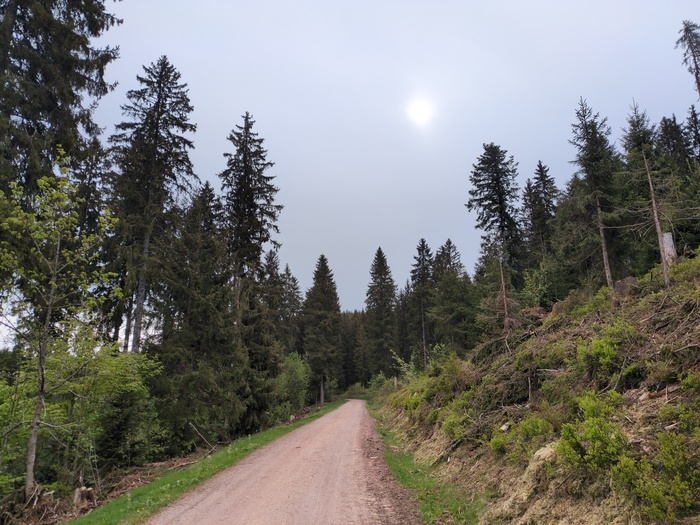
_Beginnings_

I found a cafe and spent €13 euro on a pretty good breakfast because I was
pretty good hungry - a cheese plate (Emmental, Bergkäse, Camembert), 3 bread
rolls, the right amount of salted butter, orange juice, honey and coffee.

The hotel in Konstanz was booked before I left the hut. The ride to Konstanz
would be around 100k and the first 30 miles would feature forest climbs and
the latter 30 miles would be flat(ish). I chose Konstanz because it's on the
way and I've never visited but also because I could find a reasonably priced
accomodation anywhere else. After the night previous I didn't want to risk
another cold sleepless night in a tent.

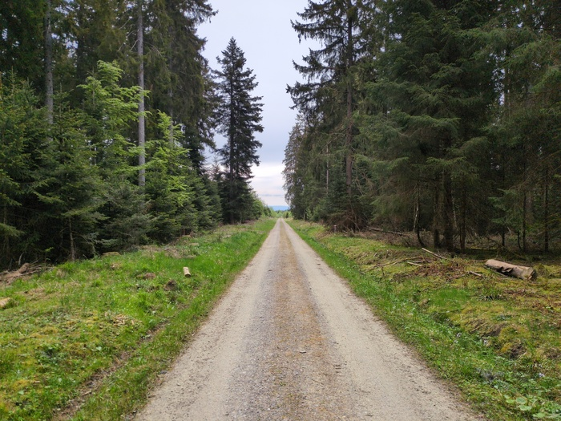
_Carry on_

Strava made me turn onto another barely visible forset path that was
obstructed (almost on purpose) by forest debris. But beyond this defense was a
reasonable trail.

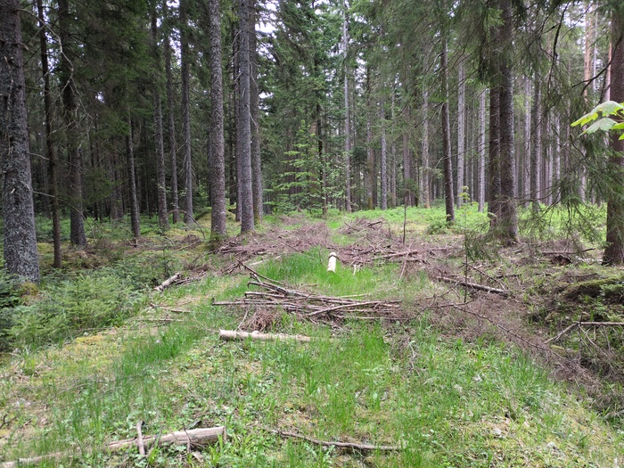
_More barriers_

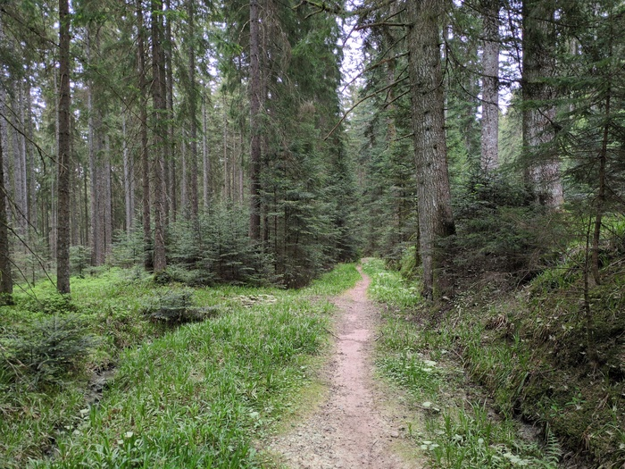
_Trailing_

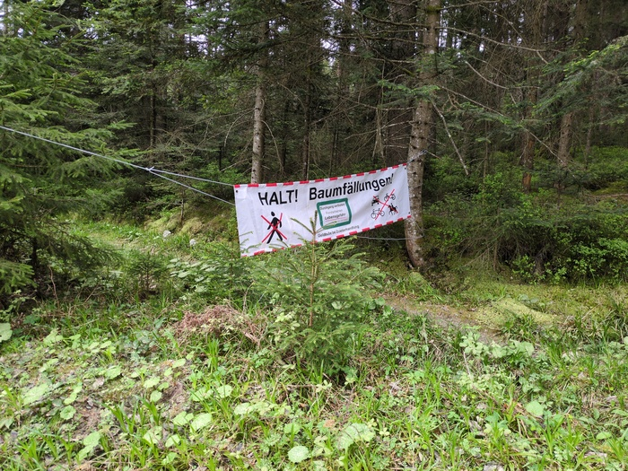
_Do not disturb the workers of the forest_

Between the climbing there were some nice Alpine landscapes and rolling green
hills with rising mountains in the distance. Visiblity was limited due to the
rain. Today was the rainiest day.

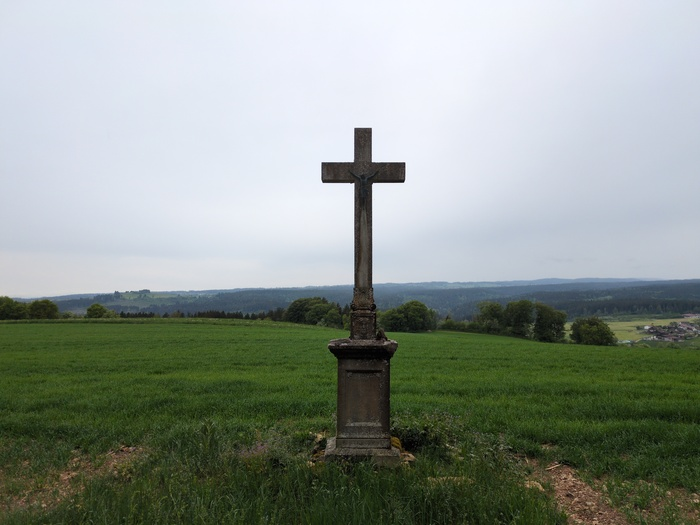
_Fair few of these_

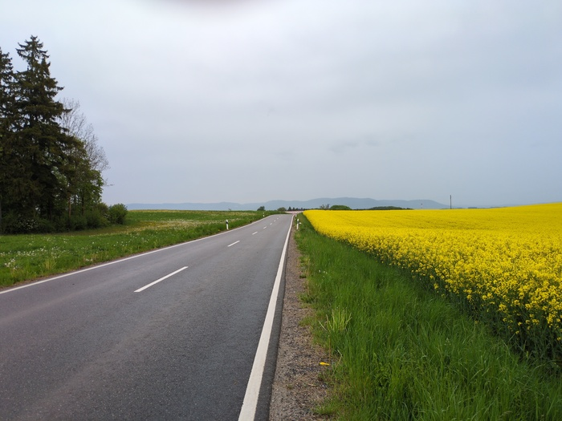
_Yellow_

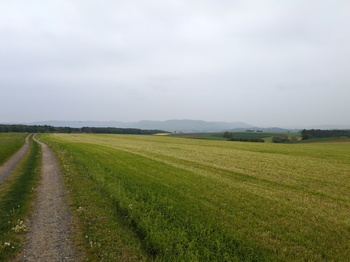
_Green_

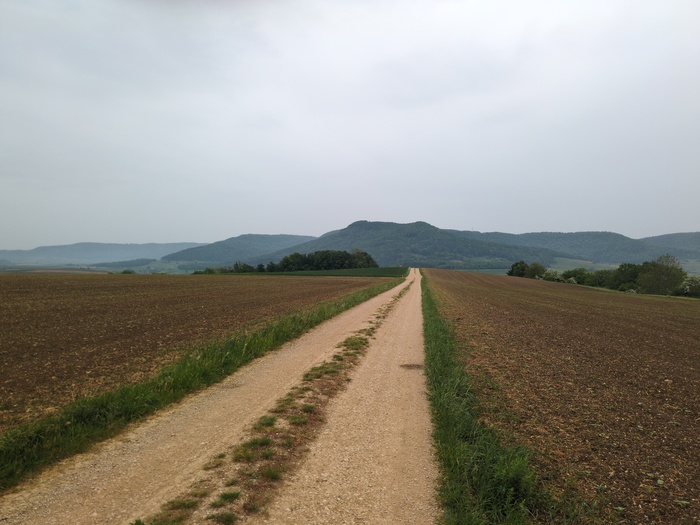
_Brown_

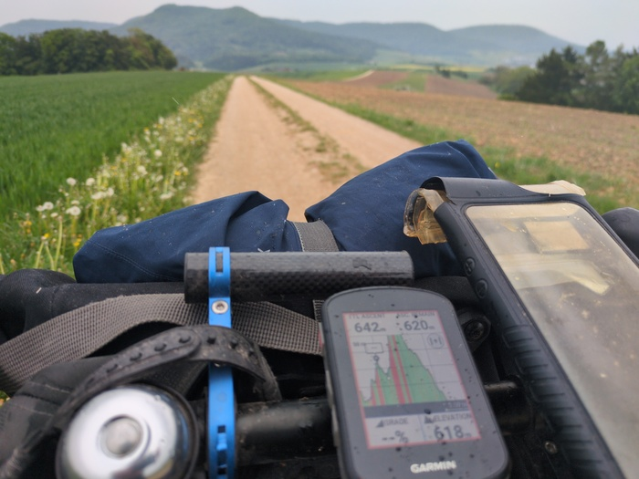
_The ultimate climb of the day_

It was pattering down fairly steadily now providing moisture on the ground
which allowed an enormous amount of forest stuff to stick on my wheel, bags,
gears and fly all over the place.

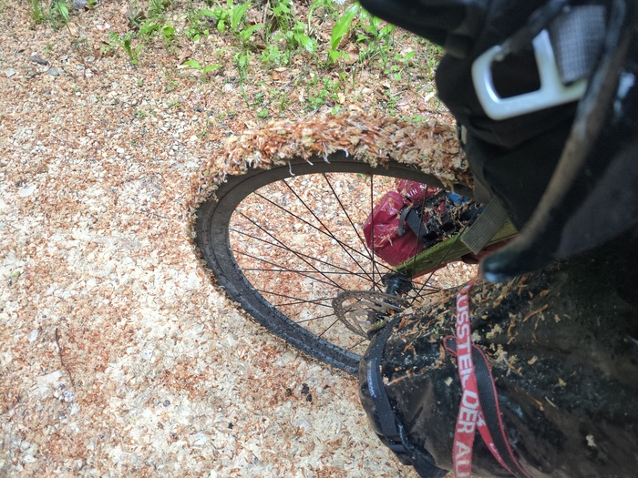
_Adorned by the Spirit of the Forest_

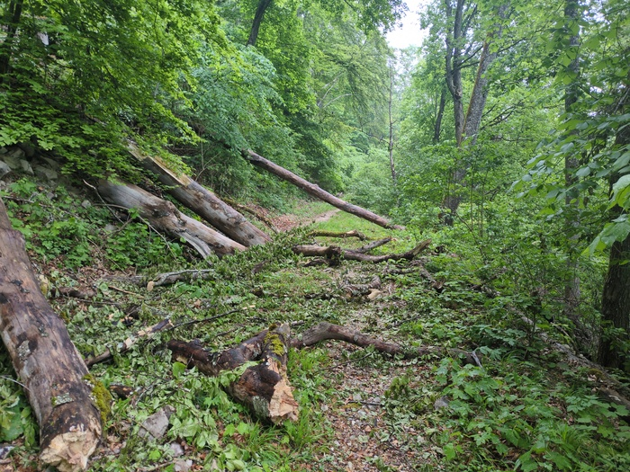
_More sabotage_

The trail finally peaked and I descended with my rain jacket to defend against
the cool breeze. I'm not confident descending on gravel tracks - even when there
are no potholes - as I feel my wheels could slide out from under me, but I'm not
sure that's a legitimate concern and I experimented with braking and sliding the back
wheel around corners to try and get a better feel for it. One thing I do
suffer from is a reduced turning circle and the weight of the gear loaded
on the front forks.

Eventually I passed a farm house, then gave way to asphault and then a
town appeared out of nowhere and I was navigating streets at vertical speed
and eventually ended up in the town of [Shaffhausen](https://en.wikipedia.org/wiki/Schaffhausen?wprov=srpw1_0).

I was wondering if I was in Switzerland. Things were subtely
different There was a
[Coop](https://en.wikipedia.org/wiki/Coop_(Switzerland)) supermarket for
example (not to
be confused with the UK
[Co-Op](https://en.wikipedia.org/wiki/The_Co-operative_Group)) and people
seemed somehow different.

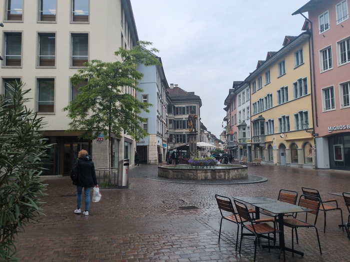
_Schaffhausen_

Schafhausen was damp. I'm not sure if it is always damp, but it was damp when
I was there. I stopped at a Bakery - having my suspicions that I was in Der
Schweiz - "Hallo, haben zie etwas vegeatarisch bitte?". The lady looked
slightly taken aback and asked if I wanted to speak English or German. Her
English was rather good with an unfamiliar accent and she was very friendly -
and this was a strong indicator that I was not in Germany.

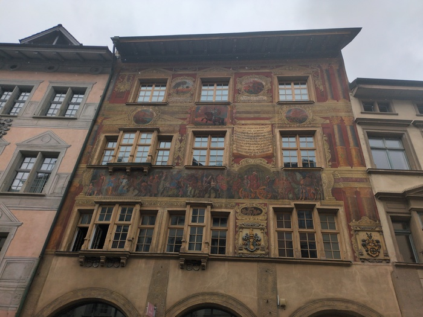
_This was a building in Schaffhausen_

I sat under the awning of the bakery with other customers that were smoking
(another sign I was not in Germany) but I wanted to keep one eye on my bike
while I enjoyed my lunch. It was still raining I returned my plates and said
"thankyou" and walked down the street then mounted my bike and rejoined the
Garmin course which would follow the famous Rhein river to Bodensee (a.k.a.
[Lake Constance](https://en.wikipedia.org/wiki/Lake_Constance)).

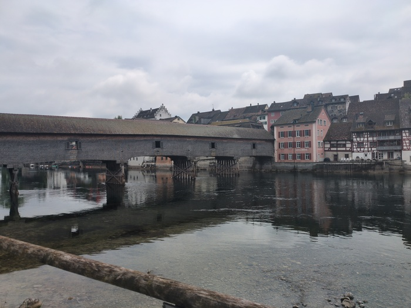
_Old Bridge Over Troubled Rhein River_

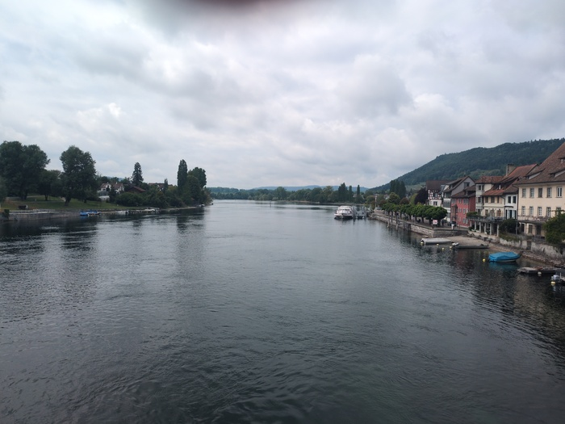
_Another view of the Rhein from a tradditional settlement_

I had 15 miles to go and it was easy riding which makes it harder because I'm
always looking at the clock.

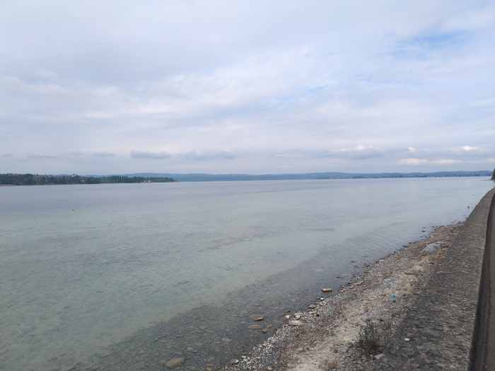
_First look at Bodensee_

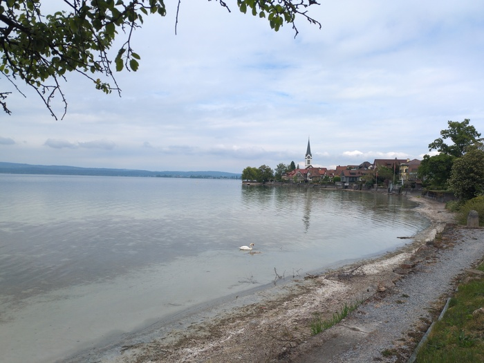
_Tower by the See_

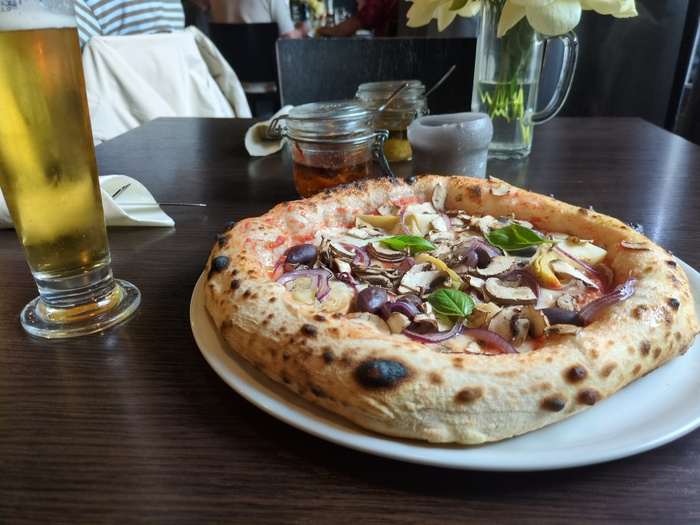
_Pizza Veggie_

Possibly the most annoying thing about Germany is the seeming lack of Belgian
beer or beer of a similar quality. Instead I had to buy a can of Carling Elephant which is somehow
weaker than [Duvel]() (7.5% vs 8.5%), tastes worse and makes you feel drunk. The
alternatives were about 75 different German beers which are all around 5% and
therefore bad (with the exceptions of the Festbiers but they're odd).

It is now 343 miles (552k) to Verona if I go via. Innsbruck (east then south)
which means I could be there 3 days early. I think I'll continue on this route
and try and stay a few nights in Trento as there's a youth hostel there and
I'm still young and unwilling to spend much on accomodation.
