--- 
title: "Vorarlberg"
categories: [verona2026]
tour: [ verona26 ]
date: 2026-05-06
gpx: /gpx/verona26/vorarlberg.gpx
bundle_image: ./202605051914-heart.jpg
distance: 119.10
time: 6h25m
---

Sitting in the Oberstdorf hostel - a large, modern, ski hostel which is out of
season but it's noisy as there are a very large number of kids here with a
small number of teachers and I think I'm the only "adult" that's staying here.
I seem to have a three bed room all to myself. It's raining outside and I'm in
the Alps. The hostel is situated in a little village about 4km from the town
of Obserstdorf itself which means I'm relying on the hostel for food and
drink. The room is quite cheap at £25 and breakfast is included and it will
probably effectively be a private room. But the kids are very loud. The
weather looks as bad tomorrow but it might improve on Friday which would make
this a good place to take a rest day. Although that somewhat depends on if I
can spend the entire day indoors without going crazy from all the noise.

This morning I woke from what felt like a good nights sleep, even if my watch
said I only had 4 hours. I was able to check that my bike was still there by
looking out the window. I put on some clothes and left to find breakfast. The
hotel served breakfast for around €14 but I thought I'd risk a cafe and the
cafe that I found was just around the corner and was an "Austrailian" cafe.
I'm not sure exactly what made it Australian, maybe it was it's easy going
atmosphere. There were irregular seats and nice music and they didn't serve a
breakfast as such but I purchased a couple of pastries and a coffee for €9 and
sat in the window and took my time considering my money well spent - except
for the nutritional value - the hotel would have been better for that.

I went back to the hotel and packed up my stuff brushing the bits of forest
off from the bed and onto the floor. I handed the keys back to the angry
German who didn't seem that angry after all and almost immediately crossed the
border back to Switzerland.

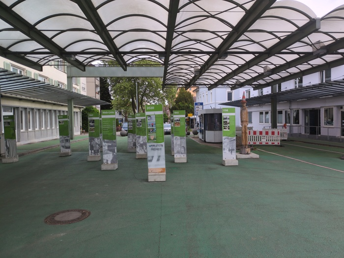
_Der Grenzen_

I cycled east along the train-line following the southern side of the Bodensee
switching from one side to the other at regular intervals and occasionally
having to wait for a train to pass.

The sky was dirty silver and the morning mountains of the Alps were glowing in
the east They became larger as I cycled the 30 miles or so to the eastern side
of Bodensee and Austria. I made very good time and listend to my music and
smiled benignly at the Swiss as they passed me on their bicycles. A heron
startled me by launching itself from a bush a meter ahead and proceeded
to clumsily gain some altitude before setting down again.

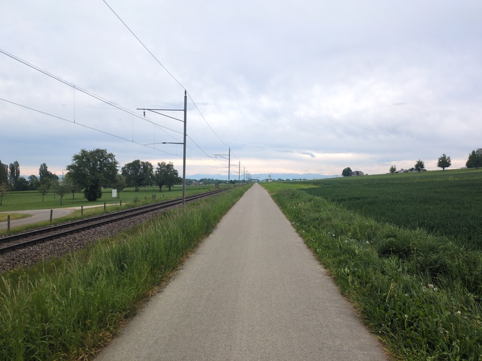
_Distant Alps_

Most of the bicycles had panniers and it looked like most people were
commuting, occasionally there'd be people with more gear who I assumed were
touring. I didn't notice so many electric bicycles, certainly none that were
excessively fast.

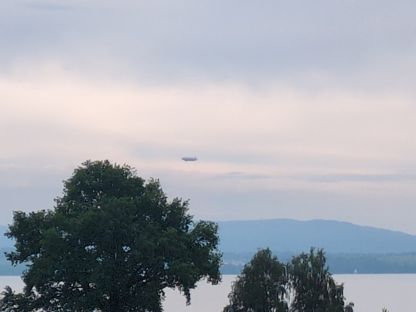
_Airship_

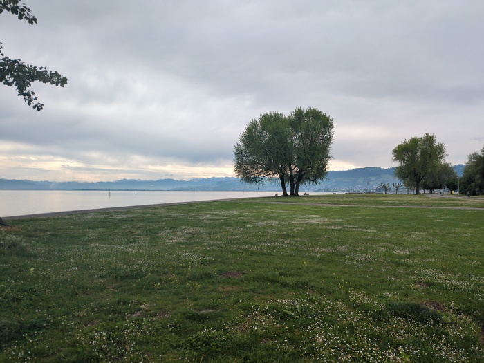
_Getting Closer_

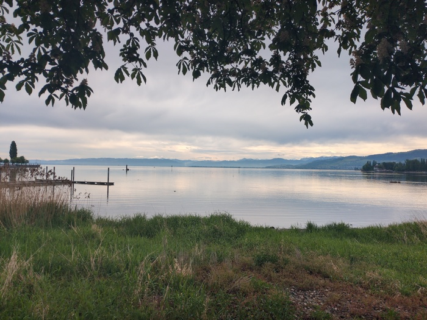
_"The Best Seeblick in Bodensee" (apparently)_

I was heading the border of Austria - and the region of Vorarlberg and my
course would take me through the town of Dornbirn where I worked a
decade or more ago and knew people. I sent a message to Daniel to say that I
was 45 minutes away if he wanted to meetup for a coffee. He didn't reply and
when I got to the edge of Dornbirn I assumed I'd miss him, but I was hungry
and it was lunchtime. I went to a bakery and purchased a
sandwich, sat down, the phone rang. Daniel was working in
Dornbirn and could meet me for lunch with his colleague. So I went back to the
counter and had my sandwich packed to go and cycled a few kilometers to a
Kebab shop and had some good conversation and food. "See you in another 10
years maybe!".

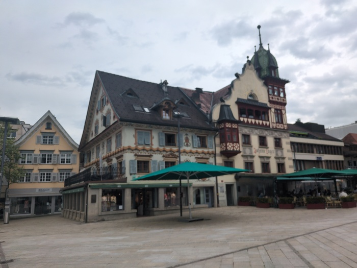
_Dornbirn center_

As I rode out of town and into the mountains everything felt very
familiar. I had done plenty of running and cycling around this area and was
reminded of leaving Vorarlberg on my [longest cycle tour](https://www.crazyguyonabike.com/doc/?doc_id=16302).

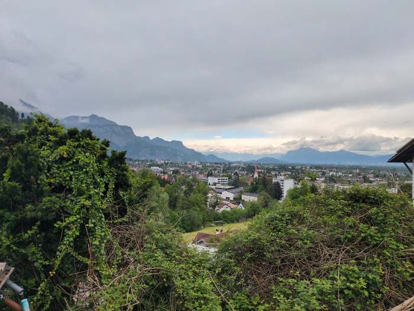
_Looking back over the [Rhine Valley](https://en.wikipedia.org/wiki/Alpine_Rhine_Valley)_

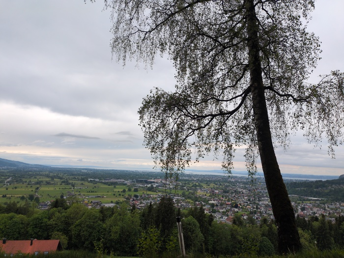
_Still looking back_

Rain started, slowly at first. Climbed first climb to 1000m.
I was on the main road at this point with cars and lorries rushing past me
with no cycling infrastructure (although the roads are big enough for it to
not be too perilous). It rained hard on the descent and soon water
was spraying up and over my shoes soaking my socks. When I got to the bottom
the rain stopped and my feet would be damp for the rest of the day.

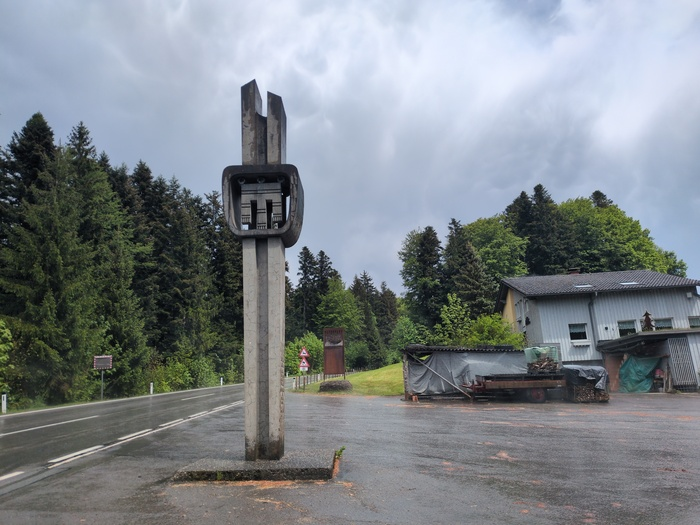
_It rained_

There was a blue patch in the sky which slowly worked its way towards me and
over me providing some sunshine and a significant amount of welcome heat and
the without me noticing I was no longer on the main road but a single lane
road with hardly any traffic.

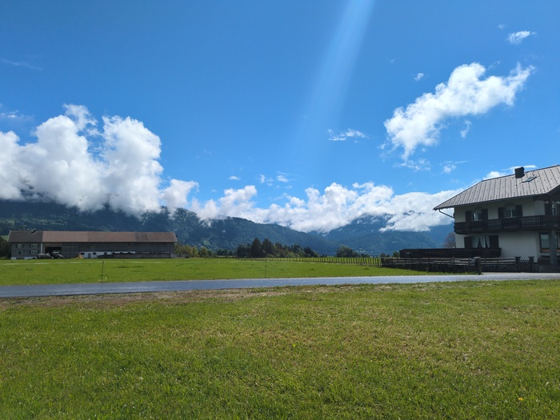
_The sky!_

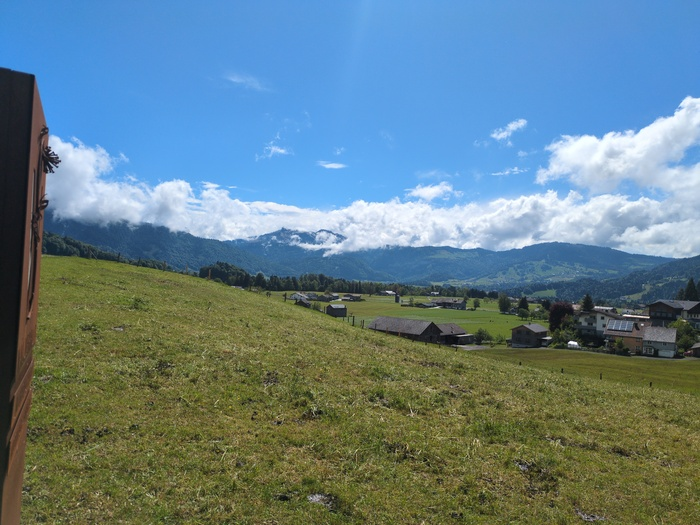
_Alpine 1_

The climbing today was all on the road which was surprising. From my time here
I know there are numerous forestry tracks running through the mountains but I
also remember climbing insane gradients and that the heat from the V-Brakes
frequently melted my inner tube on the descents requiring me to run down the
mountain while pushing the deflated bike with one hand (it was a cheap
mountain bike that was gifted to me).

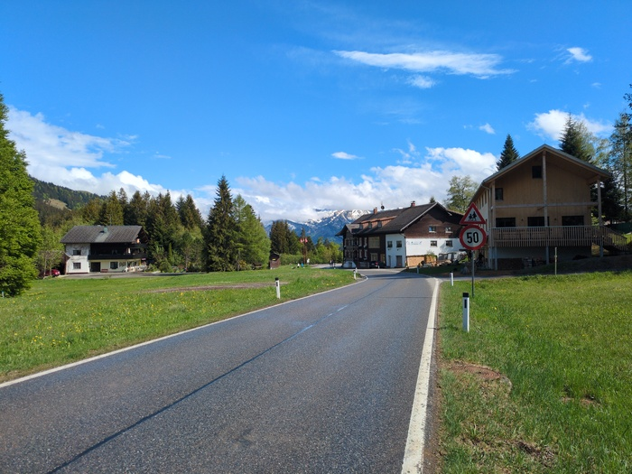
_Snow-capped mountains_

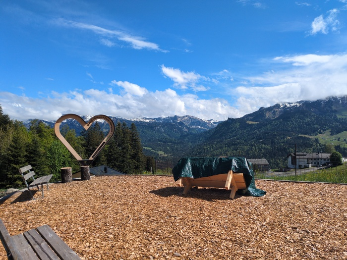
_Heart_

As I gained altitude it became colder.

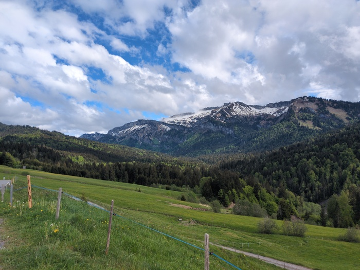
_More snow_

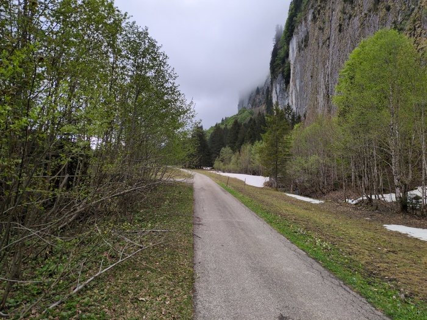
_Snow! On the ground!_

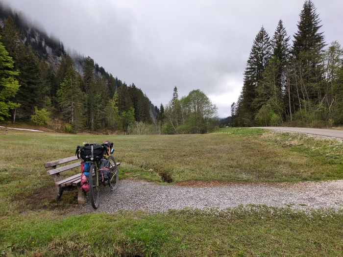
_Bike at the Top_

The course involved 5 climbs of varying degrees although I wasn't aware of
achieving any "cols". After the climbs there was a 7 mile descent to the
Oberstdorf Hostel. I had to put my jacket and then my gloves. I was lucky
to avoid the rain which promptly started again after checking in.

There is plently of availability at the Hostel. The weather looks good on
Friday, so I _may_ take tomorrow as a rest day - my bum is increasingly tender
and seems to need it. The plan would then be to go to Innsbruck, then
somewhere, then possibly Trento for a couple of days in a hostel there, then,
maybe, to Verona.
