--- 
title: "Penser Joch and Italia"
categories: [verona2026]
tour: [ verona26 ]
distance: 125.32
time: 8h12m
gpx: /gpx/verona26/weiserof.gpx
bundle_image: ./202605081814-alien.jpg
date: 2026-05-09
aliases:
  - /blog/2026/05/08/penser-joch-and-italia/
---

I left my universal power adapter in Konstanz because it electrocutes people
and falls out of the wall socket. For some reason I thought the replacement
was also "universal" but as it only had the EU two pin male connector it seems
I was wrong. "Do you have a UK to Italy power adapter?" I asked the hotel
receptionist. He looked at me, understood and said "No". I said that an EU to
Italy adapter would be just as good, but he said "No" but feeling this wasn't
an adequate answer asked around, then found the concierge and we decided that
all I needed was an Italian USB charger, there was a flurry of activity and
searching before the concierge let me borrow his own one. I assume he's the
concierge, I've never been in a hotel that has one before.

> The hotel is a "Spa" and is in the middle of nowhere and has the most
spectacular view of a mountain.

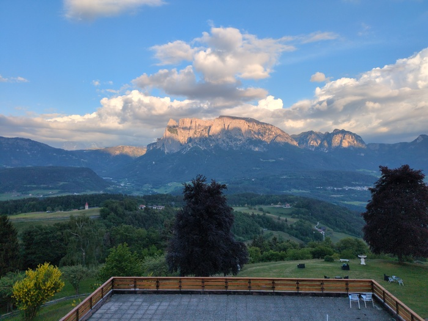
_View from the room I'm staying in now_

I just had dinner. Dinner is a strong word for barley soup. The hotel has no
physical menus, but instead you can a QR code to get the menu in your
language. Helpfully it also allows you to filter the menu "Vegetarian" I
checked. The available options were "chopped tomatoes on toast" and "french
fries". I called the waiter over and explained that this wasn't what I had in
mind, "you can have the Barley soup also, the Speck is on the side so we can
just not put it in". So I had barley soup and a beer.

Barley soup is great (although incredibly expensive it seems) but it wasn't
the meal I was hoping for to compensate for the 4,500 calories (according to
Strava) that I've spent during eight hours of cycling. Fortunately the
breakfast is included so I'm going to make the most of that. I've eaten all my
other food and this hotel is in the middle of nowhere.

This morning I left the Montagu hostel after a patchy nights sleep. The dorm
room was great - the bunks were more like capsules and very much isolated from
eachother and an incredible amount of care had gone into the design. All the
care in the world couldn't stop the 4/4 "thud thud thud" of a nearby nightclub
which penetrated through my ear plugs.

This morning I left the Montagu hostel in search of breakfast.
I paid €8 for two bread rolls, a sachet of butter and two tiny jars of jam and a coffee. At
this point I new I was going to Bolzano. Bolzano seems like a pretty big
place. I'll find a hostel ... NOPE. No hostels. A hotel? NOPE they start at
€100 a night. A .. campsite? The only campsite looked like it wasn't for
people like me. Widening the search however yielded a "hotel" for €45 that
included breakfast and was "just" 8.5 kilometers from Bolzano. I didn't
realise at the time that most of those 8.5 kilometers would be at a 14%
gradient.

I had intended to do the [Innsbruck Parkrun](https://www.parkrun.co.at/innpromenade/) at 9am but my calf muscles were
still completely knackered.

Through the center of Innsbruck I went and left on a very busy road. I
questioned if this was the correct road to take and was reassured by passing
(or being passed by) a
number of, not just cyclists, but bikepackers. It wasn't a nice road to be on
however. I had selected a "Road" track today as opposed to "Gravel" as I
wanted this to be a relatively short day and I wondered if the "Gravel"
version would have been more laid back (in hindsight it would have made today
even harder).

Having no food I stopped at a Spa supermaket. Their "Egg and Avocado"
wrap was quite filling so I purchased another with a bar of
chocolate.

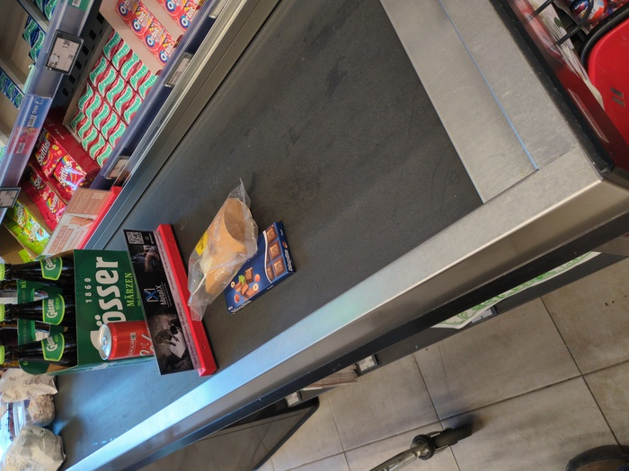
_Lunch_

As I continued I stopped at a fountain to fill my bottles and a
cyclist, dressed in black with a very clean looking offroad bickpacking setup
waved at me. He was from Zurich, had stayed in the same hostel as I had last
night and was riding to Georgia "that's a long way"
I said. "I've lost the cycle path" he said. "I'm taking the road" I
said. "Good luck!".

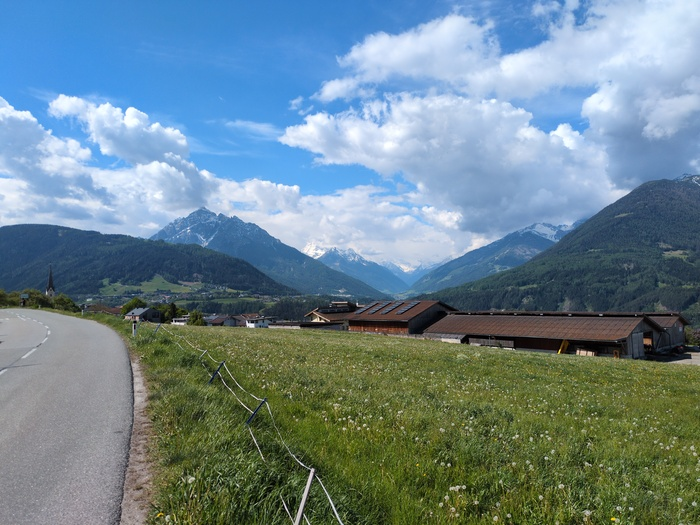

It was odd that there were so many "bikepacking" cyclists, but I did not see
any "classic", 4 paniered, tourering bicycles as there would have been a
decade ago. There were still the occasional older couples with electric bikes
and a ton of panniers, but the "bikepacking" concept seems in vogue.

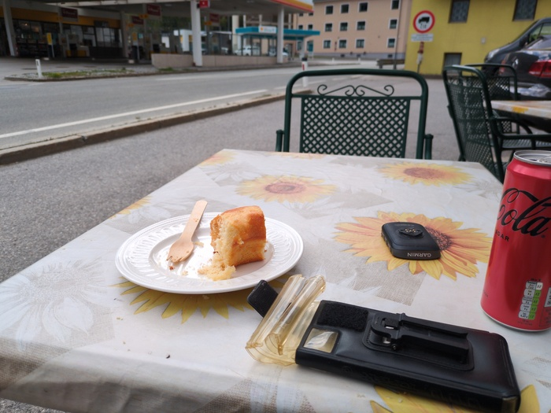
_€3.50 for coke and cake. I'll take it_

I made my way to Italy over about 20 odd miles of undulating road and had
already racked up a good amount of elevation by lunchtime.

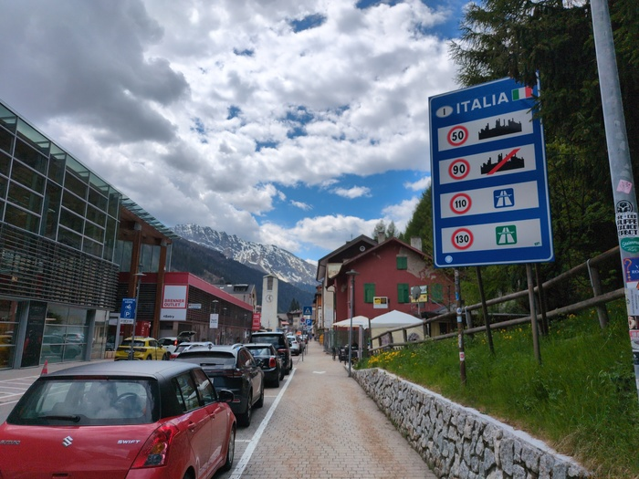
_Welkommen to Italia. No ships allowed._

At around this point I had my first "screaming bum pain" moment. The cream
helps alot and I applied more of it. 

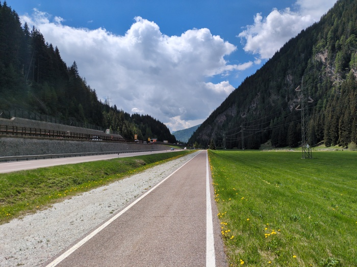
_My bum hurt along this path following the motoway_

Being happy following the Italian cycle path I missed my turning. This
wouldn't normally be much of a problem except that my Garmin computer also
doesn't have maps for Italy so although I can see **the line** I didn't know
where that is in relation to the 300m drop, the trainline and the motorway. I
was quite a way off-course but I managed to cut along some hiking paths.

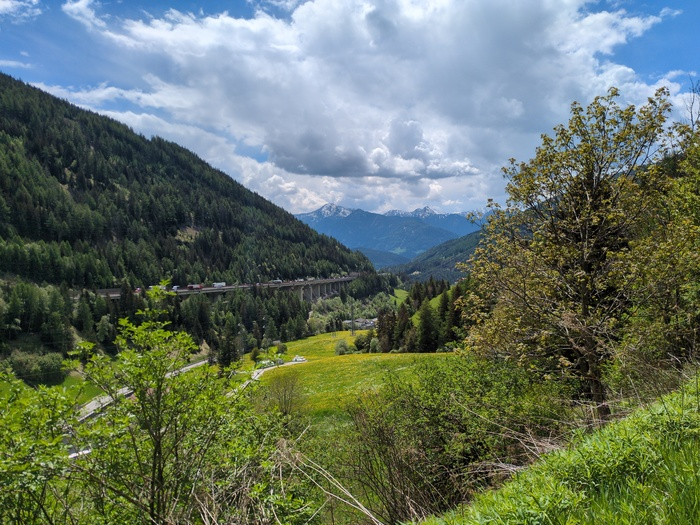
_I should be somewhere down there_

Today was all about the Penser Joch. To get to Bolzano Strava does _not_
recommend the Penser Joch path, but instead guides you through a much less
demanding valley. I wanted to get some altitude on this trip and the Penser
Joch was the pass that was on the way, rising to about 2,100m.

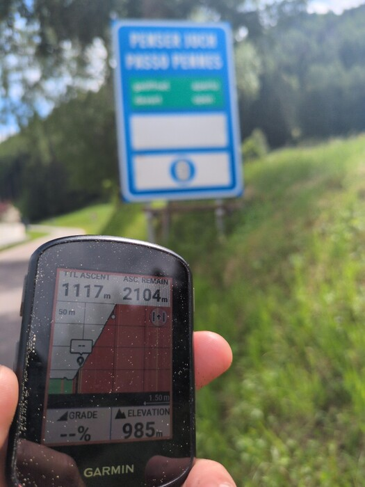
_It begins_

Soon after starting the climb I stopped to eat my Egg sandwich. The climb would
take at least an hour and probably more so eating lunch before hand seemed to
make sense.

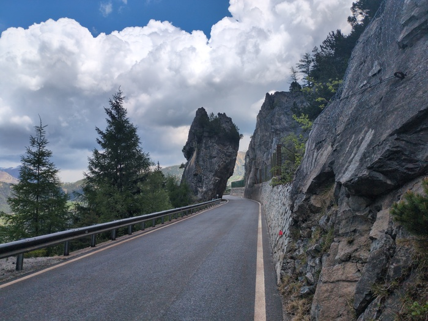
_Rock_

The gradient was pretty consistently hard. As I climbed I could hear the
rumble of thunder and looking up the solid dark-grey clouds and it started
spitting. As I climbed higher the ocassional hail stone bounced off of my
jacket. Multiple scenarios filitted through my mind:

- Getting drenched by torrential rain.
- Getting bombarded by fist-sized hail stones and having to hide under a
  tree.
- Getting to the top and being struck lightening.

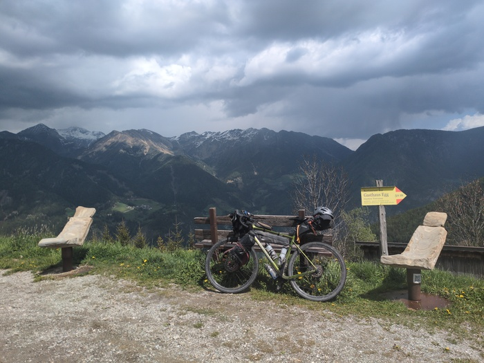
_Not knowing if I'm going to be hit by a storm_

Fortunately none of those things happened. The rain was moderate despite the
rumble of thunder and dark clouds over neighbouring mountains.

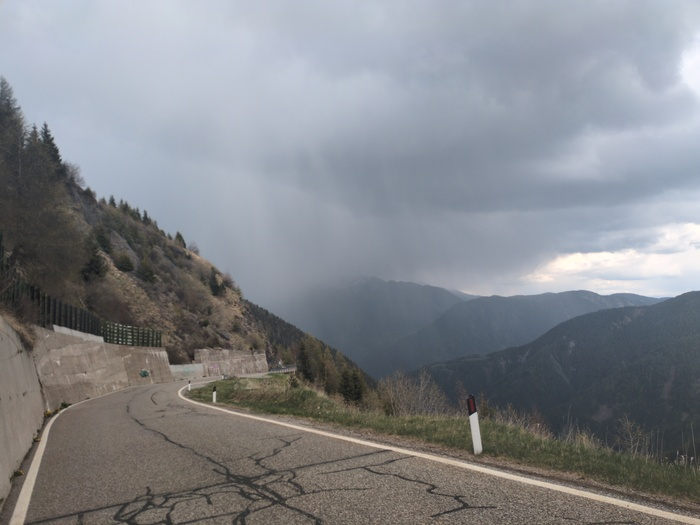
_Things don't look so great over there_

Motorcyclists passed me with their obscene engine noises. Two had stopped
ahead of me to appreciate the view. He spoke to me. I was beyond being social
at this point. I tried to smile and wave. "Vorsicht! Es ist sehr luftig" I
think he said. I fake laughed and smiled because I had no idea what he said
but by default I assume they are making some attempt at humour. My reaction
proved inappropriate when my brain translated the sentance "Be careful! It's
very windy" (it turns out however, that it was not).

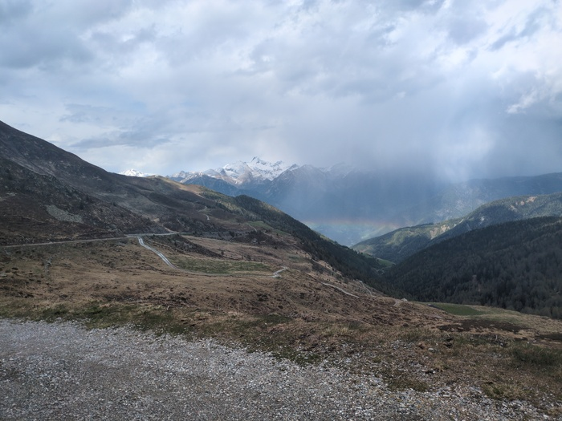
_Above the rainbow_

The top edged closer and closer. I was not enjoying the climb and was very
much looking forward to getting to the top. I can compare it with running a 5k
race. When you're running it you wish you weren't. But you signup to do them
again and again.

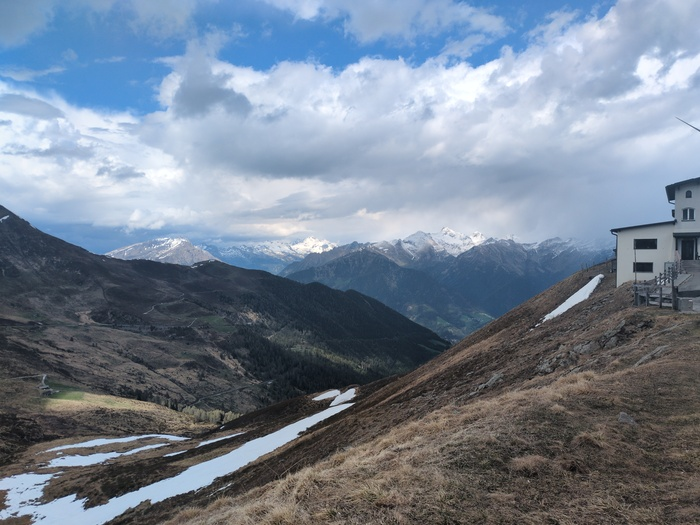
_Looking back from the top_

After around 2000m the mountains were bare of trees.

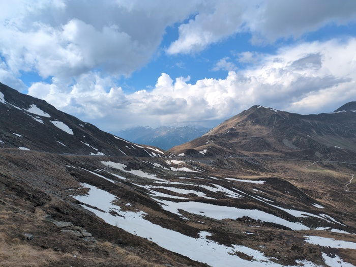
_Alien landscape_

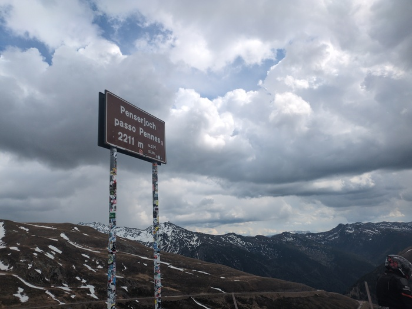
_The sign_

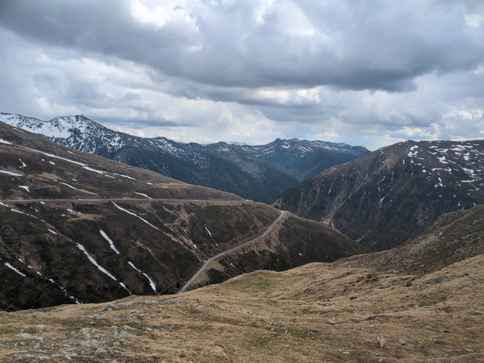
_Looking down at the desdent_

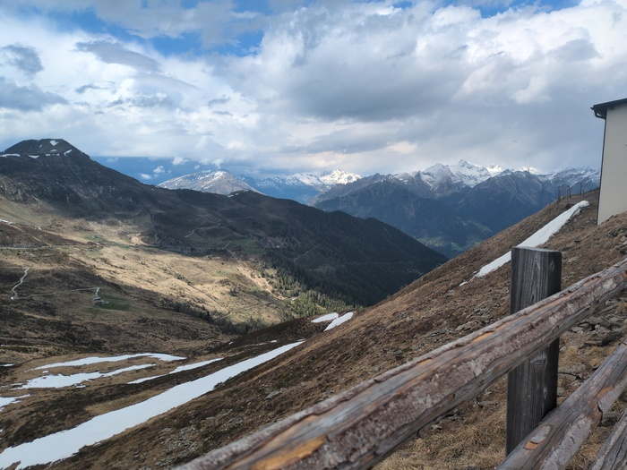
_Looking back again_

Despite my heart pumping at 140bpm and the sweat that was pouring from my
glands it was still quite chilly towards the top. The descent was colder 
but after about 15 minutes the temperature returned to a more tolerable level.

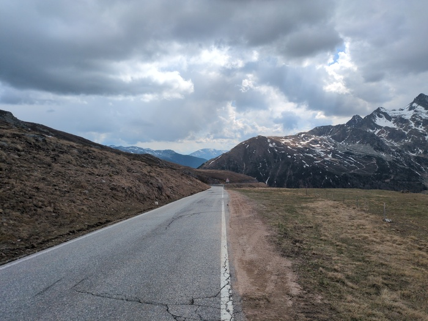
_Descending_

20 miles were spent in descent. If I were staying in Bolzano the rest of the
day would have been a descent. But no. I was staying in a hotel 8.5 kilometers
from Bolzano.

Physically I was exhausted from the Penserjoch climb and malnourished too. The
"bonus" climb would be a 700m Category 1 climb. Again I did not enjoy this
climb and it would take more than an hour to achieve it.

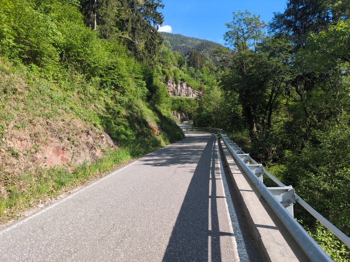
_Bonus climb_

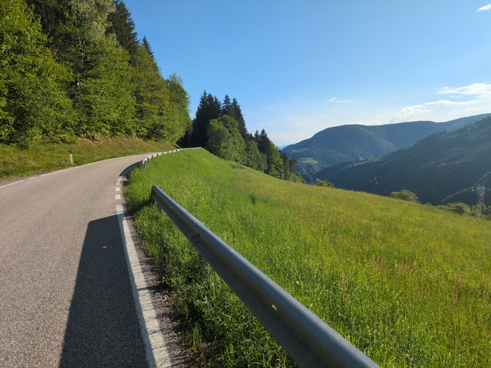
_But the weather was good_

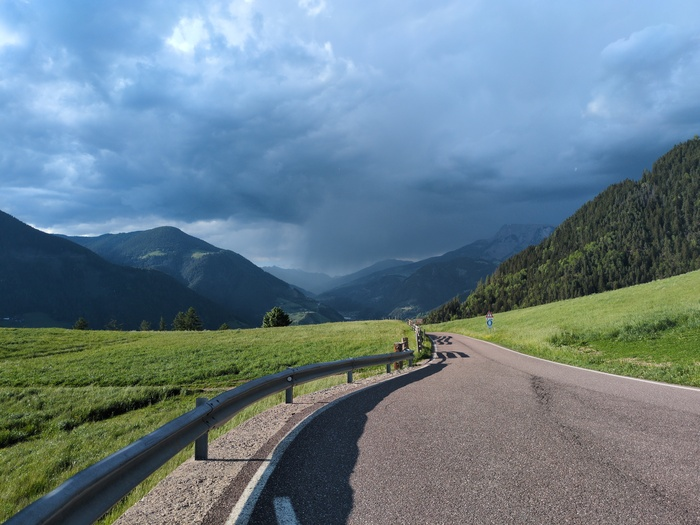
_Bad weather stays in the mountains_

As I type this I'm incredibly tired (I need to sit down after climbing a
flight of stairs). My bum hurts (🎉). Possibly I'm hungry too, I'm not sure.
