--- 
title: "Rovereto"
categories: [verona2026]
tour: [ verona26 ]
distance: 105
time: 5h13m
gpx: /gpx/verona26/rovereto.gpx
bundle_image: ./202605091944-rockyroad.jpg
date: 2026-05-10
---

"Vegetarian pizza", "So this is the Ortolano pizza, it has augergine,
zucchini, mozeralla, artichoke and pepperoni" "Peppeoni is meat" "Without the
peperonni then". I've been wandering through Rovereto for about an hour and a
half. It's damp and incredibly quiet. It's Sunday but it's a stark contrast to
Innsbruck. I'm hungry again and my beer just arrived. I'm theo only customer
in this pizzeria - probably on account of it being 6PM. I'm staying at the
hostel here. The 6 bed dorm is partially occupied by a local Italian who was
sleeping when I arrived and was snoring when I left, I don't think he is a
fellow traveller. I have things to do tomorrow:

- Sort out my power problem (I need an Italian power adapter).
- Send the key back to the hotel at the Post Office.
- Fix my gear cable.

I had a very good nights sleep at the beautiful Naturhotel. With it's old
walls, wooden smell, amazing view, rustic wooden floors, garden, and the
conspicuously placed biography of Sean Connery placed on a table in the hall.
There was a very wide selection of food for breakfast and incredible value for
€45 - worth all the pain it took to get there.

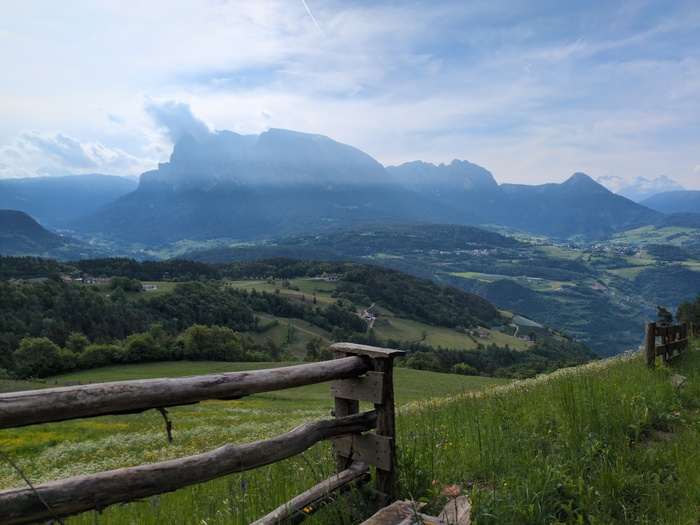
_Morning Views_

My first stop would be Bolzano. Today would be an easy day. My altitude
would drop precipitously in the first 10 miles, and then, very gradually,
descend for the remaining distance to my ultimate destination - Rovereto. I
had wanted to stay in Trento, but the hostel was full, the extra distance to
Roverto also bumped the number of kilometers to 100k.

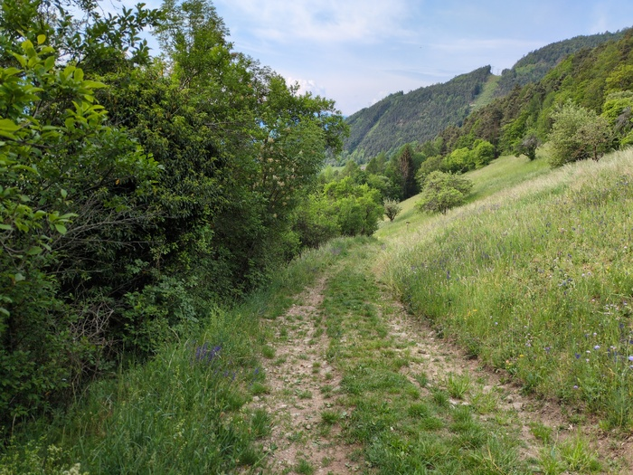
_Trail_

Out of the hotel I was almost immediately put on to a trail, which descended
relatively steeply over grass, and little hiking paths. I rode towards a vine
field and saw two walkers walking towards out mutual 90 degree turning point.
I got there first and bumped down the trail and took a wrong turning, ending
up in little field with bee houses in it but no onwards path. I doubled back
the couple had walked ahead down a precipitous and rocky path, I hopped off my
bike "prego" she said. I gestured with my hand and said "too steep!" "yes it
is very steep here". She wasn't joking. The path descended sharply and it was
rocks and boulders all the way, I had to walk my bike very carefully and the
cleats on my cycling shoes (which are mountain bike shoes at least) would
occasionally slip on the rocks.

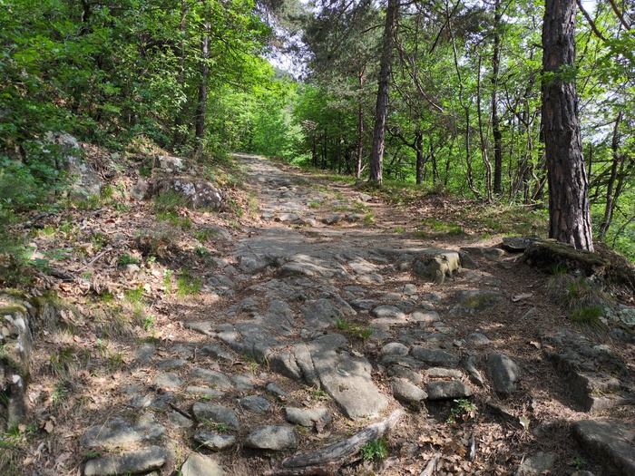
_Rocky Road_

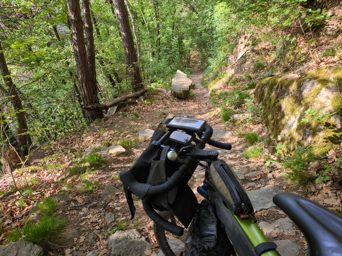
_Going down_

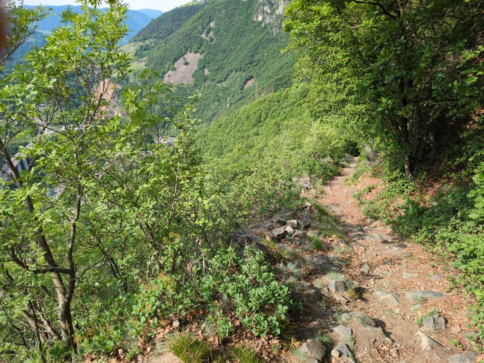
_When will it end_

The trail descended to the motorway and eventually the cycle path and I had
spent about 1000m of altitude since leaving the hotel an hour ago. I had just
200m left but the cycle path would slowly spend it all the way to Verona
probably.

The cycle path ran on one side of the south-running river and the motorway on
the other. It was smooth riding with verdant trees and grass and birds and
tunnels with the soaring sound of the river to my right and occasionally you
could distinguish the noise of the motorway. It was a busy cycle path with
plenty of road cyclists going much faster than I was and ensuring that I came
last in every Strava segment that I cared to check today. It was warm.

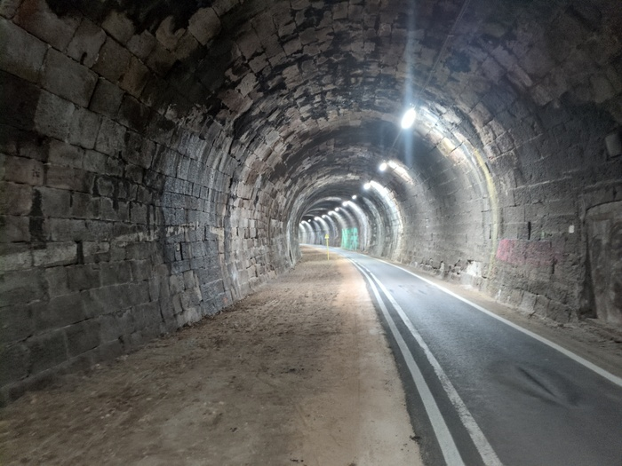
_Tunnels have benches in them_

I wasn't trying to go fast, but I wasn't intending to be so slow either. My
legs have taken a battering in the past few days and I still can't climb a
flight of stairs without my muscles demanding that I rest.

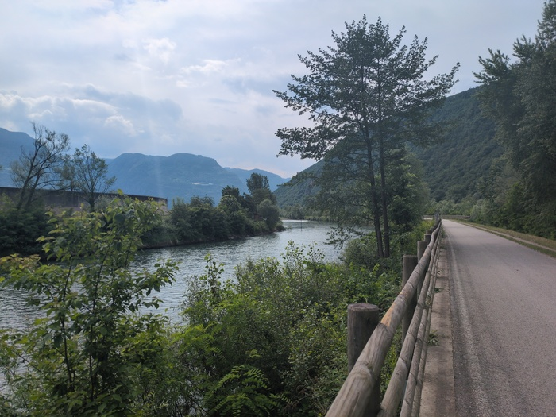
_The cycle path_

> At this point you're probably wondering how clean all of my clothes are.
> I've gotten into the routine of rinsing my jersey in the shower and letting
> it dry overnight. My bib-shorts smell (probably deceptively) like roses due
> to the amount of Nok cream I'm using. I've still got one pair of pants and
> now two pairs of socks that are out of commission - but to be fair I think
> the pants and the one pair of socks were out of commission before I started.
> Everything else is holding up well.

Bolzano was achieved quickly afterwards. It struck me as another beautiful
place and the cycle path was like a theme park ride through the city, people
would smile, birds fluttered, the river
rushed and the cool breeze and the green and the omnipresent avian twittering.
It was calm and people seemed happy.

Until now the road signs had been dual-language. _First_ in German and then in
Italian. As I rode closer to Trento it seemed the German language was quietly
dropped.

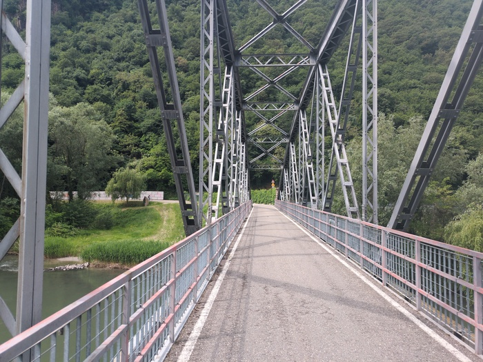
_Bridge out of Bolzano_

The cycle path would run all the way to Rovereto and perhaps even to Verona
and beyond. After I had left the city I was heading towards Trento and the
novelty started to wear off somewhat. There was a stiff headwind and it
started to spatter with rain. The scenery remained impressive although
consistent.

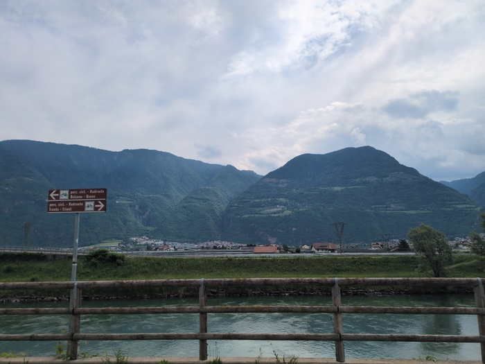
_Lumpy hills_

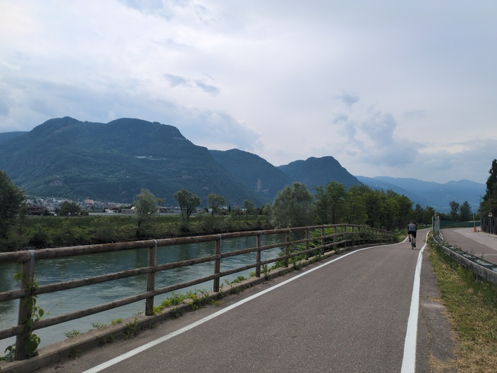
_Running by the river_

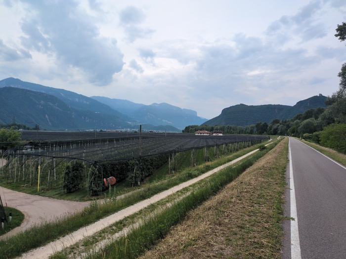
_Wine be grown in these here parts_

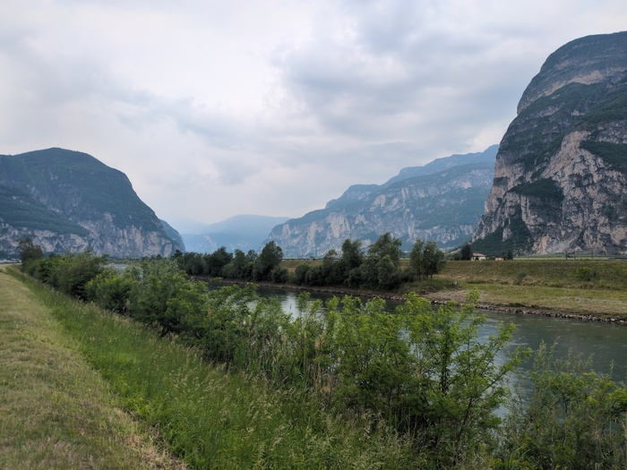
_The valley we are in_

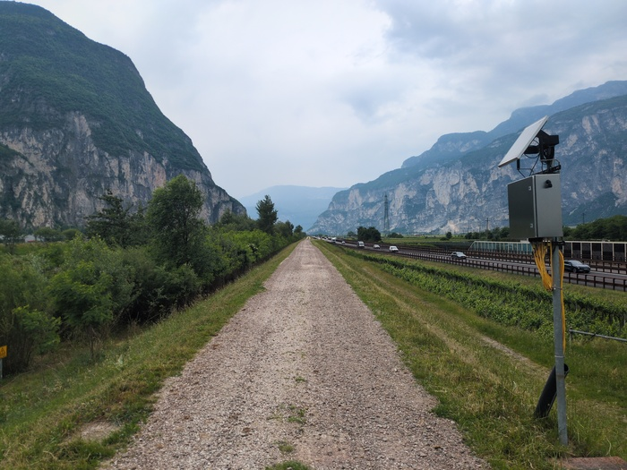
_Gravelling_

At one point I turned a corner to find the cycle path completely complete with
sheep and I had to ride into the field and around them for lack of a better
idea.

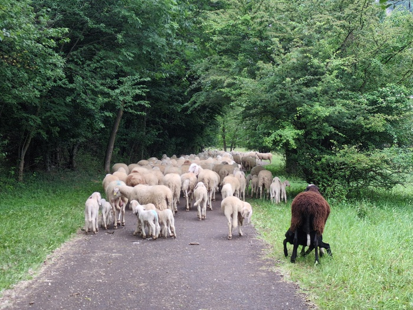
_Sheep_

I didn't see much of Trento, the cycle path pretty much bypasses it and it was
raining. I did manage to find a supermarket with a cafe and got a focaccia
sandwich:

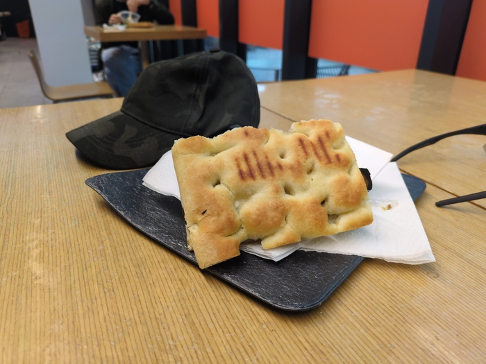
_Exciting Focacchia_

As I approached Rovereta I switched my rear gears and they snapped into place
somehwat louder than they usually do and I realised that the **gear cable had
snapped**. As much as I shifted up and down the rear gear remained in it's
bottom position. I'm not sure how this has happened - especially since the
cabling is within the frame of the bicycle. But I'm glad it happened on the
flat and not in the mountians. I'll need to either get it repaired or figure
out how to fix it myself.

I now find myself about 35 flat miles from Verona. I've booked two nights at
this hostel and I'll probably be in Verona on the 12th. The conference
organisers have booked my hotel for the 13th, 14th and 15th. I don't think
this is the penultimate blog post though. I am probably going to ride back
over the Alps to catch the train back to England.
