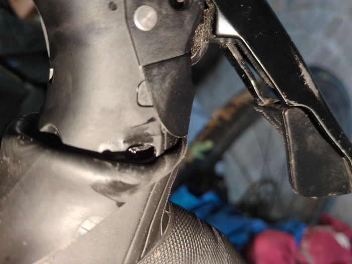
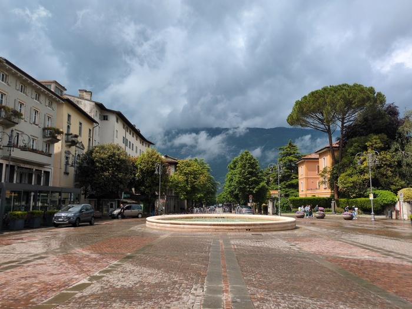
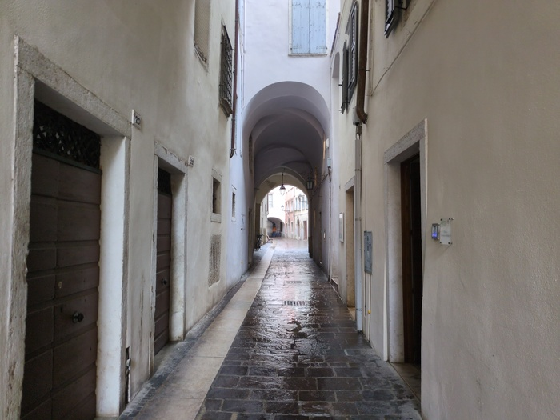

--- 
title: "Rest Day"
categories: [verona2026]
tour: [ verona26 ]
bundle_image: ./202605101904-cablebroke.jpg
date: 2026-05-11
---

Both my dorm partners snored heavily last night and both woke early and one of
them started watching youtube videos on his mobile phone with the speaker on
at 6:00am. It turns out he speaks French and was originally from Italy but
works in Lyon and is going to Tunisia for a holiday in the next days. "Et toi?
Travail? C'est la crise!" he said "Oui, je travail, comme normale. Cinq jour". He talks
to himself. One of them left and was replaced with a young Romanian who is here to
find work and speaks no English. I didn't sleep very well but made up for it
with a nap later in the day.

The hostel has a big sign "Bienvenuti. HOMEMADE CAKES. TORTE FATTE IN CASA.
Brekfast Buffet 7:30-9:00" - and indeed beyond the normal selection of bread,
cheese, cereal, butter and jams there was a large selection of cakes. I was
unable to sample them all but the ones I did try were wonderful.

My chores. The first of which was to find the post office and send
the key that I stole from the Naturhotel. I found it and climbed the steps and
walked in. It was largely empty and there were several desks only one of which
was occupied. After establishing that I don't speak Italian "I'd like to send
this key to this address". "Ticket" he said aknowledging the slightly absurd
requirement to have a ticket even though there was nobody else waiting. It
cost €3 to send standard and €10 to send signed. Standard would take up to 4
days to arrive, I wasn't going to pay €10.

Chore number two was fixing the bike. After breakfast I went outside and tried
to inspect the problem. I pulled up the rubber sleeve on the hoods of the
breaks/gear changer on the handlebar and I could see the frayed end of the
cable.

_Snapped Gear Cable_

Replacing a gear cable would normally be an easy job - and I've previously
always carried a spare - but this gravel bike has "internal routing" which
means that cables are _inside the frame_ which makes replacing them more
difficult than it would have been - and I'm dissapointed that this has
happened after only perhaps 3000k in total - I wonder if there's anything I
could be doing to mitigate it (not change gears as often perhaps). It also
explains the problems I was having switching gears, as the cable was
probably frayed and fraying for some days.

There are no shortage of bike shops in Rovereto and I found a good one
"when you are leaving?" the bike mechanic asked "tomorrow" I replied. "OK,
will be ready by 6PM. We are very very busy, normally you wait 5 days".

_Piazza Antonio Rosmini_

Chore number three was to find an EU/GB to Italy power adapter - however I
found out that more modern plug sockets supper both the Italian and EU plugs
which enabled me to charge my devices and leave a power crisis for another
time.

Lots of walking - mostly in the rain. Rovereto is somewhat like a maze of similar
looking corridors and although there was a modern shopping center most of the
shops are unevenly distributed in the old streets, in old buildings, and mixed
up with (what looked like) non-commercial and perhaps abandonned properties.
Pizzerias, Cafes and Gellato shops were in abundance as was the graffiti "Free
Gaza".

_Narrow, damp, street_

Timezones continue to defy my understanding. I had thought I was booked in for
a meeting at 1PM Italian time today, all I knew was that it was at 6PM Pacific
time. Having a meeting at 1PM that requires the laptop and stable internet
meant that I had to organise my day around that constraint. My "activity" for
the day was to visit a museum, but if I did that I didn't want to return back
to the Hostel at 1PM so I waited, and napped, found a spot with good Wifi and
then: "BALLS" - it was at 2PM not 1PM. I waited for _another_ hour. When I logged on
again I realised that my laptops clock was still in the UK. The meeting would
be at 3PM so I did some more wandering and purchased a Focaccia and finally
had the meeting.

The museum was closed on Mondays. I purchased a beer and some chocolate and
while waiting in line at the supermarket I booked a room for tomorrow at the
hotel where the conference is - so I'll be staying there for four nights. The
bicycle was repaired as promised and it cost €25.

