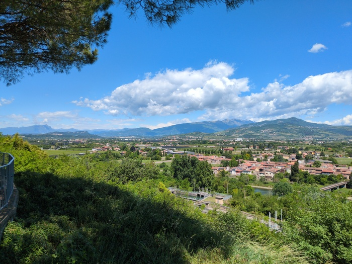

--- 
title: "Verona"
categories: [verona2026]
tour: [ verona26 ]
distance: 105
time: 5h13m
#gpx: /gpx/verona26/rovereto.gpx
#bundle_image: ./202605091944-rockyroad.jpg
date: 2026-05-12
---

I am arrived at the Hotel San Marco in Verona. It's a beautiful day and I'm
eating a toasted tea sandwich and drinking a cold beer in the familiar
surroudings of the hotel of which has been the venue for the PHPDay conference
I have attended for the past two years. I'm here two days early and have
plenty of time to rehearse and refine my talk 

After finishing my blog post last night I sat down and started to read "To The
Lighthouse" by Virginia Wolfe. I was reading the book because I purchased it a
an hour earlier at a book shop that had small, but high quality, selection of
English books. The "foreign" section of foreign bookshops often have
the "essential" books - Moby Dick, The Great Gatsby, 1984, etc. There were two
books that I recognised and had not read one was "Tender is the Night" by
Scott Fitzgerald and the other was "Too the Lighthouse". I've never read
Virginia Wolfe.

It was pleasant to sit quietly in the hostel and digest the pages of the
unconventional stream-of-conciousness prose that switched from person to
person. I really should read more.

Last nights sleep wasn't smooth sailing but I felt marginally more comfortable
than the previous night. At around 10pm we were the three of us in our beds
and the lights were still on. I had forgtten to say "Is it OK if I turn off the
light" in French. I lived in a dormitory for 6 months in Lyon many years ago
and it's certainly a phrase I would have used. But it's lost to me now.

For breakfast I helped myself to the sweet home-made cakes (the provinence of
which was in doubt when I saw the kitchen and the discarded packaging of what
looked suspiciously like cakes purchased from a supermarket. But I can't
complain they were good. The bread was bad though. Very cheap white bread that
fell apart as you spready the butter on it.

I said hello to a man in cycling lycra pants. He was cycling from Rome back
home to the Netherlands with what was surely his wife. There was also another,
older, couple who I met as I wheeled my bike out from the shed who were just
cycling up to Bolzano. Both were caught out by the weather yesterday and
didn't feel particularly optimistic about the weather in the upcoming days. 

It was raining during breakfast and it was spitting as I pedalled out from
Rovereto following the Garmin track which was simply going to join the clearly
signed cycle path to Verona which follows the
[Adige](https://en.wikipedia.org/wiki/Adige) river to Verona.

_Morning_

