--- 
title: "Verona"
categories: [verona2026]
tour: [ verona26 ]
distance: 76.6
time: 3h31m
gpx: /gpx/verona26/verona.gpx
bundle_image: ./202605111653-verona.jpg
date: 2026-05-12
---

I am arrived at the Hotel San Marco in Verona. It's a beautiful day and I'm
eating a toasted cheese sandwich and drinking a cold beer in the familiar
surroudings of the hotel which has is and has been the venue for the PHPDay
conference. I'm here two days early and have plenty of time to rehearse and
refine my talk 

After finishing my blog post last night I sat down and started to read my
book. I was reading my book because I purchased it a an hour earlier at a
book shop. The _foreign_ section of _foreign_ bookshops often have a distilled
selection of the classics - Moby Dick, The Great Gatsby, 1984, etc. I had read
most of the ones I recognised decades ago but there two that I hadn't -
"Tender is the Night" by Scott Fitzgerald and "To the Lighthouse". I've never
read Virginia Wolfe.

It was pleasant to sit quietly in the hostel and read. It's a form of mental
excercise and it's the type of activity I seem incapable of engaging in after
a demanding work day.

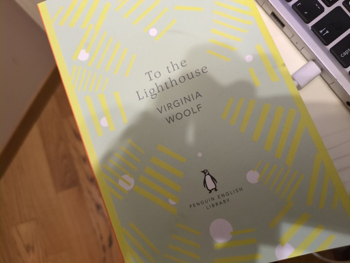
_A book!_

Last nights sleep wasn't smooth sailing but I felt marginally more comfortable
than the previous night. At around 10pm we were the three of us in our beds
and the lights were still on. I had forgtten to say "Is it OK if I turn off the
light" in French. I lived in a dormitory for 6 months in Lyon many years ago
and it's certainly a phrase I would have used. But it's lost to me now.

For breakfast I helped myself to the tasty home-made cakes (the provinence of
which was in doubt when I saw the discarded packaging in the kitchen). The
bread was bad and fell apart as you spread butter on it.

I said hello to a man in cycling lycra pants. He was cycling from Rome back
home to the Netherlands with what was surely his wife. There was also another,
older, couple who I met as I wheeled my bike out from the shed who were just
cycling up to Bolzano. Both couples were caught out by the weather yesterday and
didn't feel particularly optimistic about the weather in the upcoming days. 

It was raining during breakfast and it was spitting as I pedalled out from
Rovereto following the Garmin track which joined the clearly
signed cycle path to Verona which follows the
[Adige](https://en.wikipedia.org/wiki/Adige) river to Verona and then the sun
came out.

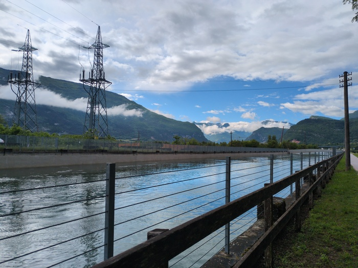
_Morning_

The sun stayed out and the wind was blowing in the correct direction.

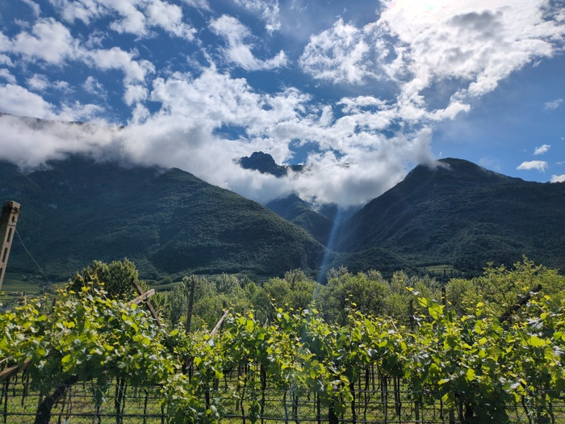
_Blown south_

The cycle path was good. There were some minor climbs but mostly it was a
gradual descent. The little climbs made  me remember that I managed
to climb two flights of stairs this morning without pausing so the rest day
provided some benefit.

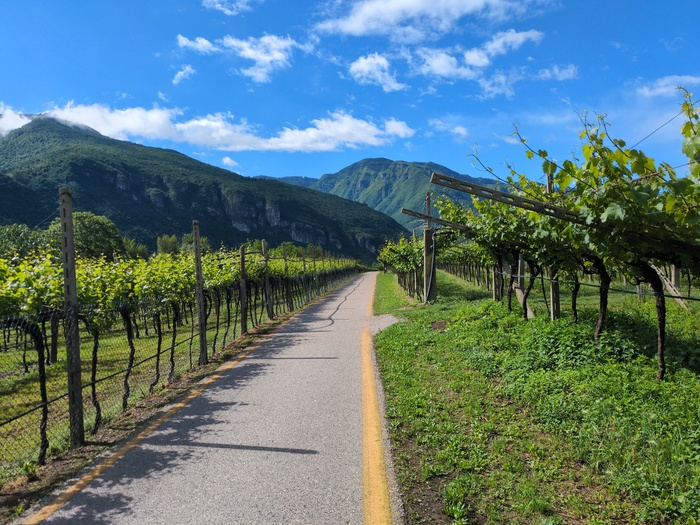
_Vines_

The scenery was nice. My gears were working after having been repaired in
Rovereto ... mostly. When I switch down to
the lowest gear it seems to get stuck somewhere before finally, lazily,
falling into place. Maybe some lubricant is required.

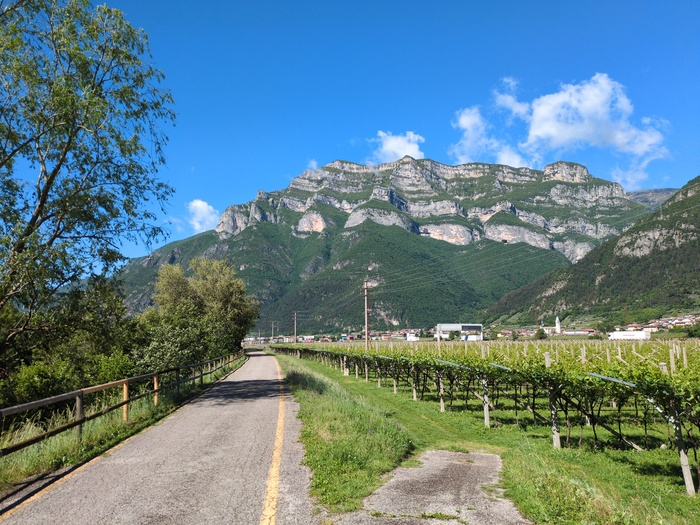
_Big_

There were lots of road cyclists (again). More frowns than smiles and I'd
attribute this to the fact that the wind was blowing in my favour and not
theirs and on some stretches I was hitting 20mph (33kmph) without trying.

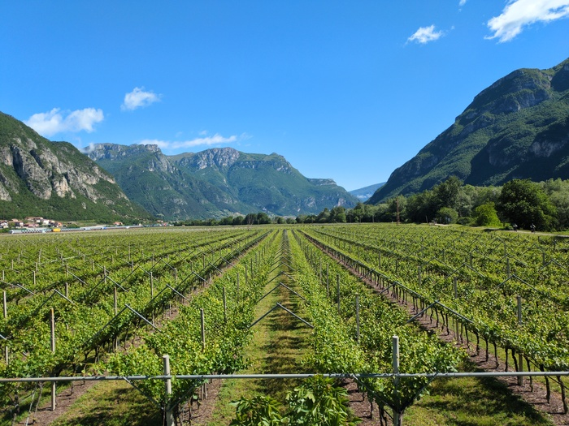
_Wine_

My route was around 45 miles and the man at the hostel said I'd be in Verona
by lunchtime and he was right. My hotel check-in was at 15:00 and there was no
point in rushing and having to wait around, so I slowed down and cruised the
last 10 miles.

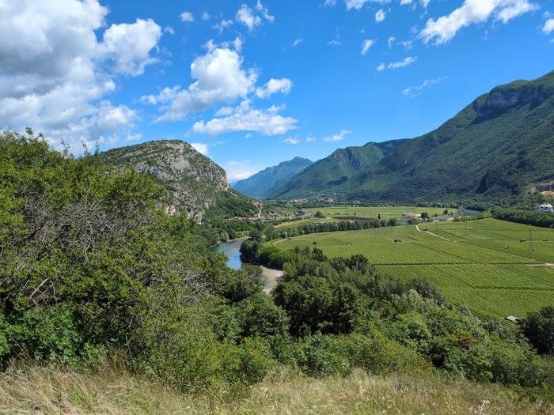
_Yes_

I wanted to get to the hotel but I also wanted to keep going. 45 miles is not
enough. Finishing at 13:00 is against the rules. The sun was bright and the
wind was blowing me south.

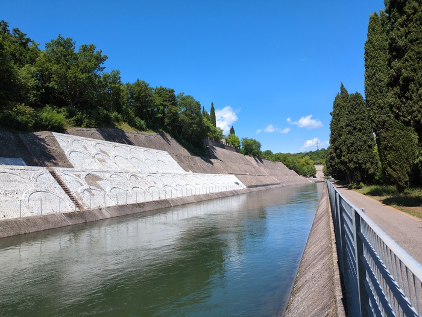
_Joining the Canale_

As I approached Verona the Cypress trees started to appear.

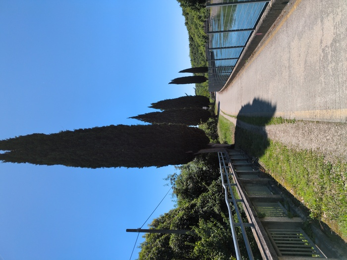
_Cypress Trees_

The mountains are gone.

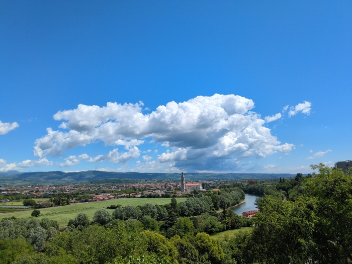

By 13:30 I was at the hotel - my destination and the venue for the conference
in two days time.

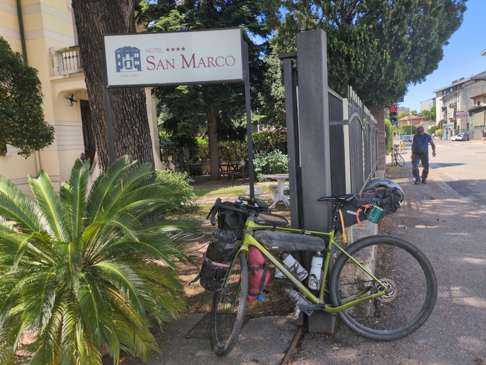
_San Marco Hotel_

My room was not ready so I got changed in the toilet and ordered a beer and a
toasted sandwich and started writing this blog. Before the nice receptionist
delivered me my room key and I showered, spent 30 minutes hand-washing my
things and then napped for 30 minutes before embarking on a walk around
Verona.

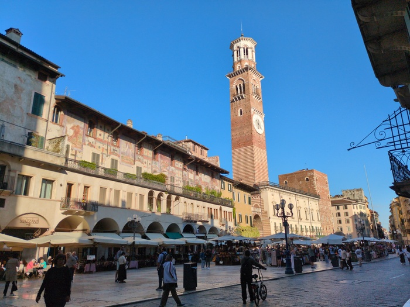
_Here I am, in Verona. I'm the man behind the phone._

I wandered to the Roman Arena (ampitheatre) which is now used for live shows
and then wandered some more and ended up far from where I thought I should be
and probably ended up walking 10 kilometers in my barefoot shoes and was
struggling a little towards the end. I passed various places to eat but ended
up buying a beer and some chocolate in a supermarket before going back to the
hotel and getting a take-away pizza which I've now finished.

I'll pause the travel blog until the 16th when the conference is over and the
next post will either be "The End" (i.e. I got the plane back from Verona with
the bike) or the first post of the return journey (which will have to involve
a train at some point...).

