--- 
title: "The Nunnery"
categories: [verona2026]
tour: [ verona26 ]
distance: 96
time: 4h44m
gpx: /gpx/verona26/nunnery.gpx
bundle_image: ./202605161903-nunnery.jpg
date: 2026-05-16
---

I'm now sitting in a religious property owned by the church that is rented out as a
hotel. It's a grand place with decorative stucco walls, ceilings painted
with cherubs and jesus and stately staircases. The room is spartan however
and somewhat like a polite prison cell with only an unreachable window in the corner
of the room. I'm now sat in a large, richly decorated and empty common room with a couple of
sofas and table in a large open space with a piano in the corner.

My right calf is twitching and I can't stretch it and I must walk with it on
my tip-toe. It's been that way since this morning for no descernible reason,
almost as if it had cramped up during the night. It doesn't significantly
affect the cycling but I would be incapable of pushing the bike and more
incapable of hiking with it.

I was four nights that I was in Verona. I had arrived two days early and had
one entire day free in which I did little other than rehearse my conference
talk and wander about the city before my peers started to arrive in the
evening and we congregated, started drinking and went to the San Zeno plaza
and drank some more before not eating very much and returning to the hotel
and continued to drink. It's possible that I drank more than I should've.

The next day was the conference and, although I did get up at 7:30am and do a
5k run, I had a terrible hangover and spent the rest of the morning being
sick, missing the conference talks and only recovering the lining of my
stomach at around 2PM. Fortunately (and not coincidentally) my talk was not on
this day but the subsequent one. I attended the speakers dinner and had only a
single drink and a large pizza and spent the evening in good company before
returning to the hotel.

The next day I rehearsed the talk twice more after breakfast and had to ask
somebody what time my talk was. I had to ask because on the first evening I
had broken my phone. The gorilla-glass screen on my phone was "smashed" with a
thousand cracks one week after having bought it over a year ago - but remained
barely legible, fully functional and seemingly indestructable until I decided
to get it fixed before this trip. Fixed it was, mostly, but seemingly not as
robust as it had been as when I dropped my bag on the floor in the San Zeno
plaza the screen simply stopped working with a single small crack and a bright
green dot shining through. My phone was out of action

"What time is my talk?" it was in two hours. In the meantime an Italian friend
said he'd accompany me to a phone shop to get it repaired and we left and I
dropped the phone off, it would cost €180 in total but I would regain the use
of my phone before the conference was over.

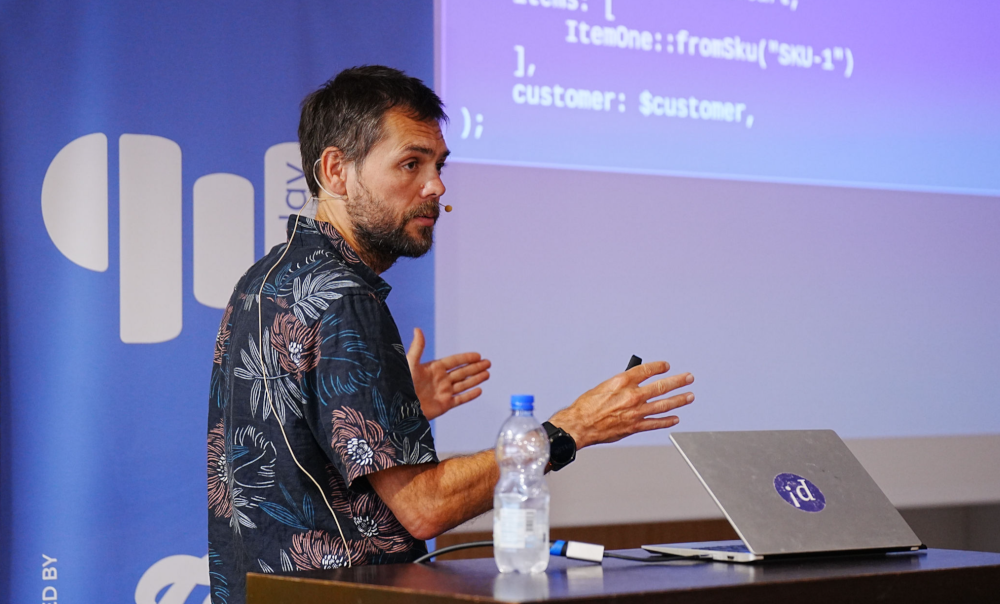
_Me Speaking about Things_

The talk seemed to go well and featured, in the introduction, a ten second
exposition of my trip from Calais to Verona and the audience all started
clapping unexpectedly. The talk did finish 10 minutes short of the 50 minute
slot however in spite of the fact that all of my rehearsals had hit the time
constraint exactly. I'm not sure if I missed something or spoke too fast.

That evening there was a community dinner organised by Marco at the same
pizzeria that the community dinner organised by Marco had been at for the past
two years and more great pizza and good company was had before returning to
the hotel and I bought a larger round of drinks than I had anticipated buying
before retiring to bed having resolved to carry on the trip by cycling west to Lyon
and getting the train to the ferry and the UK.

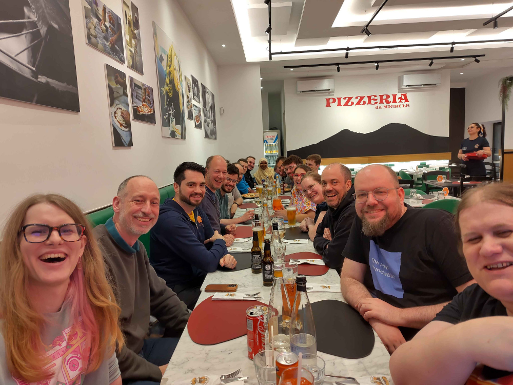
_I'm peeking my head out way at the end of the table in front of Greg_

> My dinner has just been provided. They provided a full basket of bread 10
> minutes ago and now my main course "Macronichi" which is creamy pasta with
> saffron and tastes good, although more expensive than a pizza. They don't
> have pizzas. The place is run by a family and all the staff are very
> friendly. The daughter studied the English poet John Clare and visited
> Doncaster and seems to relish the opportunity to converse.

I woke this morning at 7am, got out of bed and hobbled unexpectedly to
breakfast gradually realising that my right calf was lame. I was well fed
before breakfast having 3 days of conference behind my with nothing but a
hungover 5k run to burn it off. So when I packed up, paid my hotel bill and
left at 8am I didn't anticipate needing much more sustence for the day.

The weather forecast was confusing, advertising all of rain, thunder, cloud
and sun. It was spitting in the morning and I traced my way in the
intermittent and light rain out of Verona the same way I had come in avoiding
the puddles on the cycle path besides the canal and making good speed despite
a light headwind from the West.

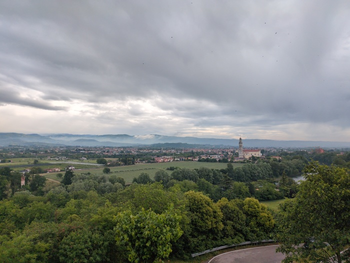
_Morning_

The speed I was making confirmed that today would be a very easy day. The
hotel that I booked was booked because it was the cheapest hotel in range of
Bergamo (it also looked very attractive) but it was barely 100k away and the
terrain was flat.

Lago de Garda featured in the first hours. It was heavily touristed but the
tourists were subdued by the weather. It wasn't a very scenic route by large
however due to the view being obscured by properties and fences. When the lake
was able to be seen it was a vast expanse of caerulean blue with cloud-lined and
snow capped mountains in the distance.

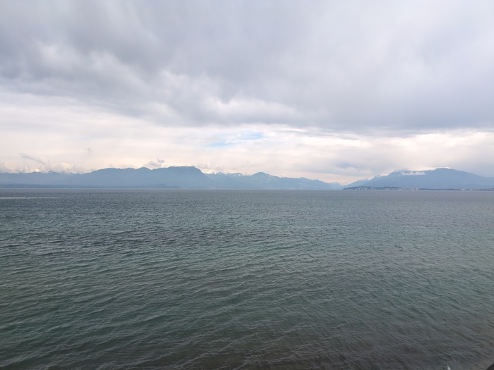
_Lago de Garda_

The route was mainly on the main roads, often in a dedicated cycle lane, but
not particularly pleasant with occasional gravel sections providing some
relief from the farting motorbikes and roaring lorries.

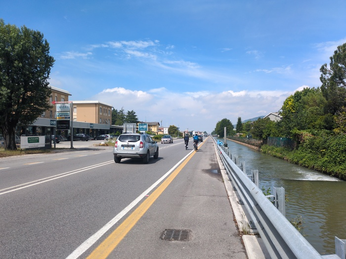
_The Road_

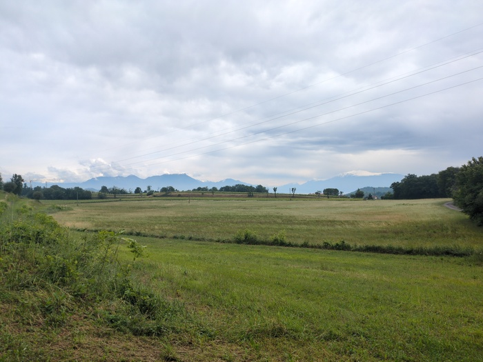
_Green_

[Brescia](https://en.wikipedia.org/wiki/Brescia) is a city, the edges of which the route intersected but the center
would be left untouched. I decided to deviate from the course and investigate
with just 17 miles to go to the destination (it was lunchtime).

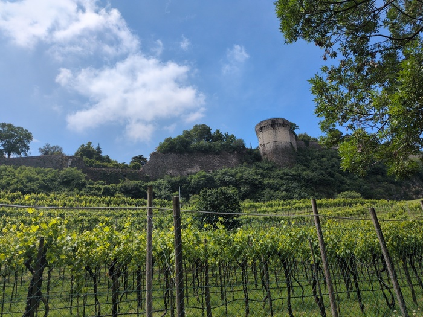
_The City Walls_

The had some impressive buildings (some of the best preserved Roman buildings
in Italy) and is the second largest city in the region (the first being
Milan). I stopped here for a coffee and a "pan frutta" (some description of
fruit cake).

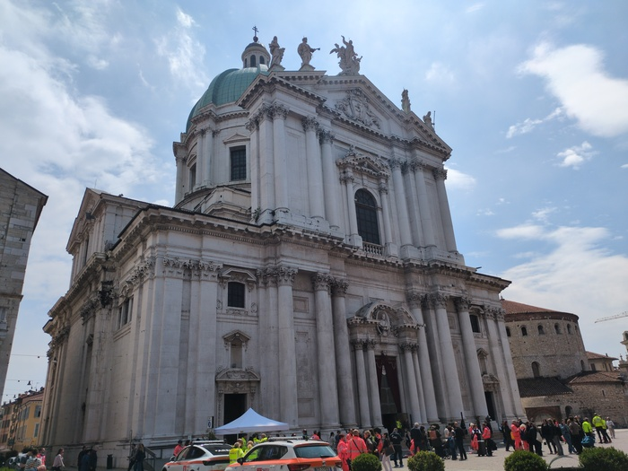
_Catholic_
_
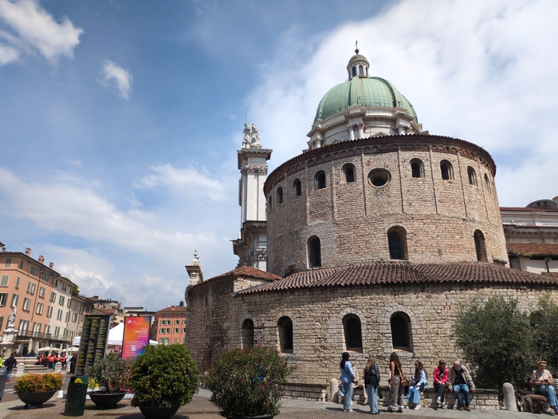
_Round_

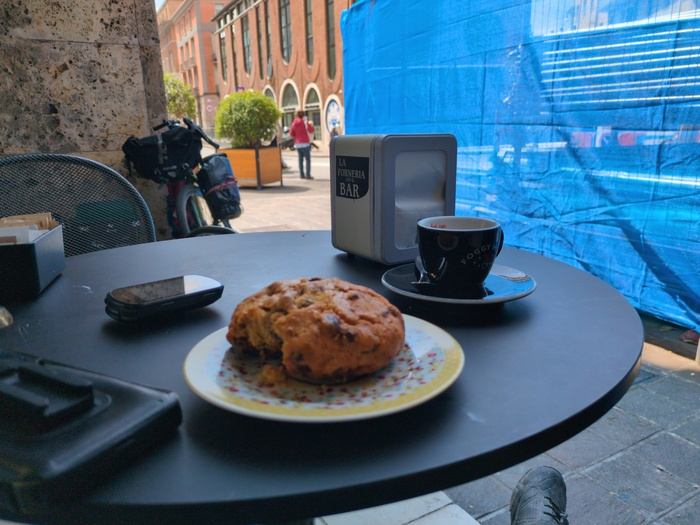
_Fruit cake_

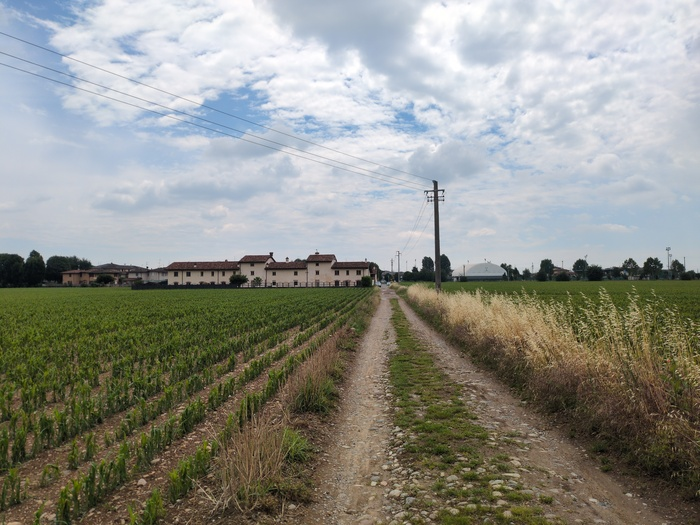
_Gravlin'_

The weather improved and the blue of the sky made itself through the clouds
and I made swift progress towards the hotel in the countryside. On the final
approach there were sirens and what seemed the scouts from an approaching
convoy. Two police motorcycles approached and one made eye contact with me and
pointed commandingly to the side of the road. I obeyed and pulled up and
waited. After a minute, and not knowing why or for what I was waiting I
cautiously proceeded down the road. Soon another two motorcycles came round a
bend and this time one approached me directly and commanded me in Italian and
this time I parked the bike against the wall and dismounted.

Presently a _swarm_ of cyclists rounded the corner being preceeded by cars
with bikes mounted on the top. They were all going incredibly fast and this
first batch probably contained over 100 cyclists which were subsequently
followed by support vehicles and then some stragglers before a final car
displaying a sign "end of the peloton" (I didn't know what it said, but "end"
and "bicycle" were in there somewhere).

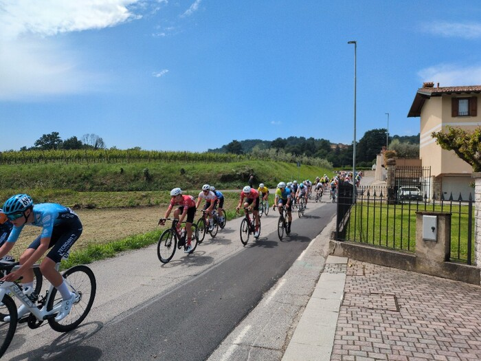
_2 Giorni di Brescia e Bergamo_

10 minutes later I was at the religious property and was conversing with the
daughter that studied John Clare (whom I had never heard of and subsequently
researched). It 2PM and I have spent the rest of the day reading and napping.

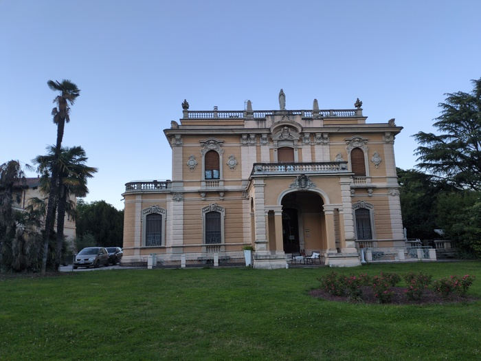
_The Hotel_

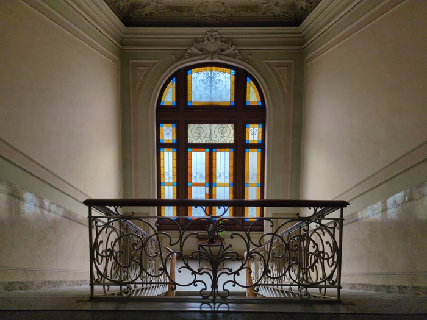
_As Above_

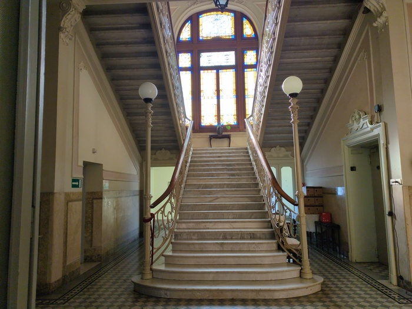
_So Below_

Tomorrow I'd like to make a greater effort and hope that my right calf muscle returns
to normal. Lake Como is 100k away if I ride through Bergamo but if the terrain
is like today I'd have maybe another 3-4 hours available to ride further.

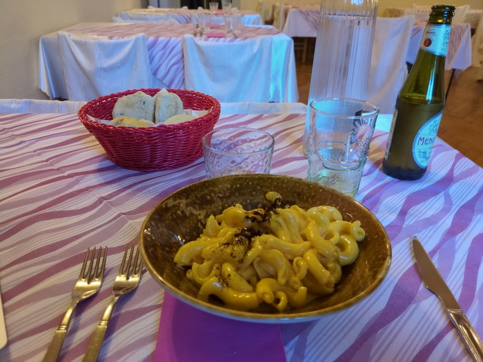
_Dinner_
