--- 
title: "Camping la Famigla"
categories: [verona2026]
tour: [ verona26 ]
distance: 137.78
time: 7h5m
gpx: /gpx/verona26/familiga.gpx
bundle_image: ./202605161925-camping.jpg
date: 2026-05-16
---

I'm now sitting in the bar of the camping with an artisanal IPA beer. The
camping is, I think, run by nuns. And I'm probably sitting with four nuns who
are playing cards and passively watching Italy's version of "Who Wants to be a
Millionaire?". The campsite has an amazing view and is very peaceful and the
weather is fine. I'm wearing my thermal "leggings" as I decided to attempt to
wash my casual trousers which are less clean than they could be after 18 days
of evening worn.

In the morning I woke after a good sleep in the monastic room and descended
for breakfast easily at around 7:15am. The breakfast buffet didn't offer a
huge amount of hutritious food but it had some variety of cereal, cheap bread
and cakes and coffee and juice. I can't complain as it was only €4 and I'm not
sure I even paid that as my checkout bill came to €21 which included dinner
and an afternoon coffee. I ascended the stately staircase (and then the less
stately "servants" staircase) to the room and downloaded some new music for
the day and paid up and left.

I didn't yet know exactly where I was going. There were three possible
destinations:

- The hostel at Como
- A campsite in Switzerland
- This campsite

I would aim for Como and then see how I felt.

The first part of the day was the ride to Burgamo city. It was mostly on a
busy road, and much of the day was on a busy road. Despite it being a busy
road it was clearly popular with recreational road cyclists and I was able to
match _some_ of them for speed. When it wasn't on the road the route took me
through the gravel tracks between vineyards.

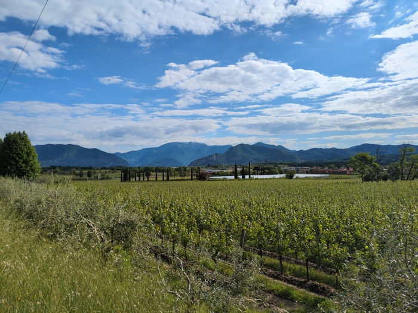
_Vineyards_

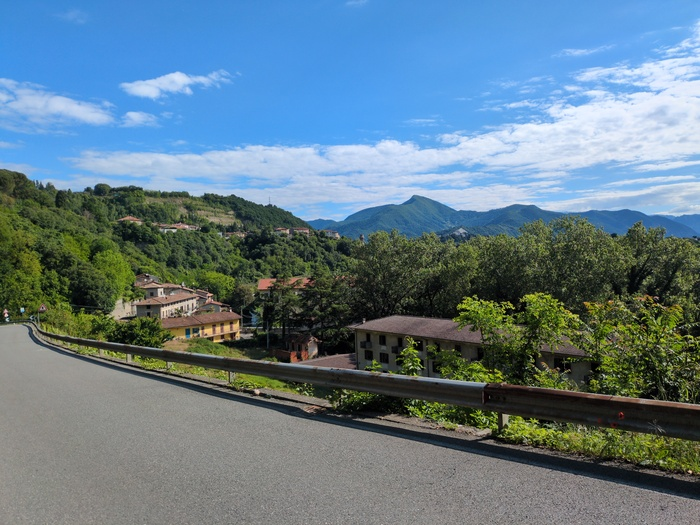
_El Camino_

Bergamo was a pretty large city and I was in it for some time before finding
what I think was the center. There was a fountain and I filled my bottles and
a few people queued behind me when I finished filling my bottle their dog
shoved his head into the fountain stream in a way that suggested he had done
it before.

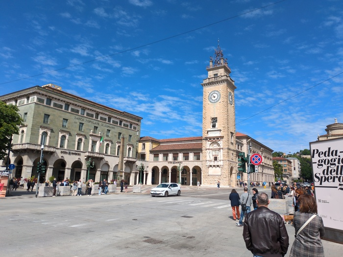
_Bergamo_

When I was in Bergamo I was hungry. It had maybe been 30 miles since breakfast
and breakfast wasn't that substantial. There was no shortage of eating
oppportunities but everywhere seemed busy and I passed on every chance "maybe
if I get out of the center I'll find a nice bakery" I thought. Of course that
never happens and I found myself well out of the city and being even hungrier
and it being Sunday there was some (unrealistic) worry that I wouldn't readily
find another opportunity to purchase food.

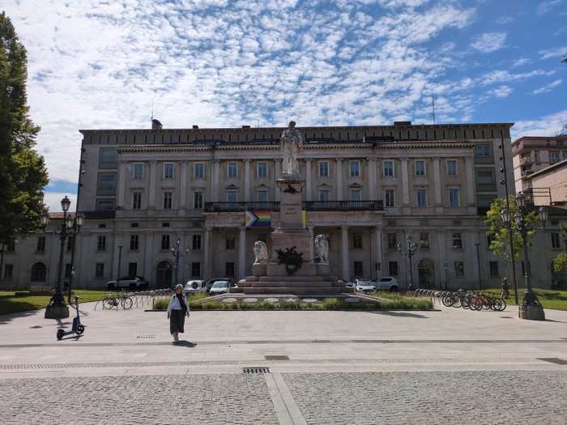
_Also Bergamo_

It was lunchtime and as I entered the 3rd village since Bergamo I used Google
Maps to show me an open supermarket, it wasn't so far away and I made a detour
and purchased some bread, some slices of "english cheddar", some chocolate and
an apple. I then spent the next hour trying to find a bench before resigning
myself to sitting on a wall and carving up my apple and cheese and bread into
a much appreciated sandwich.

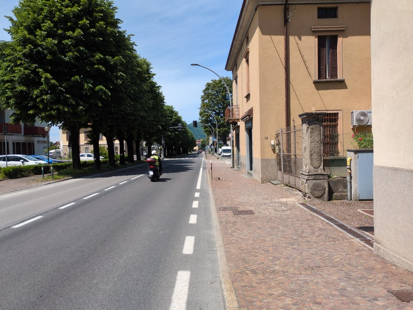
_More road_

There was a train. That was exciting.

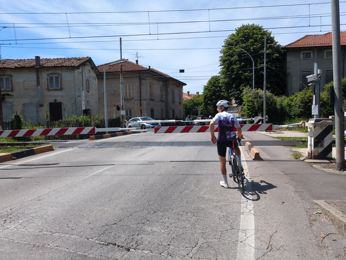
_Waiting for the trains_

The course involved crossing what I learnt was the Adda river. Unfortunately
the bridge was closed for maintainence...

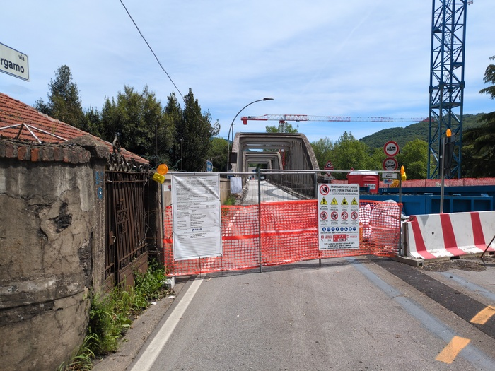
_The other side of the closed bridge_

...so I had to take a significant 5k detour to what I thought was a bridge but
was infact a ferry crossing.

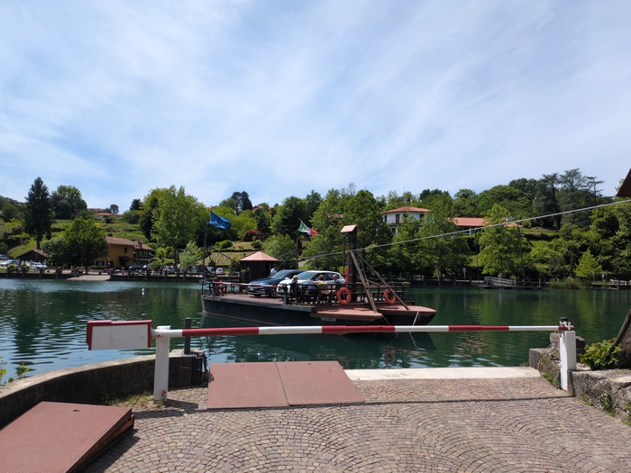
_The ferry_

It was unique in that the ferry used no motors. A cable spanned the river and
after we were on boarded and I had paid my €2 the ferryman simply grabbed the
cable with a clamp on a stick and leant back and started pulling - giving the
ferry the momentum - and it drifted listlessly accross the river following the
cable.

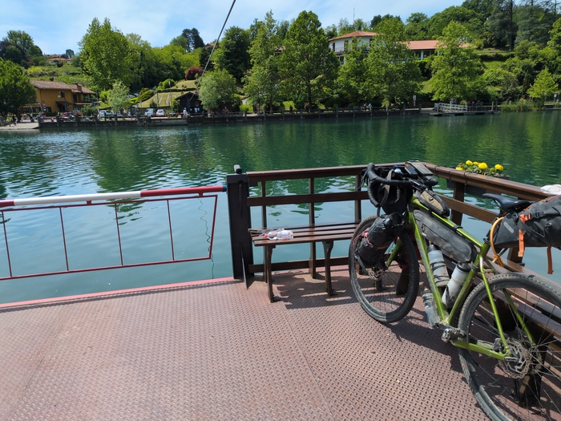
_Bike on a ~cable~ boat_

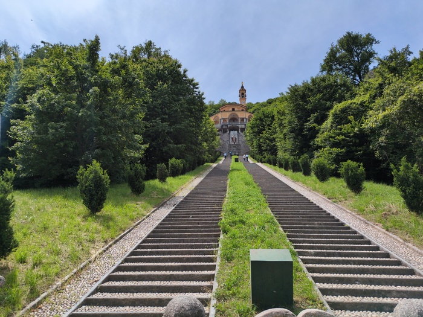
_The detour took me past this_

On the otherside there were numerous people waiting and idling including some
cyclists. I sat down to get my bearings and decide if I should cycle back up
and rejoin my original route or continue from where I am now. An old Italian
with a bicycle started speaking at me in Italian.

I looked up and smiled "No capisco Italiano". He almost tried to speak English
but said "Francais, Deustch". I said that I spoke some French. He was curious
about where I was from and where I was going and suggested the following the river to Lecco was
very beautiful "c'est tres joli". "et toi? tu allez ou?" "I am from this
village" he said.

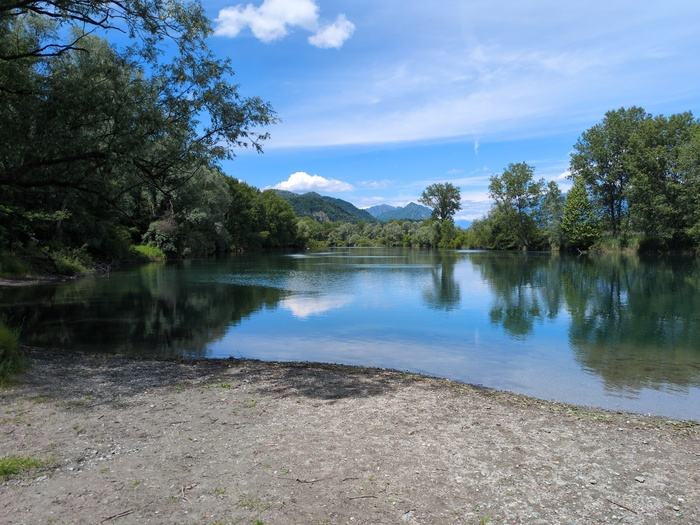
_Folowing the joli river path_

The path was indeed rather nice. The gravel crackled under my wheels with the
warm air and cool breeze and hikers and childern and dogs and magic shows. U
still had my helmet on and it was becoming uncomfortable in the heat.

I take the approach that I'll put my helmet on when I think falling off could
be complicated (e.g. on a busy road or going down a hill at speed).

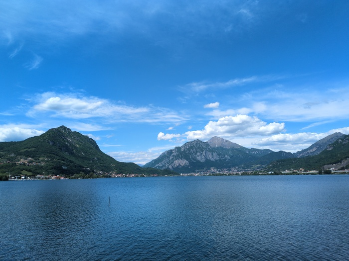
_Lake_

There were numerous handgliders gliding in the sky in front of the voluptuous
green mountain mounds.

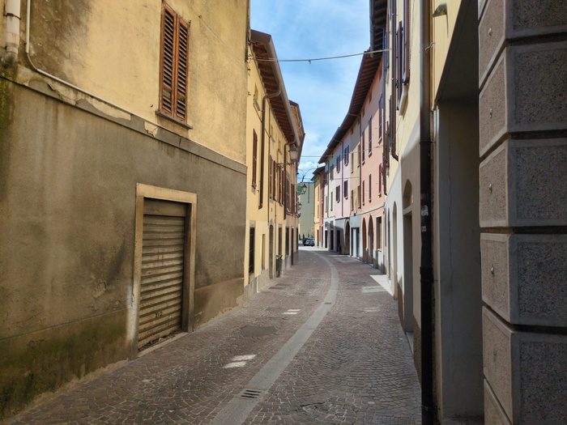
_Standard Village Street_

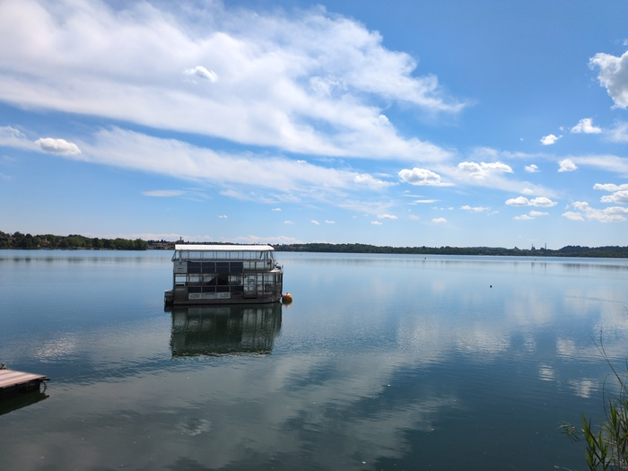
_Lago di Pusiamo_

I was heading to Como. I had been in Como before, many years ago, and I think
I came into Como from the mountains when I came into Como last. I recognised
it. It was swarming with traffic and tourists.

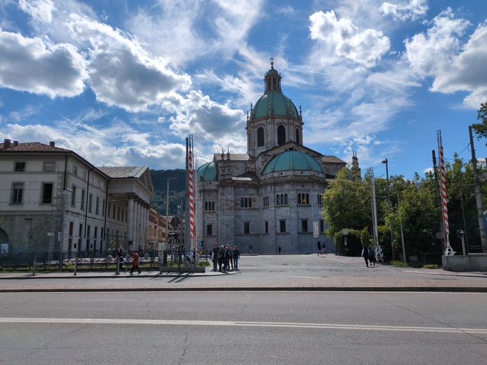
_Religious Institution in Como_

Sat down I did on a bench and I had to decide on where to go. It was
approaching 4PM - it was about 20km to this campsite (though with some
relatively large climbs) - or there was the hostel. Loolking around at the
swarming tourists I didn't really want to stay in Como, going to Switzerland
would be a significant detour.

I read the reviews for the campsite "Serene", "Peaceful", "Nuns" were some of
the recurring themes and I was sold. I continued to sit on the bench for
another 15 minutes though in the burning heat watching three pidgeons dancing
about behind the temporary fence that was placed to stop the tourists falling
into the water.

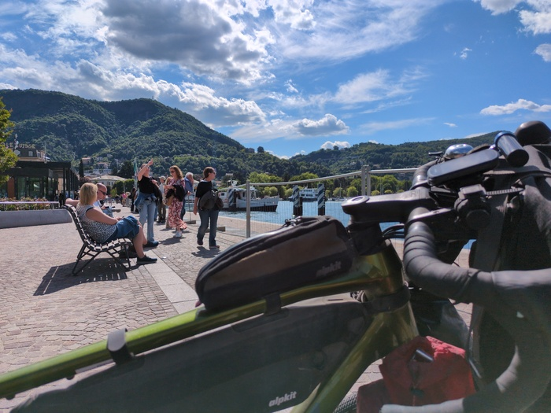
_Tourists (number of tourists reduced for scale)_

The road out a 140m climb and it was very narrow. Completely unsuitable for
the amount of traffic that was using it. A hood-down convertible sports car
overtook me at speed with a rude reving of the engine. As I struggled up the
hill I saw a confusion of cars reversing trying to find space to pass
eachother. I think I beat the sports car to the top.

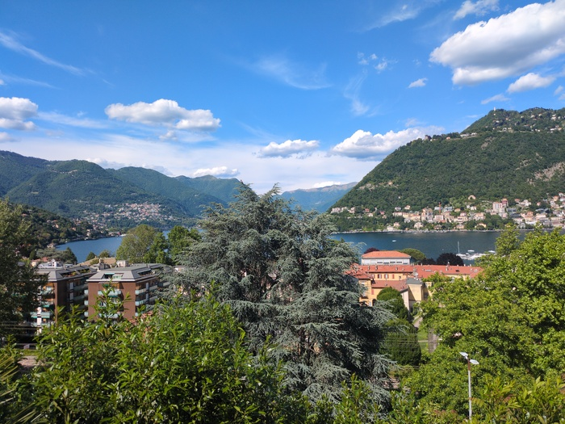
_Bye Como_

With 10k to go the campsite I made the wise decision to visit a supermarket
and buy some dinner and a few beers - finally drawing up to the gates of the
"campsite". They were automatic gates and I buzzed the buzzer and "Buonasera"
"Hello" and I was buzzed and cycled up a significant driveway to the reception
and was welcomed and shown a place and I showered and attempted to wash my
trousers and ate my dinner of black rice (from the supermarket ) and
Uncle Ben's Chilli-Sin-Carne (from Asda in England).

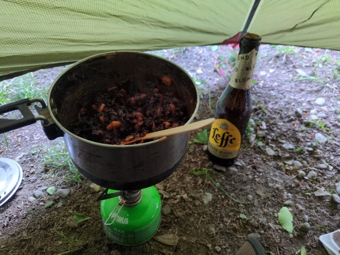
_Dinner_

The view I discovered before writing this blog post.

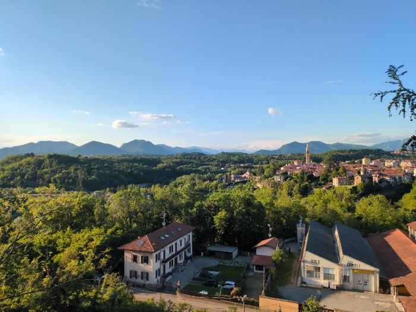
_View from the Camping_
