--- 
title: "Ivrea"
categories: [verona2026]
tour: [ verona26 ]
distance: 130.52
time: 6h18m
gpx: /gpx/verona26/ivrea.gpx
bundle_image: ./202605171839-olona.jpg
date: 2026-05-18
---

The "B&B" I'm staying at is a cosy, small converted ground floor appartment. I
share it with the cars that I can hear passing loudly at regular intervals and
I had to walk 40 minutes to the supermarket to get some food to cook (no more
cycling thanks) and forgot to buy a power adapter as this appartment has no
sockets that accept an EU plug and I'm concious of my power usage. I have an
almost dead phone, 79% on my charger (the phone will use at least 50% of that)
and 62% on my laptop. I should survive although I was planning to watch a film
this evening, that's not happening now.

An Italian driver pulled up to me on my way back and asked for what I can only
guess were directions I had to reply "no capisco Italiano" to which he waved
his hand and drove off as if to say "you don't understand Italian then piss
off". I really _should_ learn Italian so that at least I could shout "hey,
you're the one that interupted _me_ asshole" and wave my arm about as some
Italians do in such situations. It's not the first time I've been stopped for
directions in the past weeks, maybe I look Italian and I can't remember being
asked for directions in _ANY OTHER COUNTRY_ in the past ten years.

My sleep last night was as bad as either of the two previous camping nights.
With the 3am "toilet" ceremony and waking every two hours to see how much
longer I have to endure the mildly cold and uncomfortable sleep before
sleeping in longer than I had intended. I'm not sure what could be done to
improve the situation. The fact that it's realtively cold means pulling the
sleeping bag up tight which limits ones sleeping positions - I'd probably be
best sleeping on my back - but that requires an amount of discipline that I
don't posess at the moment.

Bleary eyed I threw my gear out of the tent and packed up, it was around
8:30am when I left and I made my way directly to a Cafe and "uno cafe
americano" (I've forgotten how to say "please") and I pointed at some pastries
and the barman asked me questions and I said "si, si". I sat down and planned
my route.

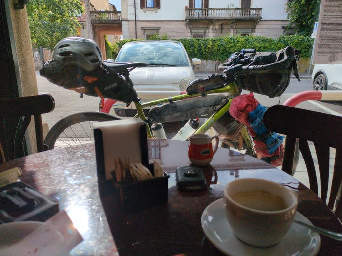
_Breakfast_

I was heading to Aosta and from there my choice of mountain passes would be
limited (in fact perhaps there is only one I can take). Aosta was about 120
miles or so - just about doable considering there wasn't _that_ much elevation -
but it would be a long day. Booking.com showed an appartment for £35 near the
town of Ivrea which was around 80 miles in the right direction so I made my
route and left, not before I did the "where are you from? Holland?" game
with the barman.

I rode out of town. The route would take me south from Malnate (the town I
camped in) through the [Olona
Valley](https://en.wikipedia.org/wiki/Olona_Valley) following the greenway
tracing the old [Valmorea
Railway](https://en.wikipedia.org/wiki/Valmorea_railway). The train tracks
were mostly still there beneath the rich plantlife that surrounded the track.
The river was once of the most polluted rivers in Italy during the 70s due to
the heavy industrialisation of the area but almost all industry has stopped
now judging by the ghostly abandonned factory buildings the littered this side
or that side of the path and were in the process of being absorbed by nature

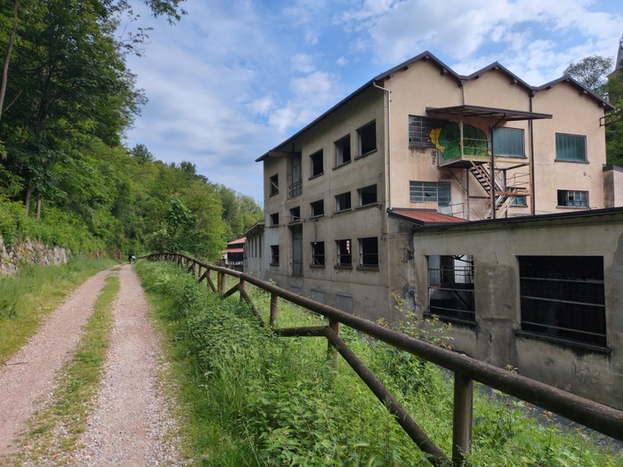
_Abandoned Factory_

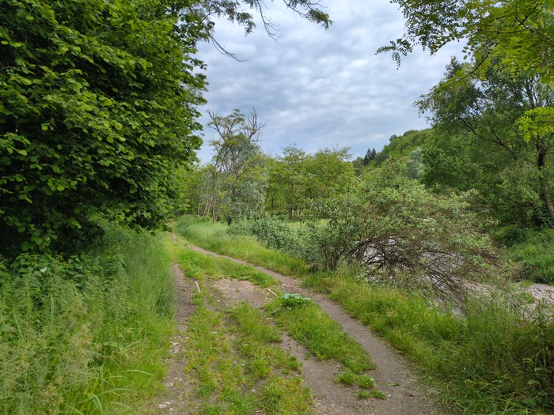
_El Camino_

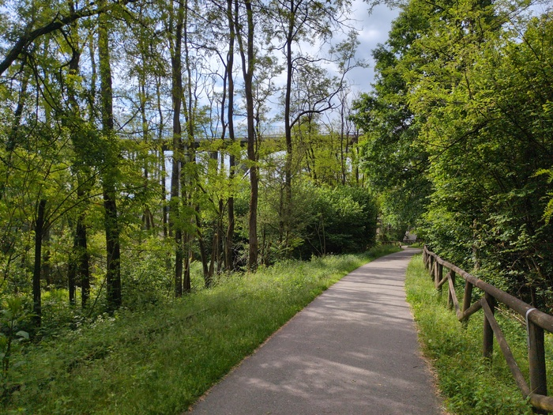
_The path_

The course led to the [Villorisi
Canal](https://en.wikipedia.org/wiki/Canale_Villoresi) that was built in the
1870s and that seemed to have bridges that were far too narrow to allow canal
boats to pass - and it turns out its purpose was/is primarily for irrigation.

While cycling I passed an asian family before having to slow down behind a
lady dog-walker in a tunnel. As I passed she said something racist about the
"chinese" - either to me or to her dog, I'm not sure.

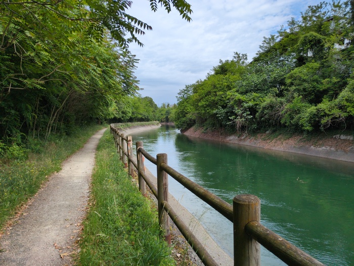
_Villorisi Canal_

I learnt that I was in Lombardy and that I would now be in Piemonte.

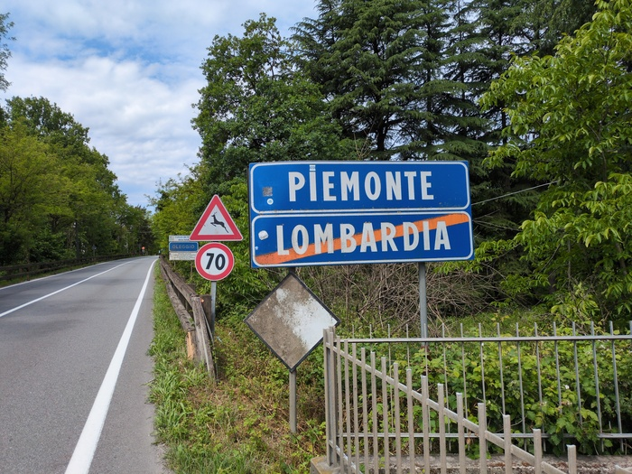
_Piemonte_

The 4 days in Verona had given my bum time to recover but now 2.5 days and
almost 200 miles later it was time to use the cream again. As I stopped on the
quiet road and applied it (trying to look as casual as possible as I slide my
hands down under my lycra to my bottom area) I looked behind "hey amico!" a
cyclist said as he rode past.

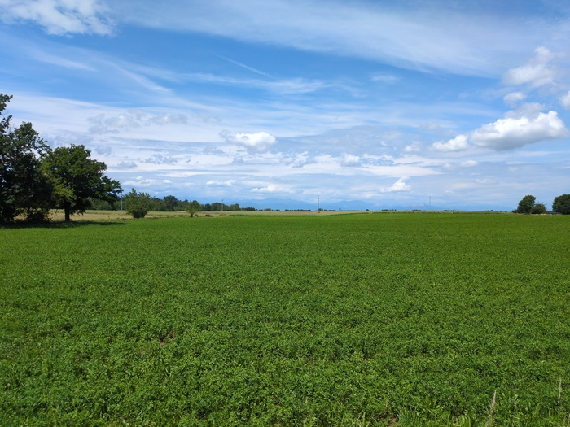
_El Montanos_

Today was, for the larger part, quite boring. Roads, roads and more roads.
Fields upon fields with the occasional village thrown in.

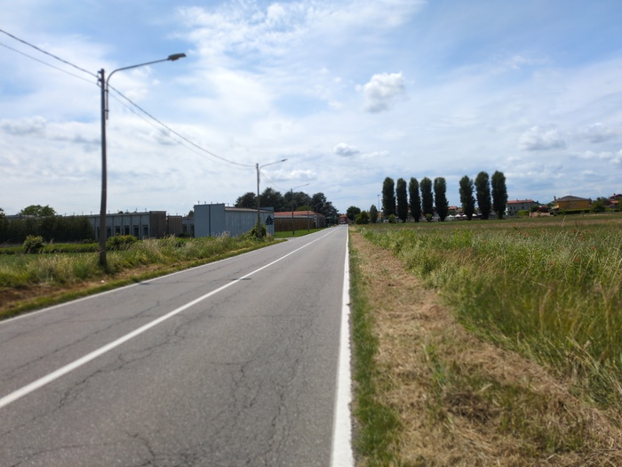
_Standard Road_

Lunch was also unimpressive. I found a supermarket and purchased a baguette
then had to use OpenStreetMap to find a bench. The bench I found wasn't that
convenient and there were, it turns out, a significant number of flying bugs
due to the plants surrouding the bench.

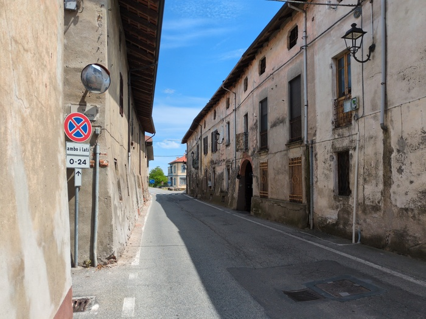
_Standard Village_

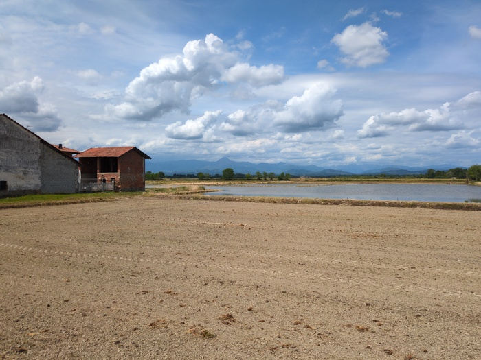
_Irrigated Field and Standard Mountains_

The previous night I had purchased 3 beers, I only drank two and the other was
a 33cl can that I put in my bag and that was a "oh no all my stuff is covered
in beer" risk. So I drank that and ate my sandwich with the cheese from
yesterday and was on my way.

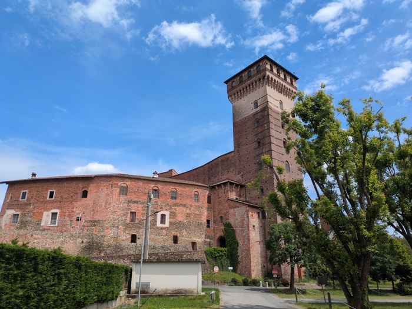
_Churchio_

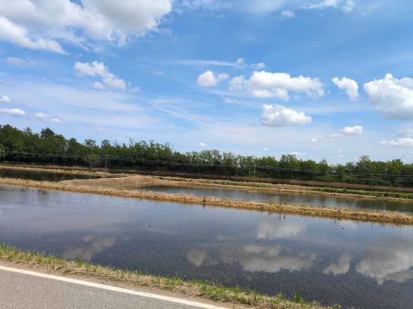
_Flooded Fields (not sure how this works)_

Eventually the mountains I was headed for came into view in the distance,
although they were obscured by the pregnant grey clouds. It was due to rain
and as I rode forward there was a strong breeze and a musty, wet, smell.

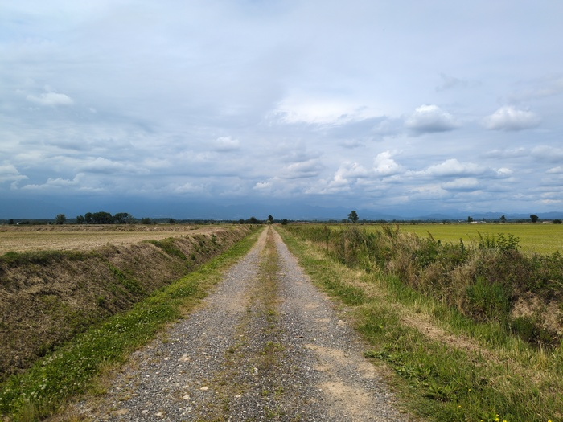
_Trail_

There would be one 250m climb today before a 250m descent. I was feeling
pretty exhausted after 70 miles and wasn't very enthusiastic about climbing
250m or getting wet. The climb was fine however and the rain was very light.

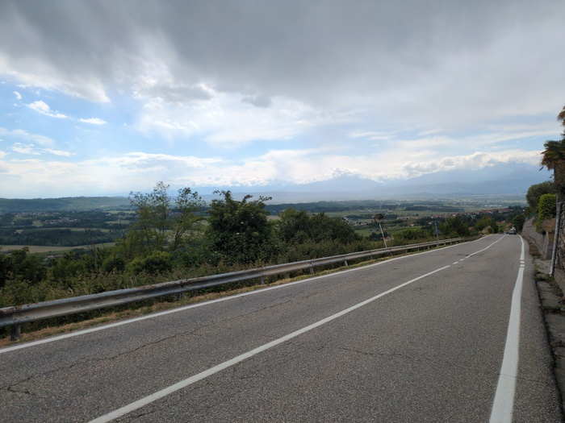
_The otherside_

On the way down there was suddenly a queue of maybe 10 cars but something
looked wrong. At the head of them was a car that was sideways to the road.
There was an accident. I made my way down - it had happened probably within
the last 10 minutes and there were lots of people standing about and assessing
the situation. I carefully cycled past - there was nothing I could contribute - 
looking back the sideways cars front wheel was crushed and the axel had
probably broken and looking ahead a works vehicle that had evidently colided
with it. I don't think anybody was hurt but an ambulance passed me minutes
later after I had left the scene.

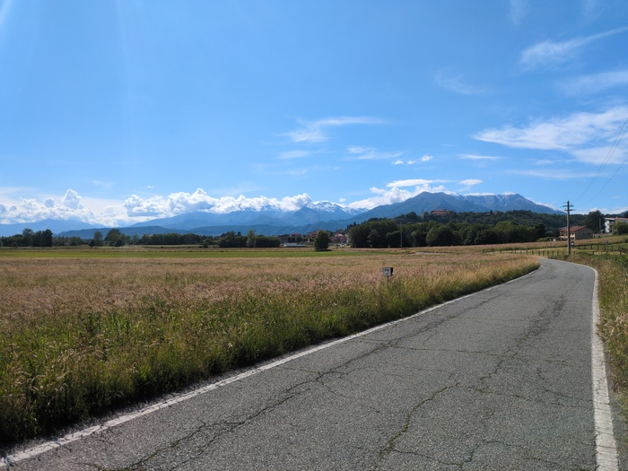.
_Might be some hills coming up_

Aosta is about 40 miles away now. I'm not sure what I'll do tomorrow besides
go in that direction. The weather looks good.

