--- 
title: "Susa"
categories: [verona2026]
tour: [ verona26 ]
distance: 131.92
time: 7h6m
gpx: /gpx/verona26/susa.gpx
bundle_image: ./202605181931-turin.jpg
date: 2026-05-19
---

My stomach is churning. I'm sitting in a lonely bar that is the only place to
eat in the village. The bar is 100m above my accomodation and my accomodation
is 200m above the town that, when I saw this was 2.7km from the center, I
thought I could walk to for dinner and to resupply at a supermarket. I'm
perhaps past the point of no return as I've already started climbing a mountain
pass. Fortunately the accomodation provides breakfast and luckily I have at
least got some cheese and an apple which should tide me over for a climb or
two. I'm heading towards the Col de Mont Genèvre (there may be other options,
but I feel I'm comitted at this point). It's the "easiest" of the passes but
most importantly it's the one that's open. There seems to be more snow in this
part, the Penser Joch pass was around 2000m and hardly any snow, but from what
I can gather there is significant snow at that altitude and on May 22nd
multiople roads are "opened" by way of driving huge snow blowing machines over
the pass to clear the way. The weather is good and today has been a good day.

> I've just finished a Bruschetta. It's not quite a pizza but something like a
> margehritta on toast. I also have a wonderful medium glass of strong 7% beer
> and it tastes like heaven. I'm going to see if I can get one to take away.

This morning I woke and my watch informed me that I had only 2.5 hours sleep.
I don't trust my watch because it certainly felt like I had far more.
Breakfast was "included" in the appartment. It consisted of 2 sachets of jam
and a number of "dried bread buscuits" with the nutritional value of clay. It
did have a Nespresso machine and I figured how how to use it and ate some of
my chocolate left the €2 tourist tax, locked up, put the key in the key box
and cycled off in the sun.

The course would be majority gravel today and almost entirely flat (until the
course ended and I had to climb to my accomodation). It was pleasant and I was
riding alongside the [Naviglio di
Ivrea](https://it.wikipedia.org/wiki/Naviglio_di_Ivrea). When I looked down at
my cycle computer and phone they were covered the fine gravel dust kicked up
by my tires (or perhaps just in the air). There were buzzing bees.

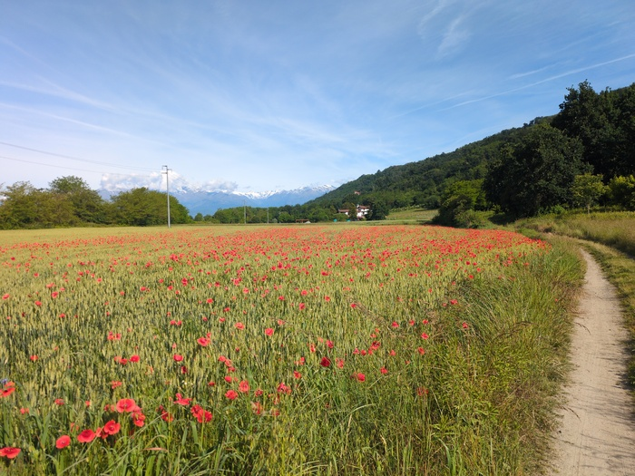
_Poppies_

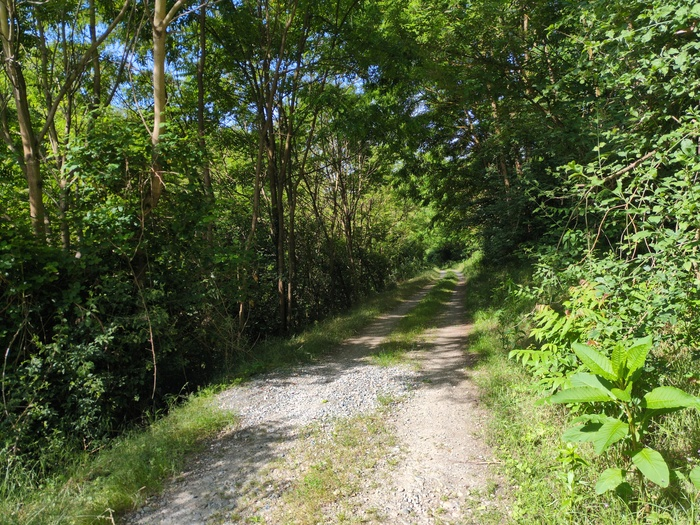
_Gravel_

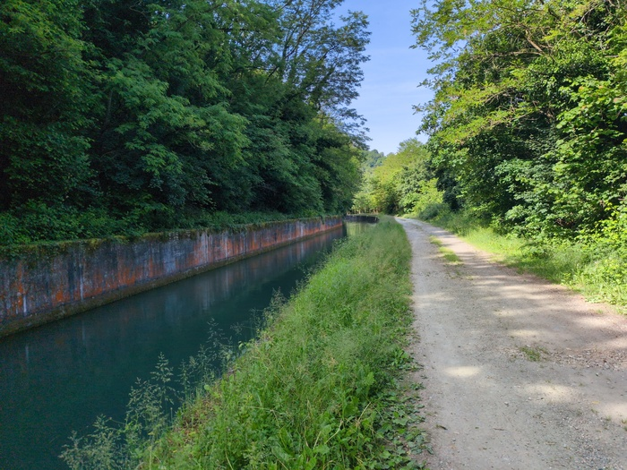
_Naviglio di Ivrea_

Soon I entered the town of [Chivasso](https://en.wikipedia.org/wiki/Chivasso)
and I was able to visit a supermarket and purchase some bread and sweets and a
can of drink and an apple. I was also on the look-out for an EU to Italian
plug adapter - although it was my last night in Italy I would struggle to
write this blog post with 19% battery on the laptop.

At Chivasso I joined the longest river in Italy - the river
[Po](https://en.wikipedia.org/wiki/Po_(river)). Which would lead me into
Turin.

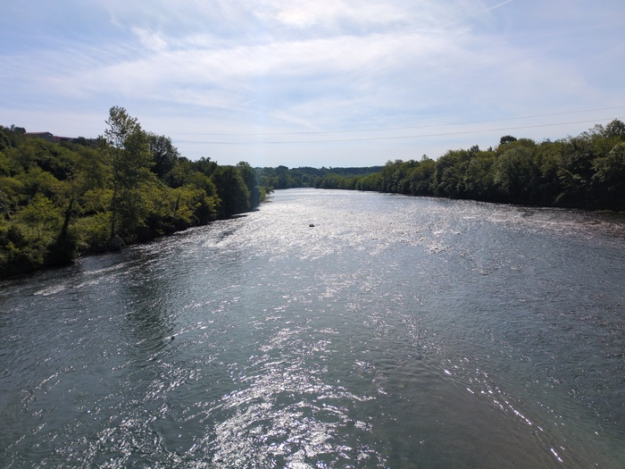
_River Po_

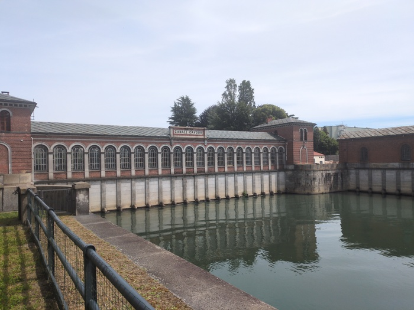
_Hydro Electric?_

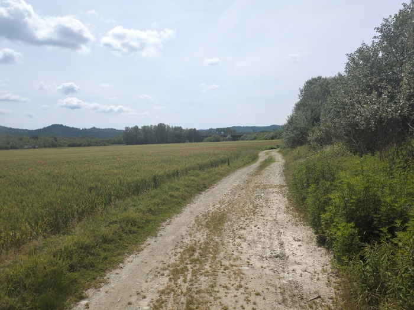
_Great Gravel_

Turin (Torino) looked impressive as I approached it.

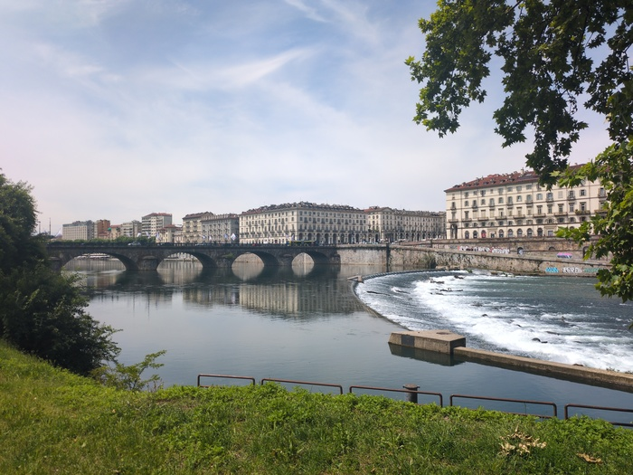
_Hello Turin_

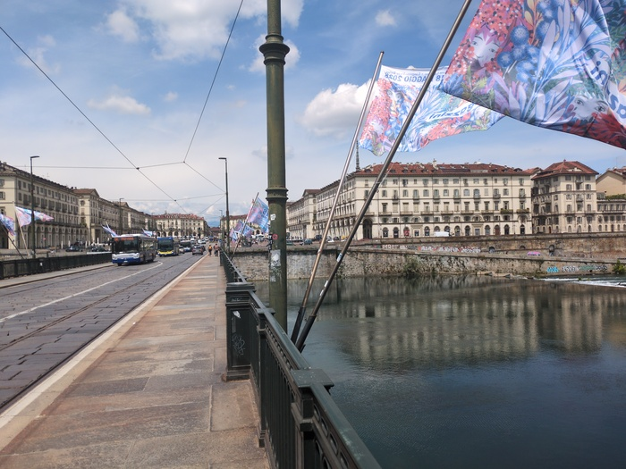
_Flags_

I decided to deviate from the course and explore a little. Crossing the bridge
a girl smiled at my smile and our eyes met and I cycled onto the [Piazza
Vittorio
Venito](https://it.wikipedia.org/wiki/Piazza_Vittorio_Veneto_(Torino)) and
made my way up the street and had a coffee and a cake.

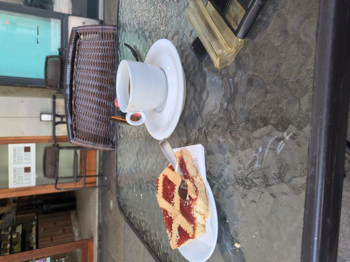
_Coffee and cake_

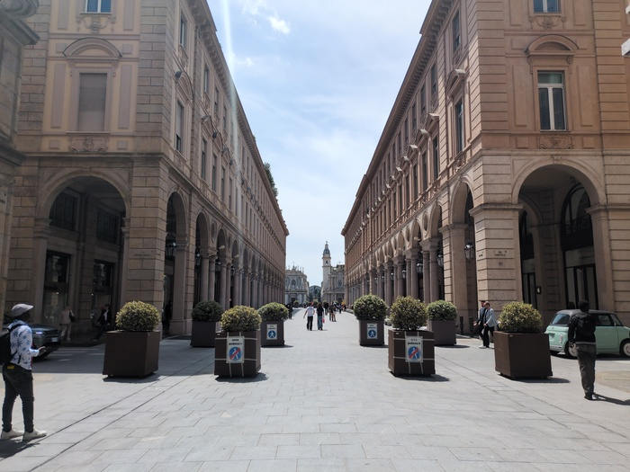
_Via Roma_

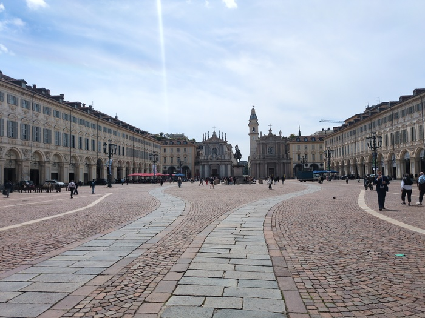
_Via Roma Againa_

I don't consider myself to be "on holiday" as such. Just inconventiently
distanceed from the laptop that I can use to do practical work. I try and keep
myself in the loop (and I bill the bare minimum for that service). So when a
question was asked of me I pulled over onto the sidewalk in Turino and as we
ended the call "oh shit I've got a puncture".

After ending the call I pushed my bike to the nearest available bench and
started my stopwatch and inspected the outside of the tire - nothing
protruding (no nails, thorns, glass etc). I managed to get the tire off in a
few minutes with the _three_ tire levers I brought with me for this
eventuality. I removed the inner tube and pumped it up and past it over my
lip - I couldn't find any air egress although it was deflating. The wind was
blowing which probably didn't help. I decided to use my spare and I checked
the inside of the tire for any intruding spiky things, put the inner tube in,
clamped the tire back on and pumped it up and the whole operation took 23
minutes.

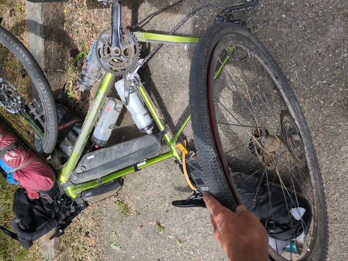
_Something is wrong_

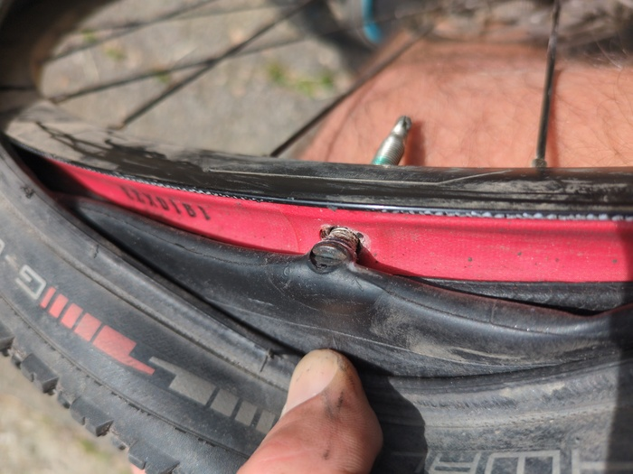
_But it wasn't this_

Turin is a massive city and it took time to exit it. When I did I found myself
by what I can describe as a "clay" river. The water was gray and the banks of
the river seemed to be clay.

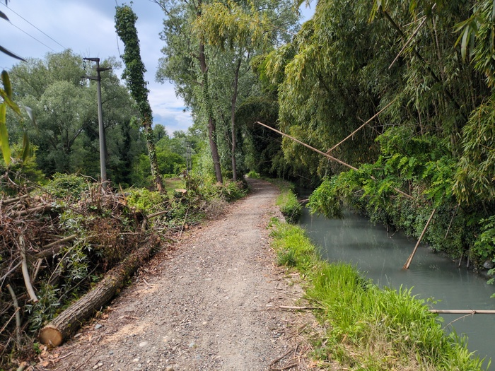
_Bamboo_

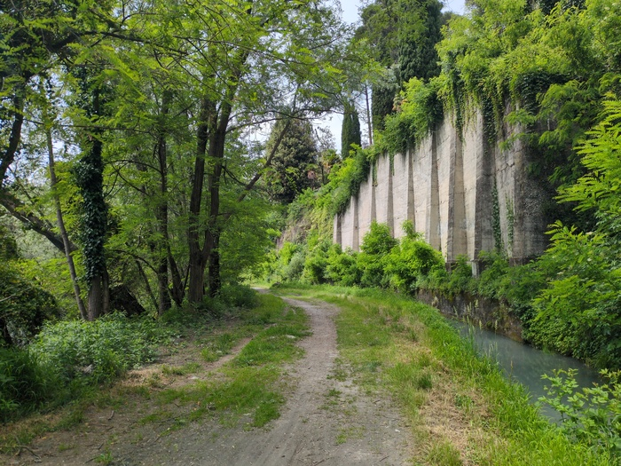
_Back to the future_

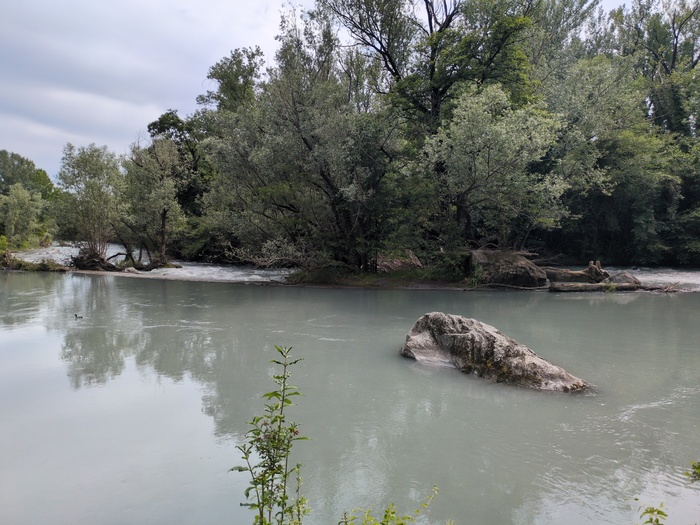
_Clay land_

After Turino I headed West towards Susa. There was more gravel and it was good
fun.

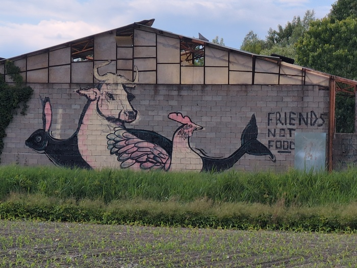
_Friends not food_

The course eventualy dropped me on the busy road that wasn't the motorway.
"Susa 28km" the road-sign said. It wasn't much fun and I didn't have much
energy for being continuously vigilant to the lorries passing me at speed
(although there were plenty of other cyclists on this road).

The route was merciful however and directed me to a wonderful cycle path. I
stopped to swig some water and eat some sweeets and three cyclists apporached
me from the ahead path "Ciao!" the first one said to which I replied "Ciao!"
"Hi" I said to the second one who replied "Bonjour", "Hello" said the third to
whom I replied "Salut!"

The valley seemed to be guarded by a castle on the top of a mountain. It
wasn't a castle however but the [Sacra di San Michele](https://en.wikipedia.org/wiki/Sacra_di_San_Michele).

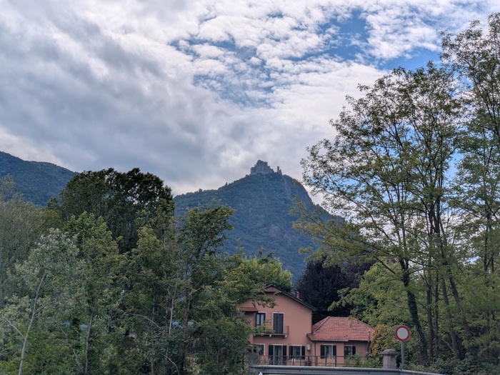
_Sacra di San Michele_

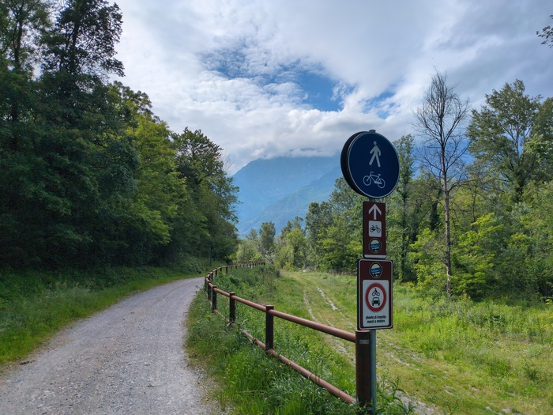
_Cyclin' on the path_

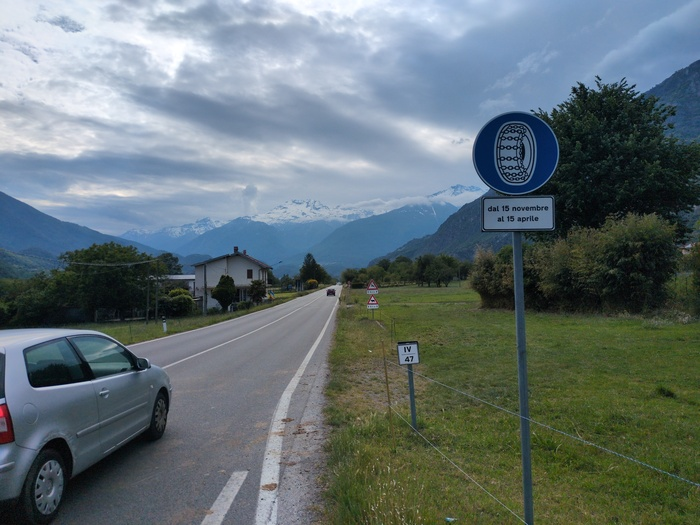
_Look Ma! Snow_

I made it to [Susa](https://en.wikipedia.org/wiki/Susa,_Piedmont). My
accomodation was 2 kilometers away. Walkable. Cycleable. I didn't realise it
was 200m vertical with some 13% gradients. I heaved and sweated my way to the
bed-and-breakfast finally rinding the door-bell.

"I'm hungry" I didn't say but I meant it. I parked my bike in the garage had a
shower "there is a bar... up there, beyond the church" she said. It was a fair
walk "it closes in an hour". There was nowhere else unless I were to descend
back to the town and I wasn't going to do that.

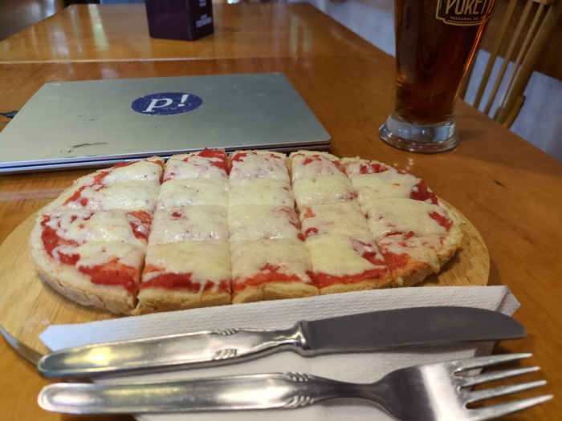
_Bruschette - Not Enougha 🤌_

As previously mentioned everything was fine and as I walked back I realised
how peaceful it was here. Being surrounded by the massiveness of the bare
and snow-capped mountains with only the occasional bird song for noise.

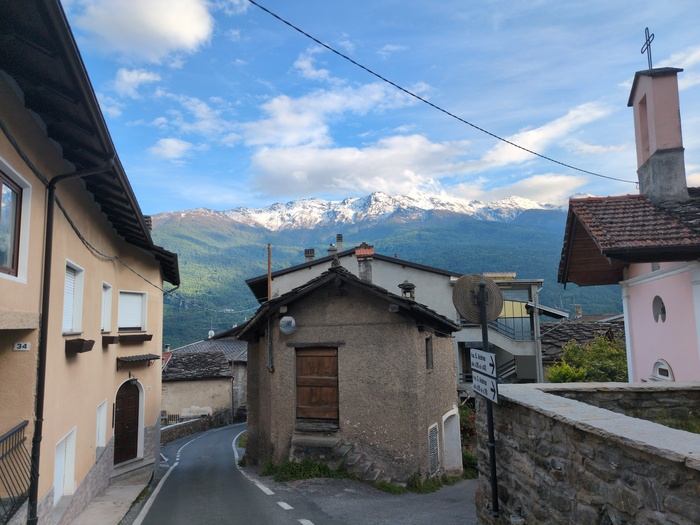
_Back from the bar_

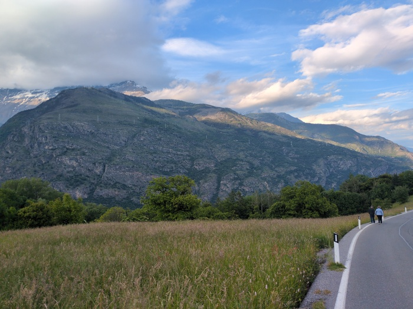
_Couple walking down the road_

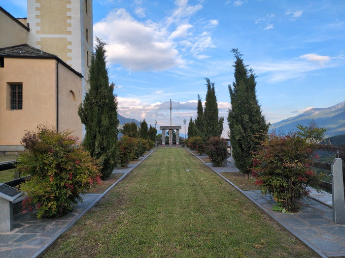
_Monument to dead soldiers at the church_

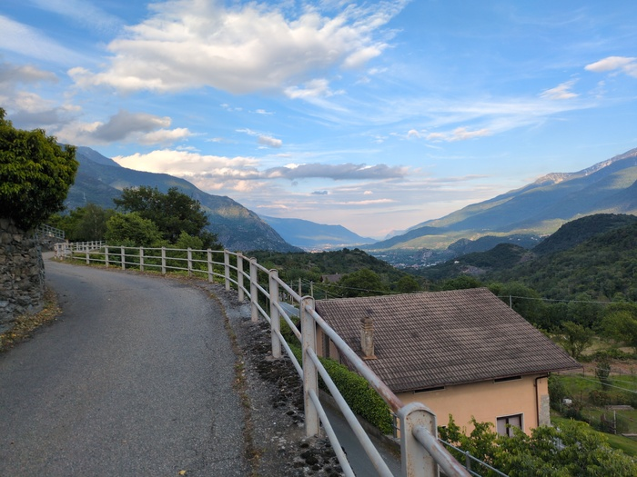
_Peaceful_

Tomorrow I'll be in France, somehow. I'm still hungry.
