--- 
title: "Grenoble"
categories: [verona2026]
tour: [ verona26 ]
distance: 196.23
time: 9h34m
gpx: /gpx/verona26/grenoble.gpx
bundle_image: ./202605191841-coldelau.jpg
date: 2026-05-19
---

Today has been both extremely long and extremely "hilly".  I'm sitting in the
Auberge de Jeunesse in Grenoble. It's the second time I've been here. The
first time was in 2010 and that was the first ever time I'd stayed in a
hostel. So here I am 16 years later. It hasn't changed. I have a beer and a
pizza which the kind English lady at the reception supplied for me "put your
bike in the bike locker and don't leave it unattended. Last time somebody did
that it was stolen!". I'm in a crowded 8 bed dormitory.

My decision to cycle 110 miles today was triggered by not being able to find
affordable accomodation on the route. There was affordable accomodation in
Briancon but Briancon was only 50ish miles away and I saw there was an Auberge
de Jeunesse in Grenoble for £25 and it only required me to cycle two cols: Col
de Mont Genevre and Col de Lauteret. It would be a hard effort but I had until
10PM to check-in to the hostel.

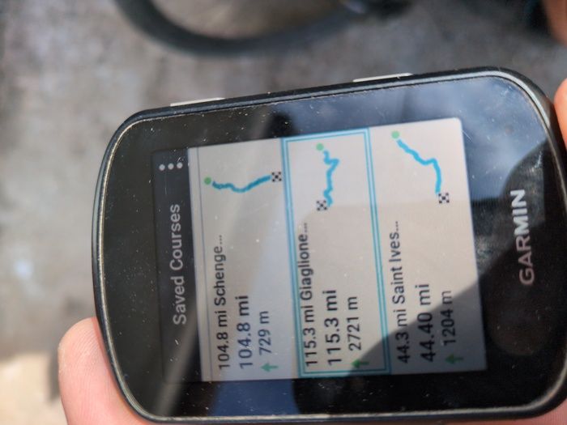
_Ok_

I had to ride back to Susa and from there I travelled along the Susa valley
before turning off towards Bardonecchia. The weather was pleasant and I had
aquired one of my favourite albims "The Wall" by Pink Floyd and I was singing
along with it (as you do) while climbing past the various "Free Gaza" and
"Free Palestine" graffiti 

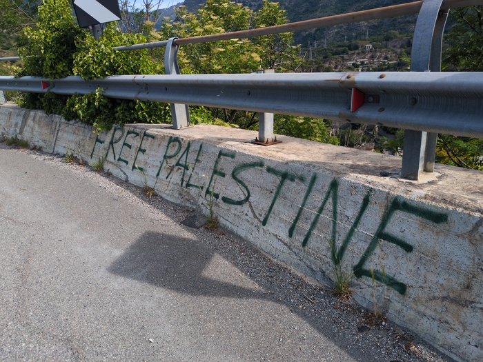
_Free Palestine_

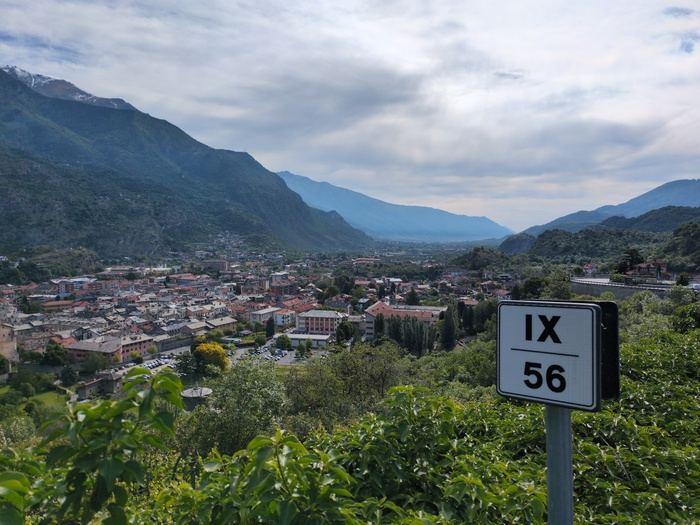
_Looking Back_

On the way I passed the [Forte di
Exilles](https://en.wikipedia.org/wiki/Fort_of_Exilles) which looked
formidable and a wonder that such a thing could be built in such a place. It been first
described in the 1300s and is one of a number of similar foritifcations.

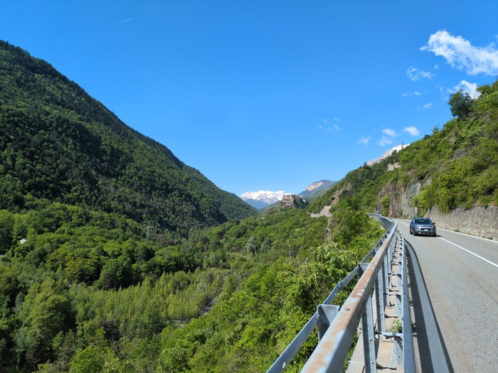
_Approaching Di Forte_

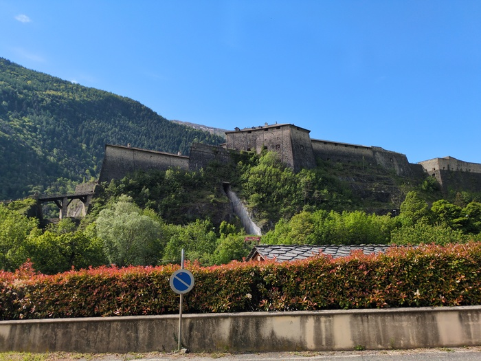
_Di Forte_

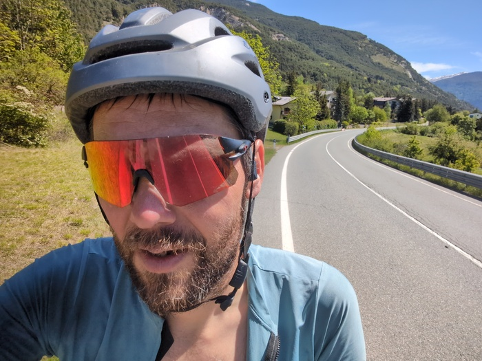
_Di Mia_

I was happily cycling along and it had alread been almost 3 hours and I was
hungry. The host at the Bed and Breakfast had provided a very good breakfast
for the guests and went so far as to engage in polite conversation. She didn't
speak English very well but she tried and was good natured and it was a good
accomodation and I left with a full stomach and a cheese sandwich. It wasn't a
good cheese sandwich.

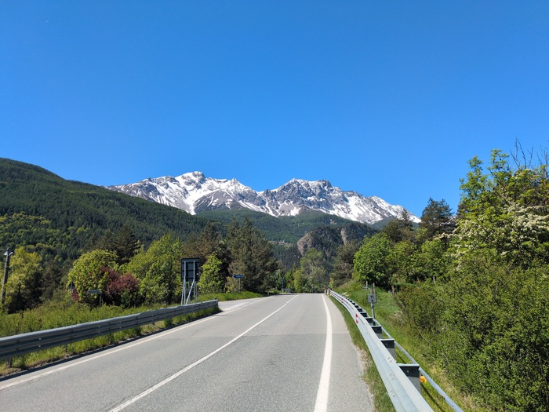
_Climbing up and up and up_

I arrived at Bardonecchia and the village was alive enough and there was a
supermarket and I found a pizza and a cola and, thank the gods, some sweets
without gelatine. This made me happy. It was already lunchtime so I sat down
and monged my pizza slice and consumed my cola on a bench and found a water
fountain (they are everywhere) to fill my water bottle and **I continued to
climb**.

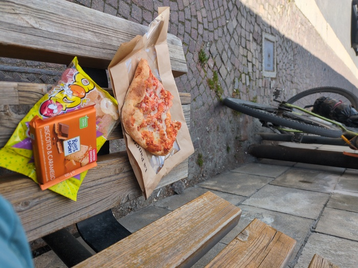
_Snack Time_

I continued to climb but I noticed that there was less traffic, and also no
signs of any upcoming cols. It felt strange. I checked my map - I was
expecting to find "Col de Mont Genevre" but I found **Col de Mauvais Pas**.
This was not the col I was looking for. But would it do?

Searched the internet did I to no avail. The "AI" result said it was closed
but provided some vague reason and none of the references backed it up. I
passed a couple that were pulling onto the road with bicycles and nodded at
them. I then turned back "Do you speak English?" they looked relieved. They
_did_ speak English and they were from the Netherlands. They informed me that
the col was closed, or at least cars couldn't pass it and a motorbike turned
back, apparently. "Oh dear" I said. I was realising that the past (one or
two?) hours had been in vein - the extent of which I confirmed to be half of
my ride so far. Much pointless ascending. "It is a long way to go back" the
Netherlandese informed me. "It was" I smiled.

> The Col du "Mauvais Pas" translates to "Wrong Step". Which was appropriate.
> Never trust Stava routing (although part of me wonders in retrospect if it
> would have been passable).

Going back didn't feel bad. It would add to the mileage but I still had time - or did I?
It took 26 minutes to _descend at speed_ to the point where I could continue
to Col de Mont Genevre and by that time it was already past 1PM. I then had
100 miles/160k to go and 9 hours to get there. Most of the rest of the day
would be spent in trying to figure out if I would miss the hostel check-in.

There would be no time to stop and stare. But I did stop and take photographs.

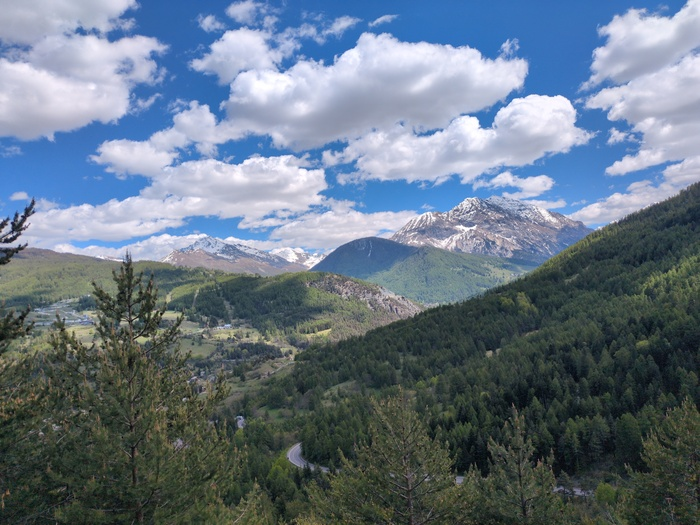
_Looking back down_

I was on the _bonne route_ and climbing. I had used my Pink Floyd bonus on the
first ascent. I tried to listen to it again but it didn't have the same
cathartic effect and my OpenShockBoneConductingHeadphones were running out of
battery.

There were lots of tunnels. I was riding mindlessly when I saw a sign with a
red circle and in the circle was a bicycle. I wondered "does that mean
**beware** of bicycles or that **bicycles are prohibited**. Then I saw a
1km tunnel _probably it means no cycles in the tunnel_. Conveniently the course
didn't go through the tunnel but by a side-road that said "authorized vehicles
only". I guess Strava authorized me.

It took me through some spooky, crumbling, abandonned tunnels. It reminded me
of Lord of the Rings when Gandalf had to take the adventurers through the
Dwarven mines.
_
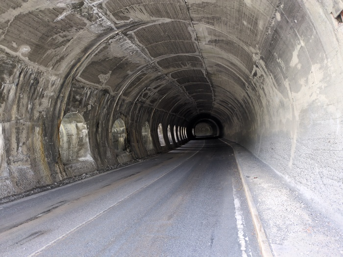
_Old tunnel_

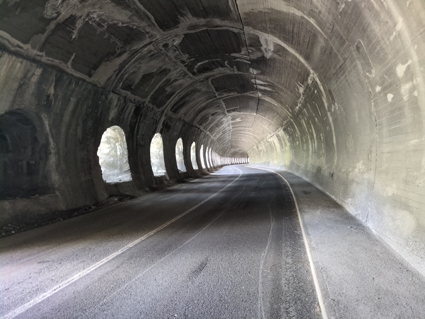
_Nothing here but ghosts_

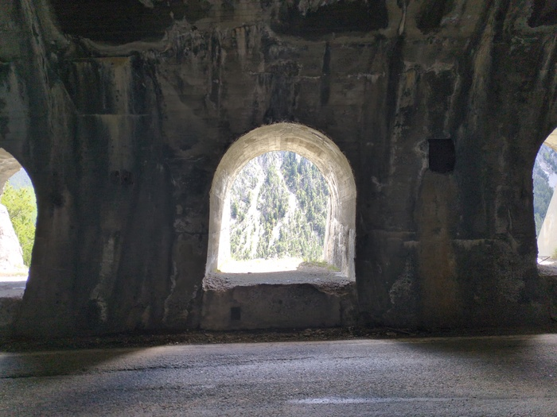
_Where are they?_

I heard a sonorous voice reverberating, coming towards me. It didn't sound
like a ghost and it was another cyclist clearly testing his voice against the
reverberation of the tunnel "Ciao!" he said (he didn't sing after that). I
tested my voice "Whooo!".

The road featured some holes in the mountainside "🏡100m this way" it said,
implying that you'd go into the cave for 100m to find refuge. I wondered if it
was a trap. Some of them seemed to be more directly accessible.

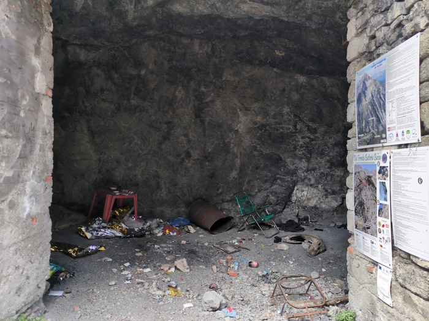
_I guess you could survive here_

The day was already long when I entered France and finally made it to the
first pass. Montgenvre is a ski resort at 1800m and aside from some builders
doing building things there was no commerce and nowhere to buy food - but it
wouldn't matter because I was descending directly to Briancon.

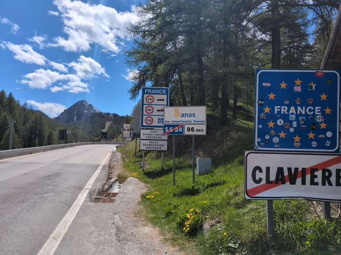
_France_

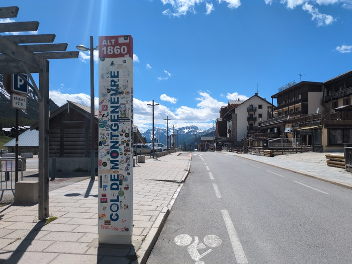
_Col de Mont Genvre_

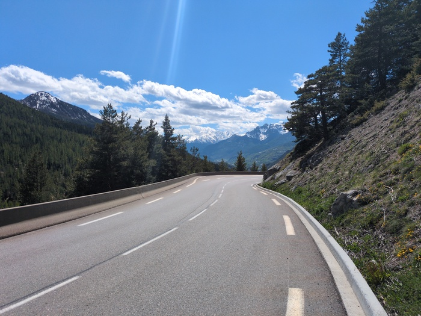
_Let's go down to Briancon..._

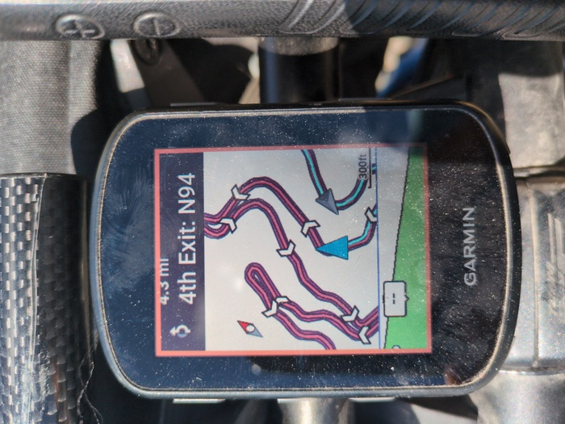
_Where the roads are like Spaghetti_

It was now 16:00 and I had about 110k to go. An entire, acceptable, days ride
at around the time I'd normally finish. I should've left the accomodation
earlier. I did my calculations and with another 1500m or so of ascent it was
possible but the margin was _thin_. If I had a puncture, or stopped too long
I'd miss the check-in.

What was sure was that I would need some calories. I stopped at the first
bakery in France there were two sandwiches "Est-ce que vous avez une sandwich
vegiterienne?" "Oui" she said and said what it was and I didn't understand
"c'est quoi?" "goats cheese and honey" she said in English without joy. But it was a
sizeable sandwich and I was very happy to eat it.

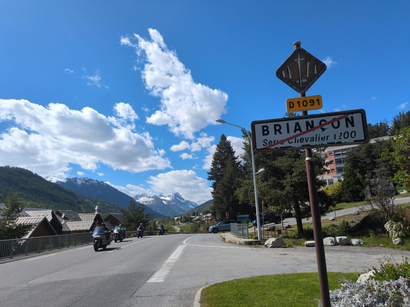
_Exiting Briancon, no time to visit_

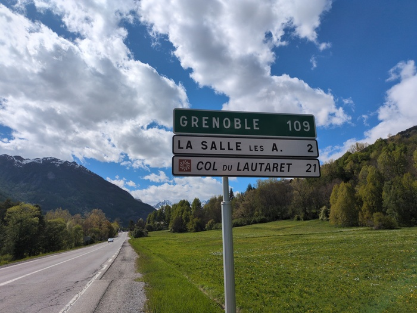
_Just 109k to go!_

I was now facing the second col.  The [Col de
Lauteret](https://en.wikipedia.org/wiki/Col_du_Lautaret) which would build on
the progress already made that wasn't already lost and raise it to 2000m.

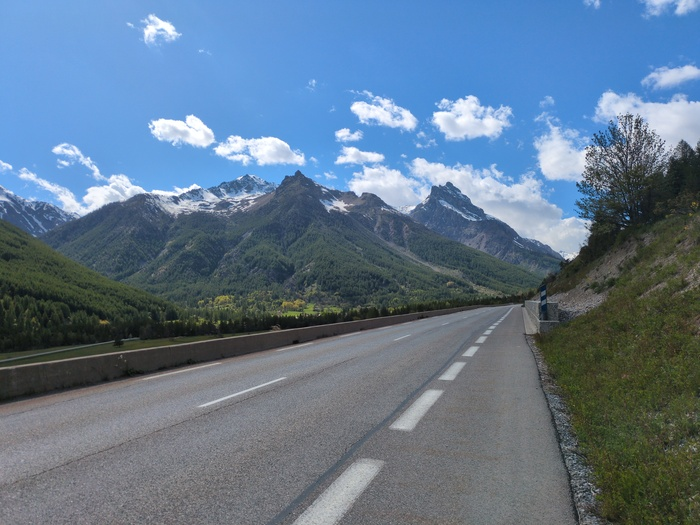
_Riding up_

At this point I started to struggle and I recited the poem "[The Love Song of J. Alfred
Prufrock](https://www.poetryfoundation.org/poetrymagazine/poems/44212/the-love-song-of-j-alfred-prufrock)".
It's one of three poems I can remember as anybody that has read my previous
tours might know. I somewhat expanded my repotoire by reciting the monologue
intro to
"Wasted Youth" by Meat Loaf.

> I REMEMBER EVERYTHING.
> I remember everything little thing as if it happened only yesterday.
> I was barely 17 and I was killed a boy with a fender guitar.
> ... 
> The guitar bled for about a week afterwards
> The blood was zoot, dark and rich, like wild berries.
> The blood of the guitar was CHUCK. BERRY. RED!
> ...

Also playing the part of the scottish school teacher in the introudction to
Pink Floyds "We don't need no education":

> If you don't eat your meat, how can you have any pudding?
> Hooow can you have any pudding if you don't eat your meat?

It helps to pass the time.

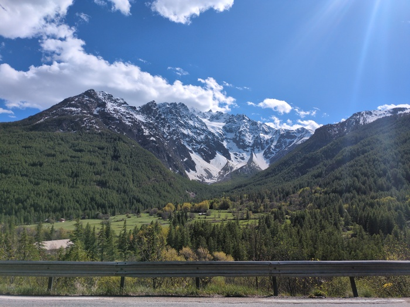
_Mountains there be_

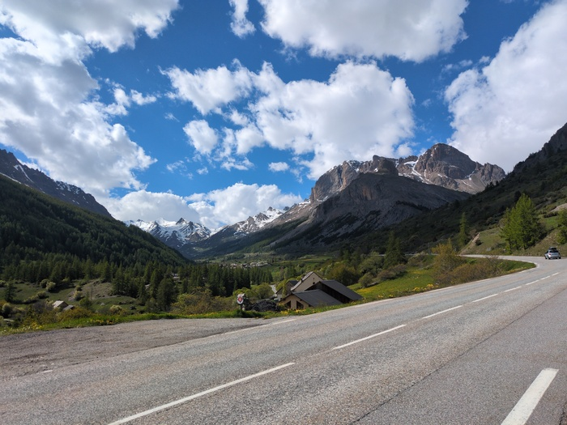
_Heading way over there_

I was climbing to the peak. It didn't seem as impressive as the Penser Joch
pass but it's subjective.

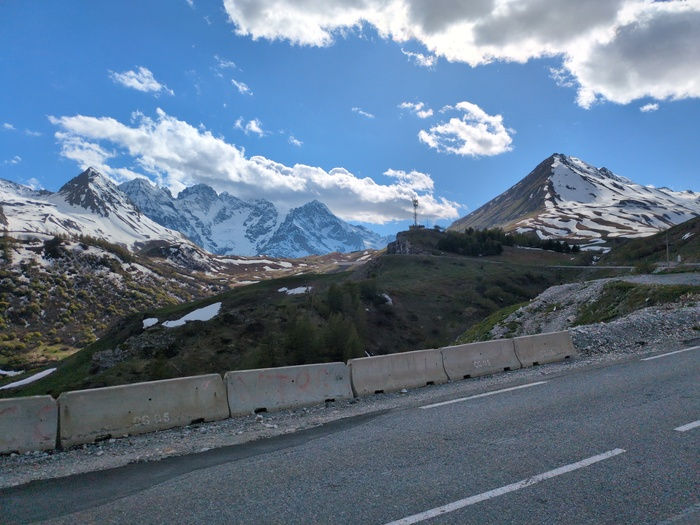
_Heading over there_

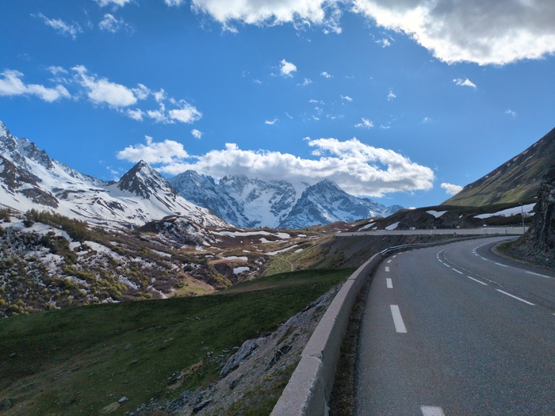
_Still heading over there_

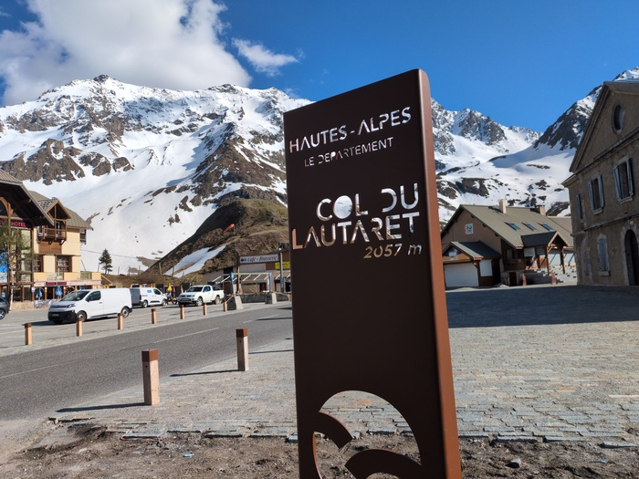
_We're there, not much here_

I stopped. I had wanted to make the col at 18:00 and have 4 hours to ride the
remaining 80k. It was 17:50 and I had ten minutes to [stop and
stare](https://www.yourdailypoem.com/listpoem.jsp?poem_id=100) - but mainly to
eat my apple and drink some water.

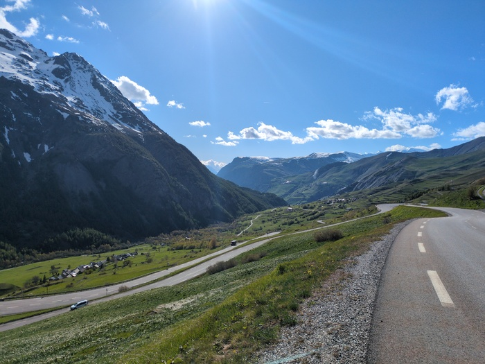
_Descending_

The descent felt fantastic. I dropped on the handlebars queued up Led Zepplin's
"Whole Lotta Love" _der da der da da da. dadada dadadada_ and screached down the mountainside at 30mph. I'd do that
all day.

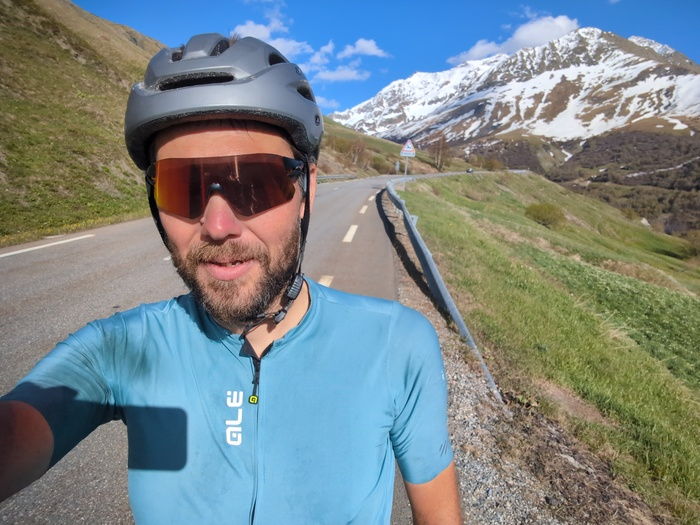
_Accidental selfie with my greesy shit_

The good part is that I'd largely continue to do it all day, but "Whole Lotta
Love" only lasts 5 minutes.

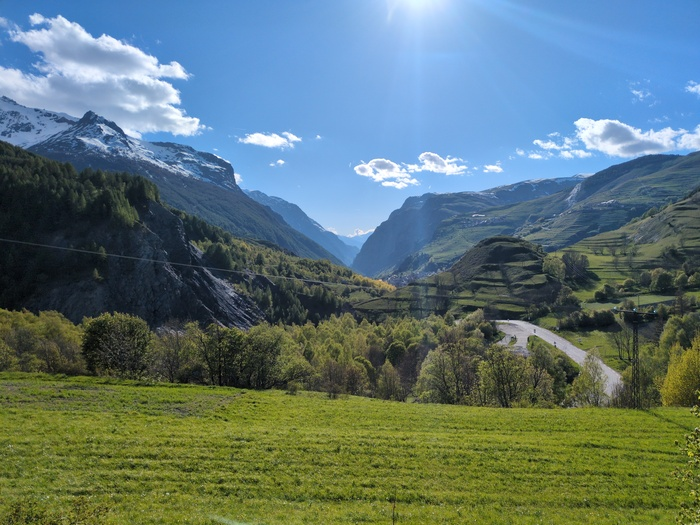
_Into the valley we go_

I passed the [Lac du Chambon](https://en.wikipedia.org/wiki/Lac_du_Chambon).

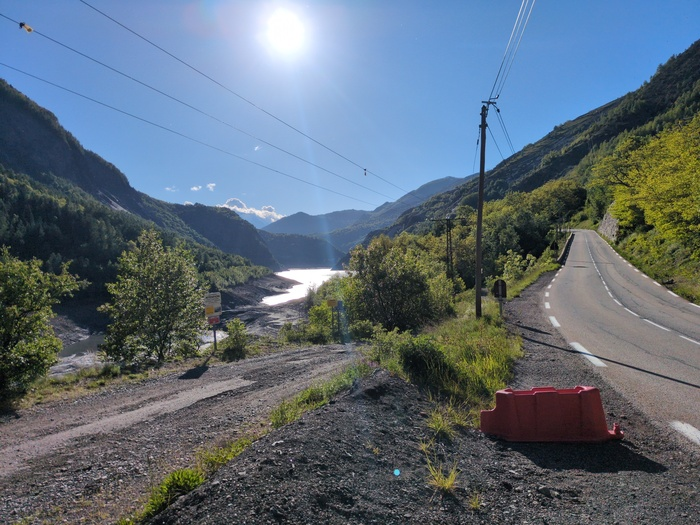
_Lac du Chambon_

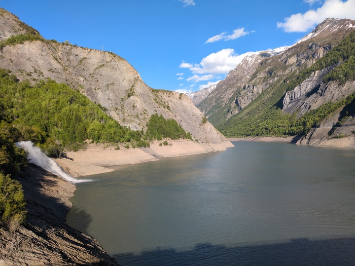
_With gushing_

I kept going downhill. My phone had given a 20% battery charge warning and I
switched from playing music from my phone to playing music from my watch and
with it I switched to the aggressive sounds of "Lamb of God" to help maintain
my pace. I was growing increasingly confident that I'd make it, but it was
still going to be within 30m.

Ugly thoughts in my head: "oh wow look how far I'll ride today,
aren't I good" - that perculiar satisfaction of making an larger than normal effort.

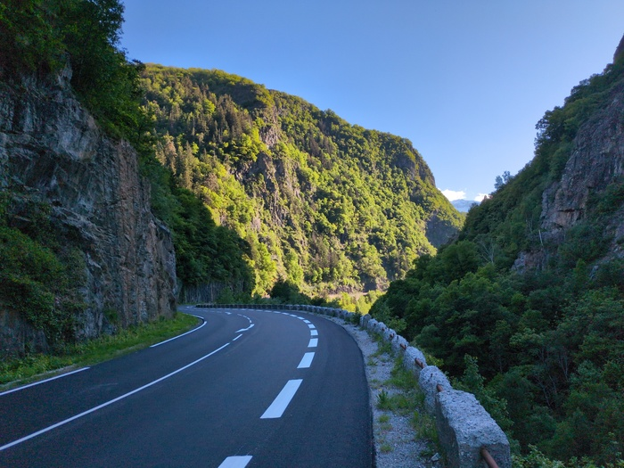
_Down down down_

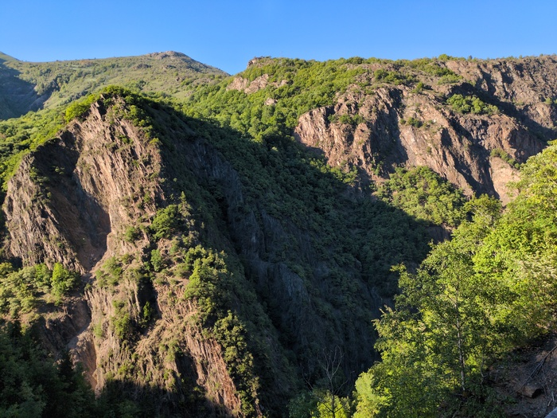
_Mountain sides_

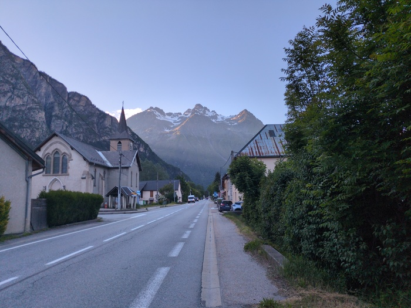
_Civilization_

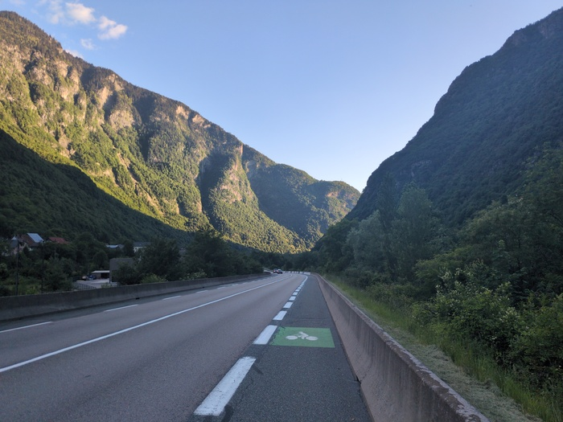
_Cycle paths!_

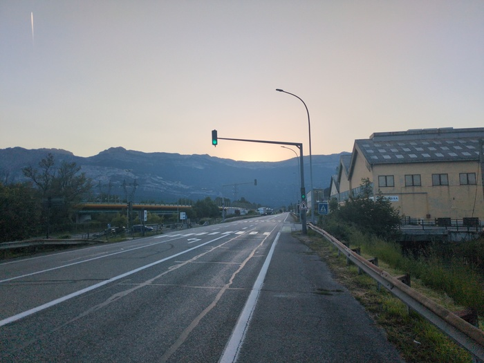
_Approaching Grenoble_

The closer I got to Grenoble the more comfortable my margin was. The hostel
was actually a few miles outside of Grenoble and I arrived with an hour to
spare.

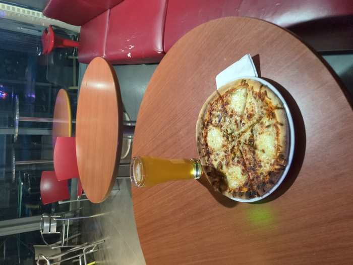
_Pizza_

It's now 23:11 and I have half a beer left. Tomorrow is another day. I was 4k
short of 200k.
