--- 
title: "Lyon"
categories: [verona2026]
tour: [ verona26 ]
distance: 130
time: 7h
gpx: /gpx/verona26/lyon.gpx
bundle_image: ./202605202044-sheep.jpg
date: 2026-05-21
---

Sitting in a bar in Lyon there is rock music playing and it's busy. All the
outside seating is taken. Both the staff I have spoken to switched to English.
My hands a burning due to heat exposure today. I have a Choufre beer and am
ordering a pizza which is appropriate as this is almost certainly my last
cycling day.

I didn't sleep great last night in the dormitory. It wasn't uncomfortable, the
8 people I was sharing with weren't noisy but every few hours I'd wake up
impatientally to see if it was breakfast time yet... 3am (no), 4am (no), 6am
(not quite). Maybe I was just hungry after the 195k the day before.

There were lots of school kids in the hostel but the breakfast hall consisted
only of the "individuals" such as myself but a bunch of the kids were waiting to
fill their water bottles at the water fountain. The included breakfast was
good, there were boiled eggs, cheese, apple tarts, yoghuts, cereals, good
bread, honey, juice, etc. 

The previous evening I had checked the distance to Lyon - it was 85 miles of
mostly unchallenging terrain, a relatively easy day. I felt OK - I could still
climb stairs regardless of the horizontal and vertical distance achieved the
previous day. Possibly I was tired. I threw my cheese sandwich in the bin
alongside with some sweets that I didn't like. My bottom-bunk partner seemed
to be a climber and he had a huge _ball_ of luggage on a skateboard that
included a crash helmet and various other climbing implements.

Leaving the hostel onto following the Gravel course through some back-alleys
before finding the cycle path heading north-west that followed the bank of the
River Drac - named after a dragon that eats children by tempting them into the
water ... or something. It's a large river and a tributary to the River Isere
which it would shortly join on exiting Grenoble. The cycle path was fine and
it was hot and the path was mainly dirt with the shade of trees and the
side-view of exposed rock cliffs.

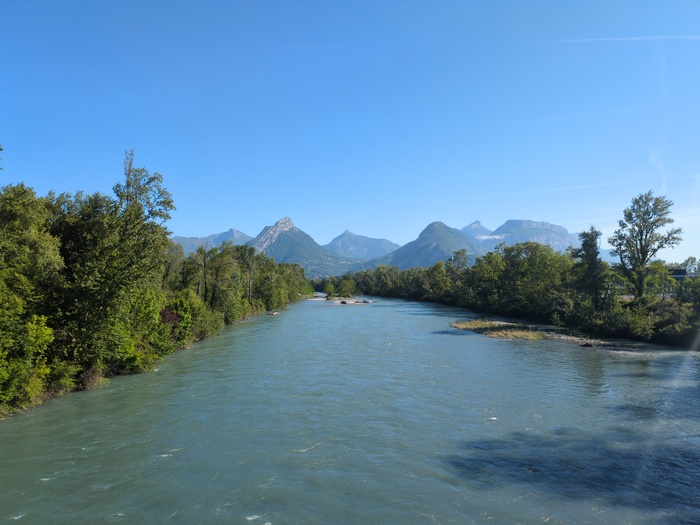
_Morning_

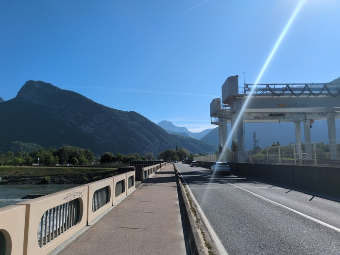
_Crossing the Spraying Bridge_

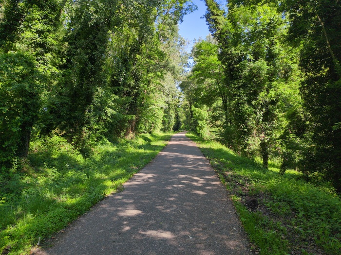
_And onto the cycle path_

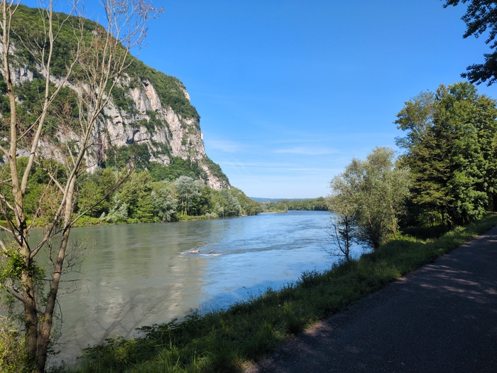
_River Drac_

I encountered a flock of sheep.

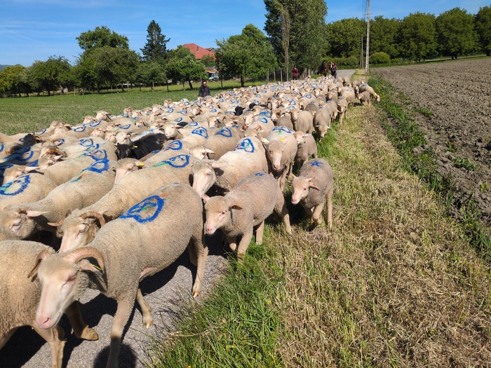
_Le Mouton_

The sentiment was that of leaving the fun behind. I was cycling on farm
tracks, avoiding tractors. The paths were flat (although occasionally
pot-holed) and then the course was 70% road so lots of cycling through
villages and small towns.

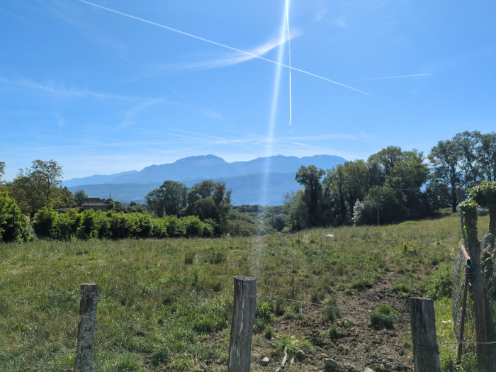
_Leaving the good stuff behind_

At lunchtime I found a bakery and purchased a goats cheese pizza slice which lasted
me the rest of the day. It was hot. It seemed hotter than it had been until
today. I had badly smothered myself in suncream earlier but it seems I missed
places. I wasn't trying to ride fast but I had the impression my legs were
still recovering from yesterday. On the old, 4-paniered, steel, touring bike
this would have been a big day, but it felt very easy if you discard the
discomfort from the heat and the impatience to arrive at my destination.

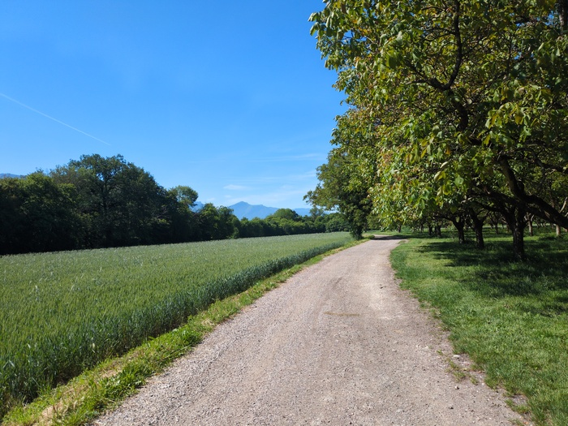
_Gravel_

I was listening to music but it passed through one ear and out of the other.
**Nothing was inspiring** -- which is less a comment on the scenery than what
the scenery had been. The bumpy gravel and rock-and-stone sections were
welcome as they provided my brain with some challenge - in the same way that
trail-running requires you to strategically (but somehow naturally) plan your
foot-plants in advance to avoid falling over.

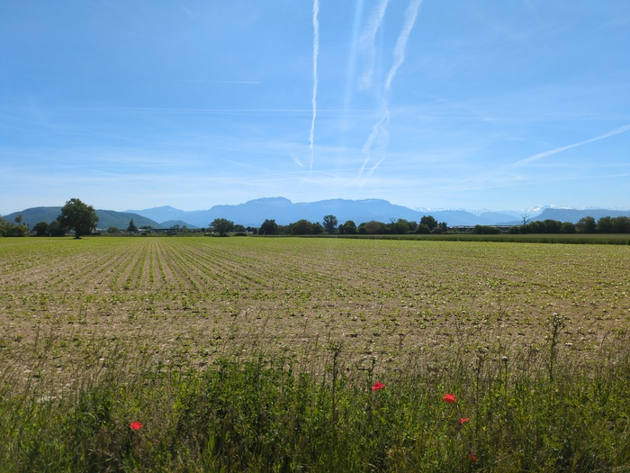
_Four Poppies_

At one point the rough farm-track led to a bridge. The little bridge was blocked off
and had both a sign with a red circle and person inside it and a legal notice
"the commune of XXX blah blah blah" two pages of A4 paper which I had no
intention of reading. It seemed that the commune had decided to prohibit
access to the 2 meter bridge that crossed the stream. I ignored the sign via.
the clearly trodden path around the sign. Was it in danger of collapse? If it
was the worst that could happen is you'd get wet, more likely you'd simply
make another step and be on the other side.

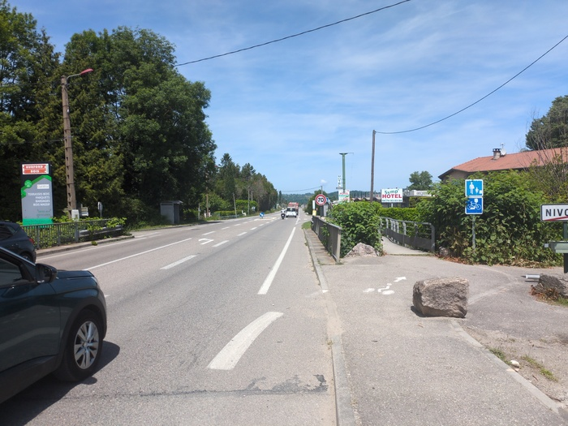
_The road_

My eyes were irritated. I ignored it at first. I had taken my sun glasses off
and planted my baseball cap on my head as a subsitute (I wasn't wearing the
helmet). Then my eyes started to be irritated. I rubbed my hands on them but
then I considered that perhaps it was the sun lotion that was irritating
them. There was something in the air and it was causing my eyes grief. They
were blood-shot. I decided to find a water fountain so I could rinse them and
also replenish my now depleted water bottles.

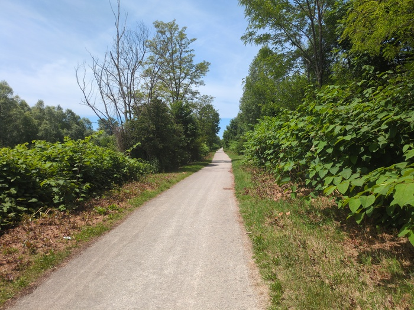
_More gravel_

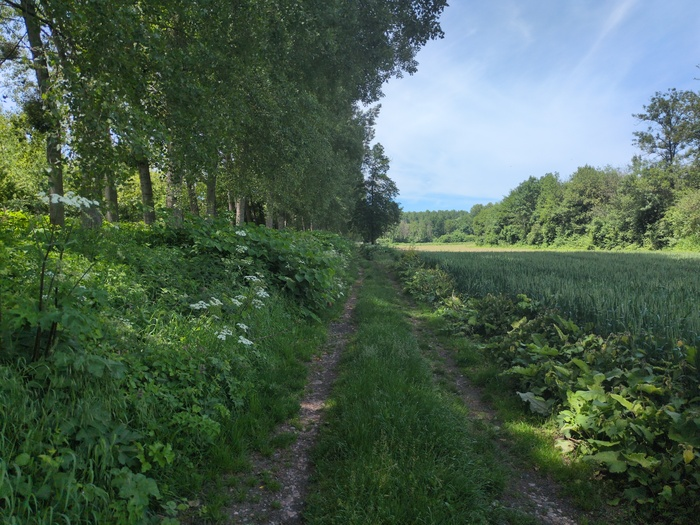
_Less Gravel_

The village I was in had a park. [OpenStreetMaps](https://www.openstreetmap.org/) indicated that there was
"drinking water" in it. Access was obstructed by a large fence and the
entrance had an elaborate mechanism that seemed designed to prevent bicycle
ingress. Leaving my bicycle outside of the park would be inconvenient so my
confused brain finally arrived at the solution of tilting it upwards and
wheeling it through the defences on the back wheel. I washed my hands and
rinsed my stinging eyes. It didn't seem to improve them much but at least I
had washed my hands and felt the rubbing them wouldn't cause them more
irritation.

> Today is the last day

The elevation profile rose gradually towards this point of the day, to 600ft
(whatever that is in meters) and then offered some downhill relief with a
lorry chasing up behind me, engines roaring and I acellerated on the hairpins
before letting it pass, with it and it's heavy, rattling, trailer, on the straight. 

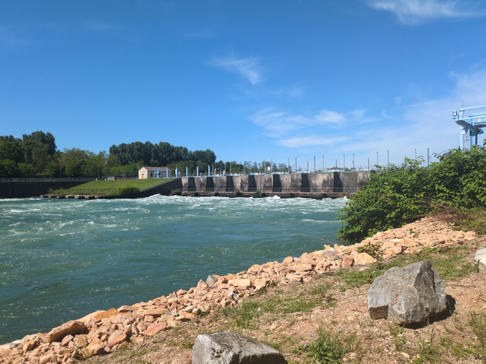
_Barrage de Jonnage_

I was bored. Now was flat and roads and gravel paths on a flat gradient and
the heat. Counting down the _miles_ 40 miles, 38, 37, .. 33. 33km is 20 miles.
33 miles is... not 33 kilometers but it gives some illogical comfort. I'd
normally switch to kilmeters in Europe, but I never got round to it this time.

> The trick is not to count the distance, the problem that almost every single
> screen on the cycle computer gives an impression of the passing of time and
> distance.

Towards Lyon I felt I was being rude. My perpetual smile was now plastered on
and people would say "bonjour" to me and I'd effectively ignore them. I was
just counting the miles to Lyon. The closer I got I experienced some
recognition. I once lived in Lyon for 6 months - staying in a youth hostel and
working. 

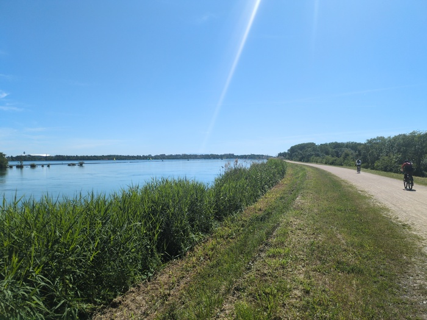
_Le Grande Large_

The wonderful thing about staying in a hostel for a long duration _is_ that
there is no privacy. To be on my own I'd walk slowly, very slowly (as slow as
possible), around Lyon in a meditative state. At the weekends I'd run long
distances which encompassed some of the paths I was now riding on. The hostel
also provided a community of "temporarily permanent" people, I was a tech
worker but there was a person trying to start a horse circus, a girl from
Finland that had become bored of travelling, and then the locals - a bus driver
(she was a lot of fun) and, I think, the sadest man I've ever met in my life,
and all the other interesting people, whether they stayed two nights or three
months. It was a greatest experience that I didn't sign up for - as all
adventures are. That hostel doesn't exist now.

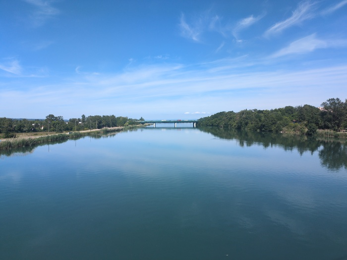
_Le Rhone (?)_

> I've just finished my second "large" glass of Choufre and should probablly
> think about leaving. I don't think I can drink another. Nor can I afford
> one.

The hostel is near the Croisse-Rouge distrinct. It is at ground-level but the
Croisse-Rouge rises precipitously and there are many, many, many stairs and
steep inclines. It's a vibrant palce and there are plenty of areas that are
simply there for people to enjoy.

> Today is the last day.

Today is the last day. I'm going to miss the feeling of being physically
active for 6-8 hours a day and solving "problems" physically. My body feels
good in general. It's also nice to have only a finite number of possesions and
as meagre as the social interactions have been it's nice to wade into new
situations and not be stuck in the same old routine.

> They don't seel alcahol after 9PM in Carrefour in Lyon. They don't
> understand me when I say "C'est ferme pour l'Alchool?"

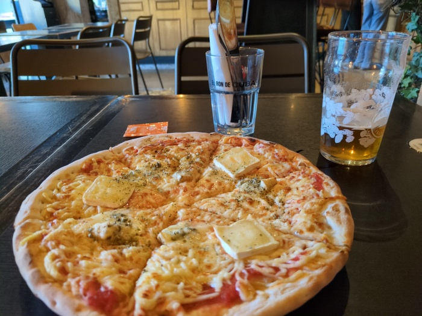
_The Last Pizza_

Tomorrow I'll get the train to Paris and from Paris to Caen, if I stay a night
in Caen I'll be getting the ferry back to the UK on Saturday and will be back
to the full-time grind on Monday.
