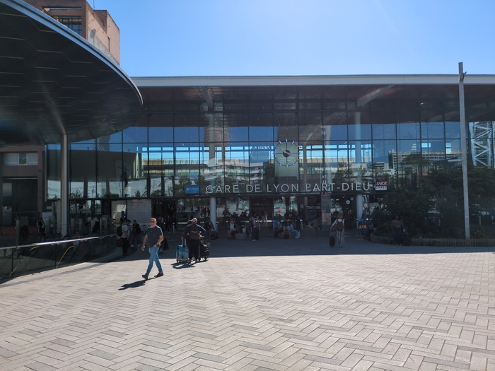
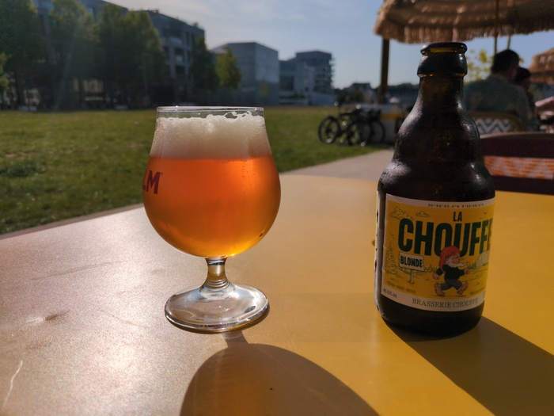
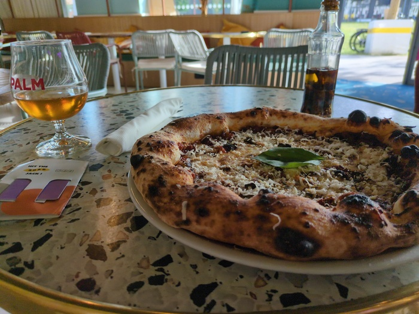
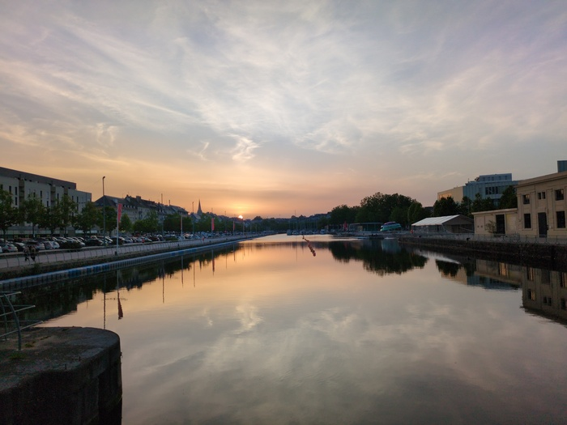

--- 
title: "Jour de Correspondance"
categories: [verona2026]
tour: [ verona26 ]
distance: 5
time: 1h
gpx: /gpx/verona26/caen.gpx
bundle_image: ./202605212025-sunset.jpg
date: 2026-05-21
---

I booked the train from Lyon to Caen in my bed it cost around €100 or so and
would leave at 11am. I passed to sleep quickly having drunk what was probably
a little bit too much. The dormitory was good - the beds were solid and
compartmentalised. Breakfast "comment ca marche, le machine de pancake" I
asked and it was demonstrated to me. There was a hotplate with 6 small pancake
sized indentations into which the mix was poured. I poured and waited "for two
minutes" as explained and helped myself to the other breakfasttries. "Il faut
le tourner" a woman said "quoi?" "le pancake, ca va brule". Indeed it was
burning. Not a fan of pancakes.

After breakfast I waited. I went to the dormitory and laid down again and
drifted in my head. The train was at 11 it was 9am. I'd leave at 10. The
train stration (Lyon Part-Dieu) was a short ride away.

_Lyon Part-Dieu_

Cycled over the bridge of the Rhone (from which I dropped my phone ten years
ago) and arrived at the station in the sun. The ticket put me in coach 17 in
seat 50 and the platform indicated where coach 17 would stop and in that coach
was a reserved cycle space for me. The reserved seat was directly opposite the
bicycle. Perfect. I was joined by another cyclist who was talkative. I tried
to carry on the conversation in French before he said "you can speak English,
I'm Dutch". He had a vintage eighties Peugeot cycle. I connected to the Wifi
and it was surprisingly responsive and usable.

**Trains in France are great!** I opened up my laptop and did some long-overdue open-source
work, having decided to achieve that one goal today. The Dutchman moved to the
next seats and started talking to other people. After an hour there was an
announcement that I didn't quite catch the Dutchman turned to me and informed
me that the train would be **30 minutes late**. This was a complicating factor
because I had **less than an hour** to cycle accross Paris to the other station
(St. Lazare). Google said it would take **23 minutes**.

As the train pulled in to Paris the Dutchman promptly removed his bike and
effectively blocked people from getting off in order to let me get out first
"Le messuier, il a une correspondance...." I thanked him and left the train
with my bike and dodged the many people all the way down the long platform
trying to get ahead. Ticket was scanned, gate was opened. 

> Where is the exit? I can't see the exit.

I chose a direction and was in the open air and checked my map. I didn't have
Paris on my normal phone app. I had to use Google maps (which is terrible) and
barely visible in the fierce sun. I turned right and the way was blockaded - I
had to lift my bicycle over the barriers as a police car screached past me
shouting something (probably not at me) and continued to cycle hard on the
cycle path up the side of the River
[Seine](https://en.wikipedia.org/wiki/Seine) - judicuously ignoring traffic
lights and follow the examples of others. On to the [Boulevard Haussmann](https://en.wikipedia.org/wiki/Boulevard_Haussmann) and the
chaos of cars and cyclists and pedestrians _slowly moving_. Everything was
_moving slowly_. I dived my way in and out **your phone is overheating** and
it switched to "Dark Mode" making the already difficult-to-read Google Maps
even harder to read. Up up up, north west, north, north. **Cycle cycle cycle** as
fast as possible. "7 minutes" it said and train would leave in 11 minutes.
_Faster._

Ahead was the Gare St. Lazare - I might make it yet. 

The "ticket" I had on my phone wasn't a ticket, it was an **email**. It had
a **code**. _I had to print the ticket at the station_. An
additional obstacle. There was a machine immediately opposite me in the
station. "Retirer e-billet" ok. "Saisr le code". I entered the code. "Saier
votre nom" I entered my name. "This name does not correspond to the name on
the ticket".

**That was my name**. That was my ticket. `WTF`. I tried again, the
minutes were ticking. It failed again. I saw a ticket office, I quickly
explained that I couldn't print the ticket the lady said _"c'est bien, montre
votre email et il vous laisse passe_" (show the email and they'll let you
through the gate) I said the train was departing in minutes, the woman
understood "I'll go up" she said and I never saw her again as I charged up the
escalator with my bike and to the **wrong end** of the station and the gates
that were there and there was nobody there. I paced up and down the gates
**swearing** under my breath, looking for somebody to let me through. 

- Swearing
- Stressed
- Exasperated

Then the train was no longer on the departures board.

The stress was gone. I'd explain at the ticket office and they'd very simply
put me on the next train and that's what happened. The next train was in 45
minutes. The station was extremely busy. I wheeled my bike in to Pret-a-Manger
and purchased some food. Wheeled my bike around looking for somewhere to sit.

The platform was announced and I went to it. It was very busy. A couple
interrogated me about my bike and we had a Frenglish conversation. They were
impressed with my journey and the lady had done ridden an electric bicycle
along the Rhone recently.

_Anachronistic Beer_

The train pulled in and hundreds of people started congregating towards the
coaches. My place was reserved, I found coach 14 and was relieved to see the
"cycle" sign on it and there were two free places to **hang** the cycle. I
hung it with a straining effort due to the weight of the gear on the forks
and on the tail - leaving me out-of-breath.

Something was wrong because people _kept_
pouring into this carridge. More bikes. More people. I didn't really want to
leave my bicycle "unattended" so I hung around making the squeeze worse.
Eventually I backed myself back into the seating area and there was an
announcement that I couldn't piece together somethig about "4 and 14" and "go
to the next _voiture_". **"C'est bien le voiture 14?"** an older lady asdked of me
**"je suis Anglais"** I replied.

Eventually the doors closed and whatever had happened had happened. I found my
seat and my head was hurting from all the pointless stress. But I continued
with my open-source project on this [NOMAD](https://nomad.normandie.fr/le-reseau-nomad-train) train for Normandie. The Wifi was
not good and I realised that trains in France are a mixed bag, but they're all
still better than most of the networks in the UK.

It was relief I got off the train and then there followed a regular **instant of panic**
when I realised I _may_ have left something on the train. I didn't. I have that
moment of panic often. Especially when I leave on my bike in the morning and
notice that I can't feel any items in my pockets. Before remembering that I
don't have pockets and no longer have a wallet.

I went to the hotel showered - should I shower? I asked. I had been in my
civilian clothes since this morning. I had no towel, but the shower had shower
cream and when I finished I brushed the water from myself as best as possible
before doing the minimal drying with my socks and putting my clothes back on
knowing they'd be dry enough soon enough.

I then hit the stuffy dormitory that smelled like dirty socks. The two people
that were actively doing things somehow neglected to open the window and there
was no air conditioning. I crawled into my bed "Top or bottom?" the
receptionist had asked me when I checked in. I thought about it "bottom" I
said - convenience is good. I've got the **worst bed in the dorm**. I lay down in
the worst bed and dozed for hours.

I had dinner at the hostel and read chapters from the book and went for a
wander. Again it hit me the amount of public spaces that were available. Lots
of people enjoying themselves. Everything was clean and everything was green
and _tres propre_.

_Dinner_

I sat on a wooden platform and took my shoes off and crossed my barefeet and
drank the 33cl tripple beer I had purchased from a supermarket and ate some
chocolate and read the book.

_Sunset_
