--- 
title: "Portsmouth"
categories: [mannheim2026]
tour: [ mannheim2026 ]
distance: 150
time: 7h15m
gpx: /gpx/mannheim2026/portsmouth.gpx
bundle_image: ./202610021906-solent.jpg
date: 2026-10-03
summary:
---

Now in ferry bar drinking beer. Fingers feel caloused. Listening to Megadeth
to drown out the noise of the other people in the bar. It's been a
characteristically bumpy first day.

I wasn't thinking about cycling to Mannheim until 4 days ago. It had crossed
my mind. I cycled last year - to the small un-conference. Why not do it again?
There's something appealing in it. The tickets were sold out. I begged the
organiser[^thanksstephan]. I'm on the list. I've booked my hotel. I have 6 days to cycle
around 900km to Mannhiem.

So this morning I woke up and packed. Shouldn't be so hard. I would have
everything from my trip to [Verona](https://www.dantleech.com/tour/verona26/) last May.

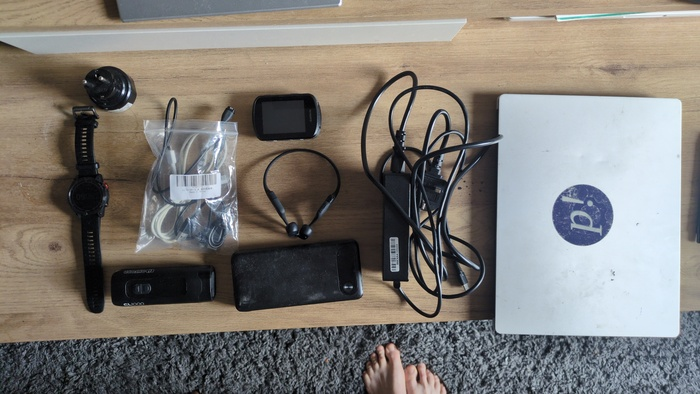
_Electronics_

The front bag, the rear bag. Tent. socks, rain jacket, gloves.
This year I've decided to take a beanie. Sleeping bag, air matress, cooking
stuff. The ... bag. The bag. The tubular wet bag. Where is it? It should be
here. It's not here. This is not the sort of thing that isn't here.

I can't tie a sleeping bag, air mattress and cooking stuff to my fork. Even if
I did it would get wet. I could wrap it in something, a carrier bag? A panier?

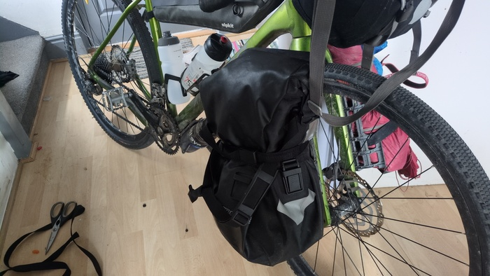
_Adapted Panier_

I removed the bulky fittings from a pannier, covered the holes in duck-tape
and wrapped it around the stuff. It worked quite well, but I rememberd a
memory of that taking that tubular wet bag to my Dads and leaving it there.

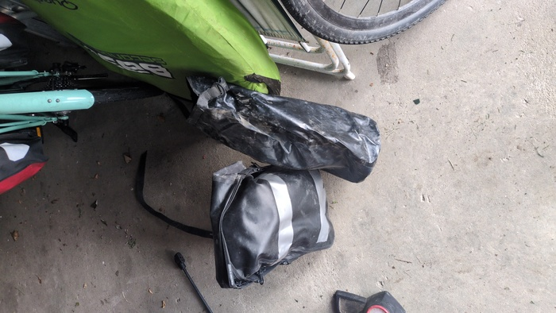
_Found - 5 miles from my flat_

The ferry would leave from Portsmouth (is leaving as I write this) at 23:00.
It was 10am. Garmin said it would take me 5 hours 30 minutes to ride the 87
miles. Not a chance.

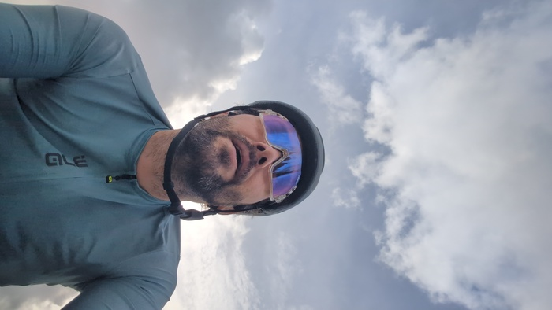
_My new glasses_

I purchased a new front light and some new glasses. I'll talk about the light
later because it's shit. The glasses are also shit - at least they're not
as good as the pair that I lost on Hardy's Monument. Having only 24 hours to
buy missing equipment I had to visit a bike shop - and purcahse things
inappropriately.

If you're cycling 6-8 hours a day in variable conditions then you probably
want a photochromatic lens (like my old pair). They'll be dark when its sunny
and clear enough when dark. The pair I got has interchangable lenses instead.
In my wisdom I decided to bring just one lens - the Orange one. This was a bad
choice. I don't like Orange. The interchangeable lens also seems to require a
bulky frame which limits my field of view, especially when checking the cars
behind me.

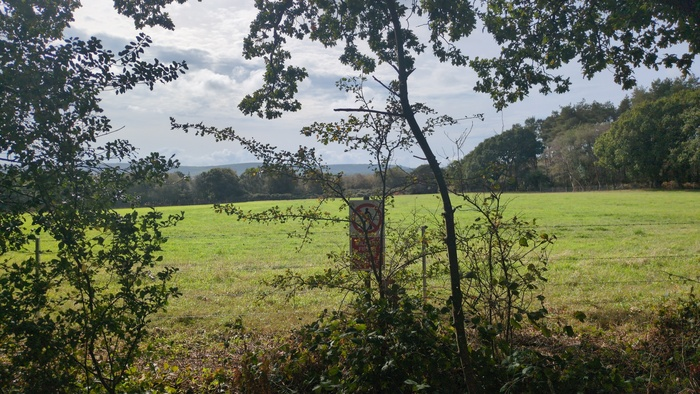
_Firing Range Please_

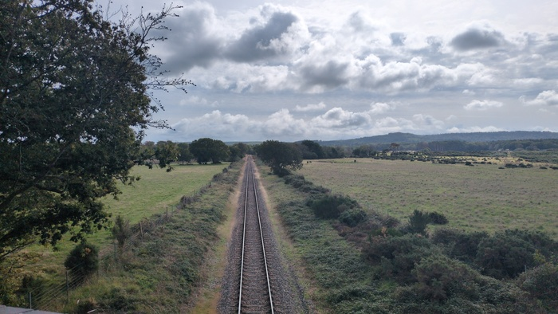
_Just another Train Line_

I didn't take the other 2 lenses because "saving space". It's normal to feel
regret for your equipment choices as you leave. I also regret taking my
skin-tight jersey again. I should've learnt from the last time.

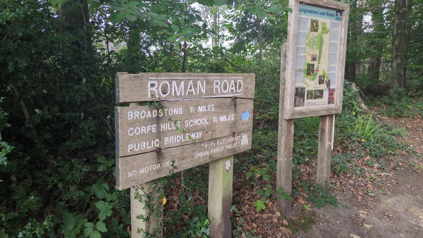
_... Roman Road_

I rode to Wareham. 29 miles and Sainsburys sandwich for lunch and organised to
stop off with family close to the port to wait out the superflous hours. 60
miles to go. I was breaking out of my routine training orbit around Weymouth
and listened to Queens Greatest Hits II. My training regime has been to ride
about 30 miles a week for the past 4 months.

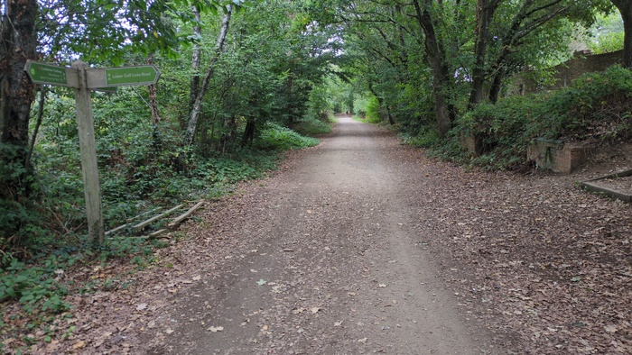
_Castleway trail_

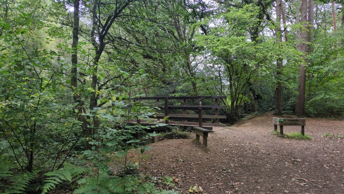
_Castleway trail again_

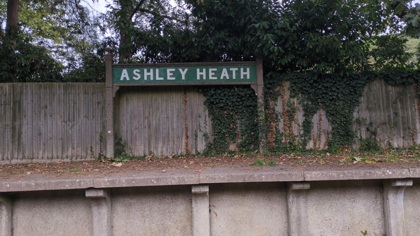
_Ashley Heath - on the Castleway Trail_

The trail seemed to stop where the New Forest started. There were a prodigous
number of indigenous wild ponies of which I did not take photos - because it's
rude.

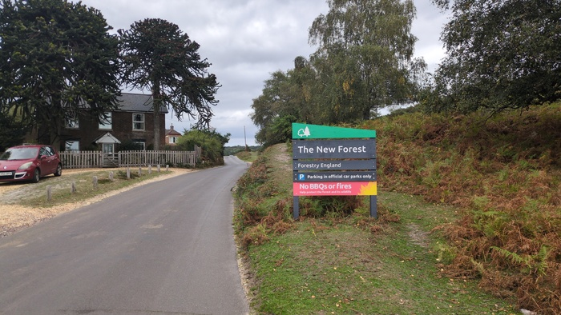
_New Forest_

There were also Donkey's. They were in the road and creating a traffic jam.
They got photos.

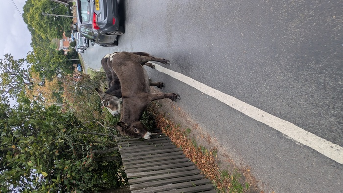
_Troublemakers_

I passed through Southhampton which is, as always, a bit shitty and made my
way to Lee-on-Solent to stay a few hours with family and cook some food and
drink a beer.

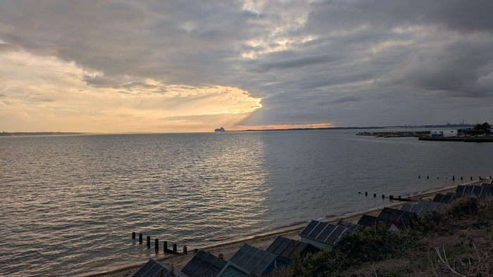
_The Solent - probably_

It was now dark and the pasta had been eaten. I would need to leave soon. I
would be able to use my new light! How excited I was. Not only is it a light
but it's also a charger! How wonderful. (or it would be if it used USB-C) I had mounted the bracket onto the
bike before I left. I mounted the light on the bracket. The bracket fell
apart.

The bracket was broken, the sping had sprung out and it was lost I gave up
looking for it because the whole thing was irrepareable having been held
together with a single plastic pin. It wasn't a cheap light. I thought about
what to do and the solution, as ever, was Der Austeiger wratchet straps. I
strapped the light on. 

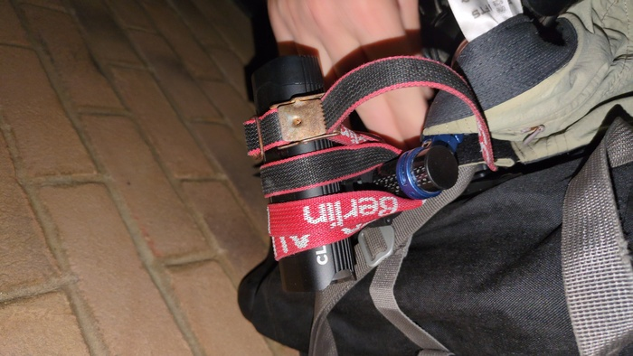
_Der Austeiger Berlin straps -still going rusty_

Feeling pleased with my road-fix I cycled the several miles to the Gosport
ferry - which would take me from Gosport to Portsmouth. They run every 15
minuutes and I had time. Or did I? I had time. It was almost 9PM when I
arrived at the ferry terminal. I pulled over to buy a ticket. I paid for the
ticket. The gangway to the floating quay was ahead I cycled forward. CRACK.

It went CRACK. I had run into a step. It was dark and I had not seen the step.
Oh fuck, but oh well. I carried the bike up the steps and down the gangway to
the waiting area - the ferry was pulling away. I wheeled my bike to a seat and
hopped off. The silence - the silence and the hissing. The hissing of air
leaving my tyre.

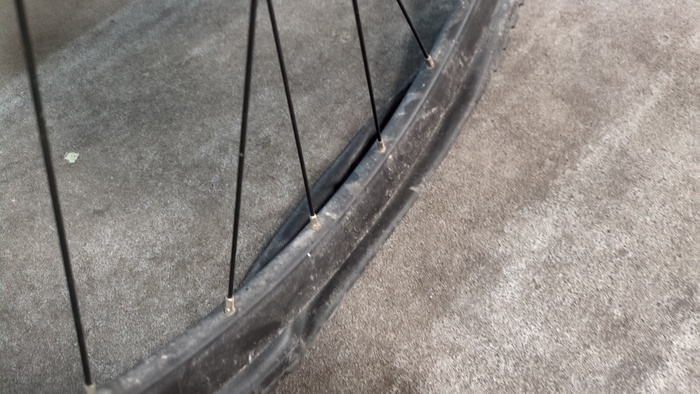
_This is what happens when you attack steps_

This was somewhat of a problem. I didn't have _that_ much time. How far was
the international ferry terminal? I cheked - 1 hour walking.  I'm not good
at fixing punctures. Would it take 15m? would I fuck it up and need to do it
again? I decided to use my spare inner tube when I got to the otherside.

The ferry to Portsmouth took all of five minutes. I debarked and wheeled my
bike to a bench and attacked the tyre with my tyre leavers. It didn't come
easily but it came. I whipped the inner tube out and whipped the new one in -
injecting some air to give it shape - and proceeded to get the easy half of
the tyre on then proceeded towards tyre levers and ill-advised brute force for
the remaining 15% - then air - I felt air - had I pinch-punctured my new inner
tube? I put more air in the tyre to test it. 30 seconds passed it seemed OK. I
man-handled the remaining part of the tire on and I was off.

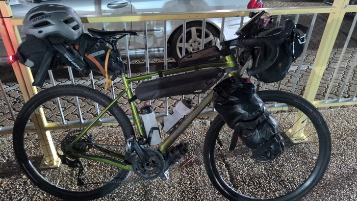
_Bike Waiting_

I had plenty of time of course and was waiting with other cyclists in the warm
evening time. I had changed out of my cycling gear earlier.

Tomorrow I'll arrive in France at 6:30am. An early start means more mileage
which is good as it will give me some slack. Evenly split I would need to do
93 miles a day for the next six days and I want to finish my days before 6PM
so I can eat pizza and drink beer.

---

[^thanksstephan]: Thanks Stephan!
