--- 
title: "Day 2: Saint-Pierre-du-Vouvray"
categories: [mannheim2026]
tour: [ mannheim2026 ]
distance: 160
time: 7h54m
gpx: /gpx/mannheim2026/stpierre.gpx
bundle_image: ./202610032231-aube.jpg
date: 2026-10-04
---

Now sitting in the hotel restaurant. It's Sunday and I'm miles from the
nearest Pizzeria, or any other type of food esablishment. So I'm at the mercy
of the hotel restaurant. They serve authentic food from Normandie - so the
vegetarian options are limited - but to give them credit - they are provided.
I'm going the entree and the main course and this will probably be the most
expensive dinner I've had while touring. But whatever. I'm 46 years old and
it's Sunday and I've burnt 4000 calories and if I don't make an attempt at
getting them back I'm going to feel pretty rotten tomorrow.

I slept in the couchette on the ferry. The couchette is a bunkbed. It was like
a hostel on the ferry. As a hostel it would have scored well on price (12€),
a quality bed with a black-out privacy curtain, the USB
charger. It also smelt _bad_. Really bad. Offensively bad. Feet and sweat.
Worst smelling hostel on land or sea.  I didn't feel fully refreshed when the
ship woke us at 5:30am.

I got out of bed and afforded myself a full english breakfast for €17 which
included access to the buffet. I sat near to one of the cyclists who boarded
with me the night previous. He spoke to me. He was heading into the Alpes
through Annecy and Alphaville and over the Pass de Saint Bernard. His
couchette also smelt bad - although perhaps not as bad as mine. He left to use
the toilet. I stayed on to finish my breakfast.

Once I finished my breakfast I had another coffee. I was the only one in the
restaurant "Are you a foot passenger?" one of the staff asked in French or
English[^probablyenglish]. "Yes" I said confidently. I helped myself to
another cup of coffee and sat down leisurely. "You must go down now" she said.

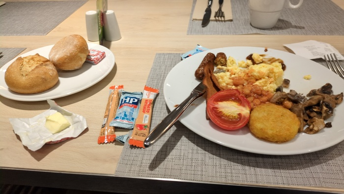
_Petite Dej - 6am_

It then dawned on me that I was not a foot passenger. But a cyclist with a
bicycle in the vehicle deck. I didn't rush. I descended the stairs and walked
directly towards the group of cyclists who were ready to go. We were not the
first off the boat[^maybeme]. I got to work attaching my fiddly saddlebag to the bike
and as soon as I had finished we were directed out into the darkness to join a
queue of cars.

The queue was long. There were five of us and we acted as a group. One of the
cyclists decided to go ahead and we all followed. "With the motorcyclists" he
said. We were with him. Then the guy at breakfast said "I'm going all the way"
and he rode off past a queue of 10 cars to the front. We waited but the
tension was building. Another cyclist cracked and followed the first and we
all followed him. Skipping the entire queue I rode out with a cyclist from
Bristol before pulling over to organise my things and we parted ways.

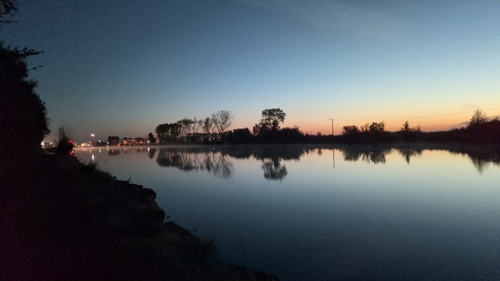
_L'aube - 7am_

It was warm when we came off the ship but as I joined the cycle path by the
water-way it became colder "I can take it" I thought. I couldn't though and I
had to put my gloves on. Normally I'd cross the waterway but I couldn't
because the road was closed. "Diversion" said a sign. Looked at my map it
wasn't a small diversion. The Garmin cycle computer wouldn't stop complaining
as it tried to return me to the closed road. This would add another 10 miles
to the day.

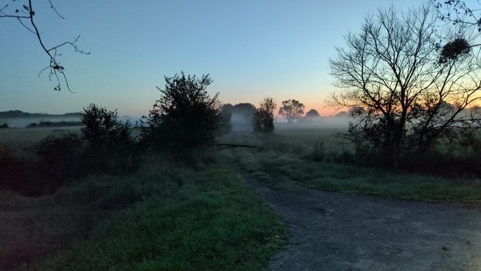
_The mist_

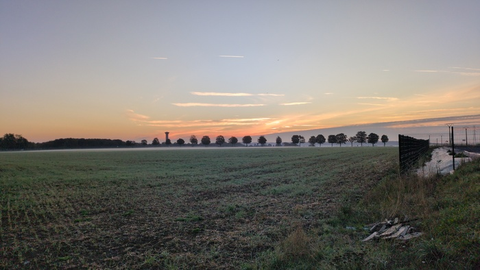
_Sunrise_

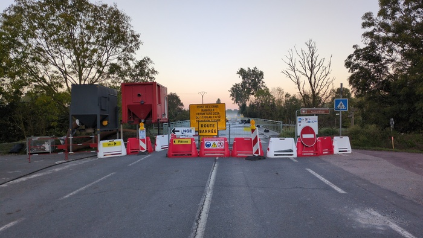
_On the other side ot the closure_

The sun was shining directly in my face. I put my sunglasses on and it took me
a while to realise that I can see better without them.

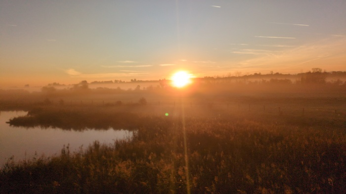
_Sun in my face_

I needed coffee and I needed food. I found an open bakery and got both and
some for later. The temperature increased slowly and I hit the the seaside
towns and then there were numerous hills and hilly places and funny houses.

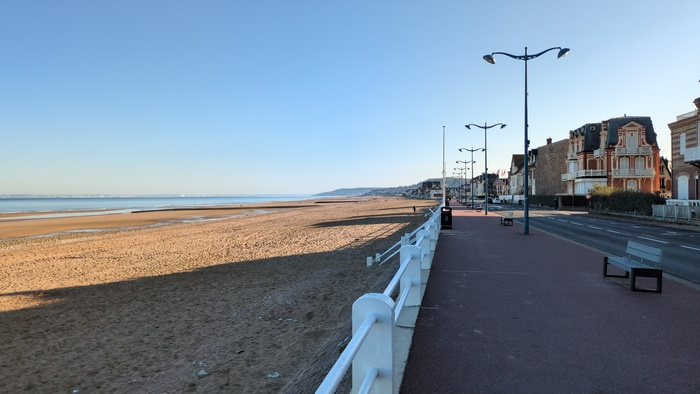
_Blondville sur Mur_

Somehow the time passed and it was lunchtime. The supermarket had a variety of
sandwiches. none of which were vegetarian and in anycase they all looked shit.
I got a baguette, some cheese clices and an apple.
_
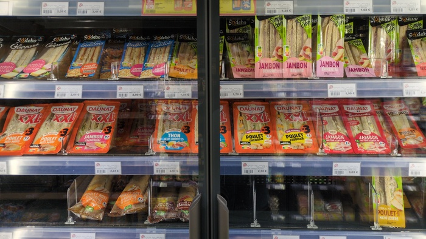
_Look Ma! Meat!_

I joined a river and looking over the river I saw a busy dock and checked my
map. It was Le Harve and the river was the Seine. The same one that Ragnar
Lothbruck sailed down in the TV series Vikings III.

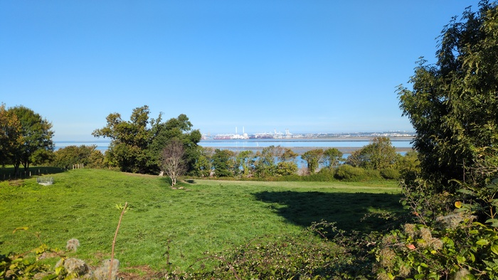
_Le Harve_

In the next town I found some noisy benches so I searched further and found 
quiet picnic benches and made a cheese and apple sandwich and looked for a
destination for the day. I had done around 60 miles at this point and I could
do 60 more. 

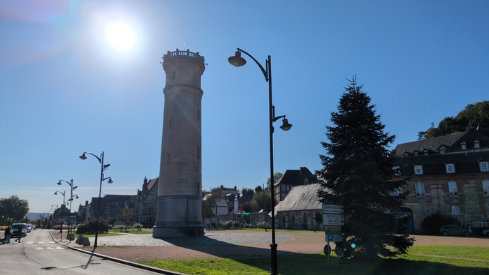
_Honfleur_

Camping was a last resort. I have the gear but it was really cold
this morning. At the same time I'm not paying more than 50 pounds for a hotel
which limits my choices. Apparently I've booked so many times on Booking.com
that I'm a "Level 2" member and I get discounts on, usually interesting,
hotels. One of those deals would give me 98 miles for the day - I had expected
to do 130 miles today. _But I'm weak_. I booked the hotel and left and stopped
again to put cream on my bum and oil on my chain.

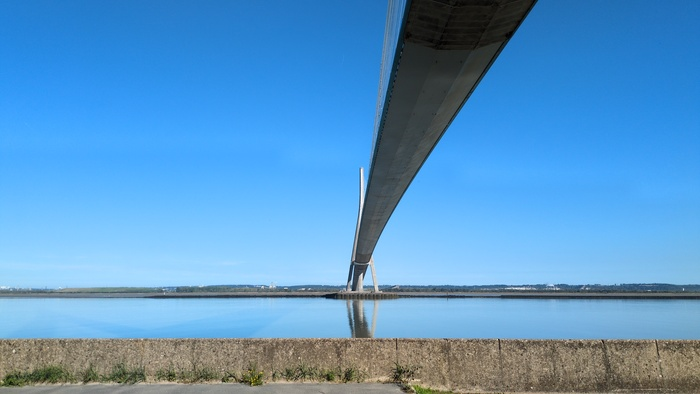
_Bridge over the Seine_

What's that river? There's a hilly green ridge running from left to right as
far as I can see. Am I in a vallee? What's the river called? "Risle". I wrote
"Risle" in my notepad mis-pronouncing it "Wrisal" and I think I determined that I
was in the Wrisal Valley.

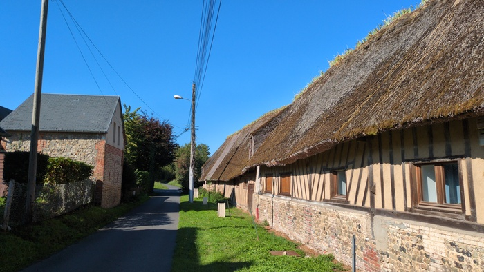
_Standard Thatched Cottage with plants growing on the top_

There were lots of interesting antiquated buildings. Both thatched cottages
with plants growing on the top and austere gothic looking mansions.

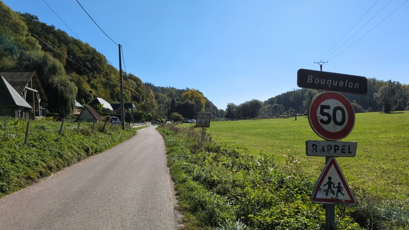
_In the Vallee de Risle_

I passed through Pont Audemer and Elbeuf and a Texaco garage. I was feeling
bored and difficient. The weather was fine, perfect even. The sun was shining
but it wasn't too hot. But the monotony was gnawing on me. "I didn't choose
the gravel route" I realised[^nogravel]. I was also tired with less than 5
hours sleep and an untrained for 100 miles done the day previously.

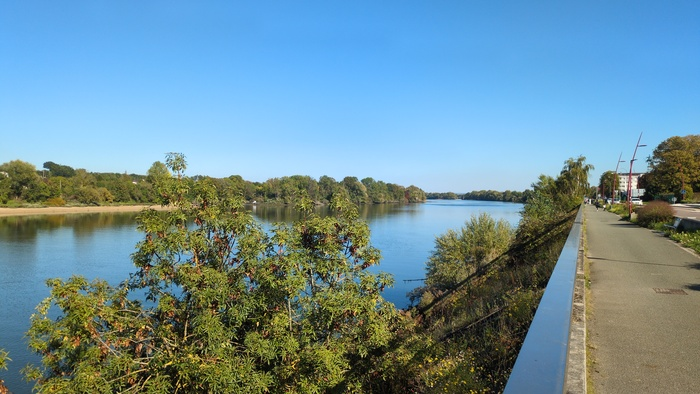
_La Seine_

I joined the sometimes-conjested cycleway along the rive Seine I was counting
the miles down. 20, 13, 6, 3. The checked into the hotel which was staffed by
a congenial 10 year old who had to ask what the price of breakfast was. It was
decided that it was €12 or €15 but effectively it was 12€.

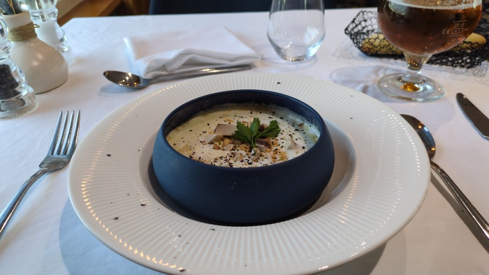
_The Starter_

The manager had spoken to me in French and seemed French but when I walked
into the restaurant I heard her speaking to an English couple in with a
northen UK accent. "You're from the UK arent you? we can do English. We were
doing well.".

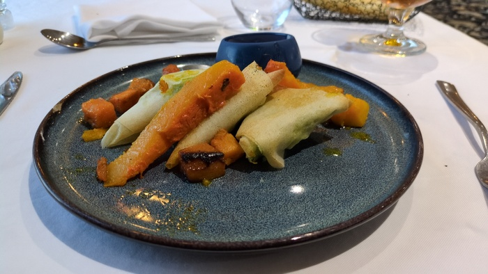
_The Main_

It was not the dinner I had hoped for.

---

[^probablyenglish]: because I can't recall how she would have said "foot passenger"
[^nogravel]: I planned my route for the next day however and Strava presented
    the same route for both Road and Gravel.
[^maybeme]: It's entirely possible that we weren't the first because I held
    everybody up by finishing my breakfast.
