--- 
title: "Day 3: Villers-Cotteretes"
categories: [mannheim2026]
tour: [ mannheim2026 ]
distance: 170
time: 8h00m
gpx: /gpx/mannheim2026/beauvais.gpx
#bundle_image: ./202610032231-aube.jpg
date: 2026-10-05
---

Sitting in a "cheap" motel type establishment. In the restaurant. There was
nothing vegetarian on the menu so I ordered the omlette. The omlette is €18
and I ordered large blonde beer for €12.50. I hope the omlette is sufficient.
As usual with these budget hotels its a good walk away from the town, but
perhaps I should've investigated more before comitting myself in coversation
with the waiter here. The beer cost €12.50 for 75cl and it's only 4.5%. x

I think I slept well at the Hostellerie Saint Pierre. I was hoping to talk
more to the English lady that was staffing the place the evening before but
she had been replaced by a French woman to whom I greeted with Bonjour as I
descended the stairs for breakfast. The breakfast was a buffet and I had a
sufficent amount of cereal, breads, butters, jams, and a yoghurt and a coffee
and a juice and paid for it all and left but came back to fill my water
bottles. It was misty.

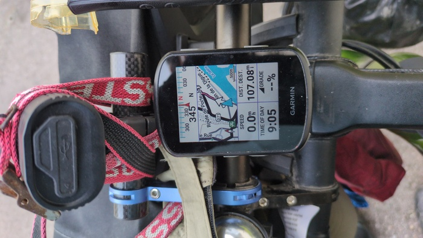
_Bonjour!_

It was misty and cold enough for gloves and water droplets formed on the hair
on my arms. Today will be just over 100 miles making up for the 100 mile
deficit from the previous two days.

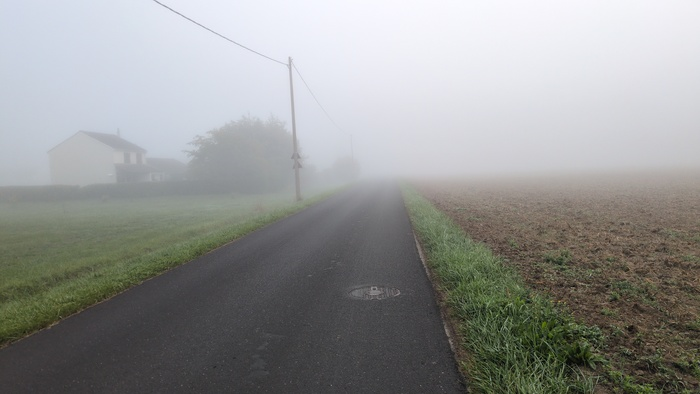
_The mist_

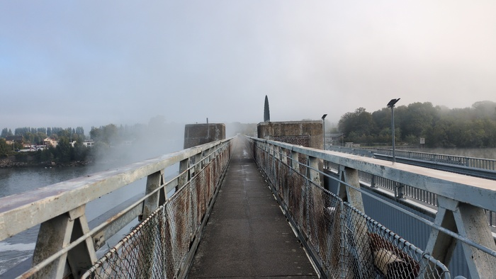
_Crossing les Eclusses_

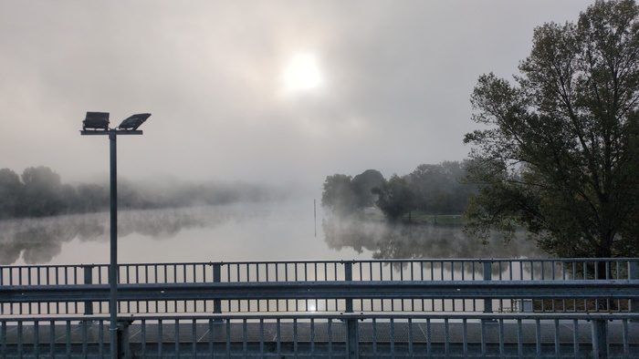
_Mist from the brige_

After two hours of riding the cold and the mist was getting to my head. I was
feeling unpleasant but the mist was clearing and there was light around the
corner.

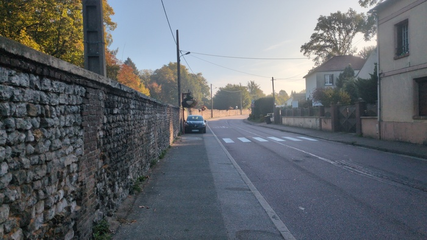
_Light around the corner_

The mist came back again but when it finally cleared it was to a clear blue
sky.

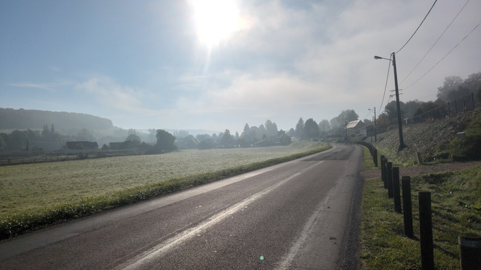
_The sky isn't clear yet_

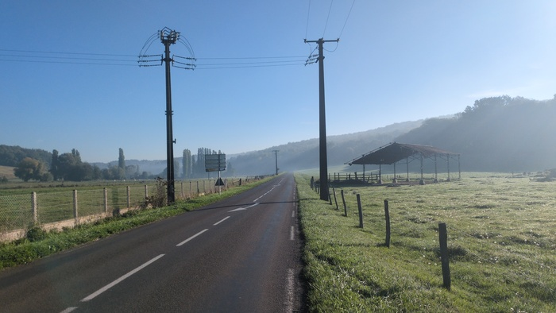
_Now it's clear_

The breakfast had served me well but it was approaching lunch time. I had done
maybe 35 miles - I'd have preferred to have done 50 in 3 hours but that would
mean riding 17 miles an hour and I could probably only manage that on a road
bike on the flat.

I saw a cyclist parked up ahead and tried to avoid him but I took
a wrong turn so I had to turn back and he was waving at me. I pulled up and
greeted him "Bonjour" "Soy espanol" he replied and shoved a pizza box
containing 1/4 of a pizza towards me. I hesitated but it was a goats-cheese pizza
"Gracias!" I said. He was standing at an autoamated pizza oven the pizza was
good. "A donde vas?" I offered but didn't quite understand the answer he got
his phone out and the route went from Paris to Dieppe. He asked where I was
going "Germany" I said in what I think was Spanish "Dos semanas!". I ate my
pizza in silence not knowing enough Spanish to continue before he shook my
hand and carried on. I could now delay my lunch stop.

> There are lots of pizza automats. I'd use them if it weren't for the fact
> that one entire pizza is too much for a snack as evidenced from my Spanish
> friend giving me 1/4 of his.

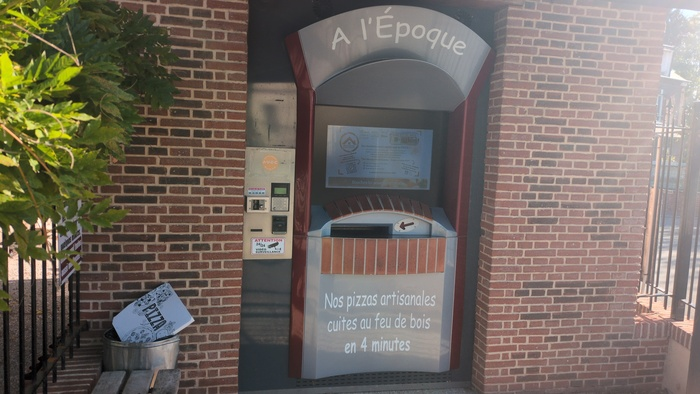
_Pizza Automaton_

I rode into a village which was equipped with a Cathedral. There was a water
fountain outside of the tourist information center and I quenched my thirst
and filled my bottles. I had a look around and saw the same Spanish cyclist
outside a shop and waved at him with a smile as I rode past.

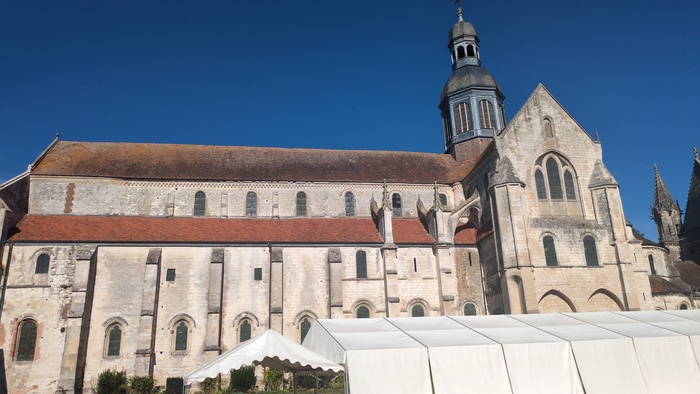
_Cathedral (13th century?)_

I found the Trans'Oise cycle route which, as the name suggests, traverses the
department of l'Oise. It was familiar I looked at my computer - 13 miles until
the next turning. I remember feeling the same small-joy last year in the
opposite direction. 13 miles of pleasant riding.

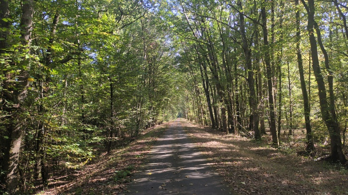
_Trans'Oise - 13 miles of this slightly downhill
_
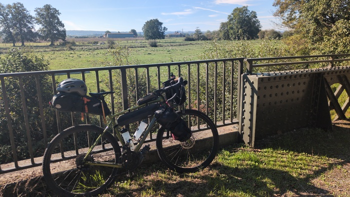
_Stopping for a pee_

I passed the Saint Piere theme park. I'm not sure I mentioned it before but
I'm mentioning it now because I've now passed it three times and it's
something of a landmark.

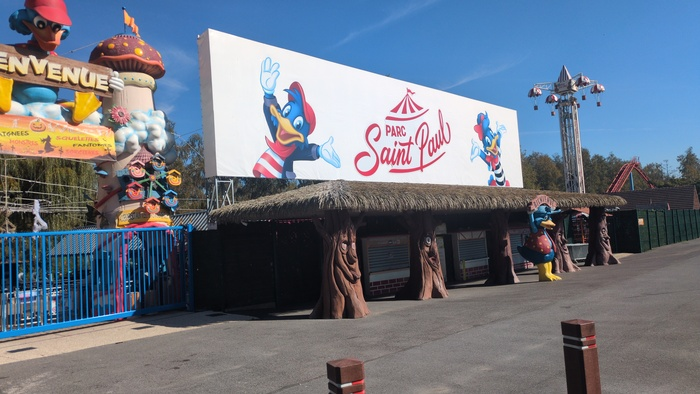
_Saint Piere Theme Park_

I passed through Beauvais - also for the third time. Now was the time for
lunch. I cycled to the large square before the Hotel de Ville which was
surrounded by commerces. Many of which were closed (is it a holiday today?)
but there was a "French Taco" fast-food place and I couldn't say no.

I ordered and paid with my watch "Oh! c'est le premier fois que j'ai vu ca"
the cashier said to me. I ordered a large Taco. Of the two vegetarian
"protiens" you could select only was was available so I had "two falaffel". I
sat down and waited, my bike parked against the window and in view. I had a
number. 

A retired white woman was talking across tables to three black
school-age teenagers in what sounded like a casual political conversation
which I didn't get the gist of but foreigners were mentioned. "Mais est-ce que
vous etes marie toi?" (are you maried) a girl asked the lady. The lady seemed
confused. One of the others offered "marrie?". It seemed awkward. "Moi
- je suis _contre_ le mariage!" (I'm against marriage!).

My number was up and I was handed a slab of a burrito. It was massive and I
would guess it weighed more than a large pizza and contained significantly
more than two falaffels. I couldn't finish it and saved almost half for later.

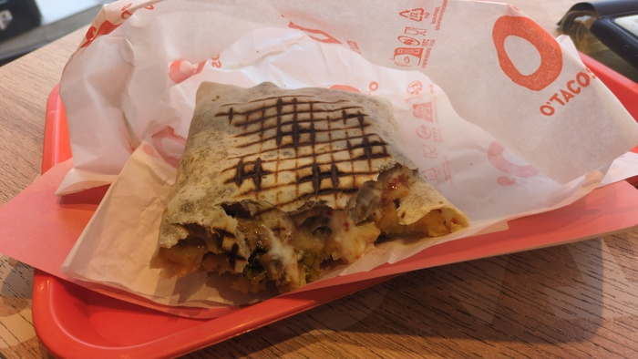
_The Slab_

Beauvais Cathedral was still there, I checked.

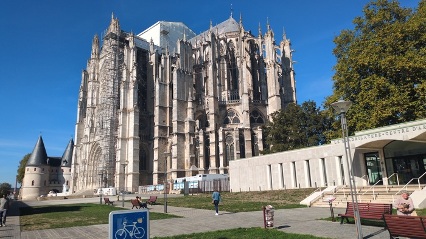
_Still there_

It got hotter - not hight of summer hot - but hot enough to warrant wasting
some water over your head hot - but I had enough to waste having only 30 miles
to go.

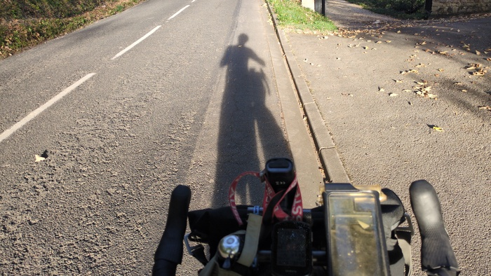
_Casting a shadow_

I passed the time listening to music and occasionally singing along beind
aware of the fact that people had the car windows open "Shiny, shiny. Shiny
boots of leather..".

There were lots of impressive aristocratic castles otted around - of which no
photos were taken.

Arriving at the hotel the checkin was done in 1 minute with an agreement that
I could put my bike in the room. I wheeled it in parked it in front of the bed
and opened the door to the bathroom and was surprised to see the next room.

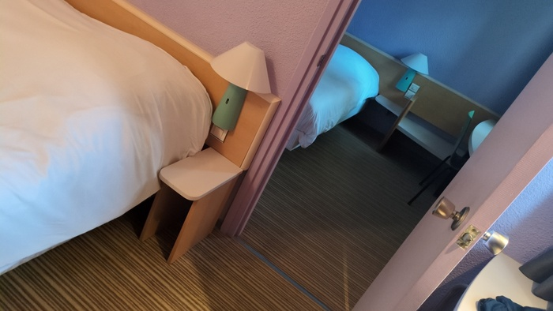
_Erm, this is the next room_

I was going to complain but when I walked out I also saw that that room had no
room number so I'm assuming that it's a room for groups.

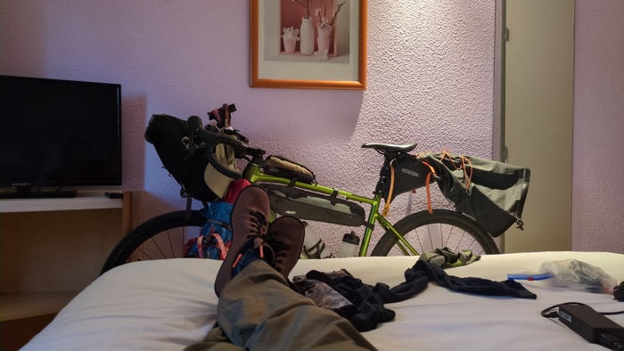
_The bike in the room_

The dinner was omlette and chips and salad and it was ok, I'm just finishing
up the beer which was also good. I'd be happier if it had cost €20 instead of
€30. Breakfast wil be €12.

