I'm in my surprisingly spacious but undecorous €45 hotel room in
Vitry-le-Francois with a take away pizza, two 500ml cans of strong beer, a
packet of 3D bugles and a chocolate bar. I'm probably hungry. The Amsterdam
beer was €1.80 while the Leffe was €2.50. They're chilled. Today was somewhat
challenging but also somewhat easy - at least in as much that I reached my
destination with fuel in the tank - which was surprising considering that I
hadn't eaten significantly over the 10 hour day.

I woke up feeling heavy and late when I looked at my watch and it was 8:20am.

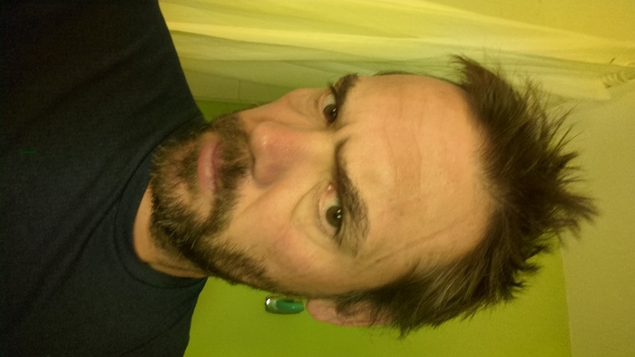
_Looking Good_

Breakfast was had with the usual French buffet. I sat and studied my phone. I
wanted to do 100 miles and I wanted to establish an accomodation.

Before I left I made a rough route plan on
[cycle.travel](https://cycle.travel/map/journey/1137774). The route isn't
exactly the fastest but perhaps it's more interesting - in anycase I'm using that as
my guide which is why I have struck south-east instead of east and adding some
miles to the journey. I was wrong when I thought I wouldn't have a chance of a
rest day. I was one day wrong. I could arrive in Mannheim on Thursday if I
introduce a longer ride - or I'd have a much shorter day on Friday.

I booked my accomodation at 96 miles because it was £40. _why do i have all
this camping shit_. _I hate spending money on hotels_.

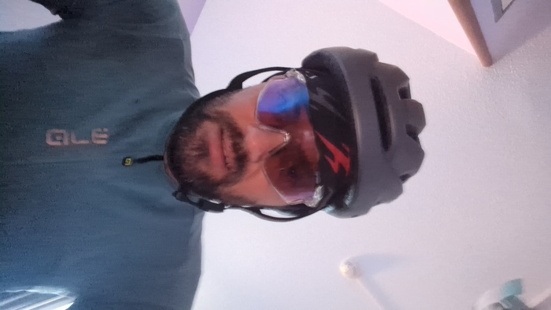
_Really looking forward to this_

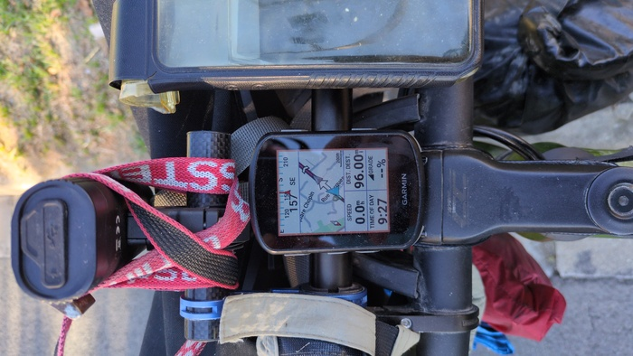
_Here we go!_

It was a little cold but not enough to warrant gloves. There was no mist and
it looked to be a lovely day. Rain was forecast for tomorrow however but I
don't want to think about that right now.

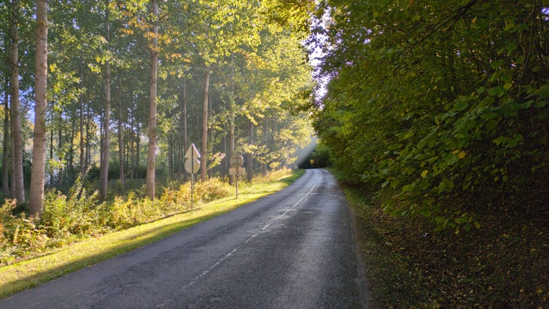
_Morning Light_

The route wound up through the forested hills and eventually into the peaceful forest
itself. I rattled over the cobblestones hands chilled by the tree-shaped shadows
of the morning.

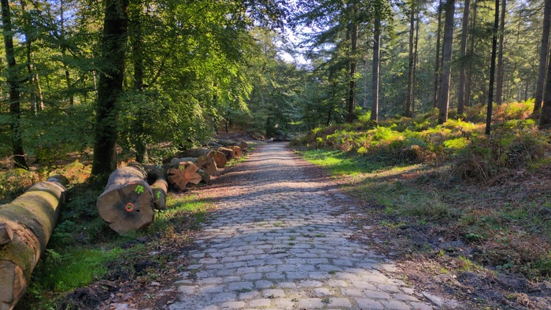
_Cyclists favour this road surface_

As I rounded a corner I thought I saw the shell of a cathedral and I veered
off course to have a closer look. It was the Abbey Notre-Dame of Longpont -
destroyed in the [French Revolution in 1793](https://fr.wikipedia.org/wiki/Abbaye_Notre-Dame_de_Longpont).

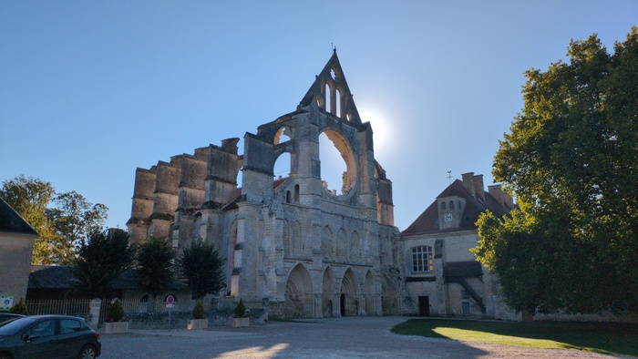
_L'abbaye Notre-Dame de Longpont_

The forest I left behind and headed into the wide open fields.
_
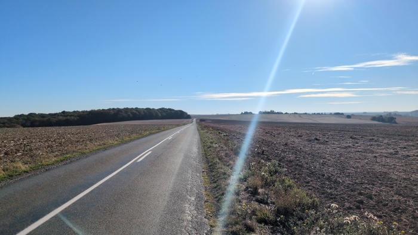
_The fields_

I passed a monument to the crew of Lancaster bomber that was returning from a
mission to bomb a V1 rocket site in Reims in 1944. Some of the crew survived
and found shelter with the villagers but some perished in the burning
fuselage.

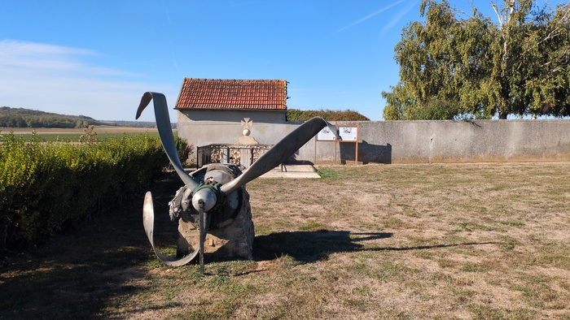
_Monument to the crew of the Lancaster Bomber_

Next were the fields of Champagne.

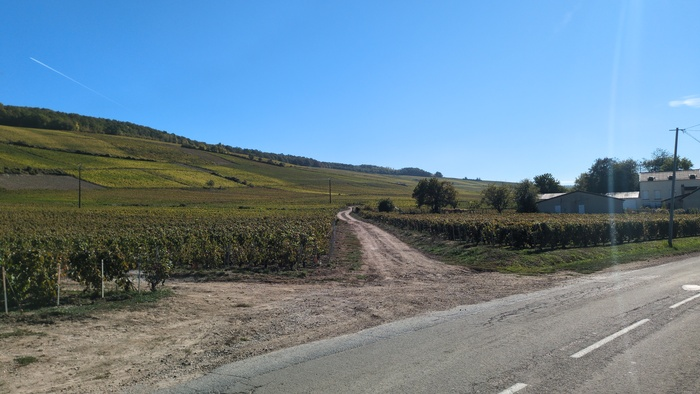
_Fields of Champagne_

It takes around 120-150 grapes to create a bottle champagne apparently which
also apparently corresponds to the average yield of a single grape vine. There
are a _lot_ of grape vines here. Like really, the entire worlds supply of
champagne is here.

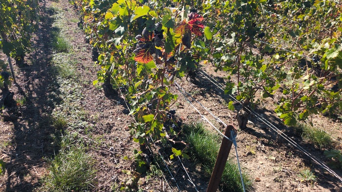
_One vine ~= 75cl of champagne_

Then the trouble started. I rounded a corner and felt the unmistakeable
sensation of drifting treads meaning a puncture. I had just past another
bikepacker who was sitting on a picinc table and had burried his head in the
corned of his arm and was either crying or exhausted. Now it was my turn.

Stopped and placed the bike flat on the ground whipped out the tool and
unscrewed the axel and removed the wheel. Which of the three tyre levers shall
I use. Crack crack heave crack up up up both at the same time ok got some
leverage grab the wheel between the legs push the lever along heave! heave!
slide slip (don't draw blood) try again slip whap. Tyre is off.

I could **not** find the puncture immediately. I had to remove it and put a good
amount of air into the tyre before I could detect where the air was coming
from.

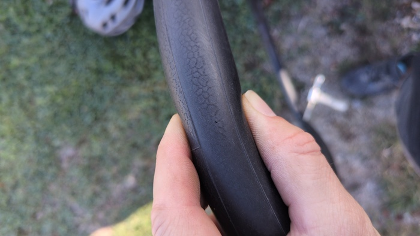
_This little fella_

I patched it and now was the difficult part. In short I fucked it up and
created a snake-bite puncture while putting the tyre back on. I had to remove
the tyre again. I patched the snake-bite.
_
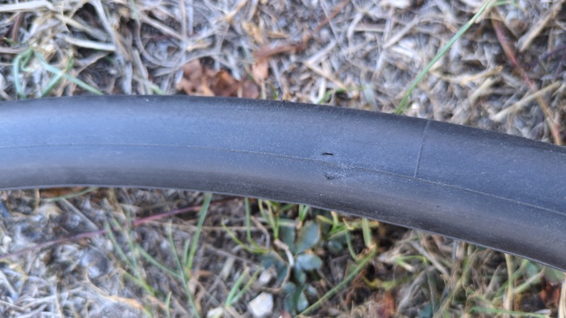
_Snake-bite - self-inflicted_

I rode off, it held, but not for long. I had done only 500m when the tyre was
down again and I had to stop.  The air had escaped around the snake-bite.

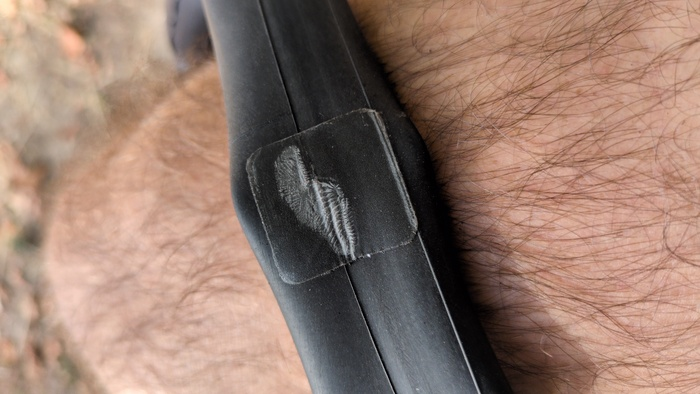
_This is what happens_

As tragic as this was it's also a learning process and I discovered a way to
remove the stubborn tyre with these two devices that came with my levers. I
slide them onto the rim as far as they can go on either side and then lever
the portion of the tyre next to one of them and then slide it up - repeating
until I can fold the tyre completely onto the rim - avoiding excessive force.

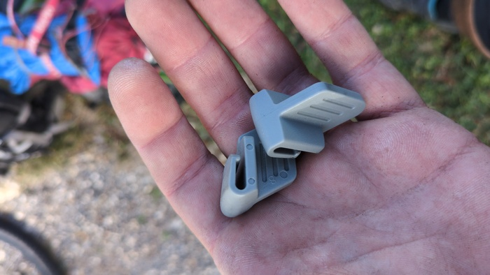
_I knew these had to be good for something_

By now I had exactly two patches remaining and no spare inner tube. I had
wasted an hour on repairs and I knew this repair may not last long. I needed
to find a bike shop and there were _lots_ of e-bike rental places around and I
made my way to one.

I pulled up and the woman called over the man and the man saw I had trouble
explaining "est-ce que vous vendez, err, le truc, pour er, reparer, le, err
crevaision" he spoke and was English. He offered to repair
it for €10, an inner tube for €10 and/or a _proper_ repair kit for €5.

> He offered to repair it because I had just tested the tyre and it was **going
> down again.**

It was fortunate that I chose to visit the shop. He assured me that the
"proper" repair kit would fix the snake-bite puncture (it didn't as it
happened but it got me 30 miles). So I fixed the puncture _again_ and rode
away with a spare inner tube. **I had now removed my tyre 4 times in one
day**.

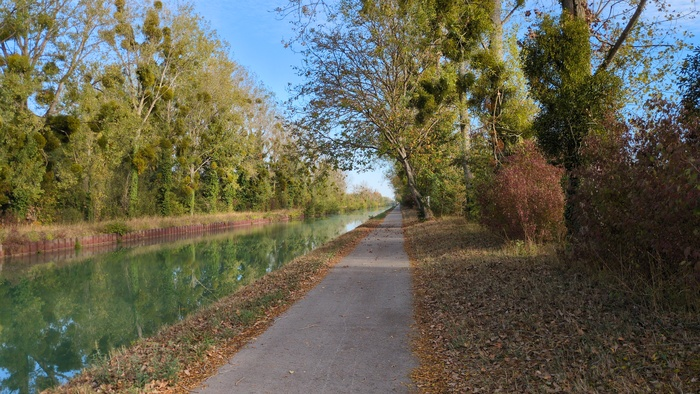
_Now is the time of the canal_

When I cycled _back_ from Mannheim [last
year](https://www.dantleech.com/blog/2025/10/14/day-12-reims/) one of the most
scenic parts was the Marne canal with the arching, drooping, autumnal trees. I
took the same number of photos this year.

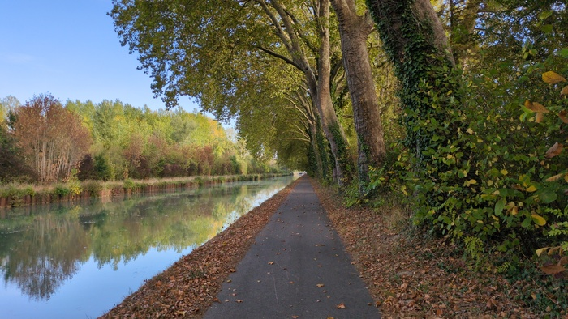
_Canal 2_

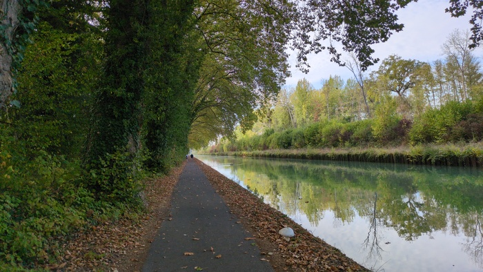
_Canal 3_

At this point I still had around 30 miles to go and was hungry. I had eaten
the left-over Taco-Slab from the day previous over two sittings (that thing
was enormous). I still had some bon-bons in my snack-bag but they were
running low.

I found a chinese corner-shop and purchased a fizzy and drink and what turned
out to be two very desecated choclate bars.

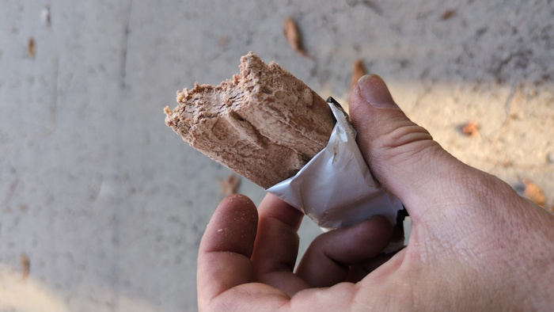
_Mmmmm_

Then there was the sunset and the italian lessons and the fast rolling on the
canal to where I am now.

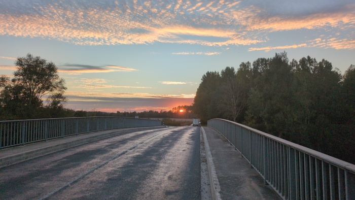
_Sunset_

The hotelier refused to let me put the bike in the room but the courtyard
seems safe-enough so I hope my bike is still available in the morning. The
tyre will be flat in anycase - I noticed it going down as I rode into the
town and at this point I'm going to replace the inner
tube.

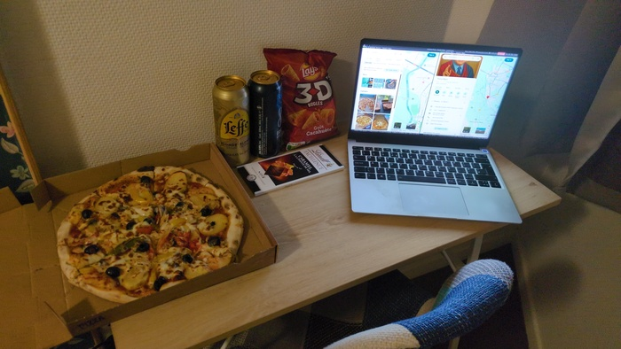
_Dinner_
