I've ordered the wrong pizza at dominoes. It has no tomtato sauce. Therefore
its pizza status is in question. I'm sitting at the tiny table in my non-suite
room in an F1 budget hotel (€35) eating my pizza and drinking my beers. I'm
concerned that the medium pizza is too small and I only have a supplementary
bar of chocolate. I'm about 130 miles away from Mannheim. The chocolate will
probably make me stay awake and give me weird dreams.

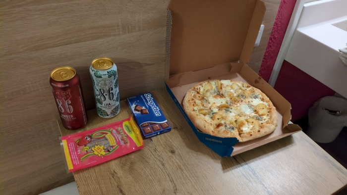
_Voila mon dinner_

I woke in the morning and turned and tossed and opened up my laptop and caught
up on some things before going down for another standard breakfast with the
Algerian hotel manager showing me how to use the coffee pressing machine. I
ate and drank coffee and kicked up my legs and read the news while listening
to American-looking English-Language EU News on the TV in the breakfast room -
although the volume wasn't loud enough for me to understand it.

The bike was still in the courtyard and the tyre was **flat as a pancacke** the
manager look surprised "en fait, c'etait creve quand j'arrive" (it was
punctured when I arrived) "vous avez une pomp?" "oui, j'ai tous qu'il faut".
I had all that I needed including a pleasant park opposite the hotel where I
could make the repair. I would be alone except for a teenage couple were being
discreet on a bench.

The inner tube repairs had failed 4 times now - including once with the
vulcanising kit and I decided to throw it away[^guessing]. I still had the
puntured Gosport Ferry inner-tube that was caused by running into the a step.
I thought I could probably fix _that one_ and still have the new inner tube
spare.

_That one_ was also a snake-bite puncture (as can be expected from
running into a step) but there was sufficient distance between the holes that
two separate patches could be applied. I patched them. I removed the wheel. I
did the now-familiar-taking-the-tyre off dance and rode out of the park not
knowing how long my repair would last.

I left the town and for some reason I reached back to check that my lock was
still hanging from my saddle bag. _It was not_. As is usual my first thought was
"**fuck it i'll get another one**" then a more reasoned "**I won't be able to find another one and you have a perfectly good one 10 minutes that way**" and I turned around knowing that there was a good
chance I'd find it.

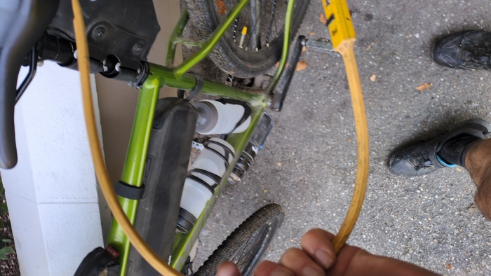
_I found it_

I finally left Vitry-le-Francois.

> I've finished my Pizza and most of one beer. It definitely was not big
> enough. I'm really hungry.

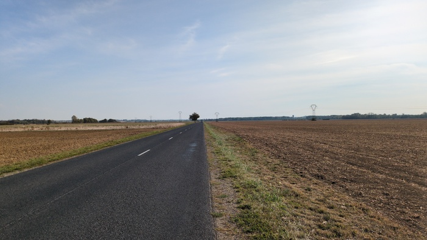
_Once upon a time this was all forests_

At the time that photo was taken I'd been riding for 45 minutes and my bum was
sore and I was feeling hungry. The temperature was rising slowly to a moderate
degree. I was in a land that was remarkable only in that it was very flat and
very full of cropped fields.

An hour was lost in the morning between the puncture and the lock and it was
soon to be lunchtime with less than 30 miles completed. I stopped at a bakery
to do some sandwich reconnaisance. They didn't have any so I got a coffee and
an pastry. As I walked out of the shop the cleats on my shoes slipped on the
step with me with on coffee in my hand I landed safely spilling coffee
forwards and backwards as I pulled away I could see a mop cleaning up my mess
and I found another bakery and they had a sandwich I got it.

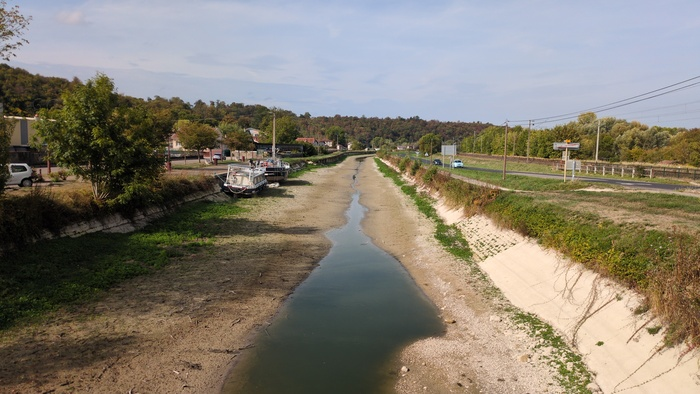
_This canal needs water. If you can help please call the National Canal
Helpline_

I saw a church. [^lots]

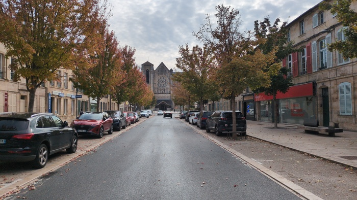
_Unusually modern church_

That feeling when you've only done 30 miles and it's lunchtime and you've got
74 miles to go. But at least you've got a baby sandwich to keep you company.

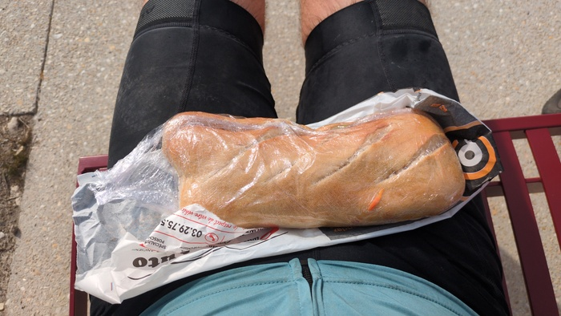
_I was pretty happy with this Sandwich au Fromage de Cherve et Crudities_

That sandwich was the only real food I ate between breakfast and dinner.

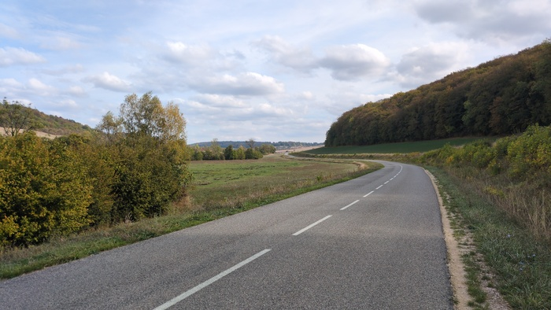
_Things are getting windey_

The road turned and twisted as I headed into the wooded hill-country where
birds-of-prey circled and squawked over the recently harvested fields and
fighterjets roared overhead for some reason. The altitude would peak at 50
miles marking the half-way point.

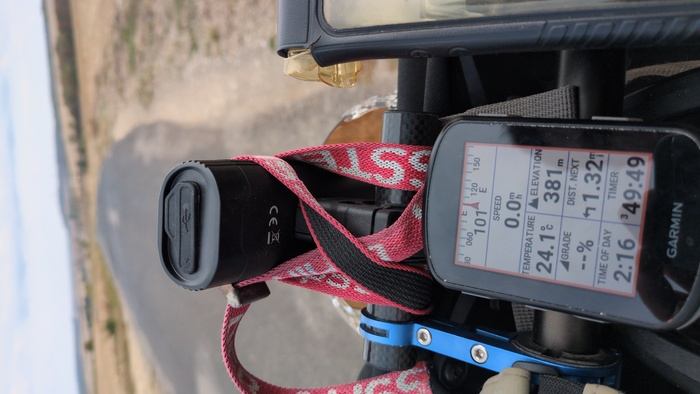
_381 meters altitude_

It felt as if I hadn't made good progress but equally I had been climbing and
the remaining 57 miles was, on average, a descent.

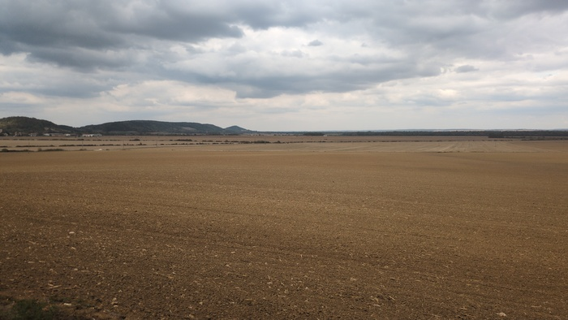
_So much farm_

I passed over the [Meuses river](https://en.wikipedia.org/wiki/Meuse) of which
no photo was taken. So much happens in 8 hours and I have very few words for
them.

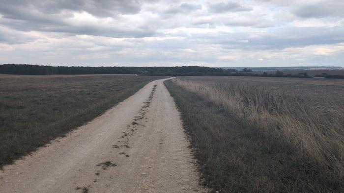
_There was some gravel_

Droplets of water on my head and on my arms. I passed an sign advertising
"cheins de chasse" (hunting dogs). I rode around the [Lac de Madine](https://fr.wikipedia.org/wiki/Lac_de_Madine).

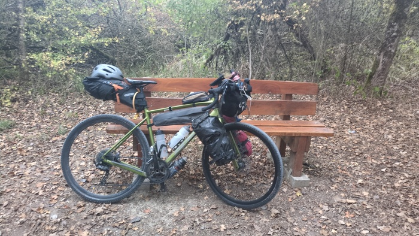
_Bike on a bench near the Lac de Madine_

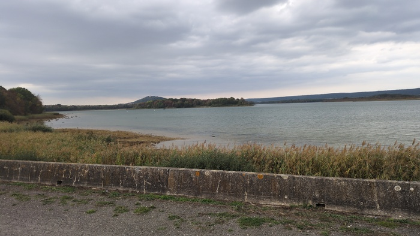
_Lac de Madine_

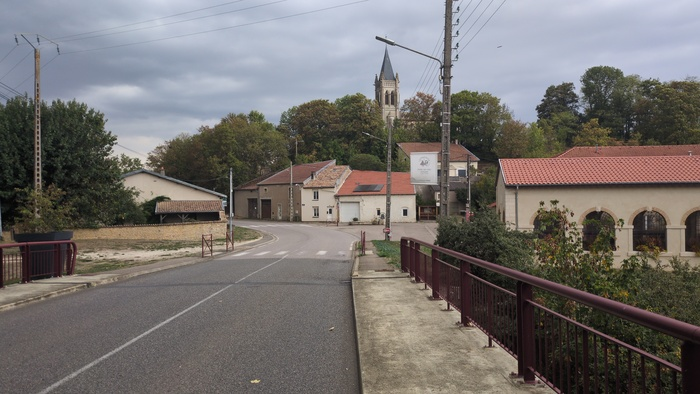
_Standard Village Bridge_

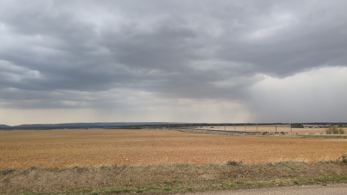
_Rain was brewing_

I joined the Moselle river which would led to Metz and passed the same Roman
Aquaduct that I passed on my [ride to
Verona](https://www.dantleech.com/blog/2026/05/02/la-moselle/) earlier this
year.

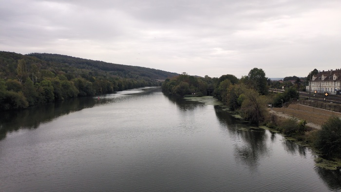
_La Mosselle_

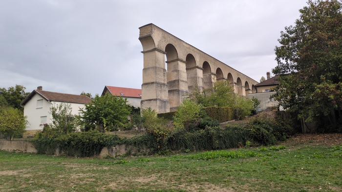
_La Aquaduct Romana_

I wanted to get to the hotel before any heavy rain happened thinking they'd be
less likely to let me put my bike in the room if it were wet. As it happens it
didn't rain hard and I don't think they'd have cared anyway. I like the F1
hotels - cheap, no fuss, clean and breakfast is just €4 (but ignore the shower facilities).

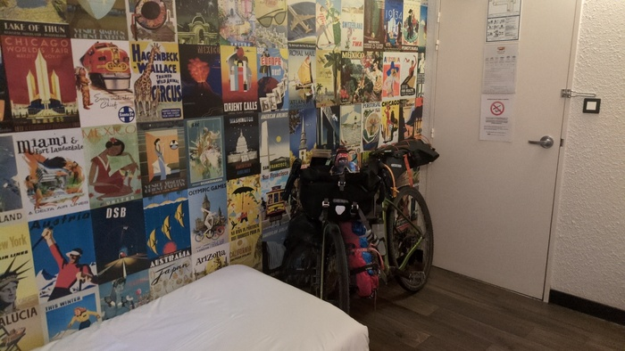
_Comfy_

Tomorrow I have the option of going hard and riding 130 miles (209k) to
Mannheim. That would probably be a top-5 distance record that nobody cares
about but it _would_ mean that I'd have an entire day prior to the conference.
The sensible option would be to do a good mileage and have a shorter day to
Mannheim and checkin to the hotel early.

[^guessing]: I'm guessing that the snake-bite punctures were too close
    together - necessitating a single patch - but the patch isn't strong
    enough.

[^lots]: actually I see churches in almost every town and they are often very
    old and interesting. This one seemed somewhat modern.
