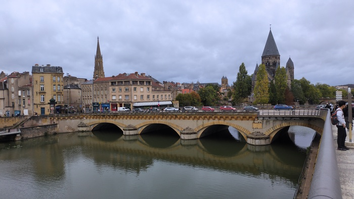
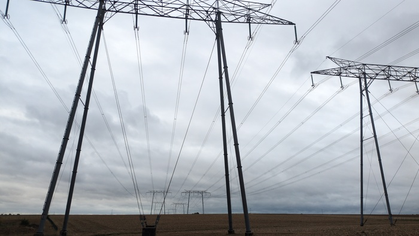
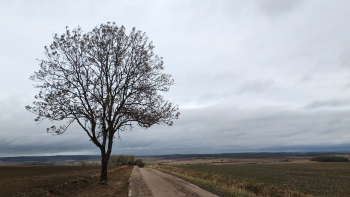
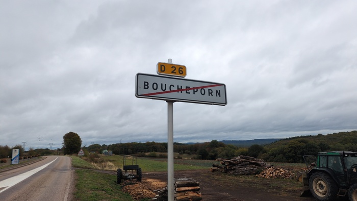
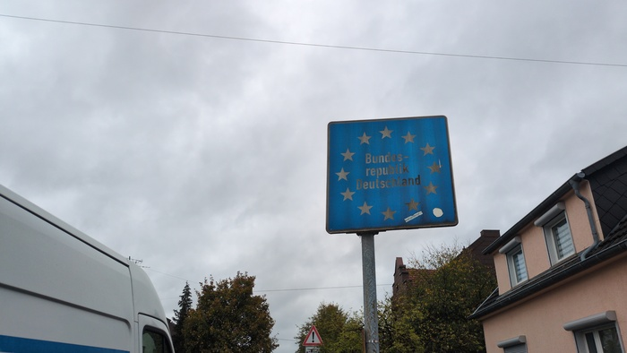
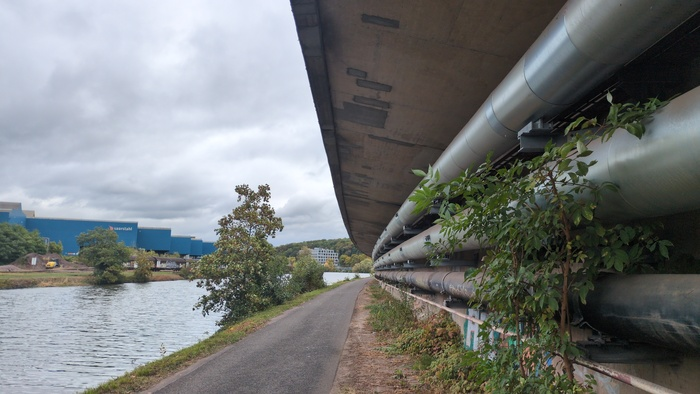
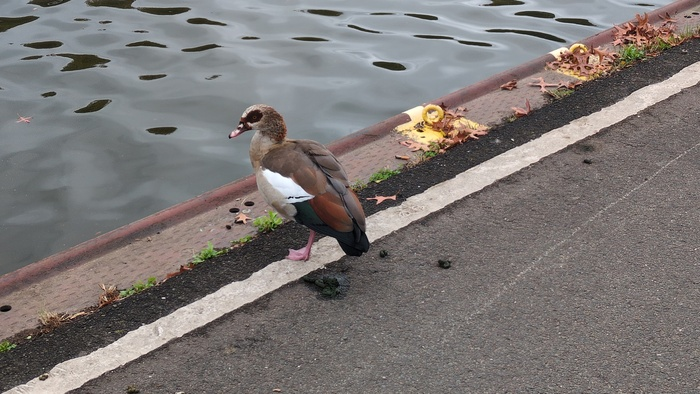
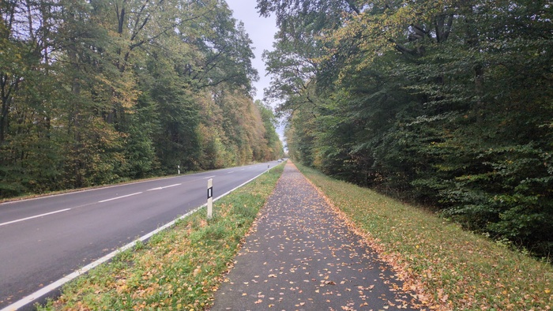

I'm staying in a greek restaurant about 8k north of Kaiserslautern in a "dorf"
called Otterbach. I'm drinking a fast-food-kebab-house-pizza and eating
inferior German beers in the spacious room that smells of smoking. I was
"welcomed" by the waiter who barely said a word to me before returning with a
key. "Wo kann ich mein err, mein Fahhrad, wo darf, kann, ..." I struggled to
remember how to speak German "Was!?" "Stellen. Wo kann ich mein fahhrad
stellen?" He suggested I tie it to the railings outside the restaurant. No.
"Irgendwoh Geschlossen?" "Hinter" - behind the restaurant - and walked back
in. This place has a 8.5 rating for staff friendliness and perhaps this is
what counts as an 8.5 in Germany[^staff]. I now have bicycle theft anxiety even though
it's quiet and it's not full of desperate people who might steal a bike.

I passed a peaceful night at the F1 hotel with my bicycle. I woke relatively
early and had to pull up the black-out shades which I normally wouldn't have
pulled down but the window gave directly onto the blaring lamps in the
car-park. I had cornflakes, bread, butter, honey, juice and coffee. 130 miles to
Mannhiem. It was possible to cycle the entire distance but I didn't commit
myself and left without any accomodation planned.

It was the school hour in Metz and lots of students were on the streets - they
were, I think, primarily concerned with _going_ to school. There were police on
motorcycles who seemed ready to discourage any seditious behavior then they rode up
the street aggressively - perhaps to discourage sedition somewhere else.

_No riots in Metz today_

The wind was blowing hard at 20mph (33kmph) from the north-west as I rode into the
countryside. I was mainly heading east so it provided some small benefit while
blowing annoyingly at my side. The sky was clouded and the temperature wasn't high and
there was intermittent spitting rain. I was converting cornflakes to
kilometers and one of a groin muscle was giving me some trouble but it got better.

_Power cables_

Time is base 60 and distance is base 10. I'm often thinking about time and
distance but sometimes get confused and wonder if 4.50 miles is 0.10 to 5
miles.

_Time and Distance_

The highlight of the day was riding through the town of Boucheporn - a town
named after a real person who owned lots of land and who was later guillotined
so it's not funny.

_Say No to Boucheporn_

I became cold enough to put my jacket on and passed into Germany - the
contrast was that of farming countryside with russling trees to a continuous
series of very un-french towns and highstreets.

_Land of the Deustches Volk_

The next place of interest was Saarbrucken - and I joined the river [Saar](https://en.wikipedia.org/wiki/Saar_(river)) and
past all the steelworks on the river and skirted around and out of the city
without taking much intrest in it having [already visited](https://www.dantleech.com/blog/2025/10/12/day-10-saarbr%C3%BCken/) and not really wanting
to stop.

_Pipes leading to Saarbrucken_

_A Saarbrucken Duck_

The weather got damper and it started to rain which necessitated me putting my
baseball cap on to prevent the rain droplets splashing on my glasses and
obscuring my vision. I stopped at a German bakery and had a good german
sandwich and decided to book the hotel that I'm sitting in and 2 hours later I
was there.

_Unremarkable_

It's been an unremarkable and dull day and I didn't feel particularly well
over the final hours of the ride but tomorrow it will be a two hour ride to
Mannheim with pre-conference drinks in the evening, the event itself, and then
the return journey north-west to Holland.

[^staff]: the waiter turned out to be very understanding later on when the
    restaurant was not so busy and was happy to let me put the bicycle in the
    room
