In hotel room in Mannheim. Feet are hot from walking. Eating the last bits of
chocolate and drinking a beer from the late-shop. It's late. That was the last
bit of chocolate. The hotel is nice enough and I was allowed to heave my bike
up two flights of stairs to room 25. I've since been informed that the next
road is the red light district and I'm in a great place to score drugs  but it
all seems pretty fine to me and people have been friendly.

This is the inflection point. Tomorrow is the un-conference. I'll propose the
same talk that I've been giving for over a year at other conferences but
mostly it's just to show my face and see people.

Well slept was I at the Pantheon Greek Restaurant in Otterberg and woke at
7:00 anxious for breakfast and to finish some work that is dragging on but is
at least, in theory, a financial offset to my travel expenses. There was no
breakfast at the Restaurant but the waiter had informed me the previous night
that there was a bakery.

"Morgen" "Guttenmorgen" "Ich scuhe Fruhstuck bitte" I wanted breakfast but she
look perplexed "Es gibt kein Fruhshuck bis zum acht heur". It was 7:30 and
there was no breakfast until 08:00. THere were however the apparent
ingredients of a breakfast and I oreded a caffe, a juice, a heated-raw-egg
sandwich and a choco-brotchen (which was not what I expected it to be). I then
sat down and worked in the bakery for an hour and a half.

I walked back to the hotel and fiddled on my phone as I lay on the bed and
when it was 10:26 packed my stuff up and put my gear on. It was 40 miles to
Mannheim and it would take around 3.5 hours and the check-in was at 14:00 so
it was time to go.

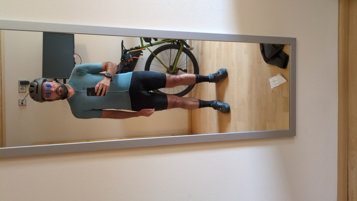
_Professional_

Wheeling my bicycle out of the hotel room, down the stairs and out of the
frontdoor which locked immutably behind me I worried had left something
inside, I also worried that it was raining and cold and I put my jacket and
gloves on and put some music on and rode out of the car park onto the main
road to head back towards Kaiserslautern to engage with the cities very many
traffic lights.

There's a thing in Germany with traffic lights - they command more respect
than in other countries and they also seem to be significantly slower and less
sensible. In Germany I wait for the light to change, and I wait, then I wait
some more. Nothing happens. There's no traffic. _Everybody_ is waiting. Then
it _does_ change and it changes for another lane. You can wait for 5 minutes
in good faith before realising that the whole thing is bonkers and you **run the
red light**[^police] as you would in every other country in the EU - or you wait for the
entire duration only to have the light go green and to have a car turn
directly at you[^oristhatfrance].

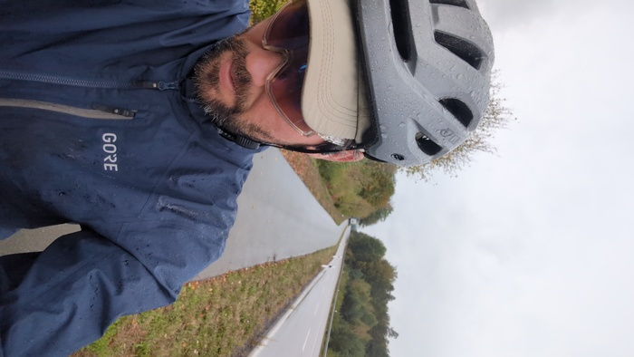
_Just wet_

It was wet and cold and my feet were wet and cold and going numb but after 20
miles all the climbing was done and it was simply a case of wheeeeee.

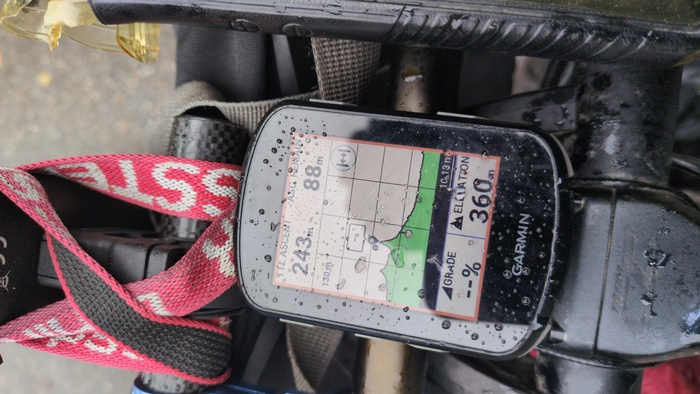
_Downhill from now_

I was on the same road as last year passing the [same paper mill and castle](https://www.dantleech.com/blog/2025/10/12/day-10-saarbr%C3%BCken/).

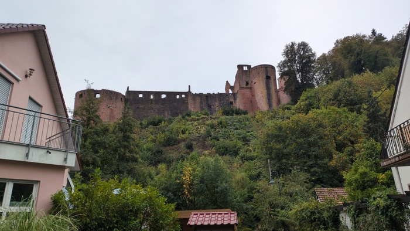
_Castle_

Halloween is nigh and I haven't mentioned the various art installations. In
rural France I saw lynched body-shaped bin-bag swinging from a barn. A
lynching! How nice. When I lived in Austria I also saw life-like witches being
burned on bonfires - delightful! Most installations are rather more innocent.

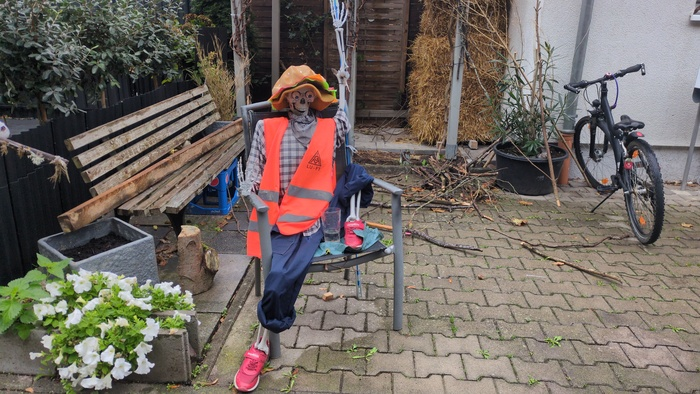
_Skeleton High-Vis_

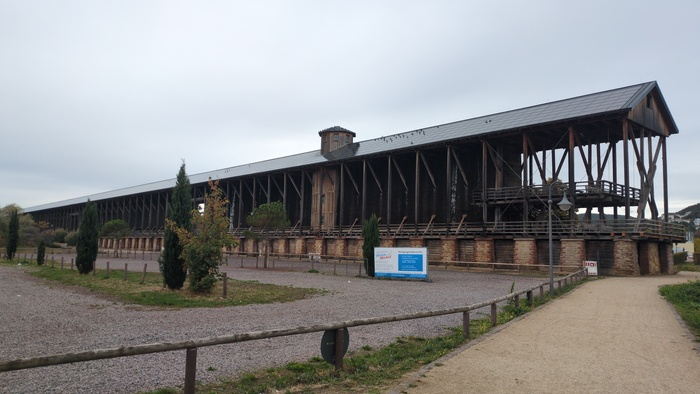
_I'm not sure what this is exactly. Something to do with Salt and Health_

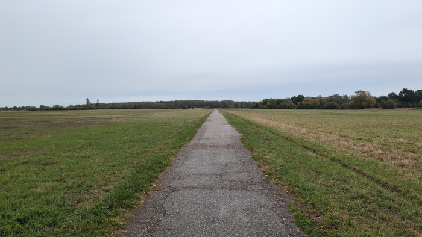
_14 miles to Mannheim_

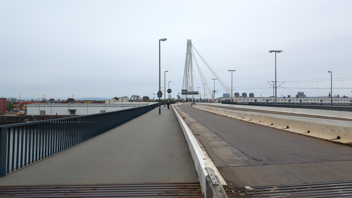
_Crossing the Rhine_

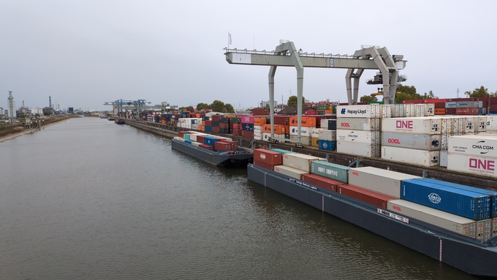
_And the Neakar_

The hotel had replied to my internet query that I could park my bike in the
Innen-hof (the inner court-yard). When I arrived I was wet and carried my bike
into the hallway "DARF ICH MEIN FAHHRAD HIER MIT BRINGEN" (I may not have
shouted) a momentary look of confusion on the receptionists face and then
recognition "ah, yes, we have the Innen-Hof so you don't have to take it to
your room" "NO" said I "I LOVE TO TAKE IT TO MY ROOM" - which was apparently
an acceptable option all along as long as I was prepared to carry it up 2
flights of stairs "Is this a normal time, for, for" "cyclists?" "yes" "maybe
not, it's better in May, June or August" "yes, it was so cold for me this
morning!" "yes it was cold". (it wasn't that cold, it was only 10c even if I
had lost the sensation in my toes).

I napped for 30 minutes and then went out to find lunch because I was hungry.
At the bakery the man was pleasant and spoke English and his wife made me a
Vegetarian Sandwich and I also got a cheese cake and a large coffee and went
back to the hotel and worked for a few hours and then wanted to sleep but my
computer clock was -1 hour and the real time was +0 hours and it was already
time to go to the pre-conference meetup.

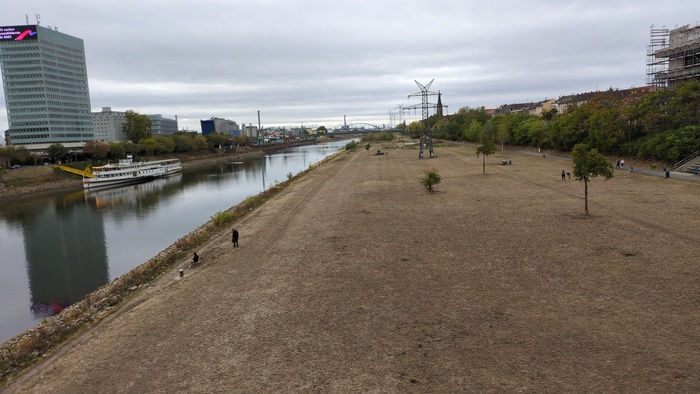
_Sun blasted_

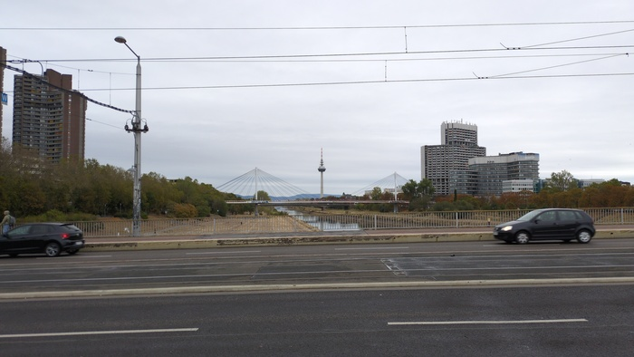
_The TV tower_

I walked 30m to the pub and met Stephan on the way and we went to the pub and
more people turned up and a band started playing and conversations were had
and also food and then there were only 4 and we left but my phone was out of
battery "where are we?" - on map shown my hotel thought I could remember but
only got as far as the brige and then **lost and alone**. Hmm.

The worst thing that could happen is that I would need to ask somebody wherej
the Rhine-Neckar Hotel was, but fortunately I discovered that my Garmin Watch
_did_ have the map and it was able to direct me to my hotel and along the way
I picked up a beer.

---

[^oristhatfrance]: or is that France? 
[^police]: you only run the red lights once you've checked that none of the
    adjacent squares are occupied by police cars.
