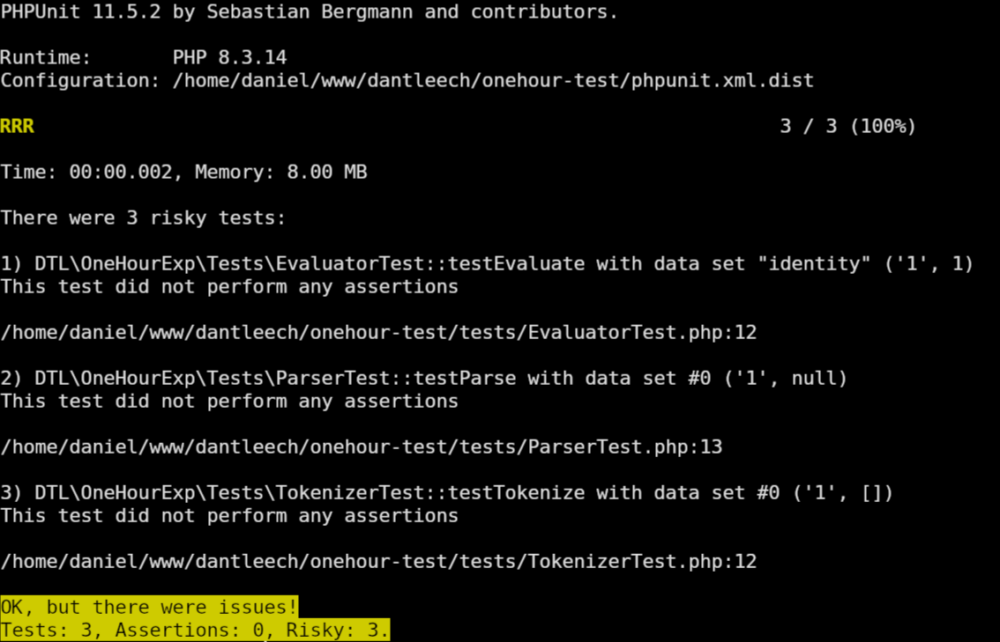

## Expression Language Workshop Instructions

### Pre-requisites

- PHP runtime (8.1+)

```bash
$ php --version
PHP 8.3.14 (cli) (built: Nov 19 2024 15:14:23) (NTS)
Copyright (c) The PHP Group
Zend Engine v4.3.14, Copyright (c) Zend Technologies
    with Zend OPcache v8.3.14, Copyright (c), by Zend Technologieson
```

### Setup

Checkout the repository:

```bash
$ git clone git@github.com:dantleech/onehourexpr
```

Run composer install:

```bash
$ composer install
```

{}
Godzilla wants you to know that if you don't have composer installed, then [install it](https://getcomposer.org/download/) here.
{}

### Run the tests

There are some empty stub tests, check that everything is working by running
them:

```bash
$ vendor/bin/phpunit
```

It should issue lots of warnings about no assertions:


*PHPUnit is failing because no assertions are present yet**

You're ready!

### Tips

Run a specific test file:

```bash
$ vendor/bin/phpunit tests/TokenizerTest.php
```

Run a specific test via. a filter (can be a method or class name):

```bash
$ vendor/bin/phpunit --filter=Tokenizer
```
