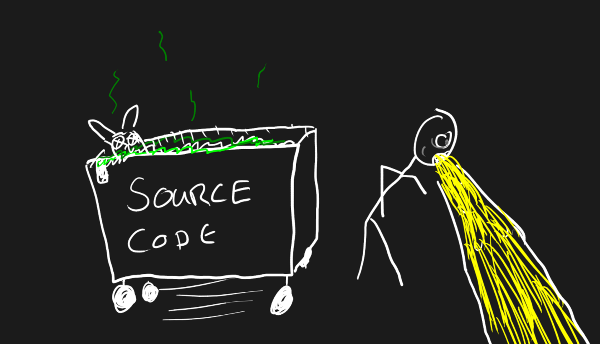

# PHP,  Value Objects and You 🫵

Daniel Leech
DTL Software
Dutch PHP Conference 2025

---

# Start your stopwatch Dan

---


# Me


* Daniel Leech
* _DTL Software_
* Software Contracts
* All things Programming
* Phpactor, PHPBench
* +500 abandonned projects you never heard of

---

# PHP,  Value Objects and **You** 🫵

---

# Why am I giving this talk?

* Seen lots of people debating about if we should use X or Y or Z (value
  objects, collections, DTOs, tests...)
* Scratching my head, because **I USE THEM ALL THE TIME**
* Would you ask _if_ you should use tests in 2025 (or in 2005)?

---

# Modelling is a way to **describe** and **represent** your problems

---

## Modelling Toolbox


---

## Modelling


---

# What are **Value Objects**?

---

# TL;DR;

Value Objects are Objects that represent a Value!

---

# **Values** have no identity other than themselves.

---

# **7** is a value. 

---

# **8** is a different value. 

---

# **IpAddress::new(127, 0, 0, 1)** is a value. 

---

# **IpAddress::new(127, 0, 0, 2)** is a different value. 

---

# The **identity** of a value object is the **sum of it's parts**

---

```php
final readonly class Integer {
    public function __construct(public int $value)
    }
    }
}

$value = new Integer(7);
```

---

# Spotting a Value Object in the Wild 🐇

---

```php
$date = Date::fromYmd(2011, 1, 1);
```

---


```php
$money = Money::fromCentsAndCode(100, 'GBP');
```

---

```php
$location = Geolocation::fromLatLong(50.8137, -2.4747);
```

---

```php
$color = Color::fromRgb(165, 42, 42);
```

---

# What about:

```php
$address = Address::fromLines("10, Rover Straet", "DT1PVZ", "UK")
```

```php
$address = Address::fromLines("10, Rover Street", "DT1PVZ", "UK")
```

* It depends
* It doesn't matter

---

# Solve your problems first **argue about terminology later**!

---

# What about:

```php
$order = new Order(
    orderId: Uuid::v4(),
    state: OrderState::Cart,
    items: [
        ItemOne::fromSku("SKU-1")
    ],
    customer: $customer,
);
```

* This is not a value object...
* It is an **entity** and tracks the progression of an order.

---

# The Picture of Value Object

---

## Immutable

```php
final readonly class Color {
    public function __construct(
        public int $red,
        public int $green,
        public int $blue,
    ) {}
}
```
---

## Correct

```php
final readonly class Color {
    public function __construct(
        public int $red,
        public int $green,
        public int $blue,
    ) {
        foreach ([$this->red, $this->green, $this->blue] as $color) {
            if ($color <0 || $color > 255) {
                throw new Exception(sprintf(
                    'Invalid color (%d, %d, %d). Tints must be between 0 and 255',
                    $red, $green, $blue,
                ));
            }
        }
    }
}
```

---

## Statically Constructed

```php
final readonly class Color {
    private function __construct(
        public int $red,
        public int $green,
        public int $blue,
    ) {
        // validate the color
    }

    public static function fromRgb($red, $green, $blue): self
    {
        return new self($red, $green, $blue);
    }

}
```

---

```php
$color1 = new Color(127, 0, 12);
$color2 = Color::fromHsv(127, 200, 112);
```

---

```php
$color1 = Color::fromRgb(127, 0, 12);
$color2 = Color::fromHsv(127, 200, 112);
$color3 = Color::fromInt(1233312);
$color4 = Color::fromHex('ddaa11');
// ...
```

---

## Convertable

```php
final readonly class Color {
    private function __construct(private int $red, private int $green, private int $blue) {
        // ...
    }

    public static function fromRgb($red, $green, $blue): self
    {
        // ...
    }

    public function toRgb(): array
    {
        return [$this->red, $this->green, $this->blue];
    }
}
```

---

```php
$color = Color::fromHex('FFFFFF');
$color->toHex(); // #FFFFFF
```

---

```php
$color = Color::fromRgb(255, 255, 255);
$color->toHex(); // FFFFFF
```

---

```php
$color = Color::fromHex('FFFFFF');
$color->toRgb(); // [255, 255, 255]
```
---

## Values in Values

```php
$range = ByteOffsetRange::fromByteOffsets(
    ByteOffset::fromInt(5),
    ByteOffset::fromInt(10),
);
```

---

## Reducing Boilerplate

```php
$range = ByteOffsetRange::fromInts(5, 10);
```
---

# Smells




---

<!-- header: `make_payment`  -->

```php
function make_payment(int $amount, string $code): Reciept;
```

---


```php
function make_payment(Money $money): Receipt
```

---

# Color Interpolation

---

<!-- header: `interpolate`  -->


```php
class ColorUtils {
    public static function interpolate(int $r1, int $g1, int $b1, int $r2, int $g2, int $b2, float $amount): array
    {
        // ...
    }
}
```

---

```php
class ColorUtils {
    public static function interpolate(Color $color1, Color $color2, float $amount): Color
    {

        // ...
    }
}
```

---

```php
class ColorUtils {
    public static function interpolate(ColorRange $range, float $amount): Color
    {
        // ...
    }
}
```

---

```php
$color = ColorRange::fromColors(
    Color::fromRgb(0,0,0),
    Color::fromRgb(255,255,255)
)->interpolateAt(0.5);
```

---

```php
$newColor = $chart->colorRange()->iterpolateAt(0.5);
```

---

<!-- header: `center_map`  -->

```php
function center_map(float $long, float $lat): void;
```

---

```php
function center_map(Geolocation $location): void;
```
---

```php
// don't do this
Geolocation::fromLatLong(52.377956, 4.897070)->centerMap();
```

---

```php
$mapService->centerMap(Geolocation::fromLatLong(52.377956, 4.897070));
```

----

# Operators

<!-- header: "Equality"  -->

* `1 + 2`
* `4 / 2`
* `"foo" . "bar"`
* `Color::red() == Color::red();`
* `Color::red() > Color::red();` ?
* `Color::red() * Color::red();` ?

----

<!-- header: "Equality"  -->

* `Color::red()->equals(Color::red());`
* `Color::red()->brighterThan(Color::lightRed());`
* `$newColor = Color::red()->mix(Color::green());`
---

<!-- header: Contextual Equality  -->

# Contextual Equality

```php
$tags1 = Tags::fromStrings('one', 'two');
$tags2 = Tags::fromStrings('two', 'one');

var_dump($tags1 == $tags2); // false!
```

---

# Contextual Equality

```php
$tags1 = Tags::fromStrings('one', 'two');
$tags2 = Tags::fromStrings('two', 'one');

var_dump($tags1->equalTo($tags2)); // true!
```

---

# Contextual Equality

<!-- header: "" -->

```php
$polyline1 = Polyline::fromTuples([0,0], [3,3], [3,0], [0,0]);
$polyline2 = Polyline::fromTuples([0,0], [3,0], [0,0], [3,3]);

$polyline1 === $polyline2; // false
```

---

# Contextual Equality

```text
      +            +
     ++           +
    + +          + 
   ++++         ++++

$polyline1   $polyline2
```

---
# Contextual Equality

```php
$polyline1 = Polyline::fromTuples([0,0], [3,3], [3,0], [0,0]);
$polyline2 = Polyline::fromTuples([0,0], [3,0], [0,0], [3,3]);

$polyline1->equalTo($polyline2); // true
```

---

# Bad Practice


---

# Constructor Bypass

```php
// bad
final readonly class Color {
    private int $red;
    private int $green;
    private int $blue;
    public static function fromRgb(int $red, int $green, int $blue): self
    {
        $color = new self();
        $color->red = $red;
        $color->green = $green;
        $color->blue = $blue;

        $this->assertValid();

        return $color;
    }

    public static function fromHex(string $hex): self
    {
        [$red, $green, $blue] =  // convert hex to r,g,b
        $color = new self();
        $color->red = $red;
        $color->green = $green;
        $color->blue = $blue;

        return $color;
    }
}
```

---

## Always Delegate to the Primary Constructor

```php
// good
final readonly class Color {
    private function __construct(private int $red, private int $green, private int $blue)
    {
        // validate here!
    }

    public static function fromHex(string $hex): self
    {
        [$red, $green, $blue] =  // convert hex to r,g,b
        return new self($red, $green, $blue);
    }
}
```

---

# The constructor is your **guard** against **invalid state**

---

# No Extends or Implements!

```php
// don't do this
interface ValueObject {
    public function eq(ValueObject $v): bool;
    public function greaterThan(ValueObject $v): bool;
}
```

---

# Value Objects are **not** an abstract type

---
<!-- header: No Value Object Namespace  -->

# No "ValueObject" Namespace!

```text
src/
  Entity/
  Form/
  ValueObject/
    Color.php
    Gradient.php
    Gradients.php // a collection!
    InvoiceNumber.php
    Uuid.php
    LicencePlate.php
```

* This is more about project structure
* And it's a whole different talk

---

```text
src/
  Runner/
  Users/
  Charts/
    Color.php
    Gradient.php
    Gradients.php // a collection!
```

---

# Give yourself the **space** to solve problems

---

# No "ValueObject" Suffix!

```php
// don't do this
GradientValueObject::fromColors(ColorValueObject::red(), ColorValueObject::green());
ColorValueObject::fromRgb(255, 10, ,255);
DistanceValueObject::fromNauticalMiles(2.69978);
```

---

# No "ValueObject" Suffix!

```php
// do this!
Gradient::fromColors(ColorValueObject::red(), ColorValueObject::green());
Color::fromRgb(255, 10, ,255);
Distance::fromNauticalMiles(2.69978);
```
---

# Values objects **are** the value

---

# No Serialization!

```php
// don't do this
class Money {

    public function fromArray(array $data): self {
        // so many problems below...
        Assert::arrayHasKey('currency', $data);
        Assert::arrayHasKey('amount', $data);
        $currency = $data['currency'];
        $amount = $data['amount'];
        Assert::isInt($amount);
        Assert::isString($currency);
        return new self($currency, $amount);
    }

    public function toArray(): array {
        return [ 
            'currency' => $this->currency,
            'amount' => $this->amount,
        ];
    }
}
```
---

# Serialization and Deserialization are **hard** and **important** problems.

---

# No Mocking!

```php
// don't do this
$color = $this->createMock(Color::class);
$color->method('toRgb')->willReturn([10, 20, 128]);

$calculator->calculateNewColor($color);
```

---

# No Mocking!

```php
// do this
$color = Color::fromRgb(10, 20, 128);

$calculator->calculateNewColor($color);
```

---

# **NOBODY** wants you to mock Value Objects or other data classes.

---

# Virtues


Value objects should:

* ... be **immutable**: _though shalt **not** change_ (but thou mayst spawn new versions of thyself).
* ... be **correct**: _though shalt **not** bare false representation_.
* ... be **isolated**: _though shalt **not** associate with false prophets_.
* ... be **functionally pure**: _though shalt **not** contaminate thine house nor the house of thy neighbor_
* ... be **unknowable**: _thy shalt not reveal thy true self_.

---

# But don't listen to me

* These are heuristics
* Do what you need to do to solve your problem!
* Try new things and learn from them!
* Value objects are **easy**!

---

# The End


http://www.dantleech.com/presentation/dcp2025-value-objects-and-you/
