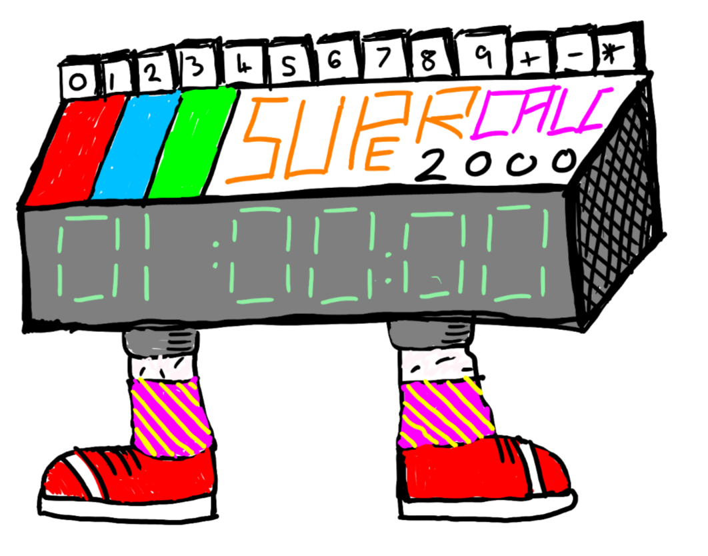
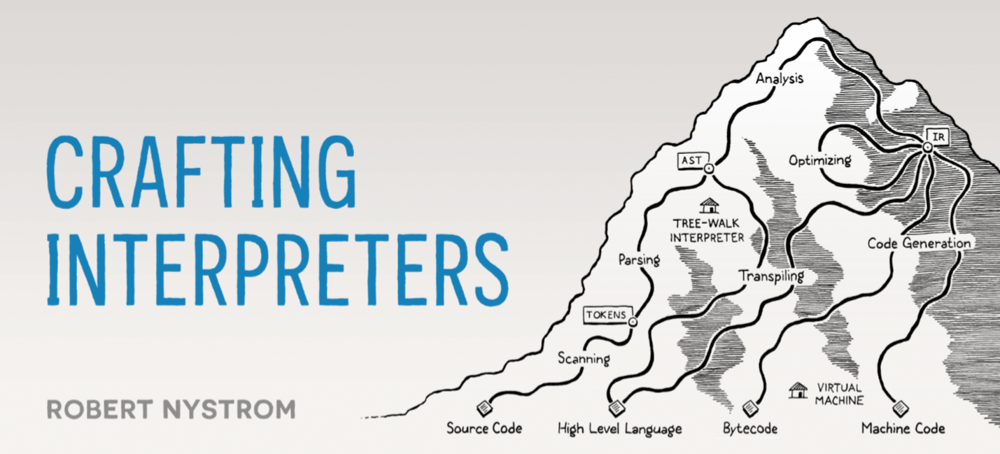

# One Hour Expression Language

How to make an expression language in one hour (or less)
Daniel Leech, DTL Software. 2025

---
## Start your watch

Don't forget to start your stopwatch, Dan.

---


# Me

- Daniel Leech
- DTL Software
- Phpactor and PHPBench
- I like TUIs (Terminal User Interfaces)
- Test Driven Development
- Running

---
# Happiness


---

# Expression Language


---

### An expression language is a **subset** of a programming language

---

```php
echo "foobar";
```

---

```php
echo "foobar" . date('c');
```

---

```
                +---------------+
                | EchoStatement |
                +---------------+
                        | expr
            +-------------------------+
            | BinaryOperation(CONCAT) |
            +-------------------------+
                        |
             +----------+-------------+
             | left                   | right
+------------+------------+  +--------+-------------+
| StringLiteral("foobar") |  | FunctionCall("date") |
+-------------------------+  +--------+-------------+
                                      | format
                             +--------+-----------+
                             | StringLiteral("c") |
                             +--------------------+
```
          
---

* Symfony Expression Language
* XPath
* `jq`
* SQL


---

# ProCalc2000



## A calculator designed for the year 2000 and **subsequent years**

---

# Syntax

- `0-9` repeated one or more times is a number
- `+` a plus operator
- `-` a minus operator
- `*` a multiplciation operator

---

# For example:

- `1 + 1` will evaluate to 2
- `4 * 2` will evaluate to 8
- `8 - 4` will evaluate to 4
- `10 + 12 - 10` will evaluate to 2

---

# Procalc is **basic** but provides all the **machinary** to write expression languages of **arbitrary complexity**

---

# How Does ProCalc2000 Work?

* **Tokenize** an expression
* **Parse** the tokens to an **AST** (Abstract Syntax Tree)
* **Evaluate** the AST to a **value**

```
              +-----------+  tokens  +--------+  ast  +-----------+ 
EXPRESSION => | Tokenizer | -------> | Parser | ----> | Evaluator | => VALUE
              +-----------+          +--------+       +-----------+
```
---

# The Three Classes

* `Tokenizer`
* `Parser`
* `Evaluator`

---

# Tokenizer

Scan a string from left to right and produce tokens

```
"10 + 11234 / 20"
```

| Offset | 0   | 1   | 2   | 3   | 4   | 5   | 6   | 7   | 8   | 9   | 10  | 11  | 12  | 13  | 14  |
| ---    | --- | --- | --- | --- | --- | --- | --- | --- | --- | --- | --- | --- | --- | --- | --- |
| Char   | 1   | 0   |     | +   |     | 1   | 1   | 2   | 3   | 4   |     | /   |     | 2   | 0   |

We **skip the whitespace** and identify 5 tokens:

```
[T_NUMBER] [T_PLUS] [T_NUMBER] [T_DIVIDE] [T_NUMBER]
    10        +       11234         /         20
```

---

# Tokenizer

The output of the tokenizer is a list of tokens:

```
Tokens(
    Token(T_NUMBER, 10),
    Token(T_PLUS),
    Token(T_NUMBER, 11234),
    Token(T_DIVIDE),
    Token(T_NUMBER, 20),
)
```

We can then feed these tokens **into the parser**.

---

# Parser

- The parser **makes sense** of the tokens and returns an **AST**.
- The **AST** is esentially the root of a tree of "nodes".
- A **Node** (in this case) is an _expression_.

---

# Parser


Our parser will have only two node types:

- `Integer`: Integer literal.
- `BinaryOp`: Binary operation.

---

# Abstract Syntax Tree

The node hierarchy for `1`:

```
                        +-----------+
                        | Integer 1 | <-- root of the AST
                        +-----------+
```

---

# Abstract Syntax Tree

The node hierarchy for `1 + 2`:

```
                        +-------------+
                        | Binary Op + | <-- root of the AST
                        +---+---+-----+
                      left  |   |  right
                    +-------+   +--------+
                    |                    |
                +-----------+      +-----------+
                | Integer 1 |      | Integer 2 |
                +-----------+      +-----------+
```
---

# Abstract Syntax Tree

The node hierarchy for `1 + 1 / 5`:

```
                        +-------------+
                        | Binary Op + | <-- root of the AST
                        +---+---+-----+
                      left  |   |  right
                    +-------+   +--------+
                    |                    |
                +-----------+      +-------------+
                | Integer 1 |      | Binary Op / |
                +-----------+      +-------------+
                                   left |   |right
                                 +------+   +----+
                                 |               |
                           +-----+-----+    +----+------+
                           | Integer 1 |    | Integer 5 |
                           +-----------+    +-----------+
```

---

# Abstract Syntax Tree

The node hierarchy for `1 + (1 / 5)`:

```
                        +-------------+
                        | Binary Op + | <-- root of the AST
                        +---+---+-----+
                      left  |   |  right
                    +-------+   +--------+
                    |                    |
                +-----------+      +-------------+
                | Integer 1 |      | Binary Op / |
                +-----------+      +-------------+
                                   left |   |right
                                 +------+   +----+
                                 |               |
                           +-----+-----+    +----+------+
                           | Integer 1 |    | Integer 5 |
                           +-----------+    +-----------+
```

---

# Parser: BinaryOp Node

```php
class BinaryOp implements Node {
    public function __construct(
        public Node $left,
        public string $operation,
        public Node $right
    ) {
    }
}
```

---

# Parser: Integer Node

```php
class Integer implements Node {
    public function __construct(
        public int $value,
    ) {
    }
}
```

---

# Parser: The Result

The result of parsing `1 + 1 / 5` will be the AST:

```php
$ast = new BinaryOp(
    left:     new Integer(1),
    operator: '+',
    right:    new BinaryOp(
        left:     new Integer(1),
        operator: '/',
        right:    new Integer(5),
    )
);
```

---

# Evaluator

The evaluator **walks** the AST. Tree Walking is a **massively powerful** and **important** pattern! It's also **extremely simple**.

---

I can almost fit an evaluator in this slide:

```php
class Evaluator {
    public function evaluate(Node $node): int
    {
        if ($node instanceof Integer) {
           return $node->value;
        }

        if ($node instanceof BinaryOp) {
            $leftValue = $this->evaluate($node->left);
            $rightValue = $this->evaluate($node->right);

           return match ($node->operator) {
              '+' => $leftValue + $rightValue,
              '*' => $leftValue * $rightValue,
              // ...
           }
        }

        throw new Exception(sprintf(
            'Do not know how to evaluate node: %s',
            $node::class
        ));
    }
}
```

---

# That's the intro.

(live coding starts here and lasts ~30-40m)

---



---

# The End


https://www.dantleech.com/presentation/phpers2025-onehourexpr/

---

---

## Parser: Warning About Operator Precedence

Our parser will evaluate `2 * 2 + 3` as `2 * (2 + 3)` which is **not what
you'd expect**.

We should perform **multiplication before addition** giving us `(2 * 2) + 3`.

Due to time constraints I won't implement a **Pratt Parser** because recursion
gives **you** a headache.

---

## Parser: Node Inheritance Diagram

All nodes should at _least_ implement a marker interface to indicate that they are part of the AST:


```
               +----------+
               |   Node   |
               +-----+----+
                     |
             +------+---------+
             |                |
       +-----------+    +-----+-----+
       | Binary Op |    |  Integer  |
       +-----------+    +-----------+
```
